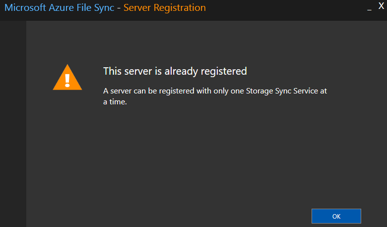
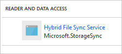

# Troubleshoot Azure File Sync
Use Azure File Sync to centralize your organization's file shares in Azure Files, while keeping the flexibility, performance, and compatibility of an on-premises file server. Azure File Sync transforms Windows Server into a quick cache of your Azure file share. You can use any protocol that's available on Windows Server to access your data locally, including SMB, NFS, and FTPS. You can have as many caches as you need across the world.

This article is designed to help you troubleshoot and resolve issues that you might encounter with your Azure File Sync deployment. We also describe how to collect important logs from the system if a deeper investigation of the issue is required. If you don't see the answer to your question, you can contact us through the following channels (in escalating order):

1. [Azure Storage Forum](https://social.msdn.microsoft.com/forums/azure/home?forum=windowsazuredata).
2. [Azure Files UserVoice](https://feedback.azure.com/forums/217298-storage/category/180670-files).
3. Microsoft Support. To create a new support request, in the Azure portal, on the **Help** tab, select the **Help + support** button, and then select **New support request**.

## I'm having an issue with Azure File Sync on my server (sync, cloud tiering, etc.). Should I remove and recreate my server endpoint?
[!INCLUDE [storage-sync-files-remove-server-endpoint](../../../includes/storage-sync-files-remove-server-endpoint.md)]

## Agent installation and server registration
<a id="agent-installation-failures"></a>**Troubleshoot agent installation failures**  
If the Azure File Sync agent installation fails, at an elevated command prompt, run the following command to turn on logging during agent installation:

```
StorageSyncAgent.msi /l*v AFSInstaller.log
```

Review installer.log to determine the cause of the installation failure.

<a id="agent-installation-on-DC"></a>**Agent installation fails on Active Directory Domain Controller**  
If you try to install the sync agent on an Active Directory domain controller where the PDC role owner is on a Windows Server 2008 R2 or below OS version, you may hit the issue where the sync agent will fail to install.

To resolve, transfer the PDC role to another domain controller running Windows Server 2012 R2 or more recent, then install sync.

<a id="parameter-is-incorrect"></a>**Accessing a volume on Windows Server 2012 R2 fails with error: The parameter is incorrect**  
After creating a server endpoint on Windows Server 2012 R2, the following error occurs when accessing the volume:

driveletter:\ is not accessible.  
The parameter is incorrect.

To resolve, install the latest updates for Windows Server 2012 R2 and restart the server.

<a id="server-registration-missing-subscriptions"></a>**Server Registration does not list all Azure Subscriptions**  
When registering a server using ServerRegistration.exe, subscriptions are missing when you click the Azure Subscription drop-down.

This issue occurs because ServerRegistration.exe does not currently support multi-tenant environments. This issue will be fixed in a future Azure File Sync agent update.

To workaround this issue, use the following PowerShell commands to register the server:

```powershell
Import-Module "C:\Program Files\Azure\StorageSyncAgent\StorageSync.Management.PowerShell.Cmdlets.dll"
Login-AzureRmStorageSync -SubscriptionID "<guid>" -TenantID "<guid>"
Register-AzureRmStorageSyncServer -SubscriptionId "<guid>" -ResourceGroupName "<string>" -StorageSyncServiceName "<string>"
```

<a id="server-registration-prerequisites"></a>**Server Registration displays the following message: "Pre-requisites are missing"**  
This message appears if Az or AzureRM PowerShell module is not installed on PowerShell 5.1. 

> [!Note]  
> ServerRegistration.exe does not support PowerShell 6.x. You can use the Register-AzStorageSyncServer cmdlet on PowerShell 6.x to register the server.

To install the Az or AzureRM module on PowerShell 5.1, perform the following steps:

1. Type **powershell** from an elevated command prompt and hit enter.
2. Install the latest Az or AzureRM module by following the documentation:
	- [Az module (requires .NET 4.7.2)](https://go.microsoft.com/fwlink/?linkid=2062890)
	- [AzureRM module]( https://go.microsoft.com/fwlink/?linkid=856959)
3. Run ServerRegistration.exe, and complete the wizard to register the server with a Storage Sync Service.

<a id="server-already-registered"></a>**Server Registration displays the following message: "This server is already registered"** 



This message appears if the server was previously registered with a Storage Sync Service. To unregister the server from the current Storage Sync Service and then register with a new Storage Sync Service, complete the steps that are described in [Unregister a server with Azure File Sync](storage-sync-files-server-registration.md#unregister-the-server-with-storage-sync-service).

If the server is not listed under **Registered servers** in the Storage Sync Service, on the server that you want to unregister, run the following PowerShell commands:

```powershell
Import-Module "C:\Program Files\Azure\StorageSyncAgent\StorageSync.Management.ServerCmdlets.dll"
Reset-StorageSyncServer
```

> [!Note]  
> If the server is part of a cluster, you can use the optional *Reset-StorageSyncServer -CleanClusterRegistration* parameter to also remove the cluster registration.

<a id="web-site-not-trusted"></a>**When I register a server, I see numerous "web site not trusted" responses. Why?**  
This issue occurs when the **Enhanced Internet Explorer Security** policy is enabled during server registration. For more information about how to correctly disable the **Enhanced Internet Explorer Security** policy, see [Prepare Windows Server to use with Azure File Sync](storage-sync-files-deployment-guide.md#prepare-windows-server-to-use-with-azure-file-sync) and [How to deploy Azure File Sync](storage-sync-files-deployment-guide.md).

<a id="server-registration-missing"></a>**Server is not listed under registered servers in the Azure portal**  
If a server is not listed under **Registered servers** for a Storage Sync Service:
1. Sign in to the server that you want to register.
2. Open File Explorer, and then go to the Storage Sync Agent installation directory (the default location is C:\Program Files\Azure\StorageSyncAgent). 
3. Run ServerRegistration.exe, and complete the wizard to register the server with a Storage Sync Service.

## Sync group management
<a id="cloud-endpoint-using-share"></a>**Cloud endpoint creation fails, with this error: "The specified Azure FileShare is already in use by a different CloudEndpoint"**  
This error occurs if the Azure file share is already in use by another cloud endpoint. 

If you see this message and the Azure file share currently is not in use by a cloud endpoint, complete the following steps to clear the Azure File Sync metadata on the Azure file share:

> [!Warning]  
> Deleting the metadata on an Azure file share that is currently in use by a cloud endpoint causes Azure File Sync operations to fail. 

1. In the Azure portal, go to your Azure file share.  
2. Right-click the Azure file share, and then select **Edit metadata**.
3. Right-click **SyncService**, and then select **Delete**.

<a id="cloud-endpoint-authfailed"></a>**Cloud endpoint creation fails, with this error: "AuthorizationFailed"**  
This error occurs if your user account doesn't have sufficient rights to create a cloud endpoint. 

To create a cloud endpoint, your user account must have the following Microsoft Authorization permissions:  
* Read: Get role definition
* Write: Create or update custom role definition
* Read: Get role assignment
* Write: Create role assignment

The following built-in roles have the required Microsoft Authorization permissions:  
* Owner
* User Access Administrator

To determine whether your user account role has the required permissions:  
1. In the Azure portal, select **Resource groups**.
2. Select the resource group where the storage account is located, and then select **Access control (IAM)**.
3. Select the **Role assignments** tab.
4. Select the **Role** (for example, Owner or Contributor) for your user account.
5. In the **Resource Provider** list, select **Microsoft Authorization**. 
    * **Role assignment** should have **Read** and **Write** permissions.
    * **Role definition** should have **Read** and **Write** permissions.

<a id="-2134375898"></a>**Server endpoint creation fails, with this error: "MgmtServerJobFailed" (Error code: -2134375898 or 0x80c80226)**  
This error occurs if the server endpoint path is on the system volume and cloud tiering is enabled. Cloud tiering is not supported on the system volume. To create a server endpoint on the system volume, disable cloud tiering when creating the server endpoint.

<a id="-2147024894"></a>**Server endpoint creation fails, with this error: "MgmtServerJobFailed" (Error code: -2147024894 or 0x80070002)**  
This error occurs if the server endpoint path specified is not valid. Verify the server endpoint path specified is a locally attached NTFS volume. Note, Azure File Sync does not support mapped drives as a server endpoint path.

<a id="-2134375640"></a>**Server endpoint creation fails, with this error: "MgmtServerJobFailed" (Error code: -2134375640 or 0x80c80328)**  
This error occurs if the server endpoint path specified is not an NTFS volume. Verify the server endpoint path specified is a locally attached NTFS volume. Note, Azure File Sync does not support mapped drives as a server endpoint path.

<a id="-2134347507"></a>**Server endpoint creation fails, with this error: "MgmtServerJobFailed" (Error code: -2134347507 or 0x80c8710d)**  
This error occurs because Azure File Sync does not support server endpoints on volumes which have a compressed System Volume Information folder. To resolve this issue, decompress the System Volume Information folder. If the System Volume Information folder is the only folder compressed on the volume, perform the following steps:

1. Download [PsExec](https://docs.microsoft.com/sysinternals/downloads/psexec) tool.
2. Run the following command from an elevated command prompt to launch a command prompt running under the system account: **PsExec.exe -i -s -d cmd**
3. From the command prompt running under the system account, type the following commands and hit enter:   
	**cd /d "drive letter:\System Volume Information"**  
	**compact /u /s**

<a id="-2134376345"></a>**Server endpoint creation fails, with this error: "MgmtServerJobFailed" (Error code: -2134376345 or 0x80C80067)**  
This error occurs if the server endpoints per server limit is reached. Azure File Sync currently supports up to 30 server endpoints per server. For more information, see 
[Azure File Sync scale targets](https://docs.microsoft.com/azure/storage/files/storage-files-scale-targets#azure-file-sync-scale-targets).

<a id="-2134376427"></a>**Server endpoint creation fails, with this error: "MgmtServerJobFailed" (Error code: -2134376427 or 0x80c80015)**  
This error occurs if another server endpoint is already syncing the server endpoint path specified. Azure File Sync does not support multiple server endpoints syncing the same directory or volume.

<a id="-2160590967"></a>**Server endpoint creation fails, with this error: "MgmtServerJobFailed" (Error code: -2160590967 or 0x80c80077)**  
This error occurs if the server endpoint path contains orphaned tiered files. If a server endpoint was recently removed, wait until the orphaned tiered files cleanup has completed. An Event ID 6662 is logged to the Telemetry event log once the orphaned tiered files cleanup has started. An Event ID 6661 is logged once the orphaned tiered files cleanup has completed and a server endpoint can be recreated using the path. If the server endpoint creation fails after an Event ID 6661 is logged, remove the orphaned tiered files by performing the steps documented in the [Tiered files are not accessible on the server after deleting a server endpoint](https://docs.microsoft.com/azure/storage/files/storage-sync-files-troubleshoot?tabs=portal1%2Cazure-portal#tiered-files-are-not-accessible-on-the-server-after-deleting-a-server-endpoint) section.

<a id="-2134347757"></a>**Server endpoint deletion fails, with this error: "MgmtServerJobExpired" (Error code: -2134347757 or 0x80c87013)**  
This error occurs if the server is offline or doesn't have network connectivity. If the server is no longer available, unregister the server in the portal which will delete the server endpoints. To delete the server endpoints, follow the steps that are described in [Unregister a server with Azure File Sync](storage-sync-files-server-registration.md#unregister-the-server-with-storage-sync-service).

<a id="server-endpoint-provisioningfailed"></a>**Unable to open server endpoint properties page or update cloud tiering policy**  
This issue can occur if a management operation on the server endpoint fails. If the server endpoint properties page does not open in the Azure portal, updating server endpoint using PowerShell commands from the server may fix this issue. 

```powershell
# Get the server endpoint id based on the server endpoint DisplayName property
Get-AzStorageSyncServerEndpoint `
    -ResourceGroupName myrgname `
    -StorageSyncServiceName storagesvcname `
    -SyncGroupName mysyncgroup | `
Tee-Object -Variable serverEndpoint

# Update the free space percent policy for the server endpoint
Set-AzStorageSyncServerEndpoint `
    -InputObject $serverEndpoint
    -CloudTiering `
    -VolumeFreeSpacePercent 60
```
<a id="server-endpoint-noactivity"></a>**Server endpoint has a health status of “No Activity” or “Pending” and the server state on the registered servers blade is “Appears offline”**  

This issue can occur if the Storage Sync Monitor process (AzureStorageSyncMonitor.exe) is not running or the server is unable to access the Azure File Sync service.

On the server that is showing as "Appears offline" in the portal, look at Event ID 9301 in the Telemetry event log (located under Applications and Services\Microsoft\FileSync\Agent in Event Viewer) to determine why the server is unable to access the Azure File Sync service. 

- If **GetNextJob completed with status: 0** is logged, the server can communicate with the Azure File Sync service. 
	- Open Task Manager on the server and verify the Storage Sync Monitor (AzureStorageSyncMonitor.exe) process is running. If the process is not running, first try restarting the server. If restarting the server does not resolve the issue, upgrade to the latest Azure File Sync [agent version](https://docs.microsoft.com/azure/storage/files/storage-files-release-notes). 

- If **GetNextJob completed with status: -2134347756** is logged, the server is unable to communicate with the Azure File Sync service due to a firewall or proxy. 
	- If the server is behind a firewall, verify port 443 outbound is allowed. If the firewall restricts traffic to specific domains, confirm the domains listed in the Firewall [documentation](https://docs.microsoft.com/azure/storage/files/storage-sync-files-firewall-and-proxy#firewall) are accessible.
	- If the server is behind a proxy, configure the machine-wide or app-specific proxy settings by following the steps in the Proxy [documentation](https://docs.microsoft.com/azure/storage/files/storage-sync-files-firewall-and-proxy#proxy).
	- Use the Test-StorageSyncNetworkConnectivity cmdlet to check network connectivity to the service endpoints. To learn more, see [Test network connectivity to service endpoints](https://docs.microsoft.com/azure/storage/files/storage-sync-files-firewall-and-proxy#test-network-connectivity-to-service-endpoints).

- If **GetNextJob completed with status: -2134347764** is logged, the server is unable to communicate with the Azure File Sync service due to an expired or deleted certificate.  
	- Run the following PowerShell command on the server to reset the certificate used for authentication:
    ```powershell
    Reset-AzStorageSyncServerCertificate -ResourceGroupName <string> -StorageSyncServiceName <string>
    ```
<a id="endpoint-noactivity-sync"></a>**Server endpoint has a health status of “No Activity” and the server state on the registered servers blade is “Online”**  

A server endpoint health status of "No Activity" means the server endpoint has not logged sync activity in the past two hours.

To check current sync activity on a server, see [How do I monitor the progress of a current sync session?](#how-do-i-monitor-the-progress-of-a-current-sync-session).

A server endpoint may not log sync activity for several hours due to a bug or insufficient system resources. Verify the latest Azure File Sync [agent version](https://docs.microsoft.com/azure/storage/files/storage-files-release-notes) is installed. If the issue persists, open a support request.

> [!Note]  
> If the server state on the registered servers blade is “Appears Offline,” perform the steps documented in the [Server endpoint has a health status of “No Activity” or “Pending” and the server state on the registered servers blade is “Appears offline”](#server-endpoint-noactivity) section.

## Sync
<a id="afs-change-detection"></a>**If I created a file directly in my Azure file share over SMB or through the portal, how long does it take for the file to sync to servers in the sync group?**  
[!INCLUDE [storage-sync-files-change-detection](../../../includes/storage-sync-files-change-detection.md)]

<a id="serverendpoint-pending"></a>**Server endpoint health is in a pending state for several hours**  
This issue is expected if you create a cloud endpoint and use an Azure file share that contains data. The change enumeration job that scans for changes in the Azure file share must complete before files can sync between the cloud and server endpoints. The time to complete the job is dependent on the size of the namespace in the Azure file share. The server endpoint health should update once the change enumeration job completes.

### <a id="broken-sync"></a>How do I monitor sync health?
# [Portal](#tab/portal1)
Within each sync group, you can drill down into its individual server endpoints to see the status of the last completed sync sessions. A green Health column and a Files Not Syncing value of 0 indicate that sync is working as expected. If this is not the case, see below for a list of common sync errors and how to handle files that are not syncing. 


# [Server](#tab/server)
Go to the server's telemetry logs, which can be found in the Event Viewer at `Applications and Services Logs\Microsoft\FileSync\Agent\Telemetry`. Event 9102 corresponds to a completed sync session; for the latest status of sync, look for the most recent event with ID 9102. SyncDirection tells you if it this session was an upload or download. If the HResult is 0, then the sync session was successful. A non-zero HResult means that there was an error during sync; see below for a list of common errors. If the PerItemErrorCount is greater than 0, this means that some files or folders did not sync properly. It is possible to have an HResult of 0 but a PerItemErrorCount that is greater than 0.

Below is an example of a successful upload. For the sake of brevity, only some of the values contained in each 9102 event are listed below. 

```
Replica Sync session completed.
SyncDirection: Upload,
HResult: 0, 
SyncFileCount: 2, SyncDirectoryCount: 0,
AppliedFileCount: 2, AppliedDirCount: 0, AppliedTombstoneCount 0, AppliedSizeBytes: 0.
PerItemErrorCount: 0,
TransferredFiles: 2, TransferredBytes: 0, FailedToTransferFiles: 0, FailedToTransferBytes: 0.
```

Conversely, an unsuccessful upload might look like this:

```
Replica Sync session completed.
SyncDirection: Upload,
HResult: -2134364065,
SyncFileCount: 0, SyncDirectoryCount: 0, 
AppliedFileCount: 0, AppliedDirCount: 0, AppliedTombstoneCount 0, AppliedSizeBytes: 0.
PerItemErrorCount: 0, 
TransferredFiles: 0, TransferredBytes: 0, FailedToTransferFiles: 0, FailedToTransferBytes: 0.
```

Sometimes sync sessions fail overall or have a non-zero PerItemErrorCount but still make forward progress, with some files syncing successfully. This can be seen in the Applied* fields (AppliedFileCount, AppliedDirCount, AppliedTombstoneCount, and AppliedSizeBytes), which tell you how much of the session is succeeding. If you see multiple sync sessions in a row that are failing but have an increasing Applied* count, then you should give sync time to try again before opening a support ticket.

---

### How do I monitor the progress of a current sync session?
# [Portal](#tab/portal1)
Within your sync group, go to the server endpoint in question and look at the Sync Activity section to see the count of files uploaded or downloaded in the current sync session. Note that this status will be delayed by about 5 minutes, and if your sync session is small enough to be completed within this period, it may not be reported in the portal. 

# [Server](#tab/server)
Look at the most recent 9302 event in the telemetry log on the server (in the Event Viewer, go to Applications and Services Logs\Microsoft\FileSync\Agent\Telemetry). This event indicates the state of the current sync session. TotalItemCount denotes how many files are to be synced, AppliedItemCount the number of files that have been synced so far, and PerItemErrorCount the number of files that are failing to sync (see below for how to deal with this).

```
Replica Sync Progress. 
ServerEndpointName: <CI>sename</CI>, SyncGroupName: <CI>sgname</CI>, ReplicaName: <CI>rname</CI>, 
SyncDirection: Upload, CorrelationId: {AB4BA07D-5B5C-461D-AAE6-4ED724762B65}. 
AppliedItemCount: 172473, TotalItemCount: 624196. AppliedBytes: 51473711577, 
TotalBytes: 293363829906. 
AreTotalCountsFinal: true. 
PerItemErrorCount: 1006.
```
---

### How do I know if my servers are in sync with each other?
# [Portal](#tab/portal1)
For each server in a given sync group, make sure:
- The timestamps for the Last Attempted Sync for both upload and download are recent.
- The status is green for both upload and download.
- The Sync Activity field shows very few or no files remaining to sync.
- The Files Not Syncing field is 0 for both upload and download.

# [Server](#tab/server)
Look at the completed sync sessions, which are marked by 9102 events in the telemetry event log for each server (in the Event Viewer, go to `Applications and Services Logs\Microsoft\FileSync\Agent\Telemetry`). 

1. On any given server, you want to make sure the latest upload and download sessions completed successfully. To do this, check that the HResult and PerItemErrorCount are 0 for both upload and download (the SyncDirection field indicates if a given session is an upload or download session). Note that if you do not see a recently completed sync session, it is likely a sync session is currently in progress, which is to be expected if you just added or modified a large amount of data.
2. When a server is fully up-to-date with the cloud and has no changes to sync in either direction, you will see empty sync sessions. These are indicated by upload and download events in which all the Sync* fields (SyncFileCount, SyncDirCount, SyncTombstoneCount, and SyncSizeBytes) are zero, meaning there was nothing to sync. Note that these empty sync sessions may not occur on high-churn servers as there is always something new to sync. If there is no sync activity, they should occur every 30 minutes. 
3. If all servers are up-to-date with the cloud, meaning their recent upload and download sessions are empty sync sessions, you can say with reasonable certainty that the system as a whole is in sync. 
	
Note that if you made changes directly in your Azure file share, Azure File Sync will not detect this change until change enumeration runs, which happens once every 24 hours. It is possible that a server will say it is up-to-date with the cloud when it is in fact missing recent changes made directly in the Azure file share. 

---

### How do I see if there are specific files or folders that are not syncing?
If your PerItemErrorCount on the server or Files Not Syncing count in the portal are greater than 0 for any given sync session, that means some items are failing to sync. Files and folders can have characteristics that prevent them from syncing. These characteristics can be persistent and require explicit action to resume sync, for example removing unsupported characters from the file or folder name. They can also be transient, meaning the file or folder will automatically resume sync; for example, files with open handles will automatically resume sync when the file is closed. When the Azure File Sync engine detects such a problem, an error log is produced that can be parsed to list the items currently not syncing properly.

To see these errors, run the **FileSyncErrorsReport.ps1** PowerShell script (located in the agent installation directory of the Azure File Sync agent) to identify files that failed to sync because of open handles, unsupported characters, or other issues. The ItemPath field tells you the location of the file in relation to the root sync directory. See the list of common sync errors below for remediation steps.

> [!Note]  
> If the FileSyncErrorsReport.ps1 script returns "There were no file errors found" or does not list per-item errors for the sync group, the cause is either:
>
>- Cause 1: The last completed sync session did not have per-item errors. The portal should be updated soon to show 0 Files Not Syncing. 
>	- Check the [Event ID 9102](https://docs.microsoft.com/azure/storage/files/storage-sync-files-troubleshoot?tabs=server%2Cazure-portal#broken-sync) in the Telemetry event log to confirm the PerItemErrorCount is 0. 
>
>- Cause 2: The ItemResults event log on the server wrapped due to too many per-item errors and the event log no longer contains errors for this sync group.
>	- To prevent this issue, increase the ItemResults event log size. The ItemResults event log can be found under "Applications and Services Logs\Microsoft\FileSync\Agent" in Event Viewer. 

#### Troubleshooting per file/directory sync errors
**ItemResults log - per-item sync errors**  

| HRESULT | HRESULT (decimal) | Error string | Issue | Remediation |
|---------|-------------------|--------------|-------|-------------|
| 0x80070043 | -2147942467 | ERROR_BAD_NET_NAME | The tiered file on the server is not accessible. This issue occurs if the tiered file was not recalled prior to deleting a server endpoint. | To resolve this issue, see [Tiered files are not accessible on the server after deleting a server endpoint](https://docs.microsoft.com/azure/storage/files/storage-sync-files-troubleshoot?tabs=portal1%2Cazure-portal#tiered-files-are-not-accessible-on-the-server-after-deleting-a-server-endpoint). |
| 0x80c80207 | -2134375929 | ECS_E_SYNC_CONSTRAINT_CONFLICT | The file or directory change cannot be synced yet because a dependent folder is not yet synced. This item will sync after the dependent changes are synced. | No action required. |
| 0x80c80284 | -2134375804 | ECS_E_SYNC_CONSTRAINT_CONFLICT_SESSION_FAILED | The file or directory change cannot be synced yet because a dependent folder is not yet synced and the sync session failed. This item will sync after the dependent changes are synced. | No action required. If the error persists, investigate the sync session failure. |
| 0x8007007b | -2147024773 | ERROR_INVALID_NAME | The file or directory name is invalid. | Rename the file or directory in question. See [Handling unsupported characters](https://docs.microsoft.com/azure/storage/files/storage-sync-files-troubleshoot?tabs=portal1%2Cazure-portal#handling-unsupported-characters) for more information. |
| 0x80c80255 | -2134375851 | ECS_E_XSMB_REST_INCOMPATIBILITY | The file or directory name is invalid. | Rename the file or directory in question. See [Handling unsupported characters](https://docs.microsoft.com/azure/storage/files/storage-sync-files-troubleshoot?tabs=portal1%2Cazure-portal#handling-unsupported-characters) for more information. |
| 0x80c80018 | -2134376424 | ECS_E_SYNC_FILE_IN_USE | The file cannot be synced because it's in use. The file will be synced when it's no longer in use. | No action required. Azure File Sync creates a temporary VSS snapshot once a day on the server to sync files that have open handles. |
| 0x80c8031d | -2134375651 | ECS_E_CONCURRENCY_CHECK_FAILED | The file has changed, but the change has not yet been detected by sync. Sync will recover after this change is detected. | No action required. |
| 0x80070002 | -2147024894 | ERROR_FILE_NOT_FOUND | The file was deleted and sync is not aware of the change. | No action required. Sync will stop logging this error once change detection detects the file was deleted. |
| 0x80070003 | -2147942403 | ERROR_PATH_NOT_FOUND | Deletion of a file or directory cannot be synced because the item was already deleted in the destination and sync is not aware of the change. | No action required. Sync will stop logging this error once change detection runs on the destination and sync detects the item was deleted. |
| 0x80c80205 | -2134375931 | ECS_E_SYNC_ITEM_SKIP | The file or directory was skipped but will be synced during the next sync session. If this error is reported when downloading the item, the file or directory name is more than likely invalid. | No action required if this error is reported when uploading the file. If the error is reported when downloading the file, rename the file or directory in question. See [Handling unsupported characters](https://docs.microsoft.com/azure/storage/files/storage-sync-files-troubleshoot?tabs=portal1%2Cazure-portal#handling-unsupported-characters) for more information. |
| 0x800700B7 | -2147024713 | ERROR_ALREADY_EXISTS | Creation of a file or directory cannot be synced because the item already exists in the destination and sync is not aware of the change. | No action required. Sync will stop logging this error once change detection runs on the destination and sync is aware of this new item. |
| 0x80c8603e | -2134351810 | ECS_E_AZURE_STORAGE_SHARE_SIZE_LIMIT_REACHED | The file cannot be synced because the Azure file share limit is reached. | To resolve this issue, see [You reached the Azure file share storage limit](https://docs.microsoft.com/azure/storage/files/storage-sync-files-troubleshoot?tabs=portal1%2Cazure-portal#-2134351810) section in the troubleshooting guide. |
| 0x80c8027C | -2134375812 | ECS_E_ACCESS_DENIED_EFS | The file is encrypted by an unsupported solution (like NTFS EFS). | Decrypt the file and use a supported encryption solution. For a list of support solutions, see [Encryption solutions](https://docs.microsoft.com/azure/storage/files/storage-sync-files-planning#encryption-solutions) section in the planning guide. |
| 0x80c80283 | -2160591491 | ECS_E_ACCESS_DENIED_DFSRRO | The file is located on a DFS-R read-only replication folder. | File is located on a DFS-R read-only replication folder. Azure Files Sync does not support server endpoints on DFS-R read-only replication folders. See [planning guide](https://docs.microsoft.com/azure/storage/files/storage-sync-files-planning#distributed-file-system-dfs) for more information. |
| 0x80070005 | -2147024891 | ERROR_ACCESS_DENIED | The file has a delete pending state. | No action required. File will be deleted once all open file handles are closed. |
| 0x80c86044 | -2134351804 | ECS_E_AZURE_AUTHORIZATION_FAILED | The file cannot be synced because the firewall and virtual network settings on the storage account are enabled and the server does not have access to the storage account. | Add the Server IP address or virtual network by following the steps documented in the [Configure firewall and virtual network settings](https://docs.microsoft.com/azure/storage/files/storage-sync-files-deployment-guide?tabs=azure-portal#configure-firewall-and-virtual-network-settings) section in the deployment guide. |
| 0x80c80243 | -2134375869 | ECS_E_SECURITY_DESCRIPTOR_SIZE_TOO_LARGE | The file cannot be synced because the security descriptor size exceeds the 64 KiB limit. | To resolve this issue, remove access control entries (ACE) on the file to reduce the security descriptor size. |
| 0x8000ffff | -2147418113 | E_UNEXPECTED | The file cannot be synced due to an unexpected error. | If the error persists for several days, please open a support case. |
| 0x80070020 | -2147024864 | ERROR_SHARING_VIOLATION | The file cannot be synced because it's in use. The file will be synced when it's no longer in use. | No action required. |
| 0x80c80017 | -2134376425 | ECS_E_SYNC_OPLOCK_BROKEN | The file was changed during sync, so it needs to be synced again. | No action required. |
| 0x80070017 | -2147024873 | ERROR_CRC | The file cannot be synced due to CRC error. This error can occur if a tiered file was not recalled prior to deleting a server endpoint or if the file is corrupt. | To resolve this issue, see [Tiered files are not accessible on the server after deleting a server endpoint](https://docs.microsoft.com/azure/storage/files/storage-sync-files-troubleshoot?tabs=portal1%2Cazure-portal#tiered-files-are-not-accessible-on-the-server-after-deleting-a-server-endpoint) to remove tiered files that are orphaned. If the error continues to occur after removing oprhaned tiered files, run [chkdsk](https://docs.microsoft.com/windows-server/administration/windows-commands/chkdsk) on the volume. |
| 0x80c80200 | -2134375936 | ECS_E_SYNC_CONFLICT_NAME_EXISTS | The file cannot be synced because the maximum number of conflict files has been reached. Azure File Sync supports 100 conflict files per file. To learn more about file conflicts, see Azure File Sync [FAQ](https://docs.microsoft.com/azure/storage/files/storage-files-faq#afs-conflict-resolution). | To resolve this issue, reduce the number of conflict files. The file will sync once the number of conflict files is less than 100. |

#### Handling unsupported characters
If the **FileSyncErrorsReport.ps1** PowerShell script shows failures due to unsupported characters (error code 0x8007007b or 0x80c80255), you should remove or rename the characters at fault from the respective file names. PowerShell will likely print these characters as question marks or empty rectangles since most of these characters have no standard visual encoding. The [Evaluation Tool](storage-sync-files-planning.md#evaluation-cmdlet) can be used to identify characters that are not supported.

The table below contains all of the unicode characters Azure File Sync does not yet support.

| Character set | Character count |
|---------------|-----------------|
| <ul><li>0x0000009D (osc operating system command)</li><li>0x00000090 (dcs device control string)</li><li>0x0000008F (ss3 single shift three)</li><li>0x00000081 (high octet preset)</li><li>0x0000007F (del delete)</li><li>0x0000008D (ri reverse line feed)</li></ul> | 6 |
| 0x0000FDD0 - 0x0000FDEF (Arabic presentation forms-a) | 32 |
| 0x0000FFF0 - 0x0000FFFF (specials) | 16 |
| <ul><li>0x0001FFFE - 0x0001FFFF = 2 (noncharacter)</li><li>0x0002FFFE - 0x0002FFFF = 2 (noncharacter)</li><li>0x0003FFFE - 0x0003FFFF = 2 (noncharacter)</li><li>0x0004FFFE - 0x0004FFFF = 2 (noncharacter)</li><li>0x0005FFFE - 0x0005FFFF = 2 (noncharacter)</li><li>0x0006FFFE - 0x0006FFFF = 2 (noncharacter)</li><li>0x0007FFFE - 0x0007FFFF = 2 (noncharacter)</li><li>0x0008FFFE - 0x0008FFFF = 2 (noncharacter)</li><li>0x0009FFFE - 0x0009FFFF = 2 (noncharacter)</li><li>0x000AFFFE - 0x000AFFFF = 2 (noncharacter)</li><li>0x000BFFFE - 0x000BFFFF = 2 (noncharacter)</li><li>0x000CFFFE - 0x000CFFFF = 2 (noncharacter)</li><li>0x000DFFFE - 0x000DFFFF = 2 (noncharacter)</li><li>0x000EFFFE - 0x000EFFFF = 2 (undefined)</li><li>0x000FFFFE - 0x000FFFFF = 2 (supplementary private use area)</li></ul> | 30 |
| 0x0010FFFE, 0x0010FFFF | 2 |

### Common sync errors
<a id="-2147023673"></a>**The sync session was cancelled.**  

| | |
|-|-|
| **HRESULT** | 0x800704c7 |
| **HRESULT (decimal)** | -2147023673 | 
| **Error string** | ERROR_CANCELLED |
| **Remediation required** | No |

Sync sessions may fail for various reasons including the server being restarted or updated, VSS snapshots, etc. Although this error looks like it requires follow-up, it is safe to ignore this error unless it persists over a period of several hours.

<a id="-2147012889"></a>**A connection with the service could not be established.**    

| | |
|-|-|
| **HRESULT** | 0x80072ee7 |
| **HRESULT (decimal)** | -2147012889 | 
| **Error string** | WININET_E_NAME_NOT_RESOLVED |
| **Remediation required** | Yes |

[!INCLUDE [storage-sync-files-bad-connection](../../../includes/storage-sync-files-bad-connection.md)]

<a id="-2134376372"></a>**The user request was throttled by the service.**  

| | |
|-|-|
| **HRESULT** | 0x80c8004c |
| **HRESULT (decimal)** | -2134376372 |
| **Error string** | ECS_E_USER_REQUEST_THROTTLED |
| **Remediation required** | No |

No action is required; the server will try again. If this error persists for several hours, create a support request.

<a id="-2134364043"></a>**Sync is blocked until change detection completes post restore**  

| | |
|-|-|
| **HRESULT** | 0x80c83075 |
| **HRESULT (decimal)** | -2134364043 |
| **Error string** | ECS_E_SYNC_BLOCKED_ON_CHANGE_DETECTION_POST_RESTORE |
| **Remediation required** | No |

No action is required. When a file or file share (cloud endpoint) is restored using Azure Backup, sync is blocked until change detection completes on the Azure file share. Change detection runs immediately once the restore is complete and the duration is based on the number of files in the file share.

<a id="-2147216747"></a>**Sync failed because the sync database was unloaded.**  

| | |
|-|-|
| **HRESULT** | 0x80041295 |
| **HRESULT (decimal)** | -2147216747 |
| **Error string** | SYNC_E_METADATA_INVALID_OPERATION |
| **Remediation required** | No |

This error typically occurs when a backup application creates a VSS snapshot and the sync database is unloaded. If this error persists for several hours, create a support request.

<a id="-2134364065"></a>**Sync can't access the Azure file share specified in the cloud endpoint.**  

| | |
|-|-|
| **HRESULT** | 0x80c8305f |
| **HRESULT (decimal)** | -2134364065 |
| **Error string** | ECS_E_EXTERNAL_STORAGE_ACCOUNT_AUTHORIZATION_FAILED |
| **Remediation required** | Yes |

This error occurs because the Azure File Sync agent cannot access the Azure file share, which may be because the Azure file share or the storage account hosting it no longer exists. You can troubleshoot this error by working through the following steps:

1. [Verify the storage account exists.](#troubleshoot-storage-account)
2. [Ensure the Azure file share exists.](#troubleshoot-azure-file-share)
3. [Ensure Azure File Sync has access to the storage account.](#troubleshoot-rbac)
4. [Verify the firewall and virtual network settings on the storage account are configured properly (if enabled)](https://docs.microsoft.com/azure/storage/files/storage-sync-files-deployment-guide?tabs=azure-portal#configure-firewall-and-virtual-network-settings)

<a id="-2134351804"></a>**Sync failed because the request is not authorized to perform this operation.**  

| | |
|-|-|
| **HRESULT** | 0x80c86044 |
| **HRESULT (decimal)** | -2134351804 |
| **Error string** | ECS_E_AZURE_AUTHORIZATION_FAILED |
| **Remediation required** | Yes |

This error occurs because the Azure File Sync agent is not authorized to access the Azure file share. You can troubleshoot this error by working through the following steps:

1. [Verify the storage account exists.](#troubleshoot-storage-account)
2. [Ensure the Azure file share exists.](#troubleshoot-azure-file-share)
3. [Verify the firewall and virtual network settings on the storage account are configured properly (if enabled)](https://docs.microsoft.com/azure/storage/files/storage-sync-files-deployment-guide?tabs=azure-portal#configure-firewall-and-virtual-network-settings)
4. [Ensure Azure File Sync has access to the storage account.](#troubleshoot-rbac)

<a id="-2134364064"></a><a id="cannot-resolve-storage"></a>**The storage account name used could not be resolved.**  

| | |
|-|-|
| **HRESULT** | 0x80C83060 |
| **HRESULT (decimal)** | -2134364064 |
| **Error string** | ECS_E_STORAGE_ACCOUNT_NAME_UNRESOLVED |
| **Remediation required** | Yes |

1. Check that you can resolve the storage DNS name from the server.

    ```powershell
    Test-NetConnection -ComputerName <storage-account-name>.file.core.windows.net -Port 443
    ```
2. [Verify the storage account exists.](#troubleshoot-storage-account)
3. [Verify the firewall and virtual network settings on the storage account are configured properly (if enabled)](https://docs.microsoft.com/azure/storage/files/storage-sync-files-deployment-guide?tabs=azure-portal#configure-firewall-and-virtual-network-settings)

<a id="-2134364022"></a><a id="storage-unknown-error"></a>**An unknown error occured while accessing the storage account.**  

| | |
|-|-|
| **HRESULT** | 0x80c8308a |
| **HRESULT (decimal)** | -2134364022 |
| **Error string** | ECS_E_STORAGE_ACCOUNT_UNKNOWN_ERROR |
| **Remediation required** | Yes |

1. [Verify the storage account exists.](#troubleshoot-storage-account)
2. [Verify the firewall and virtual network settings on the storage account are configured properly (if enabled)](https://docs.microsoft.com/azure/storage/files/storage-sync-files-deployment-guide?tabs=azure-portal#configure-firewall-and-virtual-network-settings)

<a id="-2134364014"></a>**Sync failed due to storage account locked.**  

| | |
|-|-|
| **HRESULT** | 0x80c83092 |
| **HRESULT (decimal)** | -2134364014 |
| **Error string** | ECS_E_STORAGE_ACCOUNT_LOCKED |
| **Remediation required** | Yes |

This error occurs because the storage account has a read-only [resource lock](https://docs.microsoft.com/azure/azure-resource-manager/management/lock-resources). To resolve this issue, remove the read-only resource lock on the storage account. 

<a id="-1906441138"></a>**Sync failed due to a problem with the sync database.**  

| | |
|-|-|
| **HRESULT** | 0x8e5e044e |
| **HRESULT (decimal)** | -1906441138 |
| **Error string** | JET_errWriteConflict |
| **Remediation required** | Yes |

This error occurs when there is a problem with the internal database used by Azure File Sync. When this issue occurs, create a support request and we will contact you to help you resolve this issue.

<a id="-2134364053"></a>**The Azure File Sync agent version installed on the server is not supported.**  

| | |
|-|-|
| **HRESULT** | 0x80C8306B |
| **HRESULT (decimal)** | -2134364053 |
| **Error string** | ECS_E_AGENT_VERSION_BLOCKED |
| **Remediation required** | Yes |

This error occurs if the Azure File Sync agent version installed on the server is not supported. To resolve this issue, [upgrade]( https://docs.microsoft.com/azure/storage/files/storage-files-release-notes#upgrade-paths) to a [supported agent version]( https://docs.microsoft.com/azure/storage/files/storage-files-release-notes#supported-versions).

<a id="-2134351810"></a>**You reached the Azure file share storage limit.**  

| | |
|-|-|
| **HRESULT** | 0x80c8603e |
| **HRESULT (decimal)** | -2134351810 |
| **Error string** | ECS_E_AZURE_STORAGE_SHARE_SIZE_LIMIT_REACHED |
| **Remediation required** | Yes |

This error occurs when the Azure file share storage limit has been reached, which can happen if a quota is applied for an Azure file share or if the usage exceeds the limits for an Azure file share. For more information, see the [current limits for an Azure file share](storage-files-scale-targets.md).

1. Navigate to the sync group within the Storage Sync Service.
2. Select the cloud endpoint within the sync group.
3. Note the Azure file share name in the opened pane.
4. Select the linked storage account. If this link fails, the referenced storage account has been removed.

    

5. Select **Files** to view the list of file shares.
6. Click the three dots at the end of the row for the Azure file share referenced by the cloud endpoint.
7. Verify that the **Usage** is below the **Quota**. Note unless an alternate quota has been specified, the quota will match the [maximum size of the Azure file share](storage-files-scale-targets.md).

    

If the share is full and a quota is not set, one possible way of fixing this issue is to make each subfolder of the current server endpoint into its own server endpoint in their own separate sync groups. This way each subfolder will sync to individual Azure file shares.

<a id="-2134351824"></a>**The Azure file share cannot be found.**  

| | |
|-|-|
| **HRESULT** | 0x80c86030 |
| **HRESULT (decimal)** | -2134351824 |
| **Error string** | ECS_E_AZURE_FILE_SHARE_NOT_FOUND |
| **Remediation required** | Yes |

This error occurs when the Azure file share is not accessible. To troubleshoot:

1. [Verify the storage account exists.](#troubleshoot-storage-account)
2. [Ensure the Azure file share exists.](#troubleshoot-azure-file-share)

If the Azure file share was deleted, you need to create a new file share and then recreate the sync group. 

<a id="-2134364042"></a>**Sync is paused while this Azure subscription is suspended.**  

| | |
|-|-|
| **HRESULT** | 0x80C83076 |
| **HRESULT (decimal)** | -2134364042 |
| **Error string** | ECS_E_SYNC_BLOCKED_ON_SUSPENDED_SUBSCRIPTION |
| **Remediation required** | Yes |

This error occurs when the Azure subscription is suspended. Sync will be reenabled when the Azure subscription is restored. See [Why is my Azure subscription disabled and how do I reactivate it?](../../cost-management-billing/manage/subscription-disabled.md) for more information.

<a id="-2134364052"></a>**The storage account has a firewall or virtual networks configured.**  

| | |
|-|-|
| **HRESULT** | 0x80c8306c |
| **HRESULT (decimal)** | -2134364052 |
| **Error string** | ECS_E_MGMT_STORAGEACLSNOTSUPPORTED |
| **Remediation required** | Yes |

This error occurs when the Azure file share is inaccessible because of a storage account firewall or because the storage account belongs to a virtual network. Verify the firewall and virtual network settings on the storage account are configured properly. For more information, see [Configure firewall and virtual network settings](https://docs.microsoft.com/azure/storage/files/storage-sync-files-deployment-guide?tabs=azure-portal#configure-firewall-and-virtual-network-settings). 

<a id="-2134375911"></a>**Sync failed due to a problem with the sync database.**  

| | |
|-|-|
| **HRESULT** | 0x80c80219 |
| **HRESULT (decimal)** | -2134375911 |
| **Error string** | ECS_E_SYNC_METADATA_WRITE_LOCK_TIMEOUT |
| **Remediation required** | No |

This error usually resolves itself, and can occur if there are:

* A high number of file changes across the servers in the sync group.
* A large number of errors on individual files and directories.

If this error persists for longer than a few hours, create a support request and we will contact you to help you resolve this issue.

<a id="-2146762487"></a>**The server failed to establish a secure connection. The cloud service received an unexpected certificate.**  

| | |
|-|-|
| **HRESULT** | 0x800b0109 |
| **HRESULT (decimal)** | -2146762487 |
| **Error string** | CERT_E_UNTRUSTEDROOT |
| **Remediation required** | Yes |

This error can happen if your organization is using an SSL terminating proxy or if a malicious entity is intercepting the traffic between your server and the Azure File Sync service. If you are certain that this is expected (because your organization is using an SSL terminating proxy), you skip certificate verification with a registry override.

1. Create the SkipVerifyingPinnedRootCertificate registry value.

    ```powershell
    New-ItemProperty -Path HKLM:\SOFTWARE\Microsoft\Azure\StorageSync -Name SkipVerifyingPinnedRootCertificate -PropertyType DWORD -Value 1
    ```

2. Restart the sync service on the registered server.

    ```powershell
    Restart-Service -Name FileSyncSvc -Force
    ```

By setting this registry value, the Azure File Sync agent will accept any locally trusted SSL certificate when transferring data between the server and the cloud service.

<a id="-2147012894"></a>**A connection with the service could not be established.**  

| | |
|-|-|
| **HRESULT** | 0x80072ee2 |
| **HRESULT (decimal)** | -2147012894 |
| **Error string** | WININET_E_TIMEOUT |
| **Remediation required** | Yes |

[!INCLUDE [storage-sync-files-bad-connection](../../../includes/storage-sync-files-bad-connection.md)]

<a id="-2134375680"></a>**Sync failed due to a problem with authentication.**  

| | |
|-|-|
| **HRESULT** | 0x80c80300 |
| **HRESULT (decimal)** | -2134375680 |
| **Error string** | ECS_E_SERVER_CREDENTIAL_NEEDED |
| **Remediation required** | Yes |

This error typically occurs because the server time is incorrect. If the server is running in a virtual machine, verify the time on the host is correct.

<a id="-2134364040"></a>**Sync failed due to certificate expiration.**  

| | |
|-|-|
| **HRESULT** | 0x80c83078 |
| **HRESULT (decimal)** | -2134364040 |
| **Error string** | ECS_E_AUTH_SRV_CERT_EXPIRED |
| **Remediation required** | Yes |

This error occurs because the certificate used for authentication is expired.

To confirm the certificate is expired, perform the following steps:  
1. Open the Certificates MMC snap-in, select Computer Account and navigate to Certificates (Local Computer)\Personal\Certificates.
2. Check if the client authentication certificate is expired.

If the client authentication certificate is expired, perform the following steps to resolve the issue:

1. Verify Azure File Sync agent version 4.0.1.0 or later is installed.
2. Run the following PowerShell command on the server:

    ```powershell
    Reset-AzStorageSyncServerCertificate -ResourceGroupName <string> -StorageSyncServiceName <string>
    ```

<a id="-2134375896"></a>**Sync failed due to authentication certificate not found.**  

| | |
|-|-|
| **HRESULT** | 0x80c80228 |
| **HRESULT (decimal)** | -2134375896 |
| **Error string** | ECS_E_AUTH_SRV_CERT_NOT_FOUND |
| **Remediation required** | Yes |

This error occurs because the certificate used for authentication is not found.

To resolve this issue, perform the following steps:

1. Verify Azure File Sync agent version 4.0.1.0 or later is installed.
2. Run the following PowerShell command on the server:

    ```powershell
    Reset-AzStorageSyncServerCertificate -ResourceGroupName <string> -StorageSyncServiceName <string>
    ```

<a id="-2134364039"></a>**Sync failed due to authentication identity not found.**  

| | |
|-|-|
| **HRESULT** | 0x80c83079 |
| **HRESULT (decimal)** | -2134364039 |
| **Error string** | ECS_E_AUTH_IDENTITY_NOT_FOUND |
| **Remediation required** | Yes |

This error occurs because the server endpoint deletion failed and the endpoint is now in a partially deleted state. To resolve this issue, retry deleting the server endpoint.

<a id="-1906441711"></a><a id="-2134375654"></a><a id="doesnt-have-enough-free-space"></a>**The volume where the server endpoint is located is low on disk space.**  

| | |
|-|-|
| **HRESULT** | 0x8e5e0211 |
| **HRESULT (decimal)** | -1906441711 |
| **Error string** | JET_errLogDiskFull |
| **Remediation required** | Yes |
| | |
| **HRESULT** | 0x80c8031a |
| **HRESULT (decimal)** | -2134375654 |
| **Error string** | ECS_E_NOT_ENOUGH_LOCAL_STORAGE |
| **Remediation required** | Yes |

This error occurs because the volume has filled up. This error commonly occurs because files outside the server endpoint are using up space on the volume. Free up space on the volume by adding additional server endpoints, moving files to a different volume, or increasing the size of the volume the server endpoint is on.

<a id="-2134364145"></a><a id="replica-not-ready"></a>**The service is not yet ready to sync with this server endpoint.**  

| | |
|-|-|
| **HRESULT** | 0x80c8300f |
| **HRESULT (decimal)** | -2134364145 |
| **Error string** | ECS_E_REPLICA_NOT_READY |
| **Remediation required** | No |

This error occurs because the cloud endpoint was created with content already existing on the Azure file share. Azure File Sync must scan the Azure file share for all content before allowing the server endpoint to proceed with its initial synchronization.

<a id="-2134375877"></a><a id="-2134375908"></a><a id="-2134375853"></a>**Sync failed due to problems with many individual files.**  

| | |
|-|-|
| **HRESULT** | 0x80c8023b |
| **HRESULT (decimal)** | -2134375877 |
| **Error string** | ECS_E_SYNC_METADATA_KNOWLEDGE_SOFT_LIMIT_REACHED |
| **Remediation required** | Yes |
| | |
| **HRESULT** | 0x80c8021c |
| **HRESULT (decimal)** | -2134375908 |
| **Error string** | ECS_E_SYNC_METADATA_KNOWLEDGE_LIMIT_REACHED |
| **Remediation required** | Yes |
| | |
| **HRESULT** | 0x80c80253 |
| **HRESULT (decimal)** | -2134375853 |
| **Error string** | ECS_E_TOO_MANY_PER_ITEM_ERRORS |
| **Remediation required** | Yes |

In cases where there are many per file sync errors, sync sessions may begin to fail. <!-- To troubleshoot this state, see [Troubleshooting per file/directory sync errors]().-->

> [!NOTE]
> Azure File Sync creates a temporary VSS snapshot once a day on the server to sync files that have open handles.

<a id="-2134376423"></a>**Sync failed due to a problem with the server endpoint path.**  

| | |
|-|-|
| **HRESULT** | 0x80c80019 |
| **HRESULT (decimal)** | -2134376423 |
| **Error string** | ECS_E_SYNC_INVALID_PATH |
| **Remediation required** | Yes |

Ensure the path exists, is on a local NTFS volume, and is not a reparse point or existing server endpoint.

<a id="-2134375817"></a>**Sync failed because the filter driver version is not compatible with the agent version**  

| | |
|-|-|
| **HRESULT** | 0x80C80277 |
| **HRESULT (decimal)** | -2134375817 |
| **Error string** | ECS_E_INCOMPATIBLE_FILTER_VERSION |
| **Remediation required** | Yes |

This error occurs because the Cloud Tiering filter driver (StorageSync.sys) version loaded is not compatible with the Storage Sync Agent (FileSyncSvc) service. If the Azure File Sync agent was upgraded, restart the server to complete the installation. If the error continues to occur, uninstall the agent, restart the server and reinstall the Azure File Sync agent.

<a id="-2134376373"></a>**The service is currently unavailable.**  

| | |
|-|-|
| **HRESULT** | 0x80c8004b |
| **HRESULT (decimal)** | -2134376373 |
| **Error string** | ECS_E_SERVICE_UNAVAILABLE |
| **Remediation required** | No |

This error occurs because the Azure File Sync service is unavailable. This error will auto-resolve when the Azure File Sync service is available again.

<a id="-2146233088"></a>**Sync failed due to an exception.**  

| | |
|-|-|
| **HRESULT** | 0x80131500 |
| **HRESULT (decimal)** | -2146233088 |
| **Error string** | COR_E_EXCEPTION |
| **Remediation required** | No |

This error occurs because sync failed due to an exception. If the error persists for several hours, please create a support request.

<a id="-2134364045"></a>**Sync failed because the storage account has failed over to another region.**  

| | |
|-|-|
| **HRESULT** | 0x80c83073 |
| **HRESULT (decimal)** | -2134364045 |
| **Error string** | ECS_E_STORAGE_ACCOUNT_FAILED_OVER |
| **Remediation required** | Yes |

This error occurs because the storage account has failed over to another region. Azure File Sync does not support the storage account failover feature. Storage accounts containing Azure file shares being used as cloud endpoints in Azure File Sync should not be failed over. Doing so will cause sync to stop working and may also cause unexpected data loss in the case of newly tiered files. To resolve this issue, move the storage account to the primary region.

<a id="-2134375922"></a>**Sync failed due to a transient problem with the sync database.**  

| | |
|-|-|
| **HRESULT** | 0x80c8020e |
| **HRESULT (decimal)** | -2134375922 |
| **Error string** | ECS_E_SYNC_METADATA_WRITE_LEASE_LOST |
| **Remediation required** | No |

This error occurs because of an internal problem with the sync database. This error will auto-resolve when sync retries. If this error continues for an extend period of time, create a support request and we will contact you to help you resolve this issue.

<a id="-2134364024"></a>**Sync failed due to change in Azure Active Directory tenant**  

| | |
|-|-|
| **HRESULT** | 0x80c83088 |
| **HRESULT (decimal)** | -2134364024 | 
| **Error string** | ECS_E_INVALID_AAD_TENANT |
| **Remediation required** | Yes |

This error occurs because Azure File Sync does not currently support moving the subscription to a different Azure Active Directory tenant.
 
To resolve this issue, perform one of the following options:

- **Option 1 (recommended)**: Move the subscription back to the original Azure Active Directory tenant
- **Option 2**: Delete and recreate the current sync group. If cloud tiering was enabled on the server endpoint, delete the sync group and then perform the steps documented in the [Cloud Tiering section]( https://docs.microsoft.com/azure/storage/files/storage-sync-files-troubleshoot?tabs=portal1%2Cazure-portal#tiered-files-are-not-accessible-on-the-server-after-deleting-a-server-endpoint) to remove the orphaned tiered files prior to recreating the sync groups. 

<a id="-2134364010"></a>**Sync failed due to firewall and virtual network exception not configured**  

| | |
|-|-|
| **HRESULT** | 0x80c83096 |
| **HRESULT (decimal)** | -2134364010 | 
| **Error string** | ECS_E_MGMT_STORAGEACLSBYPASSNOTSET |
| **Remediation required** | Yes |

This error occurs if the firewall and virtual network settings are enabled on the storage account and the “Allow trusted Microsoft services to access this storage account” exception is not checked. To resolve this issue, follow the steps documented in the [Configure firewall and virtual network settings](https://docs.microsoft.com/azure/storage/files/storage-sync-files-deployment-guide?tabs=azure-portal#configure-firewall-and-virtual-network-settings) section in the deployment guide.

<a id="-2147024891"></a>**Sync failed because permissions on the System Volume Information folder are incorrect.**  

| | |
|-|-|
| **HRESULT** | 0x80070005 |
| **HRESULT (decimal)** | -2147024891 |
| **Error string** | ERROR_ACCESS_DENIED |
| **Remediation required** | Yes |

This error can occur if the NT AUTHORITY\SYSTEM account does not have permissions to the System Volume Information folder on the volume where the server endpoint is located. Note, if individual files are failing to sync with ERROR_ACCESS_DENIED, perform the steps documented in the [Troubleshooting per file/directory sync errors](https://docs.microsoft.com/azure/storage/files/storage-sync-files-troubleshoot?tabs=portal1%2Cazure-portal#troubleshooting-per-filedirectory-sync-errors) section.

To resolve this issue, perform the following steps:

1. Download [Psexec](https://docs.microsoft.com/sysinternals/downloads/psexec) tool.
2. Run the following command from an elevated command prompt to launch a command prompt using the system account: **PsExec.exe -i -s -d cmd** 
3. From the command prompt running under the system account, run the following command to confirm the NT AUTHORITY\SYSTEM account does not have access to the System Volume Information folder: **cacls "drive letter:\system volume information" /T /C**
4. If the NT AUTHORITY\SYSTEM account does not have access to the System Volume Information folder, run the following command: **cacls  "drive letter:\system volume information" /T /E /G "NT AUTHORITY\SYSTEM:F"**
	- If step #4 fails with access denied, run the following command to take ownership of the System Volume Information folder and then repeat step #4: **takeown /A /R /F "drive letter:\System Volume Information"**

<a id="-2134375810"></a>**Sync failed because the Azure file share was deleted and recreated.**  

| | |
|-|-|
| **HRESULT** | 0x80c8027e |
| **HRESULT (decimal)** | -2134375810 |
| **Error string** | ECS_E_SYNC_REPLICA_ROOT_CHANGED |
| **Remediation required** | Yes |

This error occurs because Azure File Sync does not support deleting and recreating an Azure file share in the same sync group. 

To resolve this issue, delete and recreate the sync group by performing the following steps:

1. Delete all server endpoints in the sync group.
2. Delete the cloud endpoint. 
3. Delete the sync group.
4. If cloud tiering was enabled on a server endpoint, delete the orphaned tiered files on the server by performing the steps documented in the [Tiered files are not accessible on the server after deleting a server endpoint](https://docs.microsoft.com/azure/storage/files/storage-sync-files-troubleshoot?tabs=portal1%2Cazure-portal#tiered-files-are-not-accessible-on-the-server-after-deleting-a-server-endpoint) section.
5. Recreate the sync group.

<a id="-2145844941"></a>**Sync failed because the HTTP request was redirected**  

| | |
|-|-|
| **HRESULT** | 0x80190133 |
| **HRESULT (decimal)** | -2145844941 |
| **Error string** | HTTP_E_STATUS_REDIRECT_KEEP_VERB |
| **Remediation required** | Yes |

This error occurs because Azure File Sync does not support HTTP redirection (3xx status code). To resolve this issue, disable HTTP redirect on your proxy server or network device.

<a id="-2134364027"></a>**A timeout occurred during offline data transfer, but it is still in progress.**  

| | |
|-|-|
| **HRESULT** | 0x80c83085 |
| **HRESULT (decimal)** | -2134364027 |
| **Error string** | ECS_E_DATA_INGESTION_WAIT_TIMEOUT |
| **Remediation required** | No |

This error occurs when a data ingestion operation exceeds the timeout. This error can be ignored if sync is making progress (AppliedItemCount is greater than 0). See [How do I monitor the progress of a current sync session?](#how-do-i-monitor-the-progress-of-a-current-sync-session).

### Common troubleshooting steps
<a id="troubleshoot-storage-account"></a>**Verify the storage account exists.**  
# [Portal](#tab/azure-portal)
1. Navigate to the sync group within the Storage Sync Service.
2. Select the cloud endpoint within the sync group.
3. Note the Azure file share name in the opened pane.
4. Select the linked storage account. If this link fails, the referenced storage account has been removed.
    

# [PowerShell](#tab/azure-powershell)
```powershell
# Variables for you to populate based on your configuration
$region = "<Az_Region>"
$resourceGroup = "<RG_Name>"
$syncService = "<storage-sync-service>"
$syncGroup = "<sync-group>"

# Log into the Azure account
Connect-AzAccount

# Check to ensure Azure File Sync is available in the selected Azure
# region.
$regions = [System.String[]]@()
Get-AzLocation | ForEach-Object { 
    if ($_.Providers -contains "Microsoft.StorageSync") { 
        $regions += $_.Location 
    } 
}

if ($regions -notcontains $region) {
    throw [System.Exception]::new("Azure File Sync is either not available in the " + `
        " selected Azure Region or the region is mistyped.")
}

# Check to ensure resource group exists
$resourceGroups = [System.String[]]@()
Get-AzResourceGroup | ForEach-Object { 
    $resourceGroups += $_.ResourceGroupName 
}

if ($resourceGroups -notcontains $resourceGroup) {
    throw [System.Exception]::new("The provided resource group $resourceGroup does not exist.")
}

# Check to make sure the provided Storage Sync Service
# exists.
$syncServices = [System.String[]]@()

Get-AzStorageSyncService -ResourceGroupName $resourceGroup | ForEach-Object {
    $syncServices += $_.StorageSyncServiceName
}

if ($syncServices -notcontains $syncService) {
    throw [System.Exception]::new("The provided Storage Sync Service $syncService does not exist.")
}

# Check to make sure the provided Sync Group exists
$syncGroups = [System.String[]]@()

Get-AzStorageSyncGroup -ResourceGroupName $resourceGroup -StorageSyncServiceName $syncService | ForEach-Object {
    $syncGroups += $_.SyncGroupName
}

if ($syncGroups -notcontains $syncGroup) {
    throw [System.Exception]::new("The provided sync group $syncGroup does not exist.")
}

# Get reference to cloud endpoint
$cloudEndpoint = Get-AzStorageSyncCloudEndpoint `
    -ResourceGroupName $resourceGroup `
    -StorageSyncServiceName $syncService `
    -SyncGroupName $syncGroup

# Get reference to storage account
$storageAccount = Get-AzStorageAccount | Where-Object { 
    $_.Id -eq $cloudEndpoint.StorageAccountResourceId
}

if ($storageAccount -eq $null) {
    throw [System.Exception]::new("The storage account referenced in the cloud endpoint does not exist.")
}
```
---

<a id="troubleshoot-azure-file-share"></a>**Ensure the Azure file share exists.**  
# [Portal](#tab/azure-portal)
1. Click **Overview** on the left-hand table of contents to return to the main storage account page.
2. Select **Files** to view the list of file shares.
3. Verify the file share referenced by the cloud endpoint appears in the list of file shares (you should have noted this in step 1 above).

# [PowerShell](#tab/azure-powershell)
```powershell
$fileShare = Get-AzStorageShare -Context $storageAccount.Context | Where-Object {
    $_.Name -eq $cloudEndpoint.AzureFileShareName -and
    $_.IsSnapshot -eq $false
}

if ($fileShare -eq $null) {
    throw [System.Exception]::new("The Azure file share referenced by the cloud endpoint does not exist")
}
```
---

<a id="troubleshoot-rbac"></a>**Ensure Azure File Sync has access to the storage account.**  
# [Portal](#tab/azure-portal)
1. Click **Access control (IAM)** on the left-hand table of contents.
1. Click the **Role assignments** tab to the list the users and applications (*service principals*) that have access to your storage account.
1. Verify **Hybrid File Sync Service** appears in the list with the **Reader and Data Access** role. 

    

	If **Hybrid File Sync Service** does not appear in the list, perform the following steps:

	- Click **Add**.
	- In the **Role** field, select **Reader and Data Access**.
	- In the **Select** field, type **Hybrid File Sync Service**, select the role and click **Save**.

# [PowerShell](#tab/azure-powershell)
```powershell    
$role = Get-AzRoleAssignment -Scope $storageAccount.Id | Where-Object { $_.DisplayName -eq "Hybrid File Sync Service" }

if ($role -eq $null) {
    throw [System.Exception]::new("The storage account does not have the Azure File Sync " + `
                "service principal authorized to access the data within the " + ` 
                "referenced Azure file share.")
}
```
---

### How do I prevent users from creating files containing unsupported characters on the server?
You can use [File Server Resource Manager (FSRM) File Screens](https://docs.microsoft.com/windows-server/storage/fsrm/file-screening-management) to block files with unsupported characters in their names from being created on the server. You may have to do this using PowerShell as most of the unsupported characters are not printable and so you need to cast their hexadecimal representations as characters first.

First create an FSRM File Group using the [New-FsrmFileGroup cmdlet](https://docs.microsoft.com/powershell/module/fileserverresourcemanager/new-fsrmfilegroup). This example defines the group to contain only two of the unsupported characters, but you can include as many of the characters as necessary in your file group.

```powershell
New-FsrmFileGroup -Name "Unsupported characters" -IncludePattern @(("*"+[char]0x00000090+"*"),("*"+[char]0x0000008F+"*"))
```

Once you have defined an FSRM File Group, you can create an FSRM File Screen using the New-FsrmFileScreen cmdlet.

```powershell
New-FsrmFileScreen -Path "E:\AFSdataset" -Description "Filter unsupported characters" -IncludeGroup "Unsupported characters"
```

> [!Important]  
> Note that file screens should only be used to block the creation of characters not supported by Azure File Sync. If file screens are used in other scenarios, sync will continually try to download the files from the Azure file share to the server and will be blocked due to the file screen, resulting in high data egress. 

## Cloud tiering 
There are two paths for failures in cloud tiering:

- Files can fail to tier, which means that Azure File Sync unsuccessfully attempts to tier a file to Azure Files.
- Files can fail to recall, which means that the Azure File Sync file system filter (StorageSync.sys) fails to download data when a user attempts to access a file which has been tiered.

There are two main classes of failures that can happen via either failure path:

- Cloud storage failures
    - *Transient storage service availability issues*. For more information, see the [Service Level Agreement (SLA) for Azure Storage](https://azure.microsoft.com/support/legal/sla/storage/v1_2/).
    - *Inaccessible Azure file share*. This failure typically happens when you delete the Azure file share when it is still a cloud endpoint in a sync group.
    - *Inaccessible storage account*. This failure typically happens when you delete the storage account while it still has an Azure file share which is a cloud endpoint in a sync group. 
- Server failures 
  - *Azure File Sync file system filter (StorageSync.sys) is not loaded*. In order to respond to tiering/recall requests, the Azure File Sync file system filter must be loaded. The filter not being loaded can happen for several reasons, but the most common reason is that an administrator unloaded it manually. The Azure File Sync file system filter must be loaded at all times for Azure File Sync to properly function.
  - *Missing, corrupt, or otherwise broken reparse point*. A reparse point is a special data structure on a file that consists of two parts:
    1. A reparse tag, which indicates to the operating system that the Azure File Sync file system filter (StorageSync.sys) may need to do some action on IO to the file. 
    2. Reparse data, which indicates to the file system filter the URI of the file on the associated cloud endpoint (the Azure file share). 
        
       The most common way a reparse point could become corrupted is if an administrator attempts to modify either the tag or its data. 
  - *Network connectivity issues*. In order to tier or recall a file, the server must have internet connectivity.

The following sections indicate how to troubleshoot cloud tiering issues and determine if an issue is a cloud storage issue or a server issue.

### How to monitor tiering activity on a server  
To monitor tiering activity on a server, use Event ID 9003, 9016 and 9029 in the Telemetry event log (located under Applications and Services\Microsoft\FileSync\Agent in Event Viewer).

- Event ID 9003 provides error distribution for a server endpoint. For example, Total Error Count, ErrorCode, etc. Note, one event is logged per error code.
- Event ID 9016 provides ghosting results for a volume. For example, Free space percent is, Number of files ghosted in session, Number of files failed to ghost, etc.
- Event ID 9029 provides ghosting session information for a server endpoint. For example, Number of files attempted in the session, Number of files tiered in the session, Number of files already tiered, etc.

### How to monitor recall activity on a server
To monitor recall activity on a server, use Event ID 9005, 9006, 9009 and 9059 in the Telemetry event log (located under Applications and Services\Microsoft\FileSync\Agent in Event Viewer).

- Event ID 9005 provides recall reliability for a server endpoint. For example, Total unique files accessed, Total unique files with failed access, etc.
- Event ID 9006 provides recall error distribution for a server endpoint. For example, Total Failed Requests, ErrorCode, etc. Note, one event is logged per error code.
- Event ID 9009 provides recall session information for a server endpoint. For example, DurationSeconds, CountFilesRecallSucceeded, CountFilesRecallFailed, etc.
- Event ID 9059 provides application recall distribution for a server endpoint. For example, ShareId, Application Name, and TotalEgressNetworkBytes.

### How to troubleshoot files that fail to tier
If files fail to tier to Azure Files:

1. In Event Viewer, review the telemetry, operational and diagnostic event logs, located under Applications and Services\Microsoft\FileSync\Agent. 
   1. Verify the files exist in the Azure file share.

      > [!NOTE]
      > A file must be synced to an Azure file share before it can be tiered.

   2. Verify the server has internet connectivity. 
   3. Verify the Azure File Sync filter drivers (StorageSync.sys and StorageSyncGuard.sys) are running:
       - At an elevated command prompt, run `fltmc`. Verify that the StorageSync.sys and StorageSyncGuard.sys file system filter drivers are listed.

> [!NOTE]
> An Event ID 9003 is logged once an hour in the Telemetry event log if a file fails to tier (one event is logged per error code). The Operational and Diagnostic event logs should be used if additional information is needed to diagnose an issue.

### How to troubleshoot files that fail to be recalled  
If files fail to be recalled:
1. In Event Viewer, review the telemetry, operational and diagnostic event logs, located under Applications and Services\Microsoft\FileSync\Agent.
    1. Verify the files exist in the Azure file share.
    2. Verify the server has internet connectivity. 
    3. Open the Services MMC snap-in and verify the Storage Sync Agent service (FileSyncSvc) is running.
    4. Verify the Azure File Sync filter drivers (StorageSync.sys and StorageSyncGuard.sys) are running:
        - At an elevated command prompt, run `fltmc`. Verify that the StorageSync.sys and StorageSyncGuard.sys file system filter drivers are listed.

> [!NOTE]
> An Event ID 9006 is logged once per hour in the Telemetry event log if a file fails to recall (one event is logged per error code). Check the [Recall errors and remediation](#recall-errors-and-remediation) section to see if remediation steps are listed for the error code.

### Recall errors and remediation

| HRESULT | HRESULT (decimal) | Error string | Issue | Remediation |
|---------|-------------------|--------------|-------|-------------|
| 0x80070079 | -2147942521 | ERROR_SEM_TIMEOUT | The file failed to recall due to an I/O timeout. This issue can occur for several reasons: server resource constraints, poor network connectivity or an Azure storage issue (for example, throttling). | No action required. If the error persists for several hours, please open a support case. |
| 0x80070036 | -2147024842 | ERROR_NETWORK_BUSY | The file failed to recall due to a network issue.  | If the error persists, check network connectivity to the Azure file share. |
| 0x80c80037 | -2134376393 | ECS_E_SYNC_SHARE_NOT_FOUND | The file failed to recall because the server endpoint was deleted. | To resolve this issue, see [Tiered files are not accessible on the server after deleting a server endpoint](https://docs.microsoft.com/azure/storage/files/storage-sync-files-troubleshoot?tabs=portal1%2Cazure-portal#tiered-files-are-not-accessible-on-the-server-after-deleting-a-server-endpoint). |
| 0x80070005 | -2147024891 | ERROR_ACCESS_DENIED | The file failed to recall due to an access denied error. This issue can occur if the firewall and virtual network settings on the storage account are enabled and the server does not have access to the storage account. | To resolve this issue, add the Server IP address or virtual network by following the steps documented in the [Configure firewall and virtual network settings](https://docs.microsoft.com/azure/storage/files/storage-sync-files-deployment-guide?tabs=azure-portal#configure-firewall-and-virtual-network-settings) section in the deployment guide. |
| 0x80c86002 | -2134351870 | ECS_E_AZURE_RESOURCE_NOT_FOUND | The file failed to recall because it's not accessible in the Azure file share. | To resolve this issue, verify the file exists in the Azure file share. If the file exists in the Azure file share, upgrade to the latest Azure File Sync [agent version](https://docs.microsoft.com/azure/storage/files/storage-files-release-notes#supported-versions). |
| 0x80c8305f | -2134364065 | ECS_E_EXTERNAL_STORAGE_ACCOUNT_AUTHORIZATION_FAILED | The file failed to recall due to authorization failure to the storage account. | To resolve this issue, verify [Azure File Sync has access to the storage account](https://docs.microsoft.com/azure/storage/files/storage-sync-files-troubleshoot?tabs=portal1%2Cazure-portal#troubleshoot-rbac). |
| 0x80c86030 | -2134351824 | ECS_E_AZURE_FILE_SHARE_NOT_FOUND | The file failed to recall because the Azure file share is not accessible. | Verify the file share exists and is accessible. If the file share was deleted and recreated, perform the steps documented in the [Sync failed because the Azure file share was deleted and recreated](https://docs.microsoft.com/azure/storage/files/storage-sync-files-troubleshoot?tabs=portal1%2Cazure-portal#-2134375810) section to delete and recreate the sync group. |
| 0x800705aa | -2147023446 | ERROR_NO_SYSTEM_RESOURCES | The file failed to recall due to insuffcient system resources. | If the error persists, investigate which application or kernel-mode driver is exhausting system resources. |
| 0x8007000e | -2147024882 | ERROR_OUTOFMEMORY | The file failed to recall due to insuffcient memory. | If the error persists, investigate which application or kernel-mode driver is causing the low memory condition. |
| 0x80070070 | -2147024784 | ERROR_DISK_FULL | The file failed to recall due to insufficient disk space. | To resolve this issue, free up space on the volume by moving files to a different volume, increase the size of the volume, or force files to tier by using the Invoke-StorageSyncCloudTiering cmdlet. |

### Tiered files are not accessible on the server after deleting a server endpoint
Tiered files on a server will become inaccessible if the files are not recalled prior to deleting a server endpoint.

Errors logged if tiered files are not accessible
- When syncing a file, error code -2147942467 (0x80070043 - ERROR_BAD_NET_NAME) is logged in the ItemResults event log
- When recalling a file, error code -2134376393 (0x80c80037 - ECS_E_SYNC_SHARE_NOT_FOUND) is logged in the RecallResults event log

Restoring access to your tiered files is possible if the following conditions are met:
- Server endpoint was deleted within past 30 days
- Cloud endpoint was not deleted 
- File share was not deleted
- Sync group was not deleted

If the above conditions are met, you can restore access to the files on the server by recreating the server endpoint at the same path on the server within the same sync group within 30 days. 

If the above conditions are not met, restoring access is not possible as these tiered files on the server are now orphaned. Please follow the instructions below to remove the orphaned tiered files.

**Notes**
- When tiered files are not accessible on the server, the full file should still be accessible if you access the Azure file share directly.
- To prevent orphaned tiered files in the future, follow the steps documented in [Remove a server endpoint](https://docs.microsoft.com/azure/storage/files/storage-sync-files-server-endpoint#remove-a-server-endpoint) when deleting a server endpoint.

<a id="get-orphaned"></a>**How to get the list of orphaned tiered files** 

1. Verify Azure File Sync agent version v5.1 or later is installed.
2. Run the following PowerShell commands to list orphaned tiered files:
```powershell
Import-Module "C:\Program Files\Azure\StorageSyncAgent\StorageSync.Management.ServerCmdlets.dll"
$orphanFiles = Get-StorageSyncOrphanedTieredFiles -path <server endpoint path>
$orphanFiles.OrphanedTieredFiles > OrphanTieredFiles.txt
```
3. Save the OrphanTieredFiles.txt output file in case files need to be restored from backup after they are deleted.

<a id="remove-orphaned"></a>**How to remove orphaned tiered files** 

*Option 1: Delete the orphaned tiered files*

This option deletes the orphaned tiered files on the Windows Server but requires removing the server endpoint if it exists due to recreation after 30 days or is connected to a different sync group. File conflicts will occur if files are updated on the Windows Server or Azure file share before the server endpoint is recreated.

1. Verify Azure File Sync agent version v5.1 or later is installed.
2. Backup the Azure file share and server endpoint location.
3. Remove the server endpoint in the sync group (if exists) by following the steps documented in [Remove a server endpoint](https://docs.microsoft.com/azure/storage/files/storage-sync-files-server-endpoint#remove-a-server-endpoint).

> [!Warning]  
> If the server endpoint is not removed prior to using the Remove-StorageSyncOrphanedTieredFiles cmdlet, deleting the orphaned tiered file on the server will delete the full file in the Azure file share. 

4. Run the following PowerShell commands to list orphaned tiered files:

```powershell
Import-Module "C:\Program Files\Azure\StorageSyncAgent\StorageSync.Management.ServerCmdlets.dll"
$orphanFiles = Get-StorageSyncOrphanedTieredFiles -path <server endpoint path>
$orphanFiles.OrphanedTieredFiles > OrphanTieredFiles.txt
```
5. Save the OrphanTieredFiles.txt output file in case files need to be restored from backup after they are deleted.
6. Run the following PowerShell commands to delete orphaned tiered files:

```powershell
Import-Module "C:\Program Files\Azure\StorageSyncAgent\StorageSync.Management.ServerCmdlets.dll"
$orphanFilesRemoved = Remove-StorageSyncOrphanedTieredFiles -Path <folder path containing orphaned tiered files> -Verbose
$orphanFilesRemoved.OrphanedTieredFiles > DeletedOrphanFiles.txt
```
**Notes** 
- Tiered files modified on the server that are not synced to the Azure file share will be deleted.
- Tiered files which are accessible (not orphan) will not be deleted.
- Non-tiered files will remain on the server.

7. Optional: Recreate the server endpoint if deleted in step 3.

*Option 2: Mount the Azure file share and copy the files locally that are orphaned on the server*

This option doesn’t require removing the server endpoint but requires sufficient disk space to copy the full files locally.

1. [Mount](https://docs.microsoft.com/azure/storage/files/storage-how-to-use-files-windows) the Azure file share on the Windows Server that has orphaned tiered files.
2. Run the following PowerShell commands to list orphaned tiered files:
```powershell
Import-Module "C:\Program Files\Azure\StorageSyncAgent\StorageSync.Management.ServerCmdlets.dll"
$orphanFiles = Get-StorageSyncOrphanedTieredFiles -path <server endpoint path>
$orphanFiles.OrphanedTieredFiles > OrphanTieredFiles.txt
```
3. Use the OrphanTieredFiles.txt output file to identify orphaned tiered files on the server.
4. Overwrite the orphaned tiered files by copying the full file from the Azure file share to the Windows Server.

### How to troubleshoot files unexpectedly recalled on a server  
Antivirus, backup, and other applications that read large numbers of files cause unintended recalls unless they respect the skip offline attribute and skip reading the content of those files. Skipping offline files for products that support this option helps avoid unintended recalls during operations like antivirus scans or backup jobs.

Consult with your software vendor to learn how to configure their solution to skip reading offline files.

Unintended recalls also might occur in other scenarios, like when you are browsing files in File Explorer. Opening a folder that has cloud-tiered files in File Explorer on the server might result in unintended recalls. This is even more likely if an antivirus solution is enabled on the server.

> [!NOTE]
>Use Event ID 9059 in the Telemetry event log to determine which application(s) is causing recalls. This event provides application recall distribution for a server endpoint and is logged once an hour.

## General troubleshooting
If you encounter issues with Azure File Sync on a server, start by completing the following steps:
1. In Event Viewer, review the telemetry, operational and diagnostic event logs.
    - Sync, tiering, and recall issues are logged in the telemetry, diagnostic and operational event logs under Applications and Services\Microsoft\FileSync\Agent.
    - Issues related to managing a server (for example, configuration settings) are logged in the operational and diagnostic event logs under Applications and Services\Microsoft\FileSync\Management.
2. Verify the Azure File Sync service is running on the server:
    - Open the Services MMC snap-in and verify that the Storage Sync Agent service (FileSyncSvc) is running.
3. Verify the Azure File Sync filter drivers (StorageSync.sys and StorageSyncGuard.sys) are running:
    - At an elevated command prompt, run `fltmc`. Verify that the StorageSync.sys and StorageSyncGuard.sys file system filter drivers are listed.

If the issue is not resolved, run the AFSDiag tool:
1. Create a directory where the AFSDiag output will be saved (for example, C:\Output).
	> [!NOTE]
	>AFSDiag will delete all content in the output directory prior to collecting logs. Specify an output location which does not contain data.
2. Open an elevated PowerShell window, and then run the following commands (press Enter after each command):

    ```powershell
    cd "c:\Program Files\Azure\StorageSyncAgent"
    Import-Module .\afsdiag.ps1
    Debug-Afs c:\output # Note: Use the path created in step 1.
    ```

3. For the Azure File Sync kernel mode trace level, enter **1** (unless otherwise specified, to create more verbose traces), and then press Enter.
4. For the Azure File Sync user mode trace level, enter **1** (unless otherwise specified, to create more verbose traces), and then press Enter.
5. Reproduce the issue. When you're finished, enter **D**.
6. A .zip file that contains logs and trace files is saved to the output directory that you specified.

## See also
- [Monitor Azure File Sync](storage-sync-files-monitoring.md)
- [Azure Files frequently asked questions](storage-files-faq.md)
- [Troubleshoot Azure Files problems in Windows](storage-troubleshoot-windows-file-connection-problems.md)
- [Troubleshoot Azure Files problems in Linux](storage-troubleshoot-linux-file-connection-problems.md)
