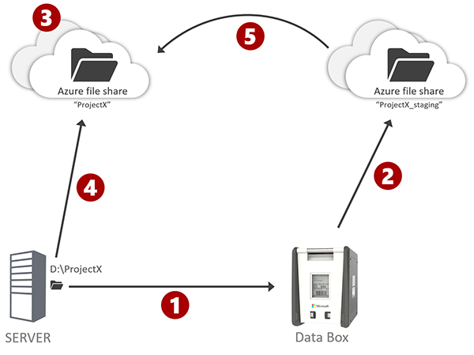
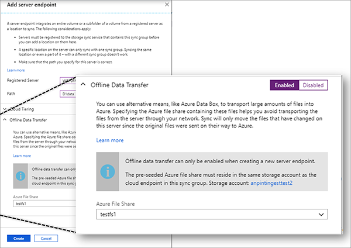

# Migrate bulk data to Azure File Sync with Azure DataBox
You can migrate bulk data to Azure File Sync in two ways:

* **Upload your files by using Azure File Sync.** This is the simplest method. Move your files locally to Windows Server 2012 R2 or later, and install the Azure File Sync agent. After you set up the sync, your files will be uploaded from the server. (Our customers currently experience an average upload speed of 1 TiB about every two days.) To ensure that your server doesn't use too much of the bandwidth for your datacenter, you might want to set up a [bandwidth throttling schedule](storage-sync-files-server-registration.md#ensuring-azure-file-sync-is-a-good-neighbor-in-your-datacenter).
* **Transfer your files offline.** If you don't have enough bandwidth, you might not be able to upload files to Azure in a reasonable amount of time. The challenge is the initial sync of the whole set of files. To overcome this challenge, use offline bulk migration tools such as the [Azure Data Box family](https://azure.microsoft.com/services/storage/databox). 

This article explains how to migrate files offline in a way that's compatible with Azure File Sync. Follow these instructions to avoid file conflicts and to preserve your file and folder access control lists (ACLs) and timestamps after you enable the sync.

## Migration tools
The process we describe in this article works not only for Data Box but also for other offline migration tools. It also works for tools such as AzCopy, Robocopy, or partner tools and services that work straight over the internet. However to overcome the initial upload challenge, follow the steps in this article to use these tools in a way that's compatible with Azure File Sync.

In some cases, you need to move from one Windows Server to another Windows Server before adopting Azure File Sync. [Storage Migration Service](https://aka.ms/storagemigrationservice) (SMS) can help with that. Whether you need to migrate to a Server OS version that is supported by Azure File Sync (Windows Server 2012R2 and up) or you simply need to migrate because you are buying a new system for Azure File Sync, SMS has numerous features and advantages that will help get your migration done smoothly.

## Benefits of using a tool to transfer data offline
Here are the main benefits of using a transfer tool like Data Box for offline migration:

- You don't have to upload all of your files over the network. For large namespaces, this tool could save significant network bandwidth and time.
- When you use Azure File Sync, no matter which transfer tool you use (Data Box, Azure Import/Export service, and so on), your live server uploads only the files that change after you move the data to Azure.
- Azure File Sync syncs your file and folder ACLs even if the offline bulk migration tool doesn't transport ACLs.
- Data Box and Azure File Sync require no downtime. When you use Data Box to transfer data into Azure, you use network bandwidth efficiently and preserve the file fidelity. You also keep your namespace up to date by uploading only the files that change after you move the data to Azure.

## Prerequisites for the offline data transfer
You should not enable sync on the server you are migrating before you complete your offline data transfer. Other things to consider before you begin are as follows:

- If you plan to use Data Box for your bulk migration: Review the [deployment prerequisites for Data Box](../../databox/data-box-deploy-ordered.md#prerequisites).
- Plan your final Azure File Sync topology: [Plan for an Azure File Sync deployment](storage-sync-files-planning.md)
- Select Azure storage account(s) that will hold the file shares you want to sync with. Ensure that your bulk migration happens to temporary staging shares in the same Storage Account(s). Bulk migration can only be enabled utilizing a final- and a staging- share that reside in the same storage account.
- A bulk migration can only be utilized when you create a new sync relationship with a server location. You can't enable a bulk migration with an existing sync relationship.

## Process for offline data transfer
Here's how to set up Azure File Sync in a way that's compatible with bulk migration tools such as Azure Data Box:

| Step | Detail |
|---|---------------------------------------------------------------------------------------|
|  | [Order your Data Box](../../databox/data-box-deploy-ordered.md). The Data Box family offers [several products](https://azure.microsoft.com/services/storage/databox/data) to meet your needs. When you receive your Data Box, follow its [documentation to copy your data](../../databox/data-box-deploy-copy-data.md#copy-data-to-data-box) to this UNC path on the Data Box: *\\<DeviceIPAddres\>\<StorageAccountName_AzFile\>\<ShareName\>*. Here, *ShareName* is the name of the staging share. Send the Data Box back to Azure. |
|  | Wait until your files show up in the Azure file shares that you chose as temporary staging shares. *Do not enable syncing to these shares.* |
|  | <ul><li>Create a new empty share for each file share that Data Box created for you. This new share should be in the same storage account as the Data Box share. [How to create a new Azure file share](storage-how-to-create-file-share.md).</li><li>[Create a sync group](storage-sync-files-deployment-guide.md#create-a-sync-group-and-a-cloud-endpoint) in a Storage Sync Service. Reference the empty share as a cloud endpoint. Repeat this step for every Data Box file share. [Set up Azure File Sync](storage-sync-files-deployment-guide.md).</li></ul> |
|  | [Add your live server directory as a server endpoint](storage-sync-files-deployment-guide.md#create-a-server-endpoint). In the process, specify that you moved the files to Azure, and reference the staging shares. You can enable or disable cloud tiering as needed. While creating a server endpoint on your live server, reference the staging share. On the **Add server endpoint** blade, under **Offline Data Transfer**, select **Enabled**, and then select the staging share that must be in the same storage account as the cloud endpoint. Here, the list of available shares is filtered by storage account and shares that aren't already syncing. The screenshot following this table shows how to reference the DataBox share during server endpoint creation in the Azure portal. |
|  | Once you have added the server endpoint in the previous step, data starts automatically flowing from the right source. The [Syncing the share](#syncing-the-share) section explains when data flows either from the DataBox share or from the Windows Server |
| |

## Syncing the share
After you create your server endpoint, sync will start. The sync process determines whether each file on the server also exists in the staging share where Data Box deposited the files. If the file exists there, the sync process copies the file from the staging share rather than uploading it from the server. If the file doesn't exist in the staging share, or if a newer version is available on the local server, the sync process uploads the file from the local server.

When syncing the share, sync will merge any missing file attributes, permissions, or timestamps from the file variants on the local server, combining them with their file counterparts from the DataBox share. This ensures each file and folder arrives with all possible file fidelity in the Azure file share.

> [!IMPORTANT]
> You can enable the bulk migration mode only while you're creating a server endpoint. After you establish a server endpoint, you can't integrate bulk-migrated data from an already syncing server into the namespace.

## ACLs and timestamps on files and folders
Azure File Sync ensures that file and folder ACLs are synced from the live server even if the bulk migration tool that you used didn't initially transport ACLs. Because of this, the staging share doesn't need to contain any ACLs for files and folders. When you enable the offline data migration feature as you create a new server endpoint, all file ACLs are synced on the server. Newly created and modified timestamps are also synced.

## Shape of the namespace
When you enable the sync, the server's contents determine the shape of the namespace. If files are deleted from the local server after the Data Box snapshot and migration finish, these files don't move into the live, syncing namespace. They stay in the staging share, but they aren't copied. This is necessary because the sync keeps the namespace according to the live server. The Data Box *snapshot* is just a staging ground for efficient file copy. It's not the authority for the shape of the live namespace.

## Cleaning up after bulk migration 
As the server completes its initial sync of the namespace, the Data Box bulk-migrated files use the staging file share. On the **Server Endpoint Properties** blade in Azure portal, in the **Offline Data Transfer** section, the status changes from **In Progress** to **Completed**. 

Now you can clean up the staging share to save costs:

1. On the **Server Endpoint Properties** blade, when the status is **Completed**, select **Disable offline data transfer**.
2. Consider deleting the staging share to save costs. The staging share probably doesn't contain file and folder ACLs, so it's unlikely to be useful. For backup point-in-time purposes, create a real [snapshot of the syncing Azure file share](storage-snapshots-files.md). You can [set up Azure Backup to take snapshots]( ../../backup/backup-afs.md) on a schedule.

Disable the offline data transfer mode only when the state is **Completed** or when you want to cancel because of a misconfiguration. If you disable the mode during a deployment, files will start to upload from the server even if your staging share is still available.

> [!IMPORTANT]
> After you disable the offline data transfer mode, you can't enable it again, even if the staging share from the bulk migration is still available.

## Next steps
- [Plan for an Azure File Sync deployment](storage-sync-files-planning.md)
- [Deploy Azure File Sync](storage-sync-files-deployment-guide.md)
