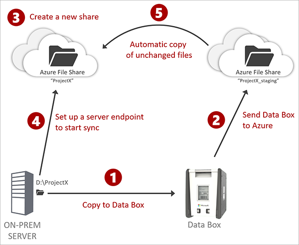
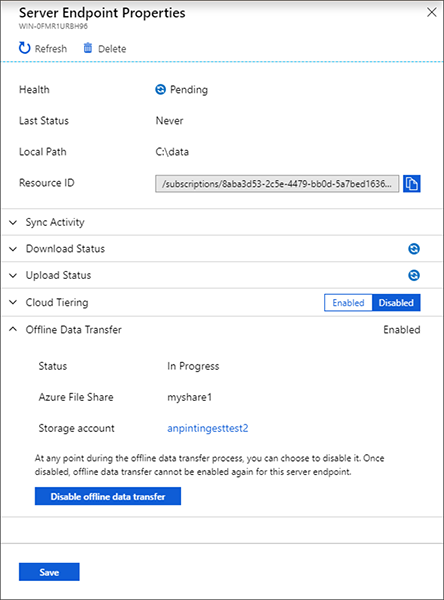

# Offline data transfer and Data Box support

Version 5 and newer of the Azure File Sync agent supports the bulk migration of files through online migration tools (for example AzCopy) as well as offline migration tools such as [Azure Data Box](https://azure.microsoft.com/services/storage/databox).
This article describes the process you should follow to ensure your bulk migration is done in a sync-compatible way. It will describe the best practices that will help you avoid conflict files and preserve your file and folder ACLs once you enable sync.

## Key benefits of utilizing an offline bulk-migration product with Azure File Sync

The main benefit in migrating files into Azure though an offline bulk transfer process, such as Data Box, is that you won’t have to upload all files from your server over the network.
For large namespaces, this could mean significant savings in network bandwidth and time.
Another core benefit of utilizing Azure File Sync is that regardless of the mode of transport used (Data Box, Azure Import, etc.), your live server will only have to upload the files that have changed since you sent the data via a postal service. Moreover, Azure File Sync always ensures that your file and folder ACLs are synced as well - even if the offline bulk migration product does not transport ACLs. 
Utilizing Azure Data Box and Azure File Sync allows for zero downtime. The solution moves large amounts of files efficiently into Azure and preserves file fidelity. It also keeps your namespace up-to-date by uploading only the files that have changed since the Data Box was sent off.

## Planning your offline data transfer

- Complete your bulk migration to one or multiple Azure file shares prior to enabling sync with Azure File Sync.
- You will have to plan your bulk migration by:
- Planning your final Azure File Sync topology:
  - [Plan for an Azure File Sync deployment](storage-sync-files-planning.md)
  - As part of this plan, you select Azure Storage Account(s) that will hold the file shares you want to sync with. Ensure that your bulk migration happens to temporary staging shares in the same Storage Account(s). Bulk migration can only be enabled utilizing a final- and a staging- share that reside in the same Storage Account.
  - Keep in mind that you can utilize a bulk migration only when you create a new sync relationship with a server location. It cannot be added to an existing sync relationship.

## Best practices

For the following best practices, it is irrelevant how your files got into Azure. You can use Data Box, Azure Import, AzCopy, or third-party tools and services. In the following best practice steps, we use Data Box as an example. Azure File Sync works with any bulk migration solution if the best practices are followed.

## Process details

| Step | Detail |
|---|---------------------------------------------------------------------------------------|
|  | [Order your Data Box](../../databox/data-box-deploy-ordered.md). There are [several variations](https://azure.microsoft.com/services/storage/databox/data) to match your needs. Receive your Data Box and follow the Data Box [documentation to copy your data](../../databox/data-box-deploy-copy-data.md#copy-data-to-data-box) and send it back to Azure. |
|  | Your files will show up in the Azure file shares you designated during the Data Box process. View these file shares as temporary, staging shares. **Do not enable sync to them!** |
|  | Create a new share that is empty for each file share that Data Box created for you. Make sure that this new share is in the same storage account as the Data Box share. [How to create a new Azure file share](storage-how-to-create-file-share.md). |
|  | Set up a sync group in a storage sync service and reference the empty share as a cloud endpoint. Repeat this step for every Data Box file share. Review the [Deploy Azure File Sync](storage-sync-files-deployment-guide.md) guide and follow the steps required to setup Azure File Sync. |
|  | [Create a sync group](storage-sync-files-deployment-guide.md#create-a-sync-group-and-a-cloud-endpoint) and [add your live server directory as a server endpoint](storage-sync-files-deployment-guide.md#create-a-server-endpoint) – specify in the process that you already moved the files to Azure and reference the file share Data Box moved the files into (in this guide called the “staging share”). It is important to recognize that the share used for the cloud endpoint and the Data Box share must reside in the same storage account. It is your choice to enable or disable cloud tiering as needed. |

## Enable offline data transfer

Once your files have arrived in Azure and reside in staging shares, your next step is to enable sync. You enable sync to a specific location on a server by creating a server endpoint in a sync group. During this create process, you need to reference the staging share.
Enable “Offline Data Transfer” in the new server endpoint blade and reference the staging share that must reside in the same storage account as the cloud endpoint. The list of available shares is filtered by storage account and shares that are not already syncing.

## Syncing the share

Once you have created your server endpoint, sync will commence.
For each file that exists on the server, sync will determine if this file also exists in the staging share where Data Box deposited the files and if so, sync will copy the file from the staging share rather than uploading it from the server. If the file doesn’t exist in the staging share or a newer version is available on the local server, then sync will upload the file from the local server.

> [!Important]
> You can only enable the bulk migration mode during the creation of a server endpoint. Once a server endpoint is established, there is currently no way to integrate bulk migrated data from an already syncing server into the namespace.

## File and folder ACLs

Azure File Sync will ensure that file and folder ACLs are synced from the live server even if the bulk migration tool that was used did not transport ACLs initially. This means it is OK for the staging share to not contain any ACLs on files and folders. When you enable the offline data migration feature as you create a new server endpoint, ACLs will be synced at that time for all files on the server.

## Shape of the namespace

The shape of the namespace is determined by what’s on the server when sync is enabled. If files are deleted on the local server after the Data Box “-snapshot” and -migration, then these files won’t be brought into the live, syncing namespace. They will still be in the staging share but never copied. That is the desired behavior as sync keeps the namespace according to the live server. The Data Box “snapshot” is just a staging ground for efficient file copy and not the authority for the shape of the live namespace.

## Finishing bulk migration and clean-up

The screenshot below shows the server endpoint properties blade in the Azure Portal.
In the offline Data Transfer section, you can observe the status of the process. It will either show “In Progress” or “Completed”.

After the server completes its initial sync of the entire namespace, it will have finished leveraging the staging file share with the Data Box bulk migrated files. Observe in the server endpoint properties for offline data transfer that the status is changing to “Complete”. At this time, you can clean up the staging share to save cost:

1. Hit “Disable offline data transfer” in the server endpoint properties, when the status is “Completed”.
2. Consider deleting the staging share to save cost. The staging share is unlikely to contain file and folder ACLs and as such is of limited use. For backup “point in time” purposes, rather create a real [snapshot of the syncing Azure file share](storage-snapshots-files.md). You can [enable Azure Backup to take snapshots]( ../../backup/backup-azure-files.md) on a schedule.

You should only disable this mode when the state is “Completed” or you truly want to abort due to misconfiguration. If you are disabling the mode mid-way a legitimate deployment, files will start to upload from the server, even if your staging share is still available.

>**Important:**
>After you disable offline data transfer there is no way to enable it again, even if the staging share from the bulk migration is still available.

## See also
- [Planning for an Azure File Sync deployment](storage-sync-files-planning.md)
- [Deploy Azure File Sync](storage-sync-files-deployment-guide.md)