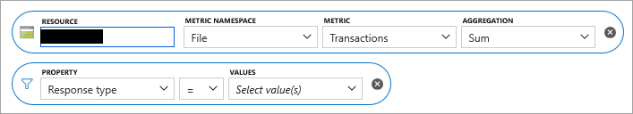
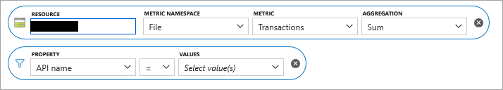

# Troubleshoot Azure Files performance issues

This article lists some common problems related to Azure file shares. It provides potential causes and workarounds when these problems are encountered.

## High latency, low throughput, and general performance issues

### Cause 1: Share was throttled

Requests are throttled when the IOPS, ingress or egress limits for a file share are reached. To understand the limits for standard and premium file shares, see [File share and file scale targets](https://docs.microsoft.com/azure/storage/files/storage-files-scale-targets#file-share-and-file-scale-targets).

To confirm if your share is being throttled, you can leverage Azure Metrics in the portal.

1. Sign in to the [Azure portal](https://portal.azure.com).

1. Select **All services** and then search for **Metrics**.

1. Select **Metrics**.

1. Select your storage account as the resource.

1. Select **File** as the metric namespace.

1. Select **Transactions** as the metric.

1. Add a filter for **ResponseType** and check to see if any requests have a response code of **SuccessWithThrottling** (for SMB) or **ClientThrottlingError** (for REST).

> [!NOTE]
> To receive an alert if a file share is throttled, see [How to create an alert if a file share is throttled](#how-to-create-an-alert-if-a-file-share-is-throttled).

### Solution

- If you are using a standard file share, enable [large file shares](https://docs.microsoft.com/azure/storage/files/storage-files-how-to-create-large-file-share?tabs=azure-portal) on your storage account. Large file shares support up to 10,000 IOPS per share.
- If you are using a premium file share, increase the provisioned file share size to increase the IOPS limit. To learn more, see the [Understanding provisioning for premium file shares](https://docs.microsoft.com/azure/storage/files/storage-files-planning#understanding-provisioning-for-premium-file-shares) section in the Azure Files planning guide.

### Cause 2: Metadata/namespace heavy workload

If the majority of your requests are metadata centric, (such as createfile/openfile/closefile/queryinfo/querydirectory) then the latency will be worse when compared to read/write operations.

To confirm if most of your requests are metadata centric, you can use the same steps as above. Except instead of adding a filter for **ResponseType**, add a filter for **API Name**.

### Workaround

- Check if the application can be modified to reduce the number of metadata operations.
- Add a VHD on the file share and mount VHD over SMB from the client to perform files operations against the data. This approach works for single writer and multiple readers scenarios and allows metadata operations to be local, offering performance similar to a local direct-attached storage.

### Cause 3: Single-threaded application

If the application being used by the customer is single-threaded, this can result in significantly lower IOPS/throughput than the maximum possible based on your provisioned share size.

### Solution

- Increase application parallelism by increasing the number of threads.
- Switch to applications where parallelism is possible. For example, for copy operations, customers could use AzCopy or RoboCopy from Windows clients or the **parallel** command on Linux clients.

## Very high latency for requests

### Cause

The client VM could be located in a different region than the file share.

### Solution

- Run the application from a VM that is located in the same region as the file share.

## Client unable to achieve maximum throughput supported by the network

One potential cause of this is a lack fo SMB multi-channel support. Currently, Azure file shares only support single channel, so there is only one connection from the client VM to the server. This single connection is pegged to a single core on the client VM, so the maximum throughput achievable from a VM is bound by a single core.

### Workaround

- Obtaining a VM with a bigger core may help improve throughput.
- Running the client application from multiple VMs will increase throughput.

- Use REST APIs where possible.

## Throughput on Linux clients is significantly lower when compared to Windows clients.

### Cause

This is a known issue with the implementation of SMB client on Linux.

### Workaround

- Spread the load across multiple VMs.
- On the same VM, use multiple mount points with **nosharesock** option, and spread the load across these mount points.
- On Linux, try mounting with **nostrictsync** option to avoid forcing SMB flush on every **fsync** call. For Azure Files, this option does not interfere with data consistency, but may result in stale file metadata on directory listing (**ls -l** command). Directly querying metadata of file (**stat** command) will return the most up-to date file metadata.

## High latencies for metadata heavy workloads involving extensive open/close operations.

### Cause

Lack of support for directory leases.

### Workaround

- If possible, avoid excessive opening/closing handle on the same directory within a short period of time.
- For Linux VMs, increase the directory entry cache timeout by specifying **actimeo=\<sec>** as a mount option. By default, it is one second, so a larger value like three or five might help.
- For Linux VMs, upgrade the kernel to 4.20 or higher.

## Low IOPS on CentOS/RHEL

### Cause

IO depth greater than one is not supported on CentOS/RHEL.

### Workaround

- Upgrade to CentOS 8 / RHEL 8.
- Change to Ubuntu.

## Slow file copying to and from Azure Files in Linux

If you are experiencing slow file copying to and from Azure Files, take a look at the [Slow file copying to and from Azure Files in Linux](storage-troubleshoot-linux-file-connection-problems.md#slow-file-copying-to-and-from-azure-files-in-linux) section in the Linux troubleshooting guide.

## Jittery/saw-tooth pattern for IOPS

### Cause

Client application consistently exceeds baseline IOPS. Currently, there is no service side smoothing of the request load, so if the client exceeds baseline IOPS, it will get throttled by the service. That throttling can result in the client experiencing a jittery/saw-tooth IOPS pattern. In this case, average IOPS achieved by the client might be lower than the baseline IOPS.

### Workaround

- Reduce the request load from the client application, so that the share does not get throttled.
- Increase the quota of the share so that the share does not get throttled.

## Excessive DirectoryOpen/DirectoryClose calls

### Cause

If the number of DirectoryOpen/DirectoryClose calls is among the top API calls and you don't expect the client to be making that many calls, it may be an issue with the antivirus installed on the Azure client VM.

### Workaround

- A fix for this issue is available in the [April Platform Update for Windows](https://support.microsoft.com/help/4052623/update-for-windows-defender-antimalware-platform).

## File creation is slower than expected

### Cause

Workloads that rely on creating a large number of files will not see a substantial difference between the performance of premium file shares and standard file shares.

### Workaround

- None.

## Slow performance from Windows 8.1 or Server 2012 R2

### Cause

Higher than expected latency accessing Azure Files for IO intensive workloads.

### Workaround

- Install the available [hotfix](https://support.microsoft.com/help/3114025/slow-performance-when-you-access-azure-files-storage-from-windows-8-1).

## How to create an alert if a file share is throttled

1. Go to your **storage account** in the **Azure portal**.
2. In the Monitoring section, click **Alerts** and then click **+ New alert rule**.
3. Click **Edit resource**, select the **File resource type** for the storage account and then click **Done**. For example, if the storage account name is contoso, select the contoso/file resource.
4. Click **Select Condition** to add a condition.
5. You will see a list of signals supported for the storage account, select the **Transactions** metric.
6. On the **Configure signal logic** blade, click the **Dimension name** drop-down and select **Response type**.
7. Click the **Dimension values** drop-down and select **SuccessWithThrottling** (for SMB) or **ClientThrottlingError** (for REST).

  > [!NOTE]
  > If the SuccessWithThrottling or ClientThrottlingError dimension value is not listed, this means the resource has not been throttled. To add the dimension value, click **Add  custom value** beside the **Dimension values** drop-down, type **SuccessWithThrottling** or **ClientThrottlingError**, click **OK** and then repeat step #7.

8. Click the **Dimension name** drop-down and select **File Share**.
9. Click the **Dimension values** drop-down and select the file share(s) that you want to alert on.

  > [!NOTE]
  > If the file share is a standard file share, select **All current and future values**. The dimension values drop-down will not list the file share(s) because per-share metrics are not available for standard file shares. Throttling alerts for standard file shares will be triggered if any file share within the storage account is throttled and the alert will not identify which file share was throttled. Since per-share metrics are not available for standard file shares, the recommendation is to have one file share per storage account.

10. Define the **alert parameters** (threshold value, operator, aggregation granularity and frequency of evaluation) and click **Done**.

  > [!TIP]
  > If you are using a static threshold, the metric chart can help determine a reasonable threshold value if the file share is currently being throttled. If you are using a dynamic threshold, the metric chart will display the calculated thresholds based on recent data.

11. Click **Select action group** to add an **action group** (email, SMS, etc.) to the alert either by selecting an existing action group or creating a new action group.
12. Fill in the **Alert details** like **Alert rule name**, **Description** and **Severity**.
13. Click **Create alert rule** to create the alert.

To learn more about configuring alerts in Azure Monitor, see [Overview of alerts in Microsoft Azure]( https://docs.microsoft.com/azure/azure-monitor/platform/alerts-overview).

## See also
* [Troubleshoot Azure Files in Windows](storage-troubleshoot-windows-file-connection-problems.md)
* [Troubleshoot Azure Files in Linux](storage-troubleshoot-linux-file-connection-problems.md)
* [Frequently asked questions (FAQ) about Azure Files](storage-files-faq.md)
