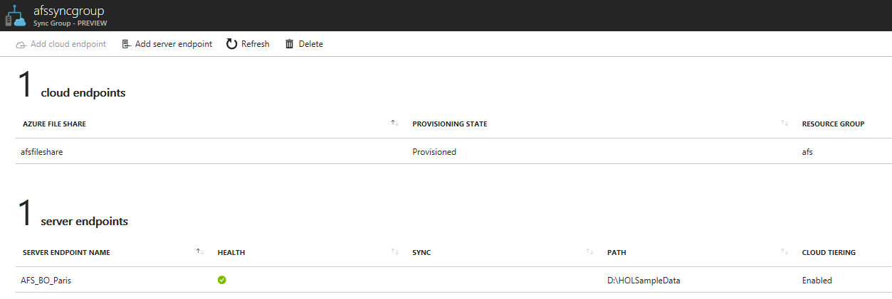

# Troubleshoot Azure File Sync (preview)
With Azure File Sync (preview), shares can be replicated to Windows Servers on-premises or in Azure. You and your users would then access the file share through the Windows Server, such as through a SMB or NFS share. This is particularly useful for scenarios in which data will be accessed and modified far away from an Azure datacenter, such as in a branch office scenario. Data may be replicated between multiple Windows Server endpoints, such as between multiple branch offices.

This article is designed to help you troubleshoot and resolve issues encountered with your Azure File Sync deployment. Failing that, this guide illustrates how to collect important logs from the system to aid in a deeper investigation of the issues. There are several options for getting support for Azure File Sync:

- Microsoft Support: To create a new support case, navigate to the "Help + support" tab on the Azure portal and click "New support request".
- [Azure Storage Forum](https://social.msdn.microsoft.com/Forums/en-US/home?forum=windowsazuredata)
- [Azure Files on StackOverflow](https://stackoverflow.com/questions/tagged/azure-storage-file+or+azure-files+or+azure-file-storage)

## How to troubleshoot agent installation failures
If the Azure File Sync agent installation is failing, run the following command from an elevated command prompt to enable logging during the agent installation:

```
StorageSyncAgent.msi /l*v Installer.log
```

Once the installation fails, review the installer.log to determine the cause.

## Server Registration
### Server is not listed under Registered Servers in the Azure portal
If a server is not listed under Registered Servers for a Storage Sync Service, perform the following steps:
1. Login to the server that you want to register.
2. Open File Explorer and navigate to the Storage Sync Agent installation directory (default location is `C:\Program Files\Azure\StorageSyncAgent`). 
3. Run ServerRegistration.exe and follow the wizard to register the server with a Storage Sync Service.

### Server Registration displays the following message after installing the Azure File Sync agent: "This server is already registered"


This message will be displayed if the server was previously registered with a Storage Sync Service. To unregister the server with the current Storage Sync Service and register with a new Storage Sync Service, follow the steps to [Unregister a server with Azure File Sync](azure-file-sync-server-registration.md#unregister-the-server-with-storage-sync-service).

## Sync
### How to troubleshoot sync not working on a server:
If sync is failing on a server, perform the following:
- Verify a Server Endpoint exists in the Azure Portal for the directory you want to sync to an Azure File share:
    
    

- Review the Operational and Diagnostic event logs with Event Viewer, located under `Applications and Services\Microsoft\FileSync\Agent`.
- Confirm the server has internet connectivity.
- Verify the Azure File Sync service is running on the server by opening up the Services MMC snap-in and verify the Storage Sync Agent service (FileSyncSvc) is running.

### How to troubleshoot individual files failing to sync 
If individual files are failing to sync, perform the following:
- Review the Operational and Diagnostic event logs under `Applications and Services\Microsoft\FileSync\Agent` in Event Viewer
- Verify there are no open handles on the file
    - Note: Azure File Sync will periodically take VSS snapshots to sync files with open handles

## Cloud tiering
### How to troubleshoot files that fail to tier
If file(s) fail to tier to Azure Files, perform the following steps:

- Verify the file(s) exist in the Azure file share
    - Note: A file must be synced to an Azure file share before it can be tiered
- Review the Operational and Diagnostic event logs, located under `Applications and Services\Microsoft\FileSync\Agent` in Event Viewer
- Confirm the server has internet connectivity 
- Verify the Azure File Sync filter drivers (StorageSync.sys & StorageSyncGuard.sys) are running
    - Open an elevated command prompt, run `fltmc` and verify the StorageSync.sys and StorageSyncGuard.sys file system filter drivers are listed

### How to troubleshoot files that fail to be recalled
If files fail to be recalled, perform the following steps:
- Review the Operational and Diagnostic event logs, located under `Applications and Services\Microsoft\FileSync\Agent` in Event Viewer
- Verify the file(s) exists in the Azure File Share
- Confirm the server has internet connectivity 
- Verify the Azure File Sync filter drivers (StorageSync.sys & StorageSyncGuard.sys) are running
    - Open an elevated command prompt, run `fltmc` and verify the StorageSync.sys and StorageSyncGuard.sys file system filter drivers are listed

### How to troubleshoot files being unexpectedly recalled on a server
Anti-virus, backup, and other applications that read large numbers of files will cause undesirable recalls unless they respect the offline attribute and skip reading the content of those files. Skipping offline files for those products that support it helps avoid undesirable recalls when performing operations such as anti-virus scans or backup jobs.

Consult with your software vendor regarding how to configure their solution to skip reading offline files.

Further undesired recalls may happen in other scenarios like browsing files in File Explorer. Opening a folder with cloud-tiered files in File Explorer on the server may result in undesired recalls, more so if anti-virus is enabled on the server.

## General troubleshooting
If you encounter issues with Azure File Sync on a server, start by performing the following:
- Review the Diagnostic and Operational event logs in Event Viewer
    - Sync, Tiering, and Recall issues are logged in the diagnostic and operational event logs under `Applications and Services\Microsoft\FileSync\Agent`
    - Issues managing a server (for example, configuration settings) are logged in the diagnostic and operational event logs under Microsoft-FileSync-Management
- Verify the Azure File Sync service is running on the server
    - Open the Services MMC snap-in and verify the Storage Sync Agent service (FileSyncSvc) is running
- Verify the Azure File Sync filter drivers (StorageSync.sys & StorageSyncGuard.sys) are running
    - Open an elevated command prompt, run fltmc and verify the StorageSync.sys and StorageSyncGuard.sys file system filter drivers are listed

If the issue is not resolved after performing the steps above, run the AFSDiag tool by performing the following steps:
1. Create a directory that will be used to save the AFSDiag output (for example, c:\output).
2. Open an elevated PowerShell window and run the following commands (hit enter after each command):

    ```PowerShell
    cd "c:\Program Files\Azure\StorageSyncAgent"
    Import-Module .\afsdiag.ps1
    Debug-Afs c:\output # Note: use the path created in step 1
    ```

3. For the Azure File Sync kernel mode trace level, enter 1 (unless specified by your buddy to create more verbose traces) and hit enter.
4. For the Azure File Sync user mode trace level, enter 1 (unless specified by your buddy to create more verbose traces) and hit enter.
5. Reproduce the issue and press D when done
6. A .zip file containing logs and trace files will be in the output directory specified.