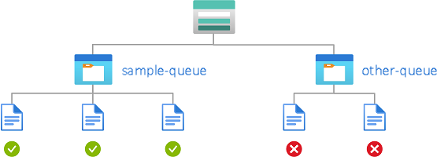

# Example Azure role assignment conditions for Queue Storage

This article lists some examples of role assignment conditions for controlling access to Azure Queue Storage.

[!INCLUDE [storage-abac-preview](../../../includes/storage-abac-preview.md)]

## Prerequisites

For information about the prerequisites to add or edit role assignment conditions, see [Conditions prerequisites](../../role-based-access-control/conditions-prerequisites.md).

## Summary of examples in this article

Use the following table to quickly locate an example that fits your ABAC scenario. The table includes a brief description of the scenario, plus a list of attributes used in the example by [source](../../role-based-access-control/conditions-format.md#attributes) (environment, principal, request and resource).

| Example | Environment | Principal | Request | Resource |
|---------|-------------|-----------|---------|----------|
| [Peek or clear messages in a named queue](#example-peek-or-clear-messages-in-a-named-queue) | | | | queue name |
| [Allow peek access to messages after a specific date and time](#example-allow-peek-access-to-messages-after-a-specific-date-and-time) | UtcNow | | | queue name |
| [Allow access to messages in specific queues from a specific subnet](#example-allow-access-to-messages-in-specific-queues-from-a-specific-subnet) | Subnet | | | queue name |
| [Principal attributes example](#principal-attributes) | | ID | | |

## Queue names

This section includes examples showing how to restrict access to messages based on queue name.

### Example: Peek or clear messages in a named queue

This condition allows users to peek or clear messages in a queue named **sample-queue**. This condition is useful for sharing specific queue data with other users in a subscription.

> [!IMPORTANT]
> For this condition to be effective for a security principal, you must add it to all role assignments for them that include the following actions: `Microsoft.Storage/storageAccounts/queueServices/queues/messages/read` and `Microsoft.Storage/storageAccounts/queueServices/queues/messages/delete`.



The condition can be added to a role assignment using either the Azure portal or Azure PowerShell. The portal has two tools for building ABAC conditions - the visual editor and the code editor. You can switch between the two editors in the Azure portal to see your conditions in different views. Switch between the **Visual editor** tab and the **Code editor** tabs below to view the examples for your preferred portal editor.

# [Portal: Visual editor](#tab/portal-visual-editor)

#### Add action

Select **Add action**, then select **Peek messages** and **Clear messages**:

:::image type="content" source="./media/queues-auth-abac-examples/peek-clear-action-select-portal.png" alt-text="Screenshot of condition editor in Azure portal showing selection of peek and clear operations." lightbox="./media/queues-auth-abac-examples/peek-clear-action-select-portal.png":::

#### Build expression

Use the values in the following table to build the expression portion of the condition:

> | Setting | Value |
> | ------- | ----- |
> | Attribute source | [Resource](../../role-based-access-control/conditions-format.md#resource-attributes) |
> | Attribute | [Queue name](queues-auth-abac-attributes.md#queue-name) |
> | Operator | [StringEquals](../../role-based-access-control/conditions-format.md#stringequals) |
> | Value | {queueName} |

:::image type="content" source="./media/queues-auth-abac-examples/peek-clear-messages-portal.png" alt-text="Screenshot of condition editor in Azure portal showing peek or clear access to messages in a named queue." lightbox="./media/queues-auth-abac-examples/peek-clear-messages-portal.png":::

# [Portal: Code editor](#tab/portal-code-editor)

To add the condition using the code editor, copy the condition code sample below and paste it into the code editor.

Storage Queue Data Contributor
```
(
 (
  !(ActionMatches{'Microsoft.Storage/storageAccounts/queueServices/queues/messages/read'})
  AND
  !(ActionMatches{'Microsoft.Storage/storageAccounts/queueServices/queues/messages/delete'})
 )
 OR 
 (
  @Resource[Microsoft.Storage/storageAccounts/queueServices/queues:name] StringEquals 'sample-queue'
 )
)
```
After entering your code, switch back to the visual editor to validate it.

# [PowerShell](#tab/azure-powershell)

Here's how to add this condition using Azure PowerShell.

```azurepowershell
$condition = "((!(ActionMatches{'Microsoft.Storage/storageAccounts/queueServices/queues/messages/delete'}) AND !(ActionMatches{'Microsoft.Storage/storageAccounts/queueServices/queues/messages/read'})) OR (@Resource[Microsoft.Storage/storageAccounts/queueServices/queues:name] StringEquals 'sample-queue'))"
$testRa = Get-AzRoleAssignment -Scope $scope -RoleDefinitionName $roleDefinitionName -ObjectId $userObjectID
$testRa.Condition = $condition
$testRa.ConditionVersion = "2.0"
Set-AzRoleAssignment -InputObject $testRa -PassThru
```

Here's how to test this condition.

```azurepowershell
$bearerCtx = New-AzStorageContext -StorageAccountName $storageAccountName
Get-AzStorageQueue -Name <queueName> -Context $bearerCtx 
```

---

## Environment attributes

This section includes examples showing how to restrict access to queue messages based on the network environment or the current date and time.

### Example: Allow peek access to messages after a specific date and time

This condition allows peek access to the queue `sample-queue` only after 1:00pm on May 1, 2023 Universal Coordinated Time (UTC).

> [!IMPORTANT]
> To make this condition effective for principals that have multiple role assignments, you must add this condition to all role assignments that include the following action: `Microsoft.Storage/storageAccounts/queueServices/queues/messages/read`.

The condition can be added to a role assignment using either the Azure portal or Azure PowerShell. The portal has two tools for building ABAC conditions - the visual editor and the code editor. You can switch between the two editors in the Azure portal to see your conditions in different views. Switch between the **Visual editor** tab and the **Code editor** tabs below to view the examples for your preferred portal editor.

# [Portal: Visual editor](#tab/portal-visual-editor)

#### Add action

Select **Add action**, then select **Peek messages**:

:::image type="content" source="./media/queues-auth-abac-examples/peek-action-select-portal.png" alt-text="Screenshot of condition editor in Azure portal showing selection of just the peek operation." lightbox="./media/queues-auth-abac-examples/peek-action-select-portal.png":::

#### Build expression

Use the values in the following table to build the expression portion of the condition:

> | Setting | Value |
> | ------- | ----- |
> | Attribute source | [Resource](../../role-based-access-control/conditions-format.md#resource-attributes) |
> | Attribute | [Queue name](queues-auth-abac-attributes.md#queue-name) |
> | Operator | [StringEquals](../../role-based-access-control/conditions-format.md#stringequals) |
> | Value | {queue-name} |
> | Logical operator | ['AND'](../../role-based-access-control/conditions-format.md#and) |
> | Attribute source | [Environment](../../role-based-access-control/conditions-format.md#environment-attributes) |
> | Attribute | [UtcNow](queues-auth-abac-attributes.md#utc-now) |
> | Operator | [DateTimeGreaterThan](../../role-based-access-control/conditions-format.md#datetime-comparison-operators) |
> | Value | `2023-05-01T13:00:00.000Z` |

The following image shows the condition after the settings have been entered into the Azure portal. Note that you must group expressions to ensure correct evaluation.

:::image type="content" source="./media/queues-auth-abac-examples/env-utcnow-queue-peek-portal.png" alt-text="Screenshot of the condition editor in the Azure portal showing peek access allowed after a specific date and time." lightbox="./media/queues-auth-abac-examples/env-utcnow-queue-peek-portal.png":::

# [Portal: Code editor](#tab/portal-code-editor)

To add the condition using the code editor, copy the condition code sample below and paste it into the code editor.

Storage Queue Data Reader
```
(
 (
  !(ActionMatches{'Microsoft.Storage/storageAccounts/queueServices/queues/messages/read'})
 )
 OR 
 (
  @Resource[Microsoft.Storage/storageAccounts/queueServices/queues:name] StringEquals 'sample-queue'
  AND
  @Environment[UtcNow] DateTimeGreaterThan '2023-05-01T13:00:00.0Z'
 )
)
```

After entering your code, switch back to the visual editor to validate it.

# [PowerShell](#tab/azure-powershell)

Here's how to add this condition for the Storage Queue Data Reader role using Azure PowerShell.

```azurepowershell
$subId = "<your subscription id>"
$rgName = "<resource group name>"
$storageAccountName = "<storage account name>"
$roleDefinitionName = "Storage Queue Data Reader"
$userUpn = "<user UPN>"
$userObjectID = (Get-AzADUser -UserPrincipalName $userUpn).Id
$queueName = "sample-queue"
$dateTime = "2023-05-01T13:00:00.000Z"
$scope = "/subscriptions/$subId/resourceGroups/$rgName/providers/Microsoft.Storage/storageAccounts/$storageAccountName"

$condition = `
"( `
 ( `
 !(ActionMatches{'Microsoft.Storage/storageAccounts/queueServices/queues/messages/read'}) `
 ) `
 OR ` 
 ( `
  @Resource[Microsoft.Storage/storageAccounts/queueServices/queues:name] StringEquals '$queueName' `
  AND `
  @Environment[UtcNow] DateTimeGreaterThan '$dateTime' `
 ) `
)"

$testRa = Get-AzRoleAssignment -Scope $scope -RoleDefinitionName $roleDefinitionName -ObjectId $userObjectID
$testRa.Condition = $condition
$testRa.ConditionVersion = "2.0"
Set-AzRoleAssignment -InputObject $testRa -PassThru
```

---

### Example: Allow access to messages in specific queues from a specific subnet

This condition allows put or update access to messages in `sample-queue` only from subnet `default` on virtual network `sample-vnet`.

> [!IMPORTANT]
> To make this condition effective for principals that have multiple role assignments, you must add this condition to all role assignments that include any of the following actions: `Microsoft.Storage/storageAccounts/queueServices/queues/messages/write`.

The condition can be added to a role assignment using either the Azure portal or Azure PowerShell. The portal has two tools for building ABAC conditions - the visual editor and the code editor. You can switch between the two editors in the Azure portal to see your conditions in different views. Switch between the **Visual editor** tab and the **Code editor** tabs below to view the examples for your preferred portal editor.

# [Portal: Visual editor](#tab/portal-visual-editor)

Select **Add action**, then select **Put or update a message**:

:::image type="content" source="./media/queues-auth-abac-examples/put-update-action-select-portal.png" alt-text="Screenshot of condition editor in Azure portal showing selection of the put or update operation." lightbox="./media/queues-auth-abac-examples/put-update-action-select-portal.png":::

#### Build expression

Use the values in the following table to build the expression portion of the condition:

> | Setting | Value |
> | ------- | ----- |
> | Attribute source | [Resource](../../role-based-access-control/conditions-format.md#resource-attributes) |
> | Attribute | [Queue name](queues-auth-abac-attributes.md#queue-name) |
> | Operator | [StringEquals](../../role-based-access-control/conditions-format.md#stringequals) |
> | Value | `container1` |
> | Logical operator | ['AND'](../../role-based-access-control/conditions-format.md#and) |
> | Attribute source | [Environment](../../role-based-access-control/conditions-format.md#environment-attributes) |
> | Attribute | [Subnet](queues-auth-abac-attributes.md#subnet) |
> | Operator | [StringEqualsIgnoreCase](../../role-based-access-control/conditions-format.md#stringequals) |
> | Value | `/subscriptions/<subscription-id>/resourceGroups/<resource-group-name>/providers/Microsoft.Network/virtualNetworks/sample-vnet/subnets/default` |

The following image shows the condition after the settings have been entered into the Azure portal. Note that you must group expressions to ensure correct evaluation.

:::image type="content" source="./media/queues-auth-abac-examples/env-subnet-queue-put-update-portal.png" alt-text="Screenshot of the condition editor in the Azure portal showing read access to specific queues allowed from a specific subnet." lightbox="./media/queues-auth-abac-examples/env-subnet-queue-put-update-portal.png":::

# [Portal: Code editor](#tab/portal-code-editor)

To add the condition using the code editor, copy the condition code sample below and paste it into the code editor.

Storage Queue Data Contributor
```
(
 (
  !(ActionMatches{'Microsoft.Storage/storageAccounts/queueServices/queues/messages/write'})
 )
 OR 
 (
  @Resource[Microsoft.Storage/storageAccounts/queueServices/queues:name] StringEquals 'sample-queue'
  AND
  @Environment[Microsoft.Network/virtualNetworks/subnets] StringEquals '/subscriptions/<subscription-id>/resourceGroups/<resource-group-name>/providers/Microsoft.Network/virtualNetworks/sample-vnet/subnets/default'
 )
)
```

After entering your code, switch back to the visual editor to validate it.

# [PowerShell](#tab/azure-powershell)

Here's how to add this condition for the Storage Queue Data Contributor role using Azure PowerShell.

```azurepowershell
$subId = "<your subscription id>"
$rgName = "<resource group name>"
$storageAccountName = "<storage account name>"
$roleDefinitionName = "Storage Queue Data Contributor"
$userUpn = "<user UPN>"
$userObjectID = (Get-AzADUser -UserPrincipalName $userUpn).Id
$queueName = "sample-queue"
$vnetName = "sample-vnet"
$subnetName = "default"
$scope = "/subscriptions/$subId/resourceGroups/$rgName/providers/Microsoft.Storage/storageAccounts/$storageAccountName"

$condition = `
"( `
 ( `
  !(ActionMatches{'Microsoft.Storage/storageAccounts/queueServices/queues/messages/write'}) `
 ) `
 OR ` 
 ( `
  @Resource[Microsoft.Storage/storageAccounts/queueServices/queues:name] StringEquals '$queueName' `
  AND `
  @Environment[Microsoft.Network/virtualNetworks/subnets] StringEqualsIgnoreCase '/subscriptions/$subId/resourceGroups/$rgName/providers/Microsoft.Network/virtualNetworks/$vnetName/subnets/$subnetName' `
 ) `
)"

$testRa = Get-AzRoleAssignment -Scope $scope -RoleDefinitionName $roleDefinitionName -ObjectId $userObjectID
$testRa.Condition = $condition
$testRa.ConditionVersion = "2.0"
Set-AzRoleAssignment -InputObject $testRa -PassThru
```

---

## Principal attributes

To see a full example of how to use principal attributes to allow access to blob data, see [Allow read access to blobs based on tags and custom security attributes](../../role-based-access-control/conditions-custom-security-attributes.md).

## Next steps

- [Actions and attributes for Azure role assignment conditions for Azure Queue Storage](queues-auth-abac-attributes.md)
- [Tutorial: Add a role assignment condition to restrict access to blobs using the Azure portal](../blobs/storage-auth-abac-portal.md)
- [Azure role assignment condition format and syntax](../../role-based-access-control/conditions-format.md)
- [Troubleshoot Azure role assignment conditions](../../role-based-access-control/conditions-troubleshoot.md)
