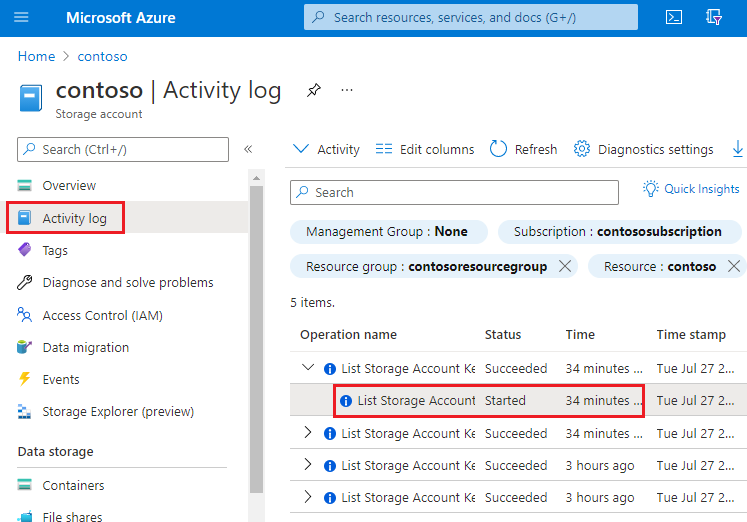

# Best practices for monitoring Azure Queue Storage

This article features a collection of common Queue Storage monitoring scenarios, and provides you with best practice guidelines to accomplish them.  

## Monitor message counts in each queue 

You can monitor the message count for all queues in a storage account by using the `QueueMessageCount` metric. This metric is refreshed daily.

### [PowerShell](#tab/azure-powershell)

If you're using PowerShell, you could use a command similar to the following:  

```powershell
(Get-AzMetric -ResourceId /subscriptions/xxxxxxxx-xxxx-xxxx-xxxxxxxxxxxx/resourceGroups/contosogroup/providers/Microsoft.Storage/storageAccounts/contoso/queueServices/default -MetricName "QueueMessageCount").data.Average
```

### [Azure CLI](#tab/azure-cli)

If you're using the Azure CLI, you could use a command similar to the following: 

```azurecli
az monitor metrics list --resource /subscriptions/xxxxxxxx-xxxx-xxxx-xxxxxxxxxxxx/resourceGroups/contosogroup/providers/Microsoft.Storage/storageAccounts/contoso/ --metric "QueueMessageCount" --interval PT1H --query value[0].timeseries[0].data[0].average
```

---

If you need to dynamically determine whether to adjust workloads to handle message volume, you can query approximate message count on each queue and then respond with the appropriate action. Use the [Get Queue Metadata](/rest/api/storageservices/get-queue-metadata) REST operation or use any of the supported Blob storage SDKs to get the approximate message count. 

The following example uses the Azure Storage .NET v12 library to get the approximate message count.

```csharp
static async Task<string> RetrieveNextMessageAsync(QueueClient theQueue)
{
    if (await theQueue.ExistsAsync())
    {
        QueueProperties properties = await theQueue.GetPropertiesAsync();

        if (properties.ApproximateMessagesCount > 0)
        {
            QueueMessage[] retrievedMessage = await theQueue.ReceiveMessagesAsync(1);
            string theMessage = retrievedMessage[0].MessageText;
            await theQueue.DeleteMessageAsync(retrievedMessage[0].MessageId, retrievedMessage[0].PopReceipt);
            return theMessage;
        }

        return null;
    }

    return null;
}
```

Also consider using Service Bus which supports message per entity. To learn more, see [Monitoring Azure Service Bus data reference](../../service-bus-messaging/monitor-service-bus-reference.md). 

## Audit account activity

In many cases, you'll need to audit the activities of your storage accounts for security and compliance. Operations on storage accounts fall into two categories: *Control Plane* and *Data Plane*. 

A control plane operation is any Azure Resource Manager request to create a storage account or to update a property of an existing storage account. For more information, see [Azure Resource Manager](../../azure-resource-manager/management/overview.md). 

A data plane operation is an operation on the data in a storage account that results from a request to the storage service endpoint. For example, a data plane operation is executed when you add a message to the queue. For more information, see [Azure Storage API](/rest/api/storageservices/). 

The section shows you how to identify the "when", "who", "what" and "how" information of control and data plane operations.

### Auditing control plane operations

Resource Manager operations are captured in the [Azure activity log](../../azure-monitor/essentials/activity-log.md). To view the activity log, open your storage account in the Azure portal, and then select **Activity log**.

> [!div class="mx-imgBorder"]
> 


Open any log entry to view JSON that describes the activity. The following JSON shows the "when", "what" and "how" information of a control plane operation:

> [!div class="mx-imgBorder"]
> 

The availability of the  "who" information depends on the method of authentication that was used to perform the control plane operation. If the authorization was performed by a Microsoft Entra security principal, the object identifier of that security principal would also appear in this JSON output (For example: `"http://schemas.microsoft.com/identity/claims/objectidentifier": "xxxxxxxx-xxxx-xxxx-xxxx-xxxxxxxxxxx"`). Because you might not always see other identity-related information such as an email address or name, the object identifier is always the best way to uniquely identify the security principal. 

You can find the friendly name of that security principal by taking the value of the object identifier, and searching for the security principal in Microsoft Entra ID page of the Azure portal. The following screenshot shows a search result in Microsoft Entra ID.

> [!div class="mx-imgBorder"]
> 

### Auditing data plane operations

Data plane operations are captured in [Azure resource logs for Storage](monitor-queue-storage.md#analyzing-logs). You can [configure Diagnostic setting](../../azure-monitor/platform/diagnostic-settings.md) to export logs to Log Analytics workspace for a native query experience. 

Here's a Log Analytics query that retrieves the "when", "who", "what", and "how" information in a list of log entries. 

```kusto
StorageQueueLogs 
| where TimeGenerated > ago(3d) 
| project TimeGenerated, AuthenticationType, RequesterObjectId, OperationName, Uri
```

For the "when" portion of your audit, the `TimeGenerated` field shows when the log entry was recorded. 

For the "what" portion of your audit, the `Uri` field shows the item was modified or read. 

For the "how" portion of your audit, the `OperationName` field shows which operation was executed. 

For the "who" portion of your audit, `AuthenticationType` shows which type of authentication was used to make a request. This field can show any of the types of authentication that Azure Storage supports including the use of an account key, a SAS token, or Microsoft Entra authentication. 

If a request was authenticated by using Microsoft Entra ID, the `RequesterObjectId` field provides the most reliable way to identify the security principal. You can find the friendly name of that security principal by taking the value of the `RequesterObjectId` field, and searching for the security principal in Microsoft Entra ID page of the Azure portal. The following screenshot shows a search result in Microsoft Entra ID.

> [!div class="mx-imgBorder"]
> 

In some cases, a user principal name or *UPN* might appear in logs. For example, if the security principal is a Microsoft Entra user, the UPN will likely appear. For other types of security principals such as user assigned managed identities, or in certain scenarios such as cross Microsoft Entra tenant authentication, the UPN will not appear in logs. 

This query shows all write operations performed by OAuth security principals.

```kusto
StorageQueueLogs
| where TimeGenerated > ago(3d)
  and OperationName == "PutMessage"
  and AuthenticationType == "OAuth"
| project TimeGenerated, AuthenticationType, RequesterObjectId, OperationName, Uri
```

Shared Key and SAS authentication provide no means of auditing individual identities. Therefore, if you want to improve your ability to audit based on identity, we recommended that you transition to Microsoft Entra ID, and prevent shared key and SAS authentication. To learn how to prevent Shared Key and SAS authentication, see [Prevent Shared Key authorization for an Azure Storage account](../common/shared-key-authorization-prevent.md?toc=/azure/storage/queues/toc.json&tabs=portal). To get started with Microsoft Entra ID, see [Authorize access to blobs using Microsoft Entra ID](authorize-access-azure-active-directory.md)

## Optimize cost for infrequent queries

You can export logs to Log Analytics for rich native query capabilities. When you have massive transactions on your storage account, the cost of using logs with Log Analytics might be high. See [Azure Log Analytics Pricing](https://azure.microsoft.com/pricing/details/monitor/). If you only plan to query logs occasionally (for example, query logs for compliance auditing), you can consider reducing the total cost by exporting logs to storage account, and then using a serverless query solution on top of log data, for example, Azure Synapse.

With Azure Synapse, you can create server-less SQL pool to query log data when you need. This could save costs significantly. 

1. Export logs to storage account. See [Creating a diagnostic setting](../../azure-monitor/platform/diagnostic-settings.md).

2. Create and configure a Synapse workspace. See [Quickstart: Create a Synapse workspace](../../synapse-analytics/quickstart-create-workspace.md).

2. Query logs. See [Query JSON files using serverless SQL pool in Azure Synapse Analytics](../../synapse-analytics/sql/query-json-files.md).

   Here's an example:

   ```sql
    select
        JSON_VALUE(doc, '$.time') AS time,
        JSON_VALUE(doc, '$.properties.accountName') AS accountName,
        JSON_VALUE(doc, '$.identity.type') AS identityType,    
        JSON_VALUE(doc, '$.identity.requester.objectId') AS requesterObjectId,
        JSON_VALUE(doc, '$.operationName') AS operationName,
        JSON_VALUE(doc, '$.callerIpAddress') AS callerIpAddress,
        JSON_VALUE(doc, '$.uri') AS uri
        doc
    from openrowset(
            bulk 'https://demo2uswest4log.blob.core.windows.net/insights-logs-storageread/resourceId=/subscriptions/xxxxxxxx-xxxx-xxxx-xxxx-xxxxxxxxxxxx/resourceGroups/mytestrp/providers/Microsoft.Storage/storageAccounts/demo2uswest/blobServices/default/y=2021/m=03/d=19/h=*/m=*/PT1H.json',
            format = 'csv', fieldterminator ='0x0b', fieldquote = '0x0b'
        ) with (doc nvarchar(max)) as rows
    order by JSON_VALUE(doc, '$.time') desc

   ```

## See also

- [Monitoring Azure Queue Storage](monitor-queue-storage.md).
- [Azure Queue Storage monitoring data reference](monitor-queue-storage-reference.md)
- [Tutorial: Use Kusto queries in Azure Data Explorer and Azure Monitor](/azure/data-explorer/kusto/query/tutorial?pivots=azuredataexplorer).
- [Get started with log queries in Azure Monitor](../../azure-monitor/logs/get-started-queries.md).

  
