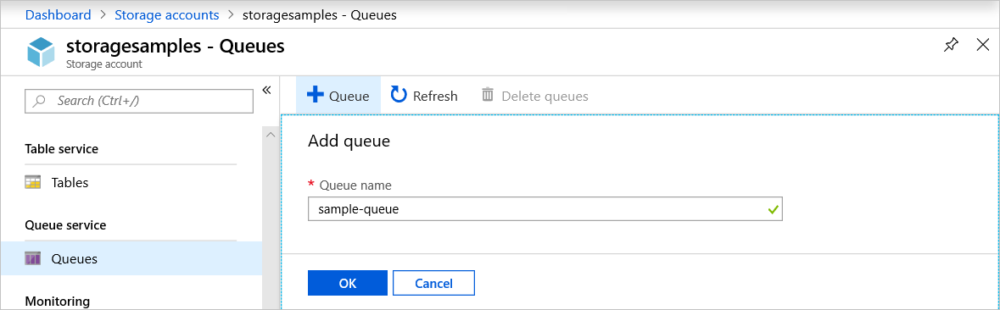
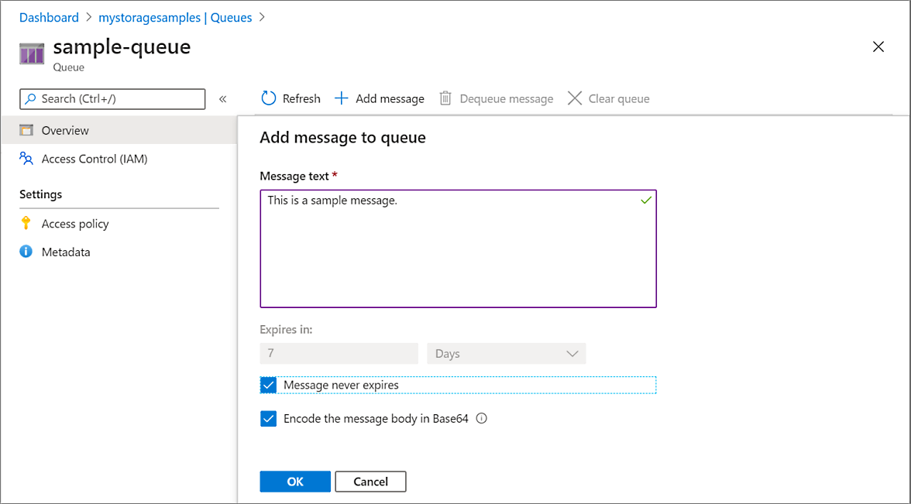
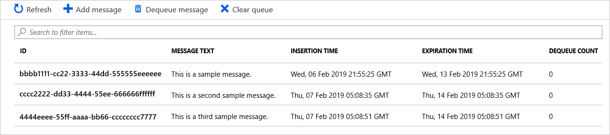
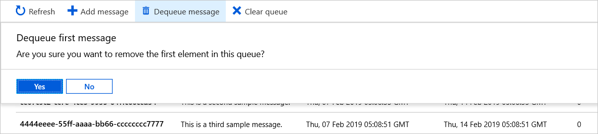

# Quickstart: Create a queue and add a message with the Azure portal

In this quickstart, you learn how to use the [Azure portal](https://portal.azure.com/) to create a queue in Azure Storage, and to add and dequeue messages.

## Prerequisites

[!INCLUDE [storage-quickstart-prereq-include](../../../includes/storage-quickstart-prereq-include.md)]

## Create a queue

To create a queue in the Azure portal, follow these steps:

1. Navigate to your new storage account in the Azure portal.
2. In the left menu for the storage account, scroll to the **Queue Storage** section, then select **Queues**.
3. Select the **+ Queue** button.
4. Type a name for your new queue. The queue name must be lowercase, must start with a letter or number, and can include only letters, numbers, and the dash (-) character.
6. Select **OK** to create the queue.

    

## Add a message

Next, add a message to the new queue. A message can be up to 64 KB in size.

1. Select the new queue from the list of queues in the storage account.
1. Select the **+ Add message** button to add a message to the queue. Enter a message in the **Message text** field.
1. Specify when the message expires. Valid values that can be entered in the **Expires in** field are between 1 second and 7 days. Select **Message never expires** to indicate a message that will remain in the queue until it is explicitly removed.
1. Indicate whether to encode the message as Base64. Encoding binary data is recommended.
1. Select the **OK** button to add the message.

    

## View message properties

After you add a message, the Azure portal displays a list of all of the messages in the queue. You can view the message ID, the contents of the message, the message insertion time, and the message expiration time. You can also see how many times this message has been dequeued.

## Dequeue a message

You can dequeue a message from the front of the queue from the Azure portal. When you dequeue a message, the message is deleted.

Dequeueing always removes the oldest message in the queue.

## Next steps

In this quickstart, you learned how to create a queue, add a message, view message properties, and dequeue a message in the Azure portal.

> [!div class="nextstepaction"]
> [What is Azure Queue Storage?](storage-queues-introduction.md)
