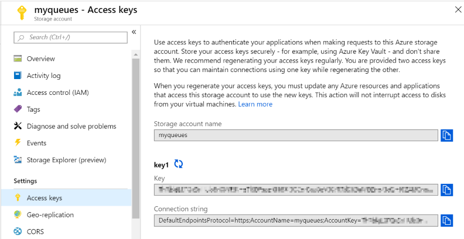

# Tutorial: Work with Azure storage queues

Azure Queue storage implements cloud-based queues to enable communication between components of a distributed application. Each queue maintains a list of messages that can be added by a sender component and processed by a receiver component. With a queue, your application can scale immediately to meet demand. This article shows the basic steps for working with an Azure storage queue.

In this tutorial, you learn how to:

> [!div class="checklist"]
>
> - Create an Azure storage account
> - Create the app
> - Add support for asynchronous code
> - Create a queue
> - Insert messages into a queue
> - Dequeue messages
> - Delete an empty queue
> - Check for command-line arguments
> - Build and run the app

## Prerequisites

- Get your free copy of the cross platform [Visual Studio Code](https://code.visualstudio.com/download) editor.
- Download and install the [.NET Core SDK](https://dotnet.microsoft.com/download).
- If you don’t have a current Azure subscription, create a [free account](https://azure.microsoft.com/free/) before you begin.

## Create an Azure storage account

First, create an Azure storage account. For a step-by-step guide to creating a storage account, see the [Create a storage account](../common/storage-quickstart-create-account.md?toc=%2Fazure%2Fstorage%2Fqueues%2Ftoc.json) quickstart.

## Create the app

Create a .NET Core application named **QueueApp**. For simplicity, this app will both send and receive messages through the queue.

1. In a console window (such as CMD, PowerShell, or Azure CLI), use the `dotnet new` command to create a new console app with the name **QueueApp**. This command creates a simple "Hello World" C# project with a single source file: **Program.cs**.

   ```console
   dotnet new console -n QueueApp
   ```

2. Switch to the newly created **QueueApp** folder and build the app to verify that all is well.

   ```console
   cd QueueApp
   ```

   ```console
   dotnet build
   ```

   You should see results similar to the following:

   ```output
   C:\Tutorials>dotnet new console -n QueueApp
   The template "Console Application" was created successfully.

   Processing post-creation actions...
   Running 'dotnet restore' on QueueApp\QueueApp.csproj...
     Restore completed in 155.62 ms for C:\Tutorials\QueueApp\QueueApp.csproj.

   Restore succeeded.

   C:\Tutorials>cd QueueApp

   C:\Tutorials\QueueApp>dotnet build
   Microsoft (R) Build Engine version 16.0.450+ga8dc7f1d34 for .NET Core
   Copyright (C) Microsoft Corporation. All rights reserved.

     Restore completed in 40.87 ms for C:\Tutorials\QueueApp\QueueApp.csproj.
     QueueApp -> C:\Tutorials\QueueApp\bin\Debug\netcoreapp2.1\QueueApp.dll

   Build succeeded.
       0 Warning(s)
       0 Error(s)

   Time Elapsed 00:00:02.40

   C:\Tutorials\QueueApp>_
   ```

## Add support for asynchronous code

Since the app uses cloud resources, the code runs asynchronously. However, C#'s **async** and **await** weren't valid keywords in **Main** methods until C# 7.1. You can easily switch to that compiler through a flag in the **csproj** file.

1. From the command line in the project directory, type `code .` to open Visual Studio Code in the current directory. Keep the command-line window open. There will be more commands to execute later. If you're prompted to add C# assets required to build and debug, click the **Yes** button.

2. Open the **QueueApp.csproj** file in the editor.

3. Add `<LangVersion>7.1</LangVersion>` into the first **PropertyGroup** in the build file. Make sure that you only add the **LangVersion** tag as your **TargetFramework** may be different depending on which version of .NET you have installed.

   ```xml
   <Project Sdk="Microsoft.NET.Sdk">

     <PropertyGroup>
       <OutputType>Exe</OutputType>
       <TargetFramework>netcoreapp2.1</TargetFramework>
       <LangVersion>7.1</LangVersion>
     </PropertyGroup>

   ...

   ```

4. Save the **QueueApp.csproj** file.

5. Open the **Program.cs** source file and update the **Main** method to run asynchronously. Replace **void** with an **async Task** return value.

   ```csharp
   static async Task Main(string[] args)
   ```

6. Save the **Program.cs** file.

## Create a queue

1. Install the **Microsoft.Azure.Storage.Common** and **Microsoft.Azure.Storage.Queue** packages to the project with the `dotnet add package` command. Execute the following dotnet commands from the project folder in the console window.

   ```console
   dotnet add package Microsoft.Azure.Storage.Common
   dotnet add package Microsoft.Azure.Storage.Queue
   ```

2. At the top of the **Program.cs** file, add the following namespaces right after the `using System;` statement. This app uses types from these namespaces to connect to Azure Storage and work with queues.

   ```csharp
   using System.Threading.Tasks;
   using Microsoft.Azure.Storage;
   using Microsoft.Azure.Storage.Queue;
   ```

3. Save the **Program.cs** file.

### Get your connection string

The client library uses a connection string to establish your connection. Your connection string is available in the **Settings** section of your storage account in the Azure portal.

1. In your web browser, sign in to the [Azure portal](https://portal.azure.com/).

2. Navigate to your storage account in the Azure portal.

3. Select **Access keys**.

4. Click the **Copy** button to the right of the **Connection string** field.



The connection string is in this format:

   ```
   "DefaultEndpointsProtocol=https;AccountName=<your storage account name>;AccountKey=<your key>;EndpointSuffix=core.windows.net"
   ```

### Add the connection string to the app

Add the connection string into the app so it can access the storage account.

1. Switch back to Visual Studio Code.

2. In the **Program** class, add a `private const string connectionString =` member to hold the connection string.

3. After the equal sign, paste the string value that you copied earlier in your Azure portal. The **connectionString** value will be unique to your account.

4. Remove the "Hello World" code from **Main**. Your code should look similar to the following but with your unique connection string value.

   ```csharp
   namespace QueueApp
   {
       class Program
       {
           private const string connectionString = "DefaultEndpointsProtocol=https; ...";

           static async Task Main(string[] args)
           {
           }
       }
   }
   ```

5. Update **Main** to create a **CloudQueue** object, which is later passed into the send and receive methods.

   ```csharp
        static async Task Main(string[] args)
        {
            CloudStorageAccount storageAccount = CloudStorageAccount.Parse(connectionString);
            CloudQueueClient queueClient = storageAccount.CreateCloudQueueClient();
            CloudQueue queue = queueClient.GetQueueReference("mystoragequeue");
        }
   ```

6. Save the file.

## Insert messages into the queue

Create a new method to send a message into the queue. Add the following method to your **Program** class. This method gets a queue reference, then creates a new queue if it doesn't already exist by calling [CreateIfNotExistsAsync](/dotnet/api/microsoft.azure.storage.queue.cloudqueue.createifnotexistsasync). Then, it adds the message to the queue by calling [AddMessageAsync](/dotnet/api/microsoft.azure.storage.queue.cloudqueue.addmessageasync).

1. Add the following **SendMessageAsync** method to your **Program** class.

   ```csharp
   static async Task SendMessageAsync(CloudQueue theQueue, string newMessage)
   {
       bool createdQueue = await theQueue.CreateIfNotExistsAsync();

       if (createdQueue)
       {
           Console.WriteLine("The queue was created.");
       }

       CloudQueueMessage message = new CloudQueueMessage(newMessage);
       await theQueue.AddMessageAsync(message);
   }
   ```

2. Save the file.

A message must be in a format that can be included in an XML request with UTF-8 encoding, and may be up to 64 KB in size. If a message contains binary data, we recommend that you Base64-encode the message.

By default, the maximum time-to-live for a message is set to 7 days. You can specify any positive number for the message time-to-live. To add a message that does not expire, use `Timespan.FromSeconds(-1)` in your call to **AddMessageAsync**.

```csharp
await theQueue.AddMessageAsync(message, TimeSpan.FromSeconds(-1), null, null, null);
```

## Dequeue messages

Create a new method called **ReceiveMessageAsync**. This method receives a message from the queue by calling [GetMessageAsync](/dotnet/api/microsoft.azure.storage.queue.cloudqueue.getmessageasync). Once the message is successfully received, it's important to delete it from the queue so it isn't processed more than once. After the message is received, delete it from the queue by calling [DeleteMessageAsync](/dotnet/api/microsoft.azure.storage.queue.cloudqueue.deletemessageasync).

1. Add the following **ReceiveMessageAsync** method to your **Program** class.

   ```csharp
   static async Task<string> ReceiveMessageAsync(CloudQueue theQueue)
   {
       bool exists = await theQueue.ExistsAsync();

       if (exists)
       {
           CloudQueueMessage retrievedMessage = await theQueue.GetMessageAsync();

           if (retrievedMessage != null)
           {
               string theMessage = retrievedMessage.AsString;
               await theQueue.DeleteMessageAsync(retrievedMessage);
               return theMessage;
           }
       }
   }
   ```

2. Save the file.

## Delete an empty queue

It's a best practice at the end of a project to identify whether you still need the resources you created. Resources left running can cost you money. If the queue exists but is empty, ask the user if they would like to delete it.

1. Expand the **ReceiveMessageAsync** method to include a prompt to delete the empty queue.

   ```csharp
   static async Task<string> ReceiveMessageAsync(CloudQueue theQueue)
   {
       bool exists = await theQueue.ExistsAsync();

       if (exists)
       {
           CloudQueueMessage retrievedMessage = await theQueue.GetMessageAsync();

           if (retrievedMessage != null)
           {
               string theMessage = retrievedMessage.AsString;
               await theQueue.DeleteMessageAsync(retrievedMessage);
               return theMessage;
           }
           else
           {
               Console.Write("The queue is empty. Attempt to delete it? (Y/N) ");
               string response = Console.ReadLine();

               if (response == "Y" || response == "y")
               {
                   await theQueue.DeleteIfExistsAsync();
                   return "The queue was deleted.";
               }
               else
               {
                   return "The queue was not deleted.";
               }
           }
       }
       else
       {
           return "The queue does not exist. Add a message to the command line to create the queue and store the message.";
       }
   }
   ```

2. Save the file.

## Check for command-line arguments

If there are any command-line arguments passed into the app, assume they're a message to be added to the queue. Join the arguments together to make a string. Add this string to the message queue by calling the **SendMessageAsync** method we added earlier.

If there are no command-line arguments, execute a retrieve operation. Call the **ReceiveMessageAsync** method to retrieve the first message in the queue.

Finally, wait for user input before exiting by calling **Console.ReadLine**.

1. Expand the **Main** method to check for command-line arguments and wait for user input.

   ```csharp
        static async Task Main(string[] args)
        {
            CloudStorageAccount storageAccount = CloudStorageAccount.Parse(connectionString);
            CloudQueueClient queueClient = storageAccount.CreateCloudQueueClient();
            CloudQueue queue = queueClient.GetQueueReference("mystoragequeue");

            if (args.Length > 0)
            {
                string value = String.Join(" ", args);
                await SendMessageAsync(queue, value);
                Console.WriteLine($"Sent: {value}");
            }
            else
            {
                string value = await ReceiveMessageAsync(queue);
                Console.WriteLine($"Received: {value}");
            }

            Console.Write("Press Enter...");
            Console.ReadLine();
        }
   ```

2. Save the file.

## Complete code

Here is the complete code listing for this project.

   ```csharp
   using System;
   using System.Threading.Tasks;
   using Microsoft.Azure.Storage;
   using Microsoft.Azure.Storage.Queue;

   namespace QueueApp
   {
    class Program
    {
        // The string value is broken up for better onscreen formatting
        private const string connectionString = "DefaultEndpointsProtocol=https;" +
                                                "AccountName=<your storage account name>;" +
                                                "AccountKey=<your key>;" +
                                                "EndpointSuffix=core.windows.net";

        static async Task Main(string[] args)
        {
            CloudStorageAccount storageAccount = CloudStorageAccount.Parse(connectionString);
            CloudQueueClient queueClient = storageAccount.CreateCloudQueueClient();
            CloudQueue queue = queueClient.GetQueueReference("mystoragequeue");

            if (args.Length > 0)
            {
                string value = String.Join(" ", args);
                await SendMessageAsync(queue, value);
                Console.WriteLine($"Sent: {value}");
            }
            else
            {
                string value = await ReceiveMessageAsync(queue);
                Console.WriteLine($"Received {value}");
            }

            Console.Write("Press Enter...");
            Console.ReadLine();
        }

        static async Task SendMessageAsync(CloudQueue theQueue, string newMessage)
        {
            bool createdQueue = await theQueue.CreateIfNotExistsAsync();

            if (createdQueue)
            {
                Console.WriteLine("The queue was created.");
            }

            CloudQueueMessage message = new CloudQueueMessage(newMessage);
            await theQueue.AddMessageAsync(message);
        }

        static async Task<string> ReceiveMessageAsync(CloudQueue theQueue)
        {
            bool exists = await theQueue.ExistsAsync();

            if (exists)
            {
                CloudQueueMessage retrievedMessage = await theQueue.GetMessageAsync();

                if (retrievedMessage != null)
                {
                    string theMessage = retrievedMessage.AsString;
                    await theQueue.DeleteMessageAsync(retrievedMessage);
                    return theMessage;
                }
                else
                {
                    Console.Write("The queue is empty. Attempt to delete it? (Y/N) ");
                    string response = Console.ReadLine();

                    if (response == "Y" || response == "y")
                    {
                        await theQueue.DeleteIfExistsAsync();
                        return "The queue was deleted.";
                    }
                    else
                    {
                        return "The queue was not deleted.";
                    }
                }
            }
            else
            {
                return "The queue does not exist. Add a message to the command line to create the queue and store the message.";
            }
        }
    }
   }
   ```

## Build and run the app

1. From the command line in the project directory, run the following dotnet command to build the project.

   ```console
   dotnet build
   ```

2. After the project builds successfully, run the following command to add the first message to the queue.

   ```console
   dotnet run First queue message
   ```

You should see this output:

   ```output
   C:\Tutorials\QueueApp>dotnet run First queue message
   The queue was created.
   Sent: First queue message
   Press Enter..._
   ```

3. Run the app with no command-line arguments to receive and remove the first message in the queue.

   ```console
   dotnet run
   ```

4. Continue to run the app until all the messages are removed. If you run it one more time, you'll get a message that the queue is empty and a prompt to delete the queue.

   ```output
   C:\Tutorials\QueueApp>dotnet run First queue message
   The queue was created.
   Sent: First queue message
   Press Enter...

   C:\Tutorials\QueueApp>dotnet run Second queue message
   Sent: Second queue message
   Press Enter...

   C:\Tutorials\QueueApp>dotnet run Third queue message
   Sent: Third queue message
   Press Enter...

   C:\Tutorials\QueueApp>dotnet run
   Received: First queue message
   Press Enter...

   C:\Tutorials\QueueApp>dotnet run
   Received: Second queue message
   Press Enter...

   C:\Tutorials\QueueApp>dotnet run
   Received: Third queue message
   Press Enter...

   C:\Tutorials\QueueApp>dotnet run
   The queue is empty. Attempt to delete it? (Y/N) Y
   Received: The queue was deleted.
   Press Enter...

   C:\Tutorials\QueueApp>_
   ```

## Next steps

In this tutorial, you learned how to:

1. Create a queue
2. Add and remove messages from a queue
3. Delete an Azure storage queue

Check out the Azure queues quickstart for more information.

> [!div class="nextstepaction"]
> [Queues quickstart](storage-quickstart-queues-portal.md)
