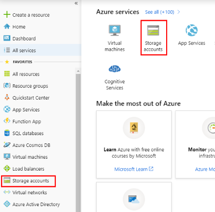
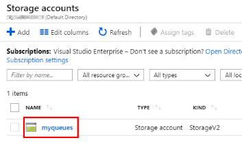
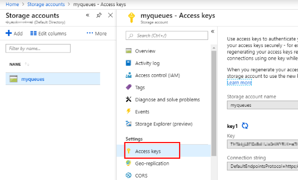
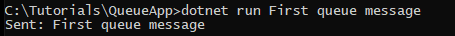
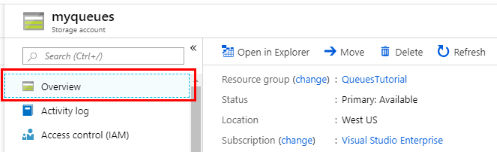
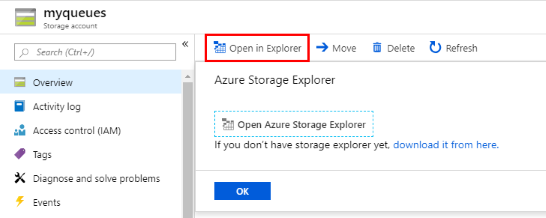
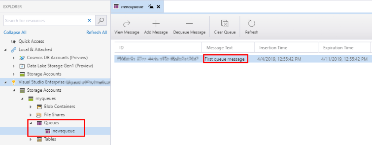
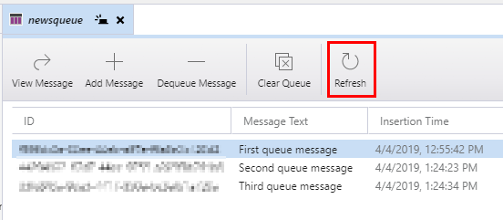
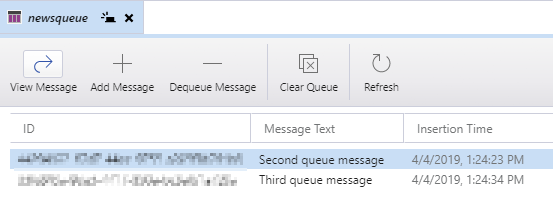
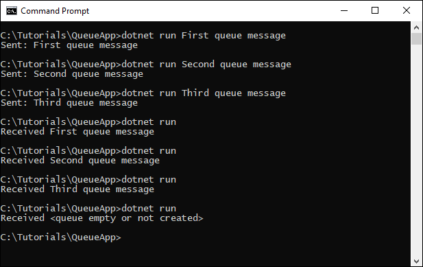

# Tutorial: Work with Azure storage queues

Queues let your application scale automatically and immediately when demand changes. This makes them useful for critical business data that would be damaging to lose. A queue increases app's resilience by temporarily storing waiting messages. At times of low or normal demand, the size of the queue remains small because the destination component removes messages from the queue faster than they are added. At times of high demand, the queue may increase in size, but messages are not lost. The destination component can catch up and empty the queue as demand returns to normal. This article demonstrates the basic steps for working with an Azure storage queue.

In this tutorial, you learn how to:

> [!div class="checklist"]
>
> - Create an Azure storage account
> - Create the app
> - Programmatically access a queue
> - Insert messages into the queue
> - Dequeue messages
> - Add support for asynchronous code

## Prerequisites

- Get your free copy of the cross platform [Visual Studio Code](https://code.visualstudio.com/download) editor.
- If you don't already have the .NET SDK installed by installing Visual Studio, download and install the [.NET Core SDK](https://dotnet.microsoft.com/download).
- If you don’t have a current Azure subscription, create a [free account](https://azure.microsoft.com/free/?WT.mc_id=A261C142F) before you begin.

### Sign in to Azure

Sign in to the [Azure portal](https://portal.azure.com/).

## Create an Azure storage account

The first step in creating a queue is to create the Azure Storage Account that will store our data. There are several options you can supply when you create the account, most of which you can use the default selection. See the [Create a storage account](../common/storage-quickstart-create-account.md?toc=%2Fazure%2Fstorage%2Fqueues%2Ftoc.json) quickstart for a step-by-step guide to creating a storage account.

## Create the app

We'll create a .NET Core application that you can run on Linux, macOS, or Windows. Let's name it **QueueApp**. For simplicity, we'll use a single app that will both send and receive messages through our queue.

1. Use the `dotnet new` command to create a new console app with the name **QueueApp**. You can type commands into the Cloud Shell on the right, or if you are working locally, in a terminal/console window. This command creates a simple app with a single source file: **Program.cs**.

```console
dotnet new console -n QueueApp
```

1. Switch to the newly created **QueueApp** folder and build the app to verify that all is well.

```console
cd QueueApp
```

```console
dotnet build
```

### Get your connection string

The client library uses a connection string to establish your connection. Your connection string is available in the **Settings** section of your Storage Account in the Azure portal.

1. In your browser, sign in to the [Azure portal](https://portal.azure.com/).

2. Select **Storage accounts** from either the **Azure services** icons at the top of the portal, or from the **FAVORITES** menu on the left of the portal page.



3. Select the storage account you created earlier.



4. Select **Access keys**



5. Click the **Copy** button to the right of the **Connection string** field.


The connection string is in this format:

```csharp
private const string connectionString = "DefaultEndpointsProtocol=https;AccountName=<your storage account name>;AccountKey=<your key>;EndpointSuffix=core.windows.net";
```

### Add the connection string to the app

Add the connection string into the app so it can access the storage account.

1. From the command line in the project directory, type `code .` to open Visual Studio Code.

2. Open the **Program.cs** source file in the project.

3. In the **Program** class, add a `private const string connectionString = ` member to hold the connection string.

4. After the equal sign, paste the string value that you copied earlier in your Azure portal in order to initialize **connectionString**.

Your code should look similar to this. The **connectionString** value will be unique to your account.

```csharp
using System;

namespace QueueApp
{
    class Program
    {
        private const string connectionString = "DefaultEndpointsProtocol=https; ...";

        static void Main(string[] args)
        {
            Console.WriteLine("Hello World!");
        }
    }
}
```

5. Save the file.

## Programmatically access a queue

1. Install the **WindowsAzure.Storage** package to the project with the `dotnet add package` command. Do this from a command line in the same folder as the project.

```console
dotnet add package WindowsAzure.Storage
```

2. At the top of the **Program.cs** file, add the following namespaces. We'll be using types from these namespaces to connect to Azure Storage and work with queues.

```csharp
using System.Threading.Tasks;
using Microsoft.WindowsAzure.Storage;
using Microsoft.WindowsAzure.Storage.Queue;
```

3. Add the following method to your **Program** class to get a reference to a **CloudQueue**, which we're calling **mystoragequeue**. Getting a queue reference is a common task. This method will be called for both Send and Receive operations.

```csharp
static CloudQueue GetQueue()
{
    CloudStorageAccount storageAccount = CloudStorageAccount.Parse(connectionString);
    CloudQueueClient queueClient = storageAccount.CreateCloudQueueClient();
    return queueClient.GetQueueReference("mystoragequeue");
}
```

## Insert messages into the queue

Create a new method to asynchronously send a message into a queue. Add the following method to your **Program** class. This method gets a queue reference, then creates a new queue if it does not already exist.

```csharp
static async Task SendMessageAsync(string newMessage)
{
    CloudQueue queue = GetQueue();
    bool createdQueue = await queue.CreateIfNotExistsAsync();

    if (createdQueue)
    {
        Console.WriteLine("The queue was created.");
    }

    CloudQueueMessage message = new CloudQueueMessage(newMessage);
    await queue.AddMessageAsync(message);
}
```

## Dequeue messages

Create a new method to asynchronously receive a messages from the queue. Once we've successfully received the message, it is safe to delete it so we don't process it more than once. After the message is received, delete it from the queue.

Add the following method to your **Program** class.

```csharp
static async Task<string> ReceiveMessageAsync()
{
    CloudQueue queue = GetQueue();
    bool exists = await queue.ExistsAsync();
    if (exists)
    {
        CloudQueueMessage retrievedMessage = await queue.GetMessageAsync();
        if (retrievedMessage != null)
        {
            string theMessage = retrievedMessage.AsString;
            await queue.DeleteMessageAsync(retrievedMessage);
            return theMessage;
        }
    }

    return "<queue empty or not created>";
}
```

## Update Main

Now we'll update the **Main** method to check for command line arguments. If there are any, assume they are the message and join them together to make a string. We then add  this string to our message queue by calling the **SendArticleAsync** method we added earlier.

If there are no command line arguments, the app will instead retrieve the last message from the queue and delete it by calling the **ReceiveActicleAsync** method.

Update **Main** to look like this:

```csharp
static async Task Main(string[] args)
{
    if (args.Length > 0)
    {
        string value = String.Join(" ", args);
        await SendMessageAsync(value);
        Console.WriteLine($"Sent: {value}");
    }
    else
    {
        string value = await ReceiveMessageAsync();
        Console.WriteLine($"Received {value}");
    }
}
```

## Complete code

Here is the complete code listing for this project.

```csharp
using System;
using System.Threading.Tasks;
using Microsoft.WindowsAzure.Storage;
using Microsoft.WindowsAzure.Storage.Queue;

namespace QueueApp
{
    class Program
    {
        private const string connectionString = "DefaultEndpointsProtocol=https;AccountName=<your storage account name>;AccountKey=<your key>;EndpointSuffix=core.windows.net";

        static async Task Main(string[] args)
        {
            if (args.Length > 0)
            {
                string value = String.Join(" ", args);
                await SendMessageAsync(value);
                Console.WriteLine($"Sent: {value}");
            }
            else
            {
                string value = await ReceiveMessageAsync();
                Console.WriteLine($"Received {value}");
            }
        }

        static CloudQueue GetQueue()
        {
            CloudStorageAccount storageAccount = CloudStorageAccount.Parse(connectionString);
            CloudQueueClient queueClient = storageAccount.CreateCloudQueueClient();
            return queueClient.GetQueueReference("mystoragequeue");
        }

        static async Task SendMessageAsync(string newMessage)
        {
            CloudQueue queue = GetQueue();
            bool createdQueue = await queue.CreateIfNotExistsAsync();

            if (createdQueue)
            {
                Console.WriteLine("The queue was created.");
            }

            CloudQueueMessage message = new CloudQueueMessage(newMessage);
            await queue.AddMessageAsync(message);
        }

        static async Task<string> ReceiveMessageAsync()
        {
            CloudQueue queue = GetQueue();
            bool exists = await queue.ExistsAsync();
            if (exists)
            {
                CloudQueueMessage retrievedMessage = await queue.GetMessageAsync();
                if (retrievedMessage != null)
                {
                    string theMessage = retrievedMessage.AsString;
                    await queue.DeleteMessageAsync(retrievedMessage);
                    return theMessage;
                }
            }

            return "<queue empty or not created>";
        }
    }
}
```

## Add support for asynchronous code

Since our app uses cloud resources, we've created our code to run asynchronously by using the **await** keyword when we make a asynchronous calls. In order to support this, we need to specify that our app uses C# 7.1.

### Switch to C# 7.1

C#'s **async** and **await** keywords were not valid keywords in **Main** methods until C# 7.1. We can easily switch to that compiler through a flag in the .csproj file.

1. Open the **QueueApp.csproj** file in the editor.

2. Add `<LangVersion>7.1</LangVersion>` into the first **PropertyGroup** in the build file. It should look like the following when you are finished.

```xml
<Project Sdk="Microsoft.NET.Sdk">

  <PropertyGroup>
    <OutputType>Exe</OutputType>
    <TargetFramework>netcoreapp2.1</TargetFramework>
    <LangVersion>7.1</LangVersion>
  </PropertyGroup>

...
```

3. Save the **QueueApp.csproj** file.

## Build and run the program

1. From the command line in the project directory, run the following to build the project.

```console
dotnet build
```

2. After the project builds successfully, run the following command to add our first message to the queue.

```console
dotnet run First queue message
```

You should see output similar to this:



### Verify that the message was added to the queue

Now that our app has run and told us that it sent a message to the queue, we can verify that it worked by opening the contents of our queue in the Storage Explorer utility.

1. In Azure portal, navigate to the **Overview** page your storage account.



2. Select **Open in Explorer**.



If you don't yet have Storage Explorer installed, you can follow the link to download your free copy of the utility.

3. In **Storage Explorer**, navigate to our **mystoragequeue** and see the message we added.



4. Run the app several more times with different strings to add more messages to the queue.

5. In **Storage Explorer**, select **Refresh** to see the new messages that were added.



6. Run the app with no command line arguments to receive and remove the first message in the queue.

```console
dotnet run
```

7. In **Storage Explorer**, select **Refresh** to see the that the last message was removed.



8. If you continue to run the app until all the messages are removed, then run it one more time, you will get a message that the queue is empty.



## Clean up resources

When you're working in your own subscription, it's a best practice at the end of a project to identify whether you still need the resources you created. Resources left running can cost you money. You can delete resources one by one or just delete the resource group to get rid of the entire set.

## Next steps

Advance to the next article to learn how to create...
> [!div class="nextstepaction"]
> [Next steps](storage-quickstart-queues-portal.md)
