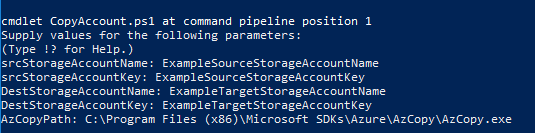

# Create a storage account and rotate its account access keys

This script takes in a source storage account name and key, a target storage account name and key, and the full filepath of AzCopy.exe. Then the script copies all the contents of the source storage account to the target storage account. At this time, this is only supported on Windows.

[!INCLUDE [sample-powershell-install](../../../includes/sample-powershell-install-no-ssh.md)]

[!INCLUDE [quickstarts-free-trial-note](../../../includes/quickstarts-free-trial-note.md)]

This sample also requires the [latest version of AzCopy on Windows](http://aka.ms/downloadazcopy). The default install directory is `C:\Program Files (x86)\Microsoft SDKs\Azure\AzCopy\`

The following is an example of the input for this script:




## Sample script

```Powershell
# Run the script in a new open Powershell window, which has not run other cmdlets, or AzCopy might runs slow.
# Need install Azure PowerShell before run the script: https://github.com/Azure/azure-powershell/releases

 param (
    [Parameter(Mandatory = $true, 
    HelpMessage= "Source Storage account name.")]
    [ValidatePattern("^[a-z0-9`]{3,24}$")]
    [String]$srcStorageAccountName,

    [Parameter(Mandatory = $true, 
    HelpMessage= "Source Storage account key.")]
    [String]$srcStorageAccountKey,
    
    [Parameter(Mandatory = $true, 
    HelpMessage= "Destination Storage account name.")]
    [ValidatePattern("^[a-z0-9`]{3,24}$")]
    [String]$DestStorageAccountName,

    [Parameter(Mandatory = $true, 
    HelpMessage= "Destination Storage account key.")]
    [String]$DestStorageAccountKey,

    [Parameter(Mandatory = $true, 
    HelpMessage= "Input the Path of AzCopy.exe, e.g.: C:\Program Files (x86)\Microsoft SDKs\Azure\AzCopy\AzCopy.exe")]
    [String]$AzCopyPath,

    [Parameter(Mandatory = $false, 
    HelpMessage='Sets the number of retries in an event of failure. Set to 0 for no retry, set -1 for infinite retry.')]
    [Int32]$RetryTimes = 3,

    [Parameter(Mandatory = $false, 
    ValueFromPipeline = $true, 
    HelpMessage='Used for resume operation. When provided, the script will copy containers that are alphabetically after $LastSuccessContainerName')]
    [String]$LastSuccessContainerName = $null
 )


# Create transfer context
$srcCtx = New-AzureStorageContext -StorageAccountName $srcStorageAccountName -StorageAccountKey $srcStorageAccountKey
$destCtx = New-AzureStorageContext -StorageAccountName $destStorageAccountName -StorageAccountKey $destStorageAccountKey

$OutputLastSuccessContainer = $LastSuccessContainerName;
$HasReachedLastSuccessContainer = $false;

if ($LastSuccessContainerName -eq $null -or $LastSuccessContainerName -eq "")
{
    $HasReachedLastSuccessContainer = $true;
}

# For list container
$MaxReturn = 250
$Token = $Null

do{
    # List source containers
    $retry = 1
    $srcContainers = Get-AzureStorageContainer -MaxCount $MaxReturn -ContinuationToken $Token -Context $srcCtx

    # If list container fail, retry it
    while(($srcContainers -eq $null) -and ($RetryTimes -eq -1 -or $retry -le $retryTimes))
    {
        Write-Host "Retry List containers $retry"
        $srcContainers = Get-AzureStorageContainer -MaxCount $MaxReturn -ContinuationToken $Token -Context $srcCtx
        $retry++
    }

    # If list container fail after retry, break script
    if ($srcContainers -eq $null){
        Write-Error "List container failed, no container is listed.";
        $CopyContainerFail = $true
        break;
    }
    $Token = $srcContainers[$srcContainers.Count -1].ContinuationToken;

    # Transfer containers one by one
    $CopyContainerFail = $false
    foreach ($container in $srcContainers)
    {
        if (!$HasReachedLastSuccessContainer)
        {
            if ($container.Name -eq $LastSuccessContainerName)
            {
                $HasReachedLastSuccessContainer = $true;
            }
            Write-Host "Skipping container copy: $($container.Name)"
            Continue;
        }

        Write-Host "Start copying container: $($container.Name)"
        $retry = 1

        # Get AzCopy command for transfer one container
        $destContainer = $destCtx.StorageAccount.CreateCloudBlobClient().GetContainerReference($container.Name)
        $azCopyCmd = [string]::Format("""{0}"" /source:{1} /dest:{2} /sourcekey:""{3}"" /destkey:""{4}"" /snapshot /y /s",$AzCopyPath, $container.CloudBlobContainer.Uri.AbsoluteUri, $destContainer.Uri.AbsoluteUri, $srcStorageAccountKey, $DestStorageAccountKey)
    
        # Execute the AzCopy command first time
        Write-Host "$azCopyCmd"
        $result = cmd /c $azCopyCmd
        foreach($s in $result)
        {
            Write-Host $s 
        }

        # If transfer failed, retry it
        while(($LASTEXITCODE -ne 0) -and ($RetryTimes -eq -1 -or $retry -le $retryTimes))
        {
            Write-Host "Retry $retry : $azCopyCmd"
            $result = cmd /c $azCopyCmd
            foreach($s in $result)
            {
                Write-Host $s 
            }
            $retry++
        }

        # If tranfer failed after retry, print error
        if ($LASTEXITCODE -ne 0){
            Write-Error "Container copy failed: $($container.Name)";
            $CopyContainerFail = $true
            break;
        }
        else
        {
            Write-Host "Finish copying container: $($container.Name)"
            Write-Host ""
            $OutputLastSuccessContainer = $container.Name
        }
    }
    if($CopyContainerFail)
    {
        break;
    }
}
While ($Token -ne $Null)

# Summary the copy result
if ($CopyContainerFail)
{
    if(($OutputLastSuccessContainer -ne $null) -and ($OutputLastSuccessContainer -ne ""))
    {
        Write-Warning "To resume, rerun the script by appending the option: ""-LastSuccessContainer $OutputLastSuccessContainer"""
        return $OutputLastSuccessContainer
    }
    else
    {
        Write-Warning "To resume, rerun the script."
        return $null
    }
}
else
{
    Write-Host "All Containers copied successfully."
    return ""
}
```

## Script explanation

This script uses the following commands to copy data from one storage account to another. Each item in the table links to command-specific documentation.

| Command | Notes |
|---|---|
| [Get-AzureStorageContainer](/powershell/module/azurerm.storage/Get-AzureStorageContainer) | Returns the containers associated with this Storage account. |
| [New-AzureStorageContext](/powershell/module/azurerm.storage/New-AzureStorageContext) | Creates an Azure Storage context. |

## Next steps

For more information on the Azure PowerShell module, see [Azure PowerShell documentation](/powershell/azure/overview).

Additional storage PowerShell script samples can be found in [PowerShell samples for Azure Blob storage](../blobs/storage-samples-blobs-powershell.md).
