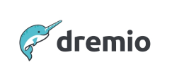
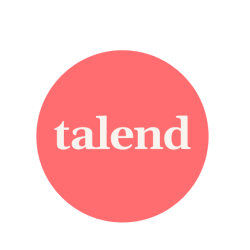

# Azure Storage analytics and big data partners

This article highlights Microsoft partner companies that are integrated with Azure Data Lake Storage. These partner solutions cover workloads like modern data warehouse workloads, advanced analytics, and real-time analytics. These partners take advantage of the [hierarchical namespace](../../../blobs/data-lake-storage-namespace.md) in Azure Storage to optimize their solution and run it efficiently in Azure.

## Verified partners

| Partner | Description | Website/product link |
| ------- | ----------- | -------------------- |
| |**Dremio** Analysts and data scientists can discover, explore, and curate data, while your information technology (IT) department maintains governance and security. Dremio makes it easy to join Data Lake Storage with Blob Storage, Azure SQL Database, Azure Synapse SQL, HDInsight, and more. With Dremio, Power BI analysts can search for new datasets stored on Data Lake Storage, immediately access that data in Power BI, create visualizations, and iteratively refine reports in real time. Analysts can also create new reports that combine data between Data Lake Storage and other databases.|[Partner page](https://www.dremio.com/azure/) [Azure Marketplace](https://azuremarketplace.microsoft.com/marketplace/apps/dremiocorporation.dremio_ce) |
 |**Informatica** Informatica’s enterprise-scale, cloud-native data management platform automates and accelerates the discovery, delivery, quality, and governance of enterprise data on Azure. AI-powered, metadata-driven data integration, and data quality and governance capabilities enable you to modernize analytics and accelerate your move to a data warehouse or to a data lake on Azure.|[Partner page](https://www.informatica.com/azure) [Azure Marketplace](https://azuremarketplace.microsoft.com/marketplace/apps/informatica.annualiics?tab=Overview)|
 |**Qlik** Qlik helps accelerate BI and ML initiatives with a scalable data integration and automation solution. Qlik also goes beyond migration tools to help drive agility throughout the data and analytics process with automated data pipelines and a governed, self-service catalog.|[Partner page](https://www.qlik.com/us/products/technology/qlik-microsoft-azure-migration) [Azure Marketplace](https://azuremarketplace.microsoft.com/marketplace/apps/qlik.qlik_data_integration_platform)|
 |**Starburst** Starburst unlocks the value of data by making it fast and easy to access anywhere. Starburst queries data across any database, making it actionable for data-driven organizations. With Starburst, teams can prevent vendor lock-in, and use the existing tools that work for their business.|[Partner page](https://www.starburst.io/platform/deployment-options/starburst-on-azure/) [Azure Marketplace](https://azuremarketplace.microsoft.com/en-us/marketplace/apps/starburstdatainc1582306810515.starburst-enterprise)|
 |**Striim** Striim enables continuous data movement and in-stream transformations from a wide variety of sources into multiple Azure solutions including Azure Synapse Analytics, Azure Cosmos DB, and Azure cloud databases. The Striim solution enables Azure Data Lake Storage customers to quickly build streaming data pipelines. Customers can choose their desired data latency (real-time, micro-batch, or batch) and enrich the data with more context. These pipelines can then support any application or big data analytics solution, including Azure SQL Data Warehouse and Azure Databricks. |[Partner ](https://www.striim.com/partners/striim-and-microsoft-azure/) [Azure Marketplace](https://azuremarketplace.microsoft.com/marketplace/apps/striim.azurestorageintegration?tab=overview)|
 |**Talend** Talend Data Fabric is a platform that brings together multiple integration and governance capabilities. Using a single unified platform, Talend delivers complete, clean, and uncompromised data in real time. The Talend Trust Score helps assess the reliability of any data set. |[Partner page](https://www.talend.com/partners/microsoft-azure/) [Azure Marketplace](https://azuremarketplace.microsoft.com/marketplace/apps/talend.talendclouddi)|
 |**Unravel Data** Unravel Data provides observability and automatic management through a single pane of glass. AI-powered recommendations proactively improve reliability, speed, and resource allocations of your data pipelines and jobs. Unravel connects easily with Azure Databricks, HDInsight, Azure Data Lake Storage, and more through the Azure Marketplace or Unravel SaaS service. Unravel Data also helps migrate to Azure by providing an assessment of your environment. This assessment uncovers usage details, dependency maps, cost, and effort needed for a fast move with less risk.|[Partner page](https://www.unraveldata.com/azure-databricks/) [Azure Marketplace](https://azuremarketplace.microsoft.com/marketplace/apps/unravel-data.unravel4databrickssubscriptionasaservice?tab=Overview)
| |**WANdisco** WANdisco’s migration engine lets you migrate Hadoop data to Data Lake Storage while it remains in active use at any scale, with zero downtime and zero data loss.  Developed in partnership with Microsoft, [WANdisco LiveData Platform for Azure](../../../blobs/migrate-gen2-wandisco-live-data-platform.md) is tightly integrated with Azure. Besides having an Azure portal deployment experience, it also uses role-based access control, Microsoft Entra ID, Azure Policy enforcement, and Activity log integration. With Azure Billing integration, you don't need to add a vendor contract or get more vendor approvals.  Accelerate the replication of Hadoop data between multiple sources and targets for any data architecture. With LiveData Cloud Services, your data will be available for Azure Databricks, Synapse Analytics, and HDInsight as soon as it lands, with guaranteed 100% data consistency. |[Partner page](https://www.wandisco.com/microsoft/) [Azure Marketplace](https://azuremarketplace.microsoft.com/marketplace/apps/wandisco.ldma?tab=Overview)|

Are you a storage partner but your solution is not listed yet? Send us your info [here](https://forms.office.com/pages/responsepage.aspx?id=v4j5cvGGr0GRqy180BHbR3i8TQB_XnRAsV3-7XmQFpFUQjY4QlJYUzFHQ0ZBVDNYWERaUlNRVU5IMyQlQCN0PWcu).
## Next steps

To learn more about some of our other partners, see:

- [Archive, backup, and BCDR partners](..\backup-archive-disaster-recovery\partner-overview.md)
-  [Container solution partners](..\container-solutions\partner-overview.md)
- [Data management and migration partners](..\data-management\partner-overview.md)
- [Primary and secondary storage partners](..\primary-secondary-storage\partner-overview.md)
