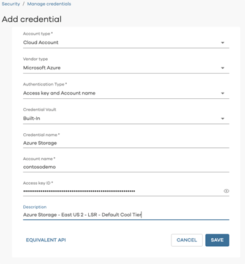

# Backup to Azure with Commvault

Commvault provides comprehensive solutions for data protection, management, and recovery, enabling businesses to safeguard their data across various environments. These solutions integrate seamlessly with Azure to ensure that your data can be recovered quickly and efficiently.

This article helps you integrate a Commvault infrastructure with Azure Blob storage. It includes prerequisites, considerations, implementation, and operational guidance. This article addresses using Azure as an offsite backup target and a recovery site if a disaster occurs, which prevents normal operation within your primary site.

> [!NOTE]
> Commvault offers a lower recovery time objective (RTO) solution, Commvault Live Sync. This solution lets you have a standby virtual machine (VM) that can help you recover more quickly from a disaster in an Azure production environment. These specific capabilities are outside the scope of this document.

## Reference architecture

The following diagram provides a reference architecture for on-premises to Azure and in-Azure deployments.

Your existing Commvault deployment can easily integrate with Azure by adding an Azure storage account, or multiple accounts, as a cloud storage target. Commvault also allows you to recover backups from on-premises within Azure giving you a recovery-on-demand site in Azure.

## Commvault interoperability matrix

| Workload              | GPv2 and Blob storage | Cool tier support | Archive tier support | Data Box Family support |
|-----------------------|-----------------------|--------------------|---------------------|-------------------------|
| On-premises VMs/data  | v11.5                 | v11.5              | v11.10              | v11.10                  |
| Azure VMs             | v11.5                 | v11.5              | v11.5               | N/A                     |
| Azure Blob            | v11.6                 | v11.6              | v11.6               | N/A                     |
| Azure Files           | v11.6                 | v11.6              | v11.6               | N/A                     |

## Before you begin

A small amount of upfront planning greatly helps you use Azure as an offsite backup target and recovery site.

### Get started with Azure

Microsoft offers a framework to follow to get you started with Azure. The [Cloud Adoption Framework](/azure/architecture/cloud-adoption/) (CAF) is a detailed approach to enterprise digital transformation and comprehensive guide to planning a production grade cloud adoption. The CAF includes a step-by-step [Azure setup guide](/azure/cloud-adoption-framework/ready/azure-setup-guide/) to help you get up and running quickly and securely. You can find an interactive version in the [Azure portal](https://portal.azure.com/?feature.quickstart=true#blade/Microsoft_Azure_Resources/QuickstartCenterBlade). This location contains sample architectures, specific best practices for deploying applications, and free training resources to help you grow your Azure expertise.

### Consider the network between your location and Azure

Whether using cloud resources to run production, test and development, or as a backup target and recovery site, it's important to understand your bandwidth needs for initial backup seeding and for ongoing day-to-day transfers.

Azure Data Box provides a way to transfer your initial backup baseline to Azure without requiring more bandwidth. This approach is useful when the baseline transfer estimate is unacceptable. You can use the Data Transfer estimator when you create a storage account to estimate the time required to transfer your initial backup.

Remember, you need sufficient network capacity to support daily data transfers within the required transfer or backup window without impacting production applications. This section outlines the tools and techniques that are available to assess your network needs.

#### Determine bandwidth requirements

To determine how much bandwidth you need, use the following resources:

- Reports from your backup software.
- Commvault provides standard reports to determine [change rate](https://documentation.commvault.com/v11/essential/index.html) and [total backup set size](https://documentation.commvault.com/v11/essential/index.html) for the initial baseline transfer to Azure.
- Backup software-independent assessment and reporting tools such as:
  - [Aptare](https://www.veritas.com/insights/aptare-it-analytics)
  - [Datavoss](https://www.datavoss.com/)

#### Determine unutilized internet bandwidth

It's important to know how much typically unutilized bandwidth, or *headroom*, you have available on a day-to-day basis. This knowledge helps you assess whether you can meet your goals for:

- the initial time to upload when you're not using Azure Data Box for offline seeding.
- the completion of daily backups, based on the change rate identified earlier and your backup window.

Use the following methods to identify the bandwidth headroom that your backups to Azure are free to consume.

- View your [circuit usage](../../../../../expressroute/expressroute-monitoring-metrics-alerts.md#circuits-metrics) in the Azure portal if you're an existing Azure ExpressRoute customer.
- Contact your internet service provider (ISP). They should be able to share reports that show your existing daily and monthly utilization.
- There are several tools that can measure utilization by monitoring your network traffic at the router/switch level. These tools include:
  - [SolarWinds Bandwidth Analyzer Pack](https://www.solarwinds.com/network-bandwidth-analyzer-pack?CMP=ORG-BLG-DNS)
  - [PRTG (Paessler Router Traffic Grapher)](https://www.paessler.com/bandwidth_monitoring)
  - [Cisco Network Assistant](https://www.cisco.com/c/en/us/products/cloud-systems-management/network-assistant/index.html)
  - [WhatsUp Gold](https://www.whatsupgold.com/network-traffic-monitoring)

### Choose the right storage options

When you use Azure as a backup target, you make use of [Azure Blob storage](../../../../blobs/storage-blobs-introduction.md). Blob storage is Microsoft's object storage solution. Blob storage is optimized for storing massive amounts of unstructured data, which is data that doesn't adhere to any data model or definition. Additionally, Azure Storage is durable, highly available, secure, and scalable. You can select the right storage for your workload to provide the [level of resiliency](../../../../common/storage-redundancy.md) to meet your internal service level agreements (SLAs). Blob storage is a pay-per-use service. You're [charged monthly](../../../../blobs/access-tiers-overview.md#pricing-and-billing), based on three factors: the amount of data stored, the number of times your data is accessed, and if using cool and archive tiers, a minimum required retention period. The resiliency and tiering options applicable to backup data are summarized in the following tables.

**Blob storage resiliency options:**

|                                            |Locally redundant |Zone-redundant |Geo-redundant  |Geo-zone-redundant  |
|--------------------------------------------|------------------|---------------|---------------|--------------------|
|**Effective # of copies**                   | 3                | 3             | 6             | 6                  |
|**# of availability zones**                 | 1                | 3             | 2             | 4                  |
|**# of regions**                            | 1                | 1             | 2             | 2                  |
|**Manual failover to secondary region**     | N/A              | N/A           | Yes           | Yes                |

**Blob storage tiers:**

|                                     | Hot tier     |Cool tier     | Archive tier |
| ------------------------------------|--------------|--------------| -------------|
| **Availability**                    | 99.9%        | 99%          | Offline      |
| **Usage charges**                   | Higher storage costs, Lower access, and transaction costs | Lower storage costs, higher access, and transaction costs | Lowest storage costs, highest access, and transaction costs |
| **Minimum data retention required** | N/A          | 30 days      | 180 days     |
| **Latency (time to first byte)**    | Milliseconds | Milliseconds | Hours        |

#### Sample cost model for an Azure backup

Pay-per-use can be daunting to customers who are new to the cloud. While you pay for only the capacity used, you're also charged for read or write transactions. You might also be billed for [egress for data](https://azure.microsoft.com/pricing/details/bandwidth/) read back to your on-premises environment when [Azure Express Route direct local or Express Route unlimited data plan](https://azure.microsoft.com/pricing/details/expressroute/) are in use where data egress from Azure is included.

You can use the [Azure Pricing Calculator](https://azure.microsoft.com/pricing/calculator/) to perform "what if" analysis. The analysis can based on list pricing or on [Azure Storage Reserved Capacity pricing](../../../../../cost-management-billing/reservations/save-compute-costs-reservations.md), which can deliver up to 38% savings.

The following example pricing exercise models the monthly cost of backing up to Azure. This exercise is only an example. *Your pricing might vary due to activities not captured here.*

| Cost factor                                                  | Monthly cost        |
|--------------------------------------------------------------|---------------------|
| 100 TB of backup data on cool storage                        | $1556.48            |
| 2 TB of new data written per day x 30 Days                   | $39 in transactions |
| Monthly estimated total                                      | $1595.48            |
|--------------------------------------------------------------|---------------------|
| One-time restore of 5 TB to on-premises over public internet | $491.26             |

> [!NOTE]
> This estimate was generated with the Azure Pricing Calculator, using Pay-as-you-go pricing in the East US region. This example is based on Commvault's default 32MB subchunk size, which generates 65,536 PUT Requests (write transactions) per day. This example might not be applicable for your use case, based on your requirements.

## Implementation guidance

This section provides a brief guide for how to add Azure Storage to an on-premises Commvault deployment.

1. Open the Azure portal, and search for **storage accounts**. 
    
    

    You can also select the default **Storage accounts** icon.

    

2. Select **Create** to add an account. Select or create a resource group, provide a unique name, choose the region, select **Standard** performance, always leave account kind as **Storage V2**, choose the replication level that best meets your SLAs, and the default tier you want your backup software to apply. An Azure Storage account makes hot, cool, and archive tiers available within a single account and Commvault policies allow you to use multiple tiers to effectively manage the lifecycle of your data.

    :::image type="content" source="../media/account-create-1.png" alt-text="A screen capture of the storage account settings within the Azure portal." lightbox="../media/account-create-1-lrg.png":::

3. Keep the default networking options and select **Continue** to advance to the **Data protection** tab. Within this tab, you can choose to enable soft delete, which allows you to recover an accidentally deleted backup file within a defined retention period. Soft delete also provides an extra layer of protection against accidental or malicious deletion.

    :::image type="content" source="../media/account-create-2.png" alt-text="A screen capture of the Data Protection settings within the Azure portal." lightbox="../media/account-create-2-lrg.png":::

   Select **Continue** to advance to the **Advanced** tab.

4. Next, we recommend keeping the default settings from the **Advanced** screen for backup to Azure use cases.

    :::image type="content" source="../media/account-create-3.png" alt-text="A screen capture of the Advanced settings within the Azure portal." lightbox="../media/account-create-3-lrg.png":::

    Select **Continue** to advance to the **Tags** tab.

5. Add tags for your organization if you use tagging, and select **Continue** to advance to the **Review + create** tab. Ensure that the settings are correct, and select **Create** to create your account. After the Storage Account is created, two last steps are required before you can add it to your Commvault environment.

6. Navigate to the account you created in the Azure portal and select **Containers** from the **Blob service** menu. Add a container and provide a meaningful name. Next, navigate to the **Access keys** item within the **Settings** menu and copy the **Storage account name** and one of the two access keys. You need the container name, account name, and access key in the following steps.

    :::image type="content" source="../media/container.png" alt-text="A screen capture showing container creation in the Azure portal." lightbox="../media/container-lrg.png":::

    :::image type="content" source="../media/container.png" alt-text="A screen capture showing access key settings in the Azure portal." lightbox="../media/container-lrg.png":::

7. Optionally, you can add more layers of security to your deployment.

    - Limit access to your storage account by configuring role-based access. For example, you can create a custom role that allows only read access to the storage account and assign it to a specific user or group. For more information, see [Built-in roles for management operations](../../../../common/authorization-resource-provider.md#built-in-roles-for-management-operations).
    
    - Prevent access attempts from outside your corporate network by using [storage firewall settings](../../../../common/storage-network-security.md) to restrict storage account access on specific network segments. 

        

    - Prevent accidental deletion of the storage account by setting a [delete lock](../../../../../azure-resource-manager/management/lock-resources.md) on the account.

        

    - Follow other [security best practices](../../../../../storage/blobs/security-recommendations.md) as needed.

8. Next, add your Azure blob storage container as a target. In the Commvault Command Center, navigate to **Manage** -> **Security** -> **Credential vault**, and use option **Add**. Choose a **Cloud Account**, **Vendor type** of **Microsoft Azure**, and select **Authentication Type**. Depending on the authentication type you choose, different credential types are required.

    For example, if you choose to use an *Entra ID* Application, you need to provide the **Application ID** and **Tenant ID**. If you choose to use a storage account access key, you need to provide the **Storage Account Name** and **Access Key**. The required credentials and their format vary based on the authentication type selected.

    

9. Next, navigate to **Storage** -> **Cloud** in Commvault Command Center. Choose to **Add**. Enter a friendly name for the storage account and then select **Microsoft Azure Storage** from the **Type** list. Select a Media Agent server to be used to transfer backups to Azure Storage. Add the container you created, choose the storage tier to use within the Azure storage account, select region and the credentials created in Step #8. Finally, choose whether or not to transfer deduplicated backups or not and a location for the deduplication database.

     

10. Finally, add your new Azure Storage resource to an existing or new plan in Commvault Command Center via **Manage** -> **Plans** under Storage policies copies.

    

11. *(Optional)* If you plan to use Azure as a recovery site or Commvault to migrate servers and applications to Azure, it's a best practice to deploy a virtual server agent (VSA) proxy in Azure.

## Operational guidance

### Azure alerts and performance monitoring

It's advisable to monitor both your Azure resources and Commvault's ability to properly use them as a backup storage target. Careful monitoring with both Azure Monitor and Commvault Command Center helps keep your environment healthy.

#### Azure portal

Azure provides a robust monitoring solution in the form of [Azure Monitor](/azure/azure-monitor/essentials/monitor-azure-resource). You can [configure Azure Monitor](../../../../blobs/monitor-blob-storage.md) to track Azure Storage capacity, transactions, availability, authentication, and more. You can find the full reference of collected metrics within the [Monitor Blob Storage](../../../../blobs/monitor-blob-storage-reference.md) article.

The following are examples of useful metrics. 

- **BlobCapacity** - to make sure you remain below the maximum [storage account capacity limit](../../../../common/scalability-targets-standard-account.md).
- **Ingress and Egress** - to track the amount of data being written to and read from your Azure Storage account.
- **SuccessE2ELatency** - to track the roundtrip time for requests to and from Azure Storage and your MediaAgent.

You can also [create log alerts](/azure/service-health/alerts-activity-log-service-notifications-portal) to track Azure Storage service health and view the [Azure status dashboard](https://azure.status.microsoft/status) at any time.

#### Commvault Command Center

- [Create an alert for cloud storage pools](https://documentation.commvault.com/v11/essential/configuring_settings_for_dashboard_alert.html).
- [View Dashboards](https://documentation.commvault.com/2023e/essential/dashboards.html).

### How to open support cases

When you need help with your backup to Azure solution, you should open a case with both Commvault and Azure. This practice helps our support organizations to collaborate when necessary.

#### To open a case with Commvault

On the [Commvault Support Site](https://www.commvault.com/support), sign in, and open a case.

To understand the support contract options available to you, see [Commvault support options](https://ma.commvault.com/support)

You can also reach Commvault Support via phone or email:

- Toll free: +1 877-780-3077
- [Worldwide Support numbers](https://ma.commvault.com/Support/TelephoneSupport)
- [Email Commvault Support](mailto:support@commvault.com)

#### To open a case with Azure

In the [Azure portal](https://portal.azure.com) search for **support** in the search bar at the top. Select **Help + support** -> **New Support Request**.

> [!NOTE]
> To avoid confusion, don't specify *Azure Backup* when opening a case. Instead, request assistance with *Azure Storage* or *Azure Networking* to ensure that your case is routed correctly.

### Links to relevant Commvault documentation

See the following Commvault documentation for further detail:

- [Commvault User Guide](https://documentation.commvault.com/2023e/essential/quick_start_guide.html)

### Marketplace offerings

Commvault makes it easy to deploy their solution in Azure to protect Azure Virtual Machines and many other Azure services. For more information, see the following references:

- [Deploy Commvault via Azure Marketplace](https://azuremarketplace.microsoft.com/marketplace/apps/commvault.commvault?tab=Overview)
- [Commvault for Azure datasheet](https://www.commvault.com/resources/microsoft-azure-cloud-platform-datasheet)
- [How to use Commvault to protect SAP High-Performance ANalytic Appliance (HANA) in Azure](https://azure.microsoft.com/resources/protecting-sap-hana-in-azure/)

## Next steps

See these Commvault resources for information about specialized usage scenarios.

- [Use Commvault to Migrate your servers and applications to Azure](https://www.commvault.com/supported-technologies/microsoft/azure)
- [Protect SAP in Azure with Commvault](https://www.youtube.com/watch?v=4ZGGE53mGVI)
- [Protect Office365 with Commvault](https://www.youtube.com/watch?v=dl3nvAacxZU)
