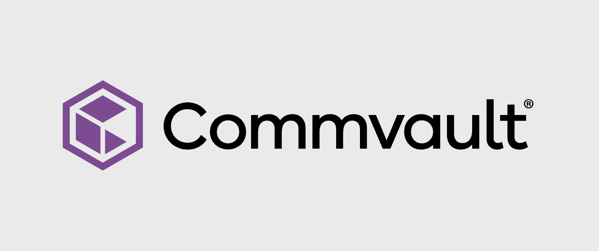
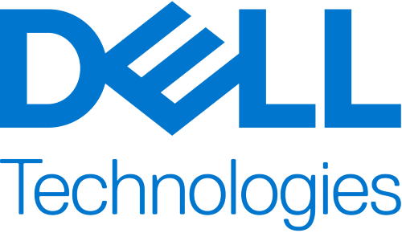
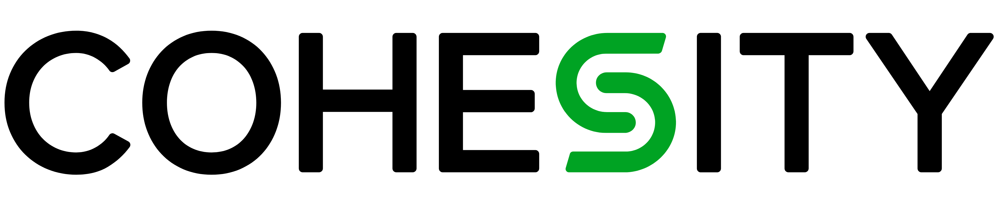
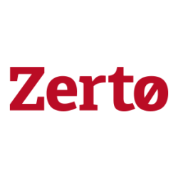

# Azure Storage archive, backup, and disaster recovery partners

This article highlights Microsoft partners that are integrated with Azure Storage for archive, backup, and for business continuity and disaster recovery (BCDR) workloads. These partner solutions take advantage of the scale and cost benefits of Azure Storage. You can use the solutions to help solve backup challenges, to create a disaster recovery site, or to archive unused content for long-term retention. With all the compliance standards that Azure Storage meets, and with Azure features such as [immutable storage](../../../blobs/immutable-storage-overview.md) and [lifecycle management](../../../blobs/lifecycle-management-overview.md), these solutions can easily replace tape-based backups, and offer an on-demand economical recovery site.

## Verified partners

| Partner | Description | Website/product link |
| ------- | ----------- | -------------------- |
| |**Commvault** Safeguard your data environments with cyber resilience solutions co-engineered by Commvault and Microsoft over a 27-year partnership. Our solutions, built on Azure, ensure true cloud resilience with NIST standards and zero-trust principles. Enjoy seamless integration, advanced AI for real-time threat detection, and comprehensive visibility and control—all from a single pane of glass. As a Gartner® Magic Quadrant™ Leader for 13 consecutive years in Enterprise Backup and Recovery Software Solutions, Commvault’s deeply integrated solutions with Microsoft provide true cyber resilience and rapid recovery for continuous business.|[Partner page](https://www.commvault.com/solutions/autonomous-recovery) [Azure Marketplace](https://azuremarketplace.microsoft.com/marketplace/apps/metallic1591115790241.metallic-backup-and-recovery?tab=Overview) [Getting started guide](./commvault/commvault-solution-guide.md) [Commvault Cloud Rewind](https://www.commvault.com/resources/video/commvault-cloud-rewind) [Commvault Cleanroom](https://www.commvault.com/resources/video/welcome-to-the-cleanroom) [Active Directory](https://www.commvault.com/platform/active-directory)|
| |**Datadobi**  Datadobi can optimize your unstructured storage environments. DobiProtect helps you keep a "golden copy" of your most business-critical network attached storage (NAS) data on Azure. This helps protect against cyberthreats, ransomware, accidental deletions, and software vulnerabilities. To keep storage costs to a minimum, select just the data that you'll need when disaster strikes. When disaster does occur, recover your data entirely, restore just a subset of data, or fail over to your golden copy. |[Partner page](https://datadobi.com/partners/microsoft/) [Azure Marketplace](https://azuremarketplace.microsoft.com/en-us/marketplace/apps/datadobi1602192408529.datadobi_license_purchase?tab=Overview)|
| | **Dell Technologies**   Dell Technologies helps simplify the protection of critical workloads, and data wherever they reside with cyber resilient multicloud data protection solutions that can be deployed right from the Azure Marketplace. Protect, secure, and recover critical workloads in Azure, and on-premises, for a simplified, and a consistent operational experience. Drive operational efficiency, cyber resiliency, and scalability while reducing the total cost of ownership. | [Azure Marketplace](https://azuremarketplace.microsoft.com/marketplace/apps/dellemc.ppdm_ddve_0_0_1?tab=Overview) |
| |**Rubrik** Rubrik and Microsoft deliver Zero Trust Data Security solutions. These solutions keep your data safe and enable business recovery in the face of cyber attacks and operational failures. Rubrik tightly integrates with Microsoft Azure Storage to ensure your data and applications are available for rapid recovery, immutable and trusted to keep your business running without interruptions. Choose from the multiple solutions offered by Rubrik to protect your data and applications across on-premises and Microsoft Azure.|[Partner page](https://www.rubrik.com/partners/technology-partners/microsoft) [Azure Marketplace](https://azuremarketplace.microsoft.com/marketplace/apps/rubrik_inc.rubrik_cloud_data_management?tab=Overview)|
| |**Tiger Technology** Tiger Technology offers high-performance, secure, data management software solutions. Tiger Technology enables organizations of any size to manage their digital assets on-premises, in any public cloud, or through a hybrid model.    Tiger Bridge is a non-proprietary, software-only data, and storage management system. It blends on-premises and multi-tier cloud storage into a single space, and enables hybrid workflows. This transparent file server extension lets you benefit from Azure scale and services, while preserving legacy applications and workflows. Tiger Bridge addresses several data management challenges, including: file server extension, disaster recovery, cloud migration, backup and archive, remote collaboration, and multi-site sync. It also offers continuous data protection. |[Partner page](https://www.tiger-technology.com/partners/microsoft-azure/) [Azure Marketplace](https://azuremarketplace.microsoft.com/en-us/marketplace/apps/tiger-technology.tiger_bridge_saas_soft_only)|
|  |**Veeam**  Veeam Backup for Microsoft Azure delivers everything you need to natively protect your Azure VMs automatically. The solution also integrates with Veeam Backup & Replication for transparent hybrid cloud data management across Azure and your private cloud.   Veeam Backup & Replication delivers protection of all your cloud, virtual and physical workloads. Achieve fast, flexible, and reliable backup with fast restores. This ensures low recovery time objective (RTO) recovery and replication for all your applications and data. |Partner pages: [Backup for Azure](https://www.veeam.com/backup-azure.html) [Backup and Replication](https://www.veeam.com/vm-backup-recovery-replication-software.html)  Azure Marketplace: [Backup for Azure](https://azuremarketplace.microsoft.com/marketplace/apps/veeam.azure_backup_free?tab=Overview) [Backup and Replication](https://azuremarketplace.microsoft.com/marketplace/apps/veeam.veeam-backup-replication) [Getting started guide](./veeam/veeam-solution-guide.md)|
|  |**Cohesity** Cohesity empowers organizations to optimize, protect, and manage their data across Microsoft and Azure environments with an AI-driven, zero-trust platform. Ensure fast recovery, seamless migration, and robust ransomware protection through built-in immutability and advanced incident response capabilities. Cohesity delivers a unified solution that simplifies data management while strengthening security posture. With Cohesity’s AI-powered threat detection and fast incident response capabilities, organizations can significantly reduce downtime and data loss to ensure your data is protected at all costs. Designed specifically for Microsoft-centric workloads, Cohesity provides comprehensive data management enabling enterprises to operate with greater agility, resilience, and confidence.|[Partner page](https://www.cohesity.com/solutions/cloud/azure/) Azure Marketplace: [DataProtect](https://azuremarketplace.microsoft.com/en-us/marketplace/apps/cohesitydev1592001764720.sol-4471-ixk?tab=Overview) [FortKnox](https://azuremarketplace.microsoft.com/en-us/marketplace/apps/veritas.cohesity_fortknox?tab=Overview) [Sentinel Integration](https://azuremarketplace.microsoft.com/en-us/marketplace/apps/cohesitydev1592001764720.cohesity_sentinel_data_connector?tab=Overview) [Alta Data Protection](https://www.veritas.com/en/aa/alta/data-protection)|
|  |**Zerto** Zerto helps customers accelerate IT transformation through a single platform for cloud data management and protection. Zerto enables an always-on customer experience by simplifying the protection, recovery, and mobility of applications and data across private, public, hybrid clouds and is optimized for Azure.|[Partner page](https://www.zerto.com/solutions/use-cases/cloud/microsoft-azure/) [Azure Marketplace](https://azuremarketplace.microsoft.com/marketplace/apps/zerto.zerto?tab=overview)|

Are you a storage partner but your solution isn't listed yet? Send us your info [here](https://forms.office.com/pages/responsepage.aspx?id=v4j5cvGGr0GRqy180BHbR3i8TQB_XnRAsV3-7XmQFpFUQjY4QlJYUzFHQ0ZBVDNYWERaUlNRVU5IMyQlQCN0PWcu).

## Next steps

To learn more about some of our other partners, see:
- [Analytics and big data partners](..\analytics\partner-overview.md)
- [Container solution partners](..\container-solutions\partner-overview.md)
- [Data management and migration partners](..\data-management\partner-overview.md)
- [Primary and secondary storage partners](..\primary-secondary-storage\partner-overview.md).
