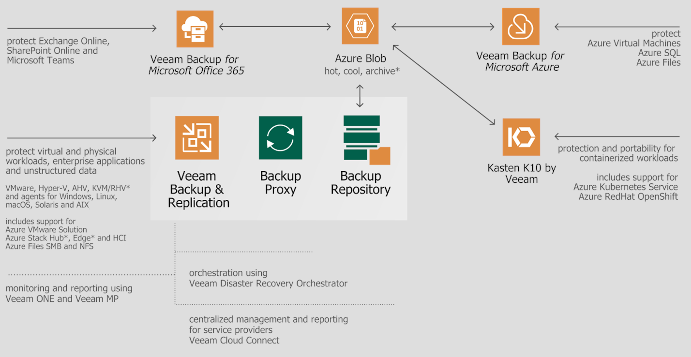

# Azure Data Protection with Veeam

This article provides information for using Azure Blob storage with Veeam solutions, including details on how to get started and best practices.

Azure Blob storage can be used with many Veeam products to provide cost-effective data retention and recovery capabilities. Not all Azure Blob features are supported by each product, learn more about [using object storage with Veeam Products](https://www.veeam.com/kb4241).
## Backup on-premises workloads to Azure

You can store backups of your on-premises workloads on Azure Blob using [Veeam Backup & Replication](https://helpcenter.veeam.com/docs/backup/hyperv/overview.html), allowing you to use Azure Storage's pay-per-use model to easily scale your backup infrastructure with durable, cost-effective storage. This includes support for virtual workloads, physical workloads, enterprise applications and unstructured data.

## Restore on-premises workloads to Azure

To restore your on-premises workloads directly to Azure, you can use [Veeam Backup & Replication](https://helpcenter.veeam.com/docs/backup/hyperv/overview.html), giving you the ability to use Azure as an on-demand recovery site or for migration purposes.

## Protect Azure workloads with Veeam

To agentlessly protect Azure Virtual Machine, Azure Files and Azure SQL workloads, you can use [Veeam Backup for Microsoft Azure](https://helpcenter.veeam.com/docs/vbazure/guide/overview.html), allowing you to perform snapshot, backup and recovery operations entirely within Azure.
Azure VMware Solution and enterprise application-specific workloads such as Oracle and SAP HANA can be protected with [Veeam Backup & Replication](https://helpcenter.veeam.com/docs/backup/hyperv/overview.html). This includes support for agent-based backup.
Azure Kubernetes Service (AKS) and Azure RedHat OpenShift (ARO) workloads are supported with [Kasten K10 by Veeam](https://docs.kasten.io/latest/), providing easy-to-use backup, restore, and application mobility.

## Protect your data in Microsoft 365

You can protect Exchange Online, SharePoint Online, OneDrive for Business, and Teams data with [Veeam Backup for Microsoft 365](https://helpcenter.veeam.com/docs/vbo365/guide/).

This diagram provides an overview of these capabilities.

## Before you begin

As you plan your Azure Storage strategy with Veeam, it's recommended to review the [Microsoft Cloud Adoption Framework](/azure/cloud-adoption-framework/) for guidance on setting up your Azure environment. The [Azure Setup Guide](/azure/cloud-adoption-framework/ready/azure-setup-guide/) includes step-by-step details to help you establish a foundation for operating efficiently and securely within Azure.

## Using Azure Blob Storage with Veeam

### Veeam Backup & Replication

Veeam Backup & Replication supports [object storage as a destination](https://helpcenter.veeam.com/docs/backup/hyperv/object_storage_repository.html) for long-term data storage or for [archiving purpose](https://helpcenter.veeam.com/docs/backup/hyperv/osr_adding_blob_storage_archive_tier.html). Veeam Backup for Azure repository can also be added as external repository for more flexible restore options. Learn how to [configure Veeam Backup & Replication with Azure Blob](https://helpcenter.veeam.com/docs/backup/hyperv/new_object_repository_azure_type.html). Veeam manages the data lifecycle of stored objects, [review considerations and limitations for using Azure Blob with Veeam Products](https://www.veeam.com/kb4241).
### Veeam Backup for Microsoft 365

Veeam Backup for Microsoft 365 supports object storage as primary repository as well as Azure archive storage for long term retention and backup archive. Learn how to configure an [Azure object storage repository in Veeam Backup for M365](https://helpcenter.veeam.com/docs/vbo365/guide/adding_azure_storage.html). Veeam manages the data lifecycle of stored objects, [review considerations and limitations for using Azure Blob with Veeam Products](https://www.veeam.com/kb4241).

### Veeam Backup for Azure

Veeam Backup for Microsoft Azure uses blob containers as target locations for image-level backups of Azure VMs and Azure SQL databases. Learn how to [add a repository in Veeam Backup for Microsoft Azure](https://helpcenter.veeam.com/docs/vbazure/guide/adding_repositories.html?ver=40). Veeam manages the data lifecycle of stored objects, [review considerations and limitations for using Azure Blob with Veeam Products](https://www.veeam.com/kb4241).

### Kasten K10

Kasten supports the use of Azure blob storage as backup target. Learn how to [configure Azure Blob storage with Kasten K10](https://docs.kasten.io/latest/usage/configuration.html#azure-storage)

## Resources

- 	[Veeam Backup & Replication for VMware vSphere](https://helpcenter.veeam.com/docs/backup/vsphere/)
- 	[Veeam Backup & Replication for Microsoft Hyper-V](https://helpcenter.veeam.com/docs/backup/hyperv/)
- 	[Veeam Backup & Replication support for Azure VMware Solution](https://www.veeam.com/kb4012)
- 	[Veeam Backup for Microsoft Azure User Guide](https://helpcenter.veeam.com/docs/vbazure/guide/)
- 	[Veeam Backup for Microsoft 365](https://helpcenter.veeam.com/docs/vbo365/guide/)
- 	[Kasten K10 by Veeam](https://docs.kasten.io/latest/)
- 	[Veeam Plug-ins for Enterprise Applications User Guide](https://helpcenter.veeam.com/docs/backup/plugins/)
- 	[Veeam Agent Management Guide](https://helpcenter.veeam.com/docs/backup/agents/)

### Additional Veeam Resources

- 	[Veeam How-To Videos](https://www.veeam.com/how-to-videos.html)
- 	[Veeam Technical Documentation](https://www.veeam.com/documentation-guides-datasheets.html)
- 	[Veeam Knowledge Base](https://www.veeam.com/knowledge-base.html)

## Support
If you have an issue using Azure Storage with Veeam, open a case with both Azure and Veeam. This helps our support organizations collaborate, if necessary.
### Open a support case with Veeam

On the [Veeam customer support site](https://www.veeam.com/support.html), sign in, and open a case.

To understand the support options available to you from Veeam, review the [Veeam Customer Support Policy](https://www.veeam.com/support-policy.html).

#### Open a support case with Azure

In the [Azure portal](https://portal.azure.com) search for **support** in the search bar at the top. Select **Help + support** -> **New Support Request**.

> [!NOTE]
> When you open a case, be specific that you need assistance with Azure Storage or Azure Networking. Do not specify Azure Backup. Azure Backup is the name of an Azure service and your case will be routed incorrectly.

## Next steps

You can continue to use the Veeam solution you know and trust to protect your workloads running on Azure. Veeam has made it easy to deploy their solutions in Azure and protect Azure Virtual Machines and many other Azure services.

### Marketplace offerings

- 	[Deploy Veeam Backup & Replication from the Azure Marketplace](https://azuremarketplace.microsoft.com/marketplace/apps/veeam.veeam-backup-replication?tab=overview)
- 	[Deploy Veeam Backup for Microsoft Azure from the Azure Marketplace](https://azuremarketplace.microsoft.com/marketplace/apps/veeam.azure_backup)
- 	[Deploy Veeam Backup for Microsoft 365 from the Azure Marketplace](https://azuremarketplace.microsoft.com/marketplace/apps/veeam.office365backup)