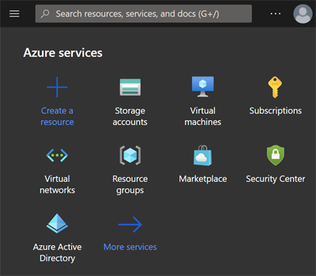
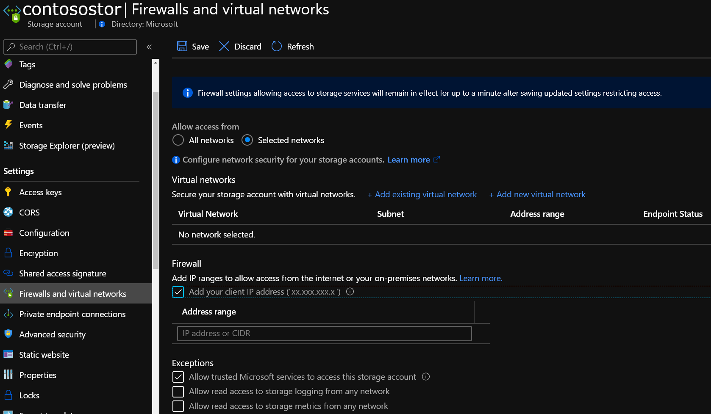

# Backup to Azure with Veeam

This article provides a guide to integrating a Veeam infrastructure with Azure Blob Storage. It includes pre-requisites, Azure Storage principles, implementation, and operational guidance. This article only addresses using Azure as an offsite Backup target and a recovery site in the event of a disaster, which prevents normal operation within your primary site. Veeam also offers a lower RTO solution, Veeam replication, as a means to have a standby VM ready to boot and recover more quickly in the event of a disaster and protection of resources within an Azure Production environment. Veeam does also dedicate tools to Backup Azure and Office 365 resources. These capabilities are out of scope for this document. 

## Reference architecture for on-premises to Azure and In-Azure deployments

Your existing Veeam deployment can easily integrate with Azure by adding an Azure Storage Account, or multiple accounts, as a Cloud Backup Repository. Veeam also allows you to recover backups from on-premises within Azure giving you a recovery-on-demand site in Azure.

## Veeam interoperability matrix
| Workload | GPv2 and Blob Storage | Cool Tier support | Archive Tier support | Data Box Family Support |
|-----------------------|--------------------|--------------------|-------------------------|-------------------------|
| On-premises VMs/data | v10a | v10a | NA | 10a* |
| Azure VMs | v10a | v10a | NA | 10a* |
| Azure Blob | v10a | v10a | NA | 10a* |
| Azure Files | v10a | v10a | NA | 10a* | 

> [!Note]
Veeam Backup and Replication does support REST API only for Azure Data Box, therefore Azure Data Box Disk is not supported. Support for the Archive Tier of Azure Blob Storage is expected in Veeam v11.

## Before you begin

A little upfront planning will make sure you join the ranks of the many, many happy customers using Azure as an offsite backup target and recovery site.

### Are you new to Azure?

Microsoft offers a framework to follow to get you started with Azure. The [Cloud Adoption Framework](https://docs.microsoft.com/azure/architecture/cloud-adoption/) \(CAF\) is a detailed approach to enterprise digital transformation and comprehensive guide to planning a production grade Cloud Adoption. The CAF includes a step-by-step [Azure Setup Guide](https://docs.microsoft.com/azure/cloud-adoption-framework/ready/azure-setup-guide/) for those new to Azure to help you get up and running quickly and securely and you can find an interactive version in the [Azure portal](https://portal.azure.com/?feature.quickstart=true#blade/Microsoft_Azure_Resources/QuickstartCenterBlade). You will find sample architectures and specific best practices for deploying applications and free training resources to put you on the path to Azure expertise.

### Consider the network between your location and Azure

Whether leveraging Cloud resources to run Production, Test and Development, or as a Backup target and Recovery site it is important to understand your bandwidth needs for initial backup seeding and for on-going day-to-day transfers.

Azure Data Box provides a means to transfer your initial backup baseline to Azure without requiring additional bandwidth if the baseline transfer is estimated to take longer than you can tolerate. You can leverage the Data Transfer estimator when you create a storage account to estimate the time required to transfer your initial backup.

Remember, you will require enough network capacity to support daily data transfers within the required transfer window (Backup window) without impacting Production applications. This section will outline the tools and techniques available to assess your network needs.

#### How can you determine how much bandwidth you will need?

Multiple assessment options are available to determine change rate and total backup set size for the initial baseline transfer to Azure. Here are some examples of assessment and reporting tools like:
  - [MiTrend](https://mitrend.com/)
  - [Aptare](https://www.veritas.com/insights/aptare-it-analytics)
  - [Datavoss](https://www.datavoss.com/)

#### How will I know how much headroom I have with my current Internet connection?

It is important to know how much headroom, or typically unutilized, bandwidth you have available on a day-to-day basis. This will allow you to properly assess if you can meet your goals for initial time to upload, when not using Azure Data Box for offline seeding, and for completing daily backups based on the change rate identified above and your backup window. Below are methods you can use to identify the bandwidth headroom your backups to Azure are free to consume.

- Are you an existing Azure ExpressRoute customer? View your [circuit usage](https://docs.microsoft.com/azure/expressroute/expressroute-monitoring-metrics-alerts#circuits-metrics) in the Azure portal.
- You can Contact your ISP. They should have reports to share with you illustrating your existing daily and monthly utilization.
- There are several tools that can measure utilization by monitoring your network traffic at your router/switch level including:
  - [Solarwinds Bandwidth Analyzer Pack](https://www.solarwinds.com/network-bandwidth-analyzer-pack?CMP=ORG-BLG-DNS)
  - [Paessler PRTG](https://www.paessler.com/bandwidth_monitoring)
  - [Cisco Network Assistant](https://www.cisco.com/c/en/us/products/cloud-systems-management/network-assistant/index.html)
  - [WhatsUp Gold](https://www.whatsupgold.com/network-traffic-monitoring)

### Choosing the right Storage options

When using Azure as a backup target, customers make use of [Azure Blob Storage](https://docs.microsoft.com/azure/storage/blobs/storage-blobs-introduction)\. Azure Blob storage is Microsoft's object storage solution. Blob storage is optimized for storing massive amounts of unstructured data, which is data that does not adhere to any data model or definition. Additionally, Azure Storage is durable, highly available, secure, and scalable. Microsoft’s platform offers up flexibility to select the right storage for the right workload in order to provide the [level of resiliency](https://docs.microsoft.com/azure/storage/common/storage-redundancy?toc=/azure/storage/blobs/toc.json) to meet your internal SLAs. Blob Storage is a pay-per-use service. You are [charged monthly](https://docs.microsoft.com/azure/storage/blobs/storage-blob-storage-tiers?tabs=azure-portal#pricing-and-billing) for the amount of data stored, accessing that data, and - in the case of Cool and Archive Tiers - a minimum required retention period. The resiliency and tiering options applicable to backup data are summarized in the tables below.

**Azure Blob Storage resiliency options:**

|  |Locally Redundant  |Zone Redundant  |Geographically Redundant  |Geo Zone Redundant  |
|---------|---------|---------|---------|---------|
|Effective # of Copies     | 3         | 3         | 6         | 6 |
|# of Availability Zones     | 1         | 3         | 2         | 4 |
|# of Regions     | 1         | 1         | 2         | 2 |
|Manual Failover to Secondary Region     | NA         | NA         | Yes         | Yes |

**Azure Blob Storage tiers:**

|  | Hot Tier   |Cool Tier   | Archive Tier |
| ----------- | ----------- | -----------  | -----------  |
| Availability | 99.9%         | 99%         | Offline      |
| Usage Charges | Higher storage costs, Lower access, and transaction costs | Lower storage costs, higher access, and transaction costs | Lowest storage costs, highest access, and transaction costs |
| Minimum Data Retention Required | NA | 30 days | 180 days |
| Latency (Time to First Byte) | Milliseconds | Milliseconds | Hours |

#### Sample Backup to Azure cost model

The concept of pay-per-use can be daunting to customers who are new to the Public Cloud. While you pay for only the capacity used, you do also pay for transactions (read and or writes) and [egress for data](https://azure.microsoft.com/pricing/details/bandwidth/) read back to your on-premises environment when [Azure Express Route Direct Local or Express Route Unlimited Data plan](https://azure.microsoft.com/pricing/details/expressroute/) are in use where data egress from Azure is included. You can perform what if analysis based on list pricing or with [Azure Storage Reserved Capacity pricing](https://docs.microsoft.com/azure/cost-management-billing/reservations/save-compute-costs-reservations), which can deliver up to 38% savings, in the [Azure Pricing Calculator](https://azure.microsoft.com/pricing/calculator/). Here is an example pricing exercise to model the monthly cost of backing up to Azure, this is an example only and ***your pricing may vary due to activities not captured here:***

|Cost Factor  |Monthly Cost  |
|---------|---------|
|100 TB of Backup Data on Cool Storage     |$1556.48         |
|2 TB of new data written per day x 30 Days     |$72 in transactions          |
|Monthly Estimated Total     |$1628.48         |
|---------|---------|
|One Time Restore of 5 TB to on-premises over Public Internet   | $527.26         |

> [!Note]
This estimate was generated in the Azure Pricing Calculator using East US Pay-as-you-go pricing and is based on the Veeam default of 256kb chunk size for WAN transfers. This example may not be applicable towards your requirements.

## Implementation and operational guidance

This section provides a brief guide to adding Azure Storage to an on-premises Veeam deployment. If you are interested in detailed guidance and planning considerations, we recommend reviewing the [Veeam Cloud Connect Backup Guide](https://helpcenter.veeam.com/docs/backup/cloud/cloud_backup.html?ver=100).

1. Open the Azure portal, and search for "Storage Accounts" or click on the default services icon.

      

      

2. Choose to Add an account, and select or create a Resource Group, provide a unique name, choose the region, select "Standard" Performance, always leave account kind as "Storage V2," choose the replication level, which meets your SLAs, and the default tier your backup software will leverage. An Azure Storage account makes Hot, Cool, and Archive tiers available within a single account and Veeam policies allow you to leverage multiple tiers to effectively manage the lifecycle of your data. Proceed to the next step. 
    
      

3. Stick with the default networking options for now and move on to "Data Protection." Here, you can choose to enable "Soft Delete" which allows you to recover an accidentally deleted Backup file within the defined retention period and offers protection against accidental or malicious deletion. 
    

4. Next, we recommend the default settings from the "Advanced" screen for Backup to Azure use cases.

     

5. Add tags for organization if you leverage tagging and create your account. You now have petabytes of on-demand storage at your disposal!

6. Two quick steps are all that are now required before you can add the account to your Veeam environment. Navigate to the account you created in the Azure Portal and select "Containers" under the "Blob Service" menu in the Portal blade. Add a new container and choose a meaningful name. Then, navigate to the "Access Keys" item under "Settings" and copy the "Storage account name" and one of the two access keys. You will need the Container name, Account Name, and Access Key in our next steps.

    
    
    
    
    > [!Note]
Veeam Backup and Replication does offer additional options to connect to Azure. For the use case of this article, leveraging Microsoft Azure Blob Storage as a backup target, using above method is the recommended best practice.

7. ***(Optional)*** You can add additional layers of security to your deployment.

     1. Configure Role Based Access to limit who can make changes to your Storage Account. [Learn more here](https://docs.microsoft.com/azure/storage/common/authorization-resource-provider?toc=/azure/storage/blobs/toc.json)

    1. Restrict access to the account to specific network segments with [Storage Firewall](https://docs.microsoft.com/azure/storage/common/storage-network-security?toc=%2Fazure%2Fstorage%2Fblobs%2Ftoc.json&tabs=azure-portal) to prevent access attempts from outside your corporate network.

     

    1. Set a [Delete Lock](https://docs.microsoft.com/azure/azure-resource-manager/management/lock-resources) on the account to prevent accidental deletion of the Storage Account.

    
    1.) Configure additional [security best practices](https://docs.microsoft.com/azure/storage/blobs/security-recommendations). 
8. In the Veaam Backup and Replication Management Console, navigate to "Backup Infrastructure" --> right click in the overview pane and select "Add Backup Repository" to open the configuration wizard. In the dialog box, select object storage --> Microsoft Azure Blob Storage --> Azure Blob Storage.
    
    

    

    

9. Next, specify a name and a description of your new Microsoft Azure Blob Repository.
    
    

10. In the next step, add the credentials to access your Azure Storage Account. Select "Microsoft Azure Storage Account" in the Cloud Credential Manager, enter your storage account name and access key. Select Azure Global in the region selector and any gateway server if applicable.
    
    

> [!Note]
If you choose not to use a Veeam gateway server, make sure that all scale-out repository extents have direct internet access.

11. On the container register, select your Azure Storage Container and select or create a folder to store your Backups in. You can also define a soft limit on the overall storage capacity to be used by Veeam (recommended). Review the displayed information in the summary section and complete the configuration tool. The new repository can then be selected in your backup job configuration.

    
    
    

### Azure alerting and performance monitoring

It is advisable to monitor both your Azure resources and Veeam's ability to leverage them as you would with any storage target you rely on to store your backups. A combination of Azure Monitor and Veeam's monitoring capabilities (i.e. the statistics tab in the jobs node of the Veeam Management Console or more advanced options like Veeam One Reporter) will help you keep your environment healthy.

#### Microsoft Azure portal

Microsoft Azure provides a robust monitoring solution in the form of [Azure Monitor](https://docs.microsoft.com/azure/azure-monitor/insights/monitor-azure-resource). You can [configure Azure Monitor](https://docs.microsoft.com/azure/storage/common/monitor-storage?toc=%2Fazure%2Fstorage%2Fblobs%2Ftoc.json&tabs=azure-powershell#configuration) to track Azure Storage capacity, transactions, availability, authentication, and more. The full reference of metrics tracked may be found [here](https://docs.microsoft.com/azure/storage/common/monitor-storage-reference). A few useful metrics to track are BlobCapacity - to make sure you remain below the maximum [Storage Account Capacity limit](https://docs.microsoft.com/azure/storage/common/scalability-targets-standard-account), Ingress, and Egress - to track the amount of data being written to and read from your Azure Storage account, and SuccessE2ELatency - to track the roundtrip time for requests to and from Azure Storage and your MediaAgent. 

You can also [create log alerts](https://docs.microsoft.com/azure/service-health/alerts-activity-log-service-notifications) to track Azure Storage service health and view the [Azure Status Dashboard](https://status.azure.com/status) at anytime.

#### Veeam reporting

[Configuring Veeam One Reporting](https://helpcenter.veeam.com/docs/one/reporter/configure_reporter.html?ver=100)

[Veeam Backup and Replication Alarms](https://helpcenter.veeam.com/docs/one/monitor/backup_alarms.html?ver=100) 

### How to open support cases

When you need assistance with your Backup to Azure Solution, we recommend opening a case with both Veeam and Azure so our support organizations can engage collaboratively, if necessary.

#### How to open a case with Veeam

Navigate to the [Veeam Customer Support Portal](https://www.veeam.com/support.html), Sign in, and open a case.

If you need to understand the support options available to you by Veeam, see [Veeam Customer Support Policy](https://www.veeam.com/veeam_software_support_policy_ds.pdf)

You may also call in to open a case:

[Worldwide Support Numbers](https://www.veeam.com/contacts.html?ad=in-text-link#support-numbers)

#### How to open a case with the Azure support team

Within the [Azure portal](https://portal.azure.com) search for "Support" in the Search Bar at the top of the portal and choose "+ New Support Request" 
> [!Note]
When opening a case, please be specific that you need assistance with "Azure Storage" or "Azure Networking" and **NOT** "Azure Backup." Azure Backup is a Microsoft Azure native service and your case will be routed incorrectly.

### Links to relevant Veeam documentation

Veeam documentation providing further detail:

[Veeam User Guide](https://helpcenter.veeam.com/docs/backup/hyperv/overview.html?ver=100)

[Veeam Architecture Guide](https://helpcenter.veeam.com/docs/backup/vsphere/backup_architecture.html?ver=100)

### Link to Marketplace Offering

You can also continue to use the Veeam solution you know and trust to protect your workloads running on Azure. Veeam has made it easy to deploy their solution in Azure and protect Azure Virtual Machines and many other Azure Services.

[Deploy Veeam B&R via the Azure Marketplace](https://azuremarketplace.microsoft.com/marketplace/apps/veeam.veeam-backup-replication?tab=overview)

[Azure Datasheet](https://www.veeam.com/backup-azure.html?ad=menu-products)

## Next steps

Explore additional resources on these external websites to get information about specialized usage scenarios:

[Veeam How to Videos](https://www.veeam.com/how-to-videos.html?ad=menu-resources)

[Veeam Technical Documentations](https://www.veeam.com/documentation-guides-datasheets.html?ad=menu-resources)

[Veeam Knowledge Base and FAQ](https://www.veeam.com/knowledge-base.html?ad=menu-resources)
