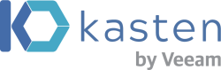
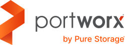
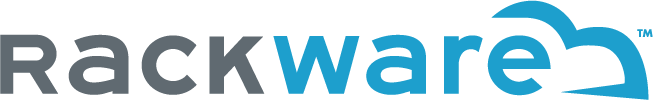

# Azure Storage container management partners

This article highlights Microsoft partner solutions that enable automation, data protection, and storage management of container-based solutions at scale.

## Verified partners

| Partner | Description | Website/product link |
| ------- | ----------- | -------------------- |
|  |**Kasten** Kasten by Veeam provides a solution for Kubernetes backup and disaster recovery. Kasten helps enterprises overcome Day 2 data management challenges to confidently run applications on Kubernetes.  The Kasten K10 data management software platform provides enterprise operations teams a scalable and secure system for BCDR and mobility of Kubernetes applications.|[Partner page](https://docs.kasten.io/latest/install/azure/azure.html) [Azure Marketplace](https://azuremarketplace.microsoft.com/en-us/marketplace/apps/veeam.kasten_k10_by_veeam_byol?tab=Overview)|
|  |**Portworx** Portworx by Pure Storage is the Kubernetes Data Services Platform enterprises trust to run mission-critical applications in containers in production.  Portworx provides a fully integrated solution for persistent storage, data protection, disaster recovery, data security, cross-cloud and data migrations, and automated capacity management for applications running on Kubernetes.|[Partner page](https://portworx.com/azure/) [Azure Marketplace](https://azuremarketplace.microsoft.com/marketplace/apps/purestoragemarketplaceadmin.portworx-enterprise)|
|  |**Robin.io** Robin.io provides an application and data management platform that enables enterprises and 5G service providers to deliver complex application pipelines as a service.  Robin Cloud Native Storage (CNS) brings advanced data management capabilities to Azure Kubernetes Service. Robin CNS seamlessly integrates with Azure Disk Storage to simplify management of stateful applications. Developers and DevOps teams can deploy Robin CNS as a standard Kubernetes operator on AKS. Robin Cloud Native Storage helps simplify data management operations such as BCDR and cloning of entire applications. |[Partner page](https://robin.io/robin-cloud-native-storage-for-microsoft-aks/)|
|  |**NetApp** NetApp is a global cloud-led, data-centric software company that empowers organizations to lead with data in the age of accelerated digital transformation.  NetApp Astra Control Service is a fully managed service that makes it easier for customers to manage, protect, and move their data-rich containerized workloads running on Kubernetes within and across public clouds and on-premises. Astra Control provides persistent container storage with Azure NetApp Files offering advanced application-aware data management functionality (like snapshot-revert, backup-restore, activity log, and active cloning) for data protection, disaster recovery, data audit, and migration use-cases for your modern apps. |[Partner page](https://cloud.netapp.com/astra) [Azure Marketplace](https://azuremarketplace.microsoft.com/marketplace/apps/netapp.netapp-astra-acs)|
|  |**Rackware** RackWare provides an intelligent highly automated Hybrid Cloud Management Platform that extends across physical and virtual environments.  RackWare SWIFT is a converged disaster recovery, backup and migration solution for Kubernetes and OpenShift. It is a cross-platform, cross-cloud and cross-version solution that enables you to move and protect your stateful Kubernetes applications from any on-premises or cloud environment to Azure Kubernetes Service (AKS) and Azure Storage.|[Partner page](https://www.rackwareinc.com/rackware-swift-microsoft-azure) [Azure Marketplace](https://azuremarketplace.microsoft.com/en-us/marketplace/apps?search=rackware%20swift&page=1&filters=virtual-machine-images)|

Are you a storage partner but your solution is not listed yet? Send us your info [here](https://forms.office.com/pages/responsepage.aspx?id=v4j5cvGGr0GRqy180BHbR3i8TQB_XnRAsV3-7XmQFpFUQjY4QlJYUzFHQ0ZBVDNYWERaUlNRVU5IMyQlQCN0PWcu).
## Next steps

To learn more about some of our other partners, see:

- [Analytics and big data partners](..\analytics\partner-overview.md)
- [Archive, backup, and BCDR partners](..\backup-archive-disaster-recovery\partner-overview.md)
- [Data management and migration partners](..\data-management\partner-overview.md)
- [Primary and secondary storage partners](..\primary-secondary-storage\partner-overview.md)
