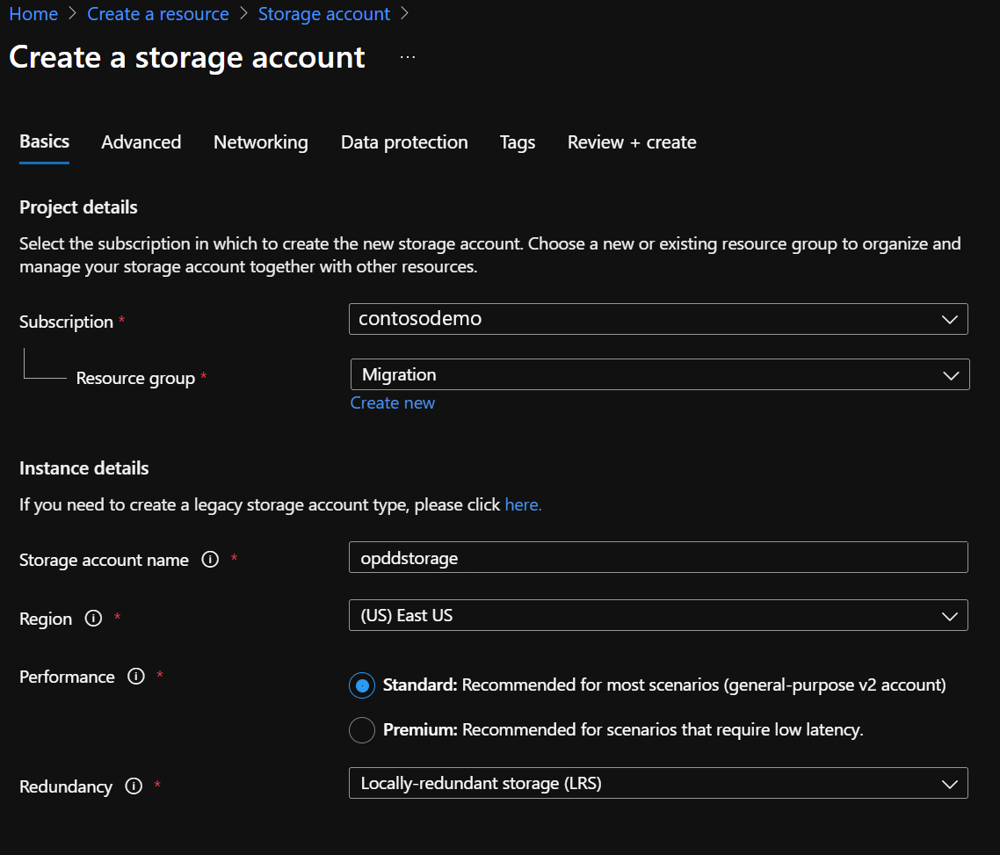
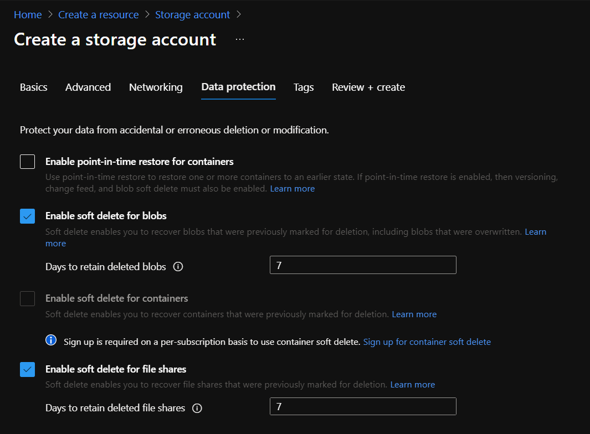
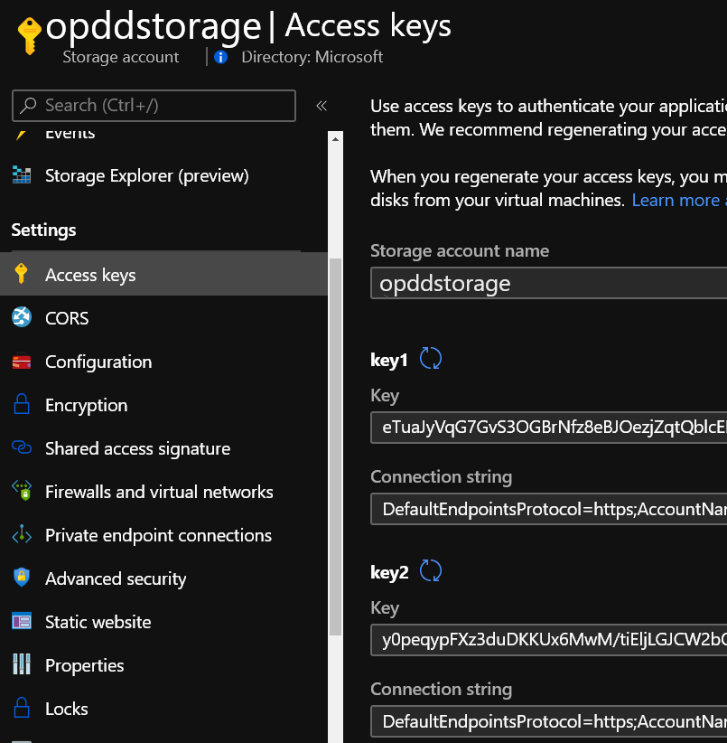
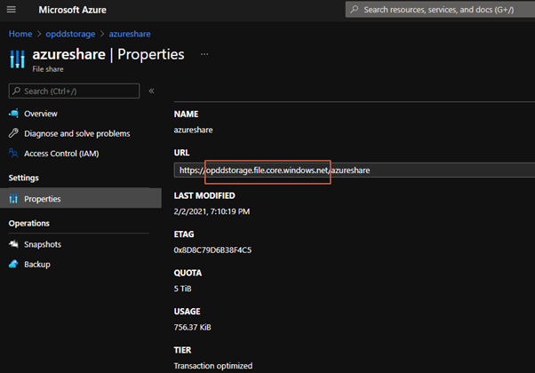
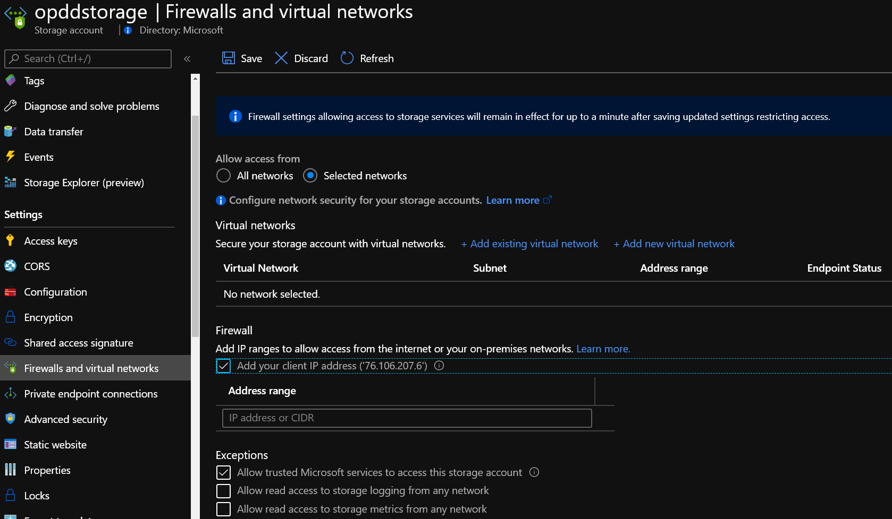
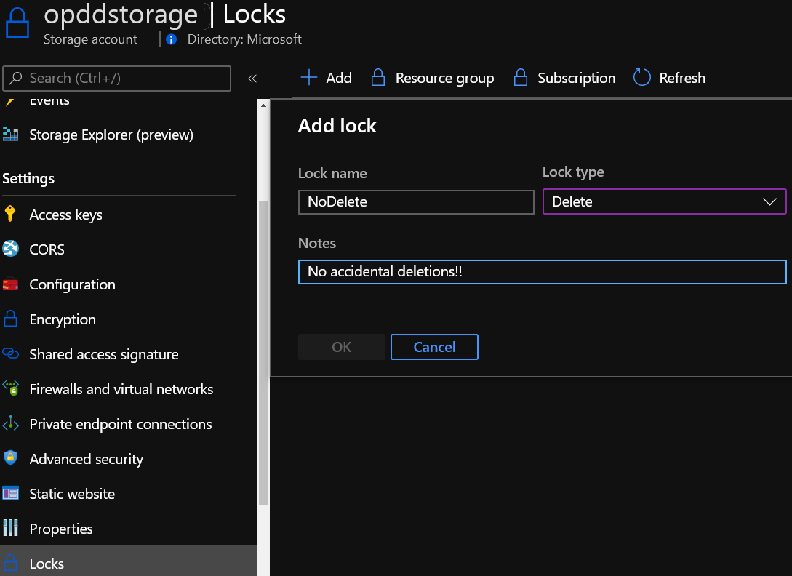
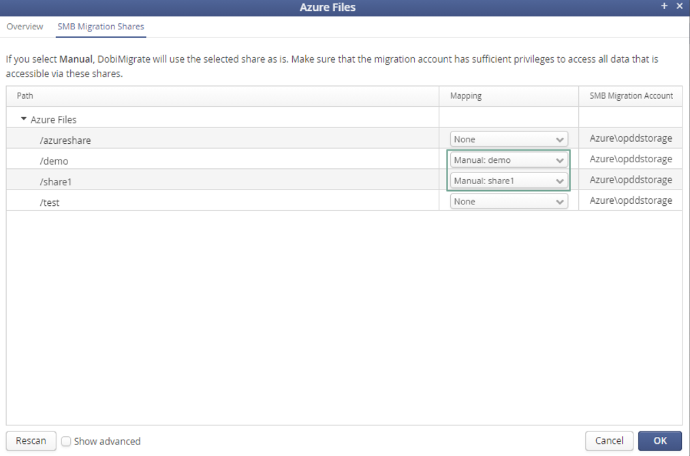

# Data Migration to Azure with Datadobi DobiMigrate

This article helps you integrate the Datadobi DobiMigrate infrastructure with Azure storage. It includes prerequisites, considerations, implementation, and operational guidance.

DobiMigrate enables file and object migrations between storage platforms. It migrates data from on-premises to Azure quickly, easily, and cost effectively.

## Reference architecture

The following diagram provides a reference architecture for on-premises to Azure and in-Azure deployments.

Your existing DobiMigrate deployment can easily integrate with Azure by adding and configuring an Azure connection.

## Before you begin

A little upfront planning will help you use Azure as an offsite backup target and recovery site.

### Get started with Azure

Microsoft offers a framework to follow to get you started with Azure. The [Cloud Adoption Framework](/azure/architecture/cloud-adoption/) (CAF) is a detailed approach to enterprise digital transformation and comprehensive guide to planning a production grade cloud adoption. The CAF includes a step-by-step [Azure setup guide](/azure/cloud-adoption-framework/ready/azure-setup-guide/) to help you get up and running quickly and securely. You can find an interactive version in the [Azure portal](https://portal.azure.com/?feature.quickstart=true#blade/Microsoft_Azure_Resources/QuickstartCenterBlade). You'll find sample architectures, specific best practices for deploying applications, and free training resources to put you on the path to Azure expertise.

### Considerations for migrations

Several aspects are important when considering migrations of file data to Azure. Before proceeding check out our [storage migration overview](/azure/storage/common/storage-migration-overview).

Remember, you'll require enough network capacity to support migrations without impacting production applications. This section outlines the tools and techniques that are available to assess your network needs.

#### Determine unutilized internet bandwidth

It's important to know how much typically unutilized bandwidth (or *headroom*) you have available on a day-to-day basis. To help you assess whether you can meet your goals for:

- initial time for migrations when you're not using Azure Data Box for offline method
- time required to do incremental resync before final switch-over to the target file service

Use the following methods to identify the bandwidth headroom to Azure that is free to consume.

- If you're an existing Azure ExpressRoute customer, view your [circuit usage](../../../../expressroute/expressroute-monitoring-metrics-alerts.md#circuits-metrics) in the Azure portal.
- Contact your ISP and request reports to show your existing daily and monthly utilization.
- There are several tools that can measure utilization by monitoring your network traffic at the router/switch level. These include:
  - [Solarwinds Bandwidth Analyzer Pack](https://www.solarwinds.com/network-bandwidth-analyzer-pack?CMP=ORG-BLG-DNS)
  - [Paessler PRTG](https://www.paessler.com/bandwidth_monitoring)
  - [Cisco Network Assistant](https://www.cisco.com/c/en/us/products/cloud-systems-management/network-assistant/index.html)
  - [WhatsUp Gold](https://www.whatsupgold.com/network-traffic-monitoring)

## Implementation guidance

This section provides a brief guide for how to add Azure Storage to an on-premises/cloud DobiMigrate deployment.

1. Open the Azure portal, and search for  **storage accounts**. You can also click on the default  **Storage accounts**  icon.

    
  
    

1. Select  **Create**  to add an account:
   - Select or create a resource group
   - provide a unique name for your storage account
   - choose the region
   - select  **Standard**  or **Premium** performance, depending on your needs. If you select **Premium**, select **File shares** under **Premium account type**.
   - select account kind (keep **Storage V2** unless using it for low latency scenarios)
   - choose the redundancy level that meets your SLAs

1. Next, we recommend the default settings from the **Advanced** screen. If you are migrating to Azure Files, we recommend enabling **Large file shares**.

1. Keep the default networking options for now and move on to  **Data protection**. You can choose to enable soft delete, which allows you to recover an accidentally deleted data within the defined retention period. Soft delete offers protection against accidental or malicious deletion.

1. Add tags for organization if you use tagging and create your account.
2. Two quick steps are all that are now required before you can add the account to your DobiMigrate environment. Navigate to the account you created in the Azure portal and select File shares under the File service menu. Add a File share and choose a meaningful name. Then, navigate to the Access keys item under Settings and copy the Storage account name and one of the two access keys.

1. Navigate to the properties of the Azure File share and take the URL address, it will be required to add the Azure connection into the DobiMigrate:

1. (_Optional_) You can add extra layers of security to your deployment.
  1. Configure role-based access to limit who can make changes to your storage account. For more information, see [Built-in roles for management operations](/azure/storage/common/authorization-resource-provider#built-in-roles-for-management-operations).
  2. Restrict access to the account to specific network segments with [storage firewall settings](/azure/storage/common/storage-network-security). This prevents access attempts from outside of your corporate network.

  1. Set a [delete lock](https://docs.microsoft.com/azure/azure-resource-manager/management/lock-resources) on the account to prevent accidental deletion of the storage account.

  1. Configure extra [security best practices](/azure/storage/blobs/security-recommendations).
1. In DobiMigrate, navigate to Configuration \&gt; File Servers. Click **Add** to add Microsoft Azure Files as a file server type:
 
2. Specify the Name, Azure Files connection details, and the storage account credentials:
 
3. Assign the proxies to the Azure Files connection and click &quot;Test connection&quot; to confirm that the proxies can communicate with Azure Files:
 

The connection test results are displayed:

1. Under SMB Migration Shares, you see all the Azure File shares that are provisioned under this storage account. Set Mapping to &quot;Manual&quot; for the shares that are in your migration scope, for example:
 
2. Click &quot;Finish&quot; to complete the Azure Files configuration. You can then initiate a new migration task.

## Support 

When you need help with your migration to Azure solution, you should open a case with both Datadobi and Azure.

### To open a case with Datadobi

On the [Datadobi Support Site](https://support.datadobi.com/s/), sign in, and open a case.

### To open a case with Azure

In the [Azure portal](https://portal.azure.com/) search for  **support**  in the search bar at the top. Select  **Help + support**  -\&gt;  **New Support Request**.

## Marketplace

Datadobi has made it easy to deploy their solution in Azure to protect Azure Virtual Machines and many other Azure services. For more information, see the following references:

- [Migrate File Data to Azure with DobiMigrate](https://azuremarketplace.microsoft.com/marketplace/apps/datadobi1602192408529.datadobi-dobimigrate?tab=overview)

## Additional resources

- [Storage migration overview](/azure/storage/common/storage-migration-overview)
- [DobiMigrate User Manual](https://downloads.datadobi.com/NAS/olh/latest/dobimigrate.html)
- [DobiMigrate Prerequisites Guide](https://downloads.datadobi.com/NAS/guides/latest/prerequisites.html)
- [DobiMigrate Install Guide](https://downloads.datadobi.com/NAS/guides/latest/installguide.html)
