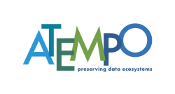
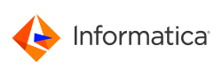
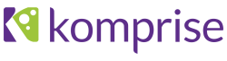

# Azure Storage data governance, management, and migration partners

This article highlights Microsoft partner companies integrated with Azure Storage that can improve your overall data management capabilities. These partner solutions can support storage assessment and reporting, platform-agnostic migration, replication, cloud tiering, or data governance.

## Verified partners

| Partner | Description | Website/product link |
| ------- | ----------- | -------------------- |
| |**Atempo** Atempo Miria empowers you to manage complex file workflows including migration, backup, archive, and synchronization in heterogenous environments. Atempo Miria has a compatibility guide allowing to implement efficient data workflows between NAS, parallel FS, object, tape, and optical disk. The association of Azure and Atempo Miria allows customers to deploy any file workflow from on-premises to Azure or from cloud to Azure. |[Partner page](https://www.atempo.com/products/miria-for-archiving-large-file-sets/)|
| |**Cirrus Data** Cirrus Data Solutions is a block storage data migration solution for both on-premises and cloud environments. An end-to-end approach allows you to migrate your data from on-premises to the cloud, between storage tiers within the cloud, and seamlessly migrate between public clouds. |[Partner Page](https://www.cirrusdata.com/cloud-migration/) [Azure Marketplace](https://azuremarketplace.microsoft.com/marketplace/apps/cirrusdatasolutionsinc1618222951068.cirrus-migrate-cloud)|
| |**Commvault** Optimize, protect, migrate, and index your data using Microsoft infrastructure with Commvault. Take control of your data with Commvault Complete Data Protection, the Microsoft-centric and, Azure-centric data management solution. Commvault provides the tools you need to manage, migrate, access, and recover your data no matter where it resides, while reducing cost and risk.|[Partner Page](https://www.commvault.com/complete-data-protection) [Azure Marketplace](https://azuremarketplace.microsoft.com/marketplace/apps/commvault.commvault)|
| |**Data Dynamics** Data Dynamics provides enterprise solutions to manage unstructured data for hybrid and multi-cloud environments. Their Unified Unstructured Data Management Platform uses analytics and automation to help you intelligently and efficiently move data from heterogenous storage environments (SMB, NFS, or S3 Object) into Azure. The platform provides seamless integration, enterprise scale, and performance that enables the efficient management of data for hybrid and multi-cloud environments. Use cases include: intelligent cloud migration, disaster recovery, archive, backup, and infrastructure optimization and data management. |[Partner page](https://www.datadynamicsinc.com/partners-2/)|
 |**Datadobi**  Datadobi can optimize your unstructured storage environments. DobiMigrate is enterprise-class software that gets your file and object data – safely, quickly, easily, and cost effectively – to Azure. Focus on value-added activities instead of time-consuming migration tasks. Grow your storage footprint without CAPEX investments.|[Partner page](https://datadobi.com/partners/microsoft/) [Azure Marketplace](https://azuremarketplace.microsoft.com/en-us/marketplace/apps/datadobi1602192408529.datadobi_license_purchase?tab=Overview)|
 |**Informatica** Informatica’s enterprise-scale, cloud-native data management platform automates and accelerates the discovery, delivery, quality, and governance of enterprise data on Azure. AI-powered, metadata-driven data integration, and data quality and governance capabilities enable you to modernize analytics and accelerate your move to a data warehouse or to a data lake on Azure.|[Partner page](https://www.informatica.com/azure) [Azure Marketplace](https://azuremarketplace.microsoft.com/marketplace/apps/informatica.annualiics?tab=Overview)|
| |**Komprise** Komprise enables visibility across silos to manage file and object data and save costs. Komprise Intelligent Data Management software lets you consistently analyze, move, and manage data across clouds.  Komprise helps you to analyze data growth across any network attached storage (NAS) and object storage to identify significant cost savings. You can also archive cold data to Azure, and runs data migrations, transparent data archiving, and data replications to Azure Files and Blob storage. Patented Komprise Transparent Move Technology enables you to archive files without changing user access. Global search and tagging enables virtual data lakes for AI, big data, and machine learning applications. |[Partner page](https://www.komprise.com/partners/microsoft-azure/) [Azure Marketplace](https://azuremarketplace.microsoft.com/marketplace/apps/komprise_inc.intelligent_data_management?tab=Overview) 
| |**Peer Software** Peer Software provides real-time file management solutions for hybrid and multi-cloud environments. Key use cases include high availability for user and application data across branch offices, Azure regions and availability zones, file sharing with version integrity, and migration to file or object storage with minimal cutover downtime. |[Partner page](https://go.peersoftware.com/azure_file_management_solutions) [Azure Marketplace](https://azuremarketplace.microsoft.com/marketplace/apps/peer-software-inc.peergfs?tab=overview)
| |**Privacera** Privacera provides a unified system for data governance and security across multiple cloud services and analytical platforms. Privacera enables IT and data platform teams to democratize data for analytics, while ensuring compliance with privacy regulations.  |[Partner page](https://privacera.com/azure/) [Azure Marketplace](https://azuremarketplace.microsoft.com/marketplace/apps/globaltenetincdbaprivacera1585932150924.privacera_platform)
| |**Tiger Technology** Tiger Technology offers high-performance, secure data & storage management software solutions. It enables organizations of any size to manage their digital assets on-premises, in any public cloud, or through an on-premises-first hybrid model. Specializes in migrating mission-critical workflows, application servers, and NAS/tape-to-cloud migrations. Tiger Bridge is a non-proprietary, software-only data management solution. It blends a file system and multi-tier cloud storage into a single space and enables hybrid workflows. Tiger Bridge addresses several data management challenges: file server and application server extension, migration, disaster recovery, backup and archive, and multi-site sync. It also offers continuous data protection and ransomware protection capabilities. |[Partner page](https://www.tiger-technology.com/partners/microsoft-azure/) [Azure Marketplace](https://azuremarketplace.microsoft.com/marketplace/apps/tiger-technology.tigerbridge_vm)|

Are you a storage partner but your solution is not listed yet? Send us your info [here](https://forms.office.com/pages/responsepage.aspx?id=v4j5cvGGr0GRqy180BHbR3i8TQB_XnRAsV3-7XmQFpFUQjY4QlJYUzFHQ0ZBVDNYWERaUlNRVU5IMyQlQCN0PWcu).
## Next steps

To learn more about some of our other partners, see:

- [Analytics and big data partners](..\analytics\partner-overview.md)
- [Archive, backup, and BCDR partners](..\backup-archive-disaster-recovery\partner-overview.md)
- [Container solution partners](..\container-solutions\partner-overview.md)
- [Primary and secondary storage partners](..\primary-secondary-storage\partner-overview.md)
