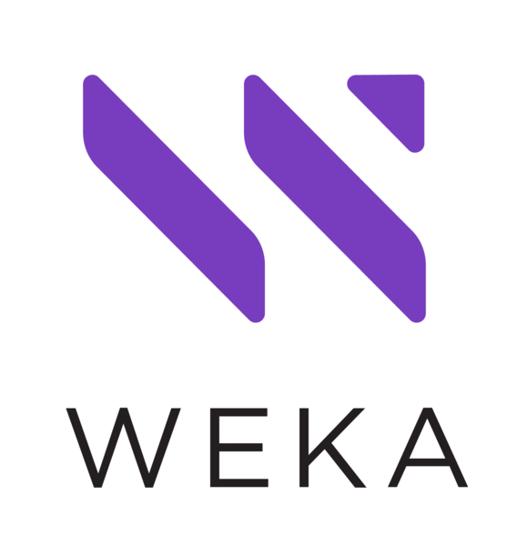

# Azure Storage partners for primary and secondary storage

This article highlights Microsoft partner companies that deliver a network attached storage (NAS) or storage area network (SAN) solution. The solution can be on-premises, in Azure, or a hybrid solution that uses Azure Storage as a cost-effective tier. These solutions can enable customers to use the same solution in any of their environments.

## Validated partners

| Partner | Description | Website/product link |
| ------- | ----------- | -------------------- |
|  |**Nasuni** Nasuni is a file storage platform that replaces enterprise NAS and file servers including the associated infrastructure for Business Continuity and Disaster Recovery and disk tiering. Virtual edge appliances keep files quickly accessible and synchronized with the cloud. The management console lets you manage multiple storage sites from one location including the ability to provision, monitor, control, and report on your file infrastructure. Continuous versioning to the cloud brings file restore times down to minutes.  Nasuni cloud file storage built on Azure eliminates traditional NAS and file servers across any number of locations and replaces it with a cloud solution. Nasuni cloud file storage provides infinite file storage, backups, disaster recovery, and multi-site file sharing. Nasuni is a software-as-a-service used for data-center-to-the-cloud initiatives, multi-location file synching, sharing and collaboration, and as a cloud storage companion for Virtual Desktop environments.|[Partner page](https://www.nasuni.com/partner/microsoft/) [Azure Marketplace](https://azuremarketplace.microsoft.com/marketplace/apps/nasunicorporation.nasuni)|
|  |**Pure Storage** Pure delivers a modern data experience that empowers organizations to run their operations as a true, automated, storage as-a-service model seamlessly across multiple clouds.|[Partner page](https://www.purestorage.com/company/technology-partners/microsoft.html) [Solution Video](https://azure.microsoft.com/resources/videos/pure-storage-overview) [Azure Marketplace](https://azuremarketplace.microsoft.com/en-us/marketplace/apps/purestoragemarketplaceadmin.pure_cloud_block_store_product_deployment?tab=overview)|
| |**Qumulo** Qumulo services on Azure empower the data, and workforces that fuel the next generation of workflows and innovation. It provides a high-performance, scalable, and elastic data platform. Enables organizations to move their file, and object-based applications, and user experiences to the cloud cost-effectively. In Azure, Qumulo offers a fully managed service, Azure Native Qumulo (ANQ), and a self-hosted service, Cloud Native Qumulo (CNQ). CNQ, and ANQ are unstructured data platforms offering SMB, NFS, and object protocol support. Both enable organizations to operate unstructured data workflows without application refactoring. Qumulo’s patented software architecture delivers optimal economics for organizations. Used in Media & Entertainment, Healthcare, Genomics, Technology, Energy, Manufacturing, Government, and Financial Services industries, runs their most demanding workloads, and optimizes cost. Customers use Qumulo for its scale, performance, and ability to enable seamless hybrid cloud workflows. Sign up for a free [Proof of Concept](https://azuremarketplace.microsoft.com/marketplace/apps/qumulo1584033880660.qumulo-saas-mpp). | [ANQ Partner page](https://qumulo.com/product/azure/) [CNQ Partner Page](https://qumulo.com/product/azure-cnq/) [Azure Marketplace (ANQ)](https://azuremarketplace.microsoft.com/marketplace/apps/qumulo1584033880660.qumulo-saas-mpp) [Azure Marketplace (CNQ)](https://azuremarketplace.microsoft.com/marketplace/apps/qumulo1584033880660.cnq-azure) [Datasheet (ANQ)](https://query.prod.cms.rt.microsoft.com/cms/api/am/binary/RWUtF0) [Datasheet (CNQ)](https://qumulo.com/wp-content/uploads/2024/12/SB-%E2%80%94-CNQ-on-Azure.pdf) [Video (ANQ)](https://www.youtube.com/watch?v=zJpUAZVAato) [Video (CNQ)](https://dadqwu9fiodc7.cloudfront.net/videos/CNQ-on-Azure.mp4) [Documentation (ANQ)](https://docs.qumulo.com/azure-native-administrator-guide/) [Documentation (CNQ)](https://docs.qumulo.com/cloud-native-azure-administrator-guide/)|
|  |**Weka** The WEKA Data Platform provides a fast, scalable file storage system for AI and HPC workloads in Microsoft Azure. WEKA provides a transformational software-defined approach to data that accelerates storage performance, reduces cloud storage costs, and simplifies data operations across on-premises and cloud environments. For generative AI and enterprise AI applications, customers use WEKA to accelerate large language model tuning and training times from months to hours. In the life sciences industry, major pharmaceutical companies use WEKA to accelerate drug discovery times from weeks to hours. Content production studios rely on WEKA to build their studio in the cloud approach, enabling artists with a low frame loss, zero lag experience. Organizations across many other industries like government and defense, computer aided engineering, electronic design and automation, and financial services all use WEKA to accelerate performance intensive applications and reduce time to market. |[Partner page](https://www.weka.io/data-platform/solutions/cloud/azure/) [Azure Marketplace](https://azuremarketplace.microsoft.com/marketplace/apps/weka1652213882079.weka_data_platform) [Datasheet](https://www.weka.io/resources/datasheet/weka-on-azure-datasheet/) [Performance Benchmark](https://www.weka.io/lp/performance-benchmark-weka-on-azure/) [TCO Study](https://www.weka.io/lp/economic-benefits-of-weka-in-the-cloud/) [Demo](https://www.youtube.com/watch?v=7w_ahfaWJV8)|
|  |**Silk** The Silk Platform quickly moves mission-critical data to Azure and keeps it operating at performance standards on par with even the fastest on-premises environments. Silk works to ensure a seamless, efficient, and smooth migration process, followed by unparalleled performance speeds for all data and applications in the Azure cloud. The platform makes cloud environments run faster, and the entire application stack is more resilient to any infrastructure hiccups, or malfunctions. |[Partner page](https://silk.us/solutions/azure/) [Azure Marketplace](https://azuremarketplace.microsoft.com/marketplace/apps/silk.silk_cloud_data_platform?tab=overview)|
|  |**Scality** Scality builds a software-defined file and object platform designed for on-premises, hybrid, and multicloud environments. Scality’s integration with Azure Blob Storage enable enterprises to manage and secure their data between on-premises environments and Azure, and meet the demand of high-performance, cloud-based file workloads. |[Partner page](https://www.scality.com/partners/azure/)|
|  |**Tiger Technology** Tiger Technology offers high-performance, secure, data management software solutions. Tiger Technology enables organizations of any size to manage their digital assets on-premises, in any public cloud, or through a hybrid model.    Tiger Bridge is a nonproprietary, software-only data, and storage management system. It blends on-premises and multi-tier cloud storage into a single space, and enables hybrid workflows. This transparent file server extension lets you benefit from Azure scale and services, while preserving legacy applications and workflows. Tiger Bridge addresses several data management challenges, including: file server extension, disaster recovery, cloud migration, backup and archive, remote collaboration, and multi-site sync. It also offers continuous data protection. |[Partner page](https://www.tiger-technology.com/partners/microsoft-azure/) [Azure Marketplace](https://azuremarketplace.microsoft.com/en-us/marketplace/apps/tiger-technology.tiger_bridge_saas_soft_only)|
|  |**XenData** XenData software creates multi-tier storage systems that manage files and folders across on-premises storage and Azure Blob Storage. XenData Multi-Site Sync software creates a global file system for distributed teams, enabling them to share and synchronize files across multiple locations. XenData cloud solutions are optimized for video files, supporting video streaming and partial file restore. They are integrated with many complementary software products used in the Media and Entertainment industry and support a variety of workflows. Other industries and applications that use XenData solutions include Oil and Gas, Engineering and Scientific Data, Video Surveillance and Medical Imaging. |[Partner page](https://xendata.com/tech_partners_cloud/azure/)|
|  |**Panzura** Panzura is the fabric that transforms Azure cloud storage into a high-performance global file system. Panzura delivers one authoritative data source for all users. Panzura also allows enterprises to use Azure as a globally available data center and offers all the functionality and speed of a single-site NAS, including automatic file locking, immediate global data consistency, and local file operation performance. |[Partner page](https://panzura.com/partners/microsoft-azure/) [Azure Marketplace](https://azuremarketplace.microsoft.com/marketplace/apps/panzura-file-system.panzura-freedom-filer)|

Are you a storage partner but your solution isn't listed yet? Send us your info [here](https://forms.office.com/pages/responsepage.aspx?id=v4j5cvGGr0GRqy180BHbR3i8TQB_XnRAsV3-7XmQFpFUQjY4QlJYUzFHQ0ZBVDNYWERaUlNRVU5IMyQlQCN0PWcu).
## Next steps

To learn more about some of our other partners, see:

- [Big data and analytics partners](..\analytics\partner-overview.md)
- [Archive, backup, and BCDR partners](..\backup-archive-disaster-recovery\partner-overview.md)
- [Container solution partners](..\container-solutions\partner-overview.md)
- [Data management and migration partners](..\data-management\partner-overview.md)
