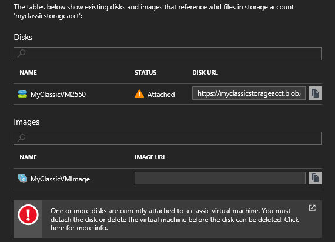

# Troubleshoot deleting Azure storage accounts, containers, or VHDs in a classic deployment
[!INCLUDE [storage-selector-cannot-delete-storage-account-container-vhd](../../includes/storage-selector-cannot-delete-storage-account-container-vhd.md)]

You might receive errors when you try to delete the Azure storage account, container, or VHD in the [Azure portal](https://portal.azure.com/) or the [Azure classic portal](https://manage.windowsazure.com/). The issues can be caused by the following circumstances:

* When you delete a VM, the disk and VHD are not automatically deleted. That might be the reason for failure on storage account deletion. We don't delete the disk so that you can use the disk to mount another VM.
* There is still a lease on a disk or the blob that's associated with the disk.
* There is still a VM image that is using a blob, container, or storage account.

If your Azure issue is not addressed in this article, visit the Azure forums on [MSDN and the Stack Overflow](https://azure.microsoft.com/support/forums/). You can post your issue on these forums or to @AzureSupport on Twitter. Also, you can file an Azure support request by selecting **Get support** on the [Azure support](https://azure.microsoft.com/support/options/) site.

## Symptoms
The following section lists common errors that you might receive when you try to delete the Azure storage accounts, containers, or VHDs.

### Scenario 1: Unable to delete a storage account
When you navigate to the classic storage account in the [Azure portal](https://portal.azure.com/) and select **Delete**, you may be presented with a list of objects that are preventing deletion of the storage account:

  

When you navigate to the storage account in the [Azure classic portal](https://manage.windowsazure.com/) and select **Delete**, you might see one of the following errors:

- *Storage account StorageAccountName contains VM Images. Ensure these VM Images are removed before deleting this storage account.*

- *Failed to delete storage account <vm-storage-account-name>. Unable to delete storage account <vm-storage-account-name>: 'Storage account <vm-storage-account-name> has some active image(s) and/or disk(s). Ensure these image(s) and/or disk(s) are removed before deleting this storage account.'.*

- *Storage account <vm-storage-account-name> has some active image(s) and/or disk(s), e.g. xxxxxxxxx- xxxxxxxxx-O-209490240936090599. Ensure these image(s) and/or disk(s) are removed before deleting this storage account.*

- *Storage account <vm-storage-account-name> has 1 container(s) which have an active image and/or disk artifacts. Ensure those artifacts are removed from the image repository before deleting this storage account*.

- *Submit Failed
Storage account <vm-storage-account-name> has 1 container(s) which have an active image and/or disk artifacts. Ensure those artifacts are removed from the image repository before deleting this storage account.
When you attempt to delete a storage account and there are still active disks associated with it, you will see a message telling you there are active disks that need to be deleted*.

### Scenario 2: Unable to delete a container
When you try to delete the storage container, you might see the following error:

*Failed to delete storage container <container name>. Error: 'There is currently a lease on the container and no lease ID was specified in the request*.

Or

*The following virtual machine disks use blobs in this container, so the container cannot be deleted: VirtualMachineDiskName1, VirtualMachineDiskName2, ...*

### Scenario 3: Unable to delete a VHD
After you delete a VM and then try to delete the blobs for the associated VHDs, you might receive the following message:

*Failed to delete blob 'path/XXXXXX-XXXXXX-os-1447379084699.vhd'. Error: 'There is currently a lease on the blob and no lease ID was specified in the request.*

Or

*Blob 'BlobName.vhd' is in use as virtual machine disk 'VirtualMachineDiskName', so the blob cannot be deleted.*

## Solution
To resolve the most common issues, try the following method:

### Step 1: Delete any disks that are preventing deletion of the storage account, container, or VHD
1. Switch to the [Azure classic portal](https://manage.windowsazure.com/).
2. Select **VIRTUAL MACHINE** > **DISKS**.

    
3. Locate the disks that are associated with the storage account, container, or VHD that you want to delete. When you check the location of the disk, you will find the associated storage account, container, or VHD.

    
4. Delete the disks by using one of the following methods:

  - If  there is no VM listed on the **Attached To** field of the disk, you can delete the disk directly.

  - If the disk is a data disk, follow these steps:

    1. Check the name of the VM that the disk is attached to.
    2. Go to **Virtual Machines** > **Instances**, and then locate the VM.
    3. Make sure that nothing is actively using the disk.
    4. Select **Detach Disk** at the bottom of the portal to detach the disk.
    5. Go to **Virtual Machines** > **Disks**, and wait for the **Attached To** field to turn blank. This indicates the disk has successfully detached from the VM.
    6. Select **Delete** at the bottom of **Virtual Machines** > **Disks** to delete the disk.

  - If the disk is an OS disk (the **Contains OS** field has a value like Windows) and attached to a VM, follow these steps to delete the VM. The OS disk cannot be detached, so we have to delete the VM to release the lease.

    1. Check the name of the Virtual Machine the Data Disk is attached to.  
    2. Go to **Virtual Machines** > **Instances**, and then select the VM that the disk is attached to.
    3. Make sure that nothing is actively using the virtual machine, and that you no longer need the virtual machine.
    4. Select the VM the disk is attached to, then select **Delete** > **Delete the attached disks**.
    5. Go to **Virtual Machines** > **Disks**, and wait for the disk to disappear.  It may take a few minutes for this to occur, and you may need to refresh the page.
    6. If the disk does not disappear, wait for the **Attached To** field to turn blank. This indicates the disk has fully detached from the VM.  Then, select the disk, and select **Delete** at the bottom of the page to delete the disk.

   > [!NOTE]
   > If a disk is attached to a VM, you will not be able to delete it. Disks are detached from a deleted VM asynchronously. It might take a few minutes after the VM is deleted for this field to clear up.
   >
   >

### Step 2: Delete any VM Images that are preventing deletion of the storage account or container
1. Switch to the [Azure classic portal](https://manage.windowsazure.com/).
2. Select **VIRTUAL MACHINE** > **IMAGES**, and then delete the images that are associated with the storage account, container, or VHD.

    After that, try to delete the storage account, container, or VHD again.

> [!WARNING]
> Be sure to back up anything you want to save before you delete the account. Once you delete a VHD, blob, table, queue, or file, it is permanently deleted. Ensure that the resource is not in use.
>
>

## About the Stopped (deallocated) status
VMs that were created in the classic deployment model and that have been retained will have the **Stopped (deallocated)** status on either the [Azure portal](https://portal.azure.com/) or [Azure classic portal](https://manage.windowsazure.com/).

**Azure classic portal**:

**Azure portal**:

A "Stopped (deallocated)" status releases the computer resources, such as the CPU, memory, and network. The disks, however, are still retained so that you can quickly re-create the VM if necessary. These disks are created on top of VHDs, which are backed by Azure storage. The storage account has these VHDs, and the disks have leases on those VHDs.

## Next steps
* [Delete a storage account](storage-create-storage-account.md#delete-a-storage-account)
* [How to break the locked lease of blob storage in Microsoft Azure (PowerShell)](https://gallery.technet.microsoft.com/scriptcenter/How-to-break-the-locked-c2cd6492)
