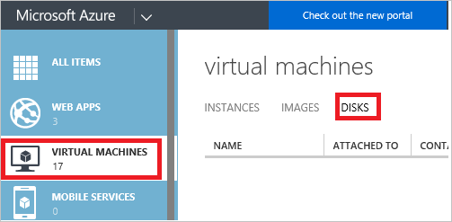
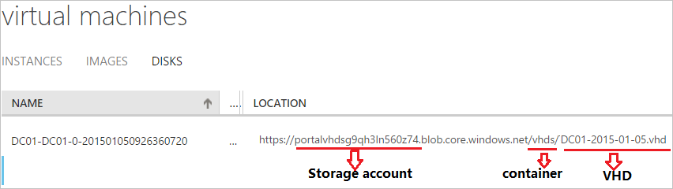
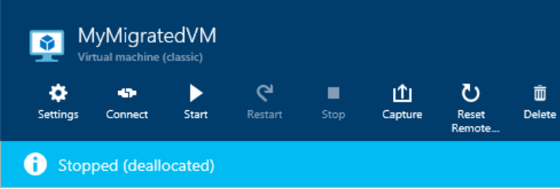
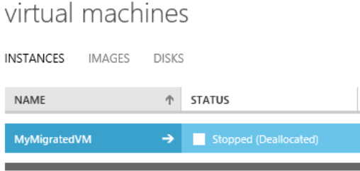

<properties
	pageTitle="Troubleshoot deleting Azure storage accounts, containers, or VHDs| Microsoft Azure"
	description="Troubleshoot deleting Azure storage accounts, containers, or VHDs"
	services="storage"
	documentationCenter=""
	authors="genlin"
	manager="felixwu"
	editor=""
	tags="storage"/>

<tags
	ms.service="storage"
	ms.workload="na"
	ms.tgt_pltfrm="na"
	ms.devlang="na"
	ms.topic="article"
	ms.date="03/20/2016"
	ms.author="genli"/>

# Troubleshoot deleting Azure storage accounts, containers, or VHDs

## Summary
You might receive errors when you try to delete the Azure storage account, container, or VHD in the [Azure portal](https://portal.azure.com/) or the [Azure classic portal](https://manage.windowsazure.com/). The issues can be caused by the following circumstances:

-	When you delete a VM, the disk and VHD are not automatically deleted. That might be the reason for failure on storage account deletion. We don’t delete the disk so that you can use the disk to mount another VM.

-	There is still a lease on a disk or the blob that's associated with the disk.

If your Azure issue is not addressed in this article, visit the Azure forums on [MSDN and the Stack Overflow](https://azure.microsoft.com/support/forums/). You can post your issue on these forums or to @AzureSupport on Twitter. Also, you can file an Azure support request by selecting **Get support** on the [Azure support](https://azure.microsoft.com/support/options/) site.

## Resolution
To resolve the most common issues, try the following method:

1. Switch to the [Azure classic portal](https://manage.windowsazure.com/).
2. Select **VIRTUAL MACHINE** > **DISKS**.

	

3. Locate the disks that are associated with the storage account, container, or VHD that you want to delete. When you check the location of the disk, you will find the associated storage account, container, or VHD.

	

4. Confirm that no VM is listed on the **Attached to** field of the disks, and then delete the disks.

 	> [AZURE.NOTE] If a disk is attached to a VM, you will not be able to delete it. Disks are detached from a deleted VM asynchronously. It might take a few minutes after the VM is deleted for this field to clear up.

5. Select **VIRTUAL MACHINE** > **IMAGES**, and then delete the images that are associated with the storage account, container, or VHD.

	After that, try to delete the storage account, container, or VHD again.

> [AZURE.WARNING] Be sure to back up anything you want to save before you delete the account. It is not possible to restore a deleted storage account or retrieve any of the content that it contained before deletion. This also holds true for any resources in the account: once you delete a VHD, blob, table, queue, or file, it is permanently deleted. Ensure that the resource is not in use.

## Symptom

The following section lists common errors that you might receive when you try to delete the Azure storage accounts, containers, or VHDs.

### Scenario 1: Unable to delete a storage account

When you navigate to the storage account in the [Azure portal](https://portal.azure.com/) or [Azure classic portal](https://manage.windowsazure.com/) and select **Delete**, you might see the following error message:

**On the Azure portal**:

*Failed to delete storage account <vm-storage-account-name>. Unable to delete storage account <vm-storage-account-name>: 'Storage account <vm-storage-account-name> has some active image(s) and/or disk(s). Ensure these image(s) and/or disk(s) are removed before deleting this storage account.'.*

**On the Azure classic portal**:

*Storage account <vm-storage-account-name> has some active image(s) and/or disk(s), e.g. xxxxxxxxx- xxxxxxxxx-O-209490240936090599. Ensure these image(s) and/or disk(s) are removed before deleting this storage account.*

You might also see this error:

**On the Azure portal**:

*Storage account <vm-storage-account-name> has 1 container(s) which have an active image and/or disk artifacts. Ensure those artifacts are removed from the image repository before deleting this storage account*.

**On the Azure classic portal**:

*Submit Failed
Storage account <vm-storage-account-name> has 1 container(s) which have an active image and/or disk artifacts. Ensure those artifacts are removed from the image repository before deleting this storage account.
When you attempt to delete a storage account and there are still active disks associated with it, you will see a message telling you there are active disks that need to be deleted*.

### Scenario 2: Unable to delete a container

When you try to delete the storage container, you might see the following error:

*Failed to delete storage container <container name>. Error: 'There is currently a lease on the container and no lease ID was specified in the request*.

### Scenario 3: Unable to delete a VHD

After you delete a VM and then try to delete the blobs for the associated VHDs, you might receive the following message:

*Failed to delete blob 'path/XXXXXX-XXXXXX-os-1447379084699.vhd'. Error: 'There is currently a lease on the blob and no lease ID was specified in the request.*

## More information

VMs that were created in the classic deployment model and that have been retained will have the **Stopped (deallocated)** status on either the [Azure portal](https://portal.azure.com/) or [Azure classic portal](https://manage.windowsazure.com/).

**Azure classic portal**:

**Azure portal**:

A “Stopped (deallocated)” status releases the computer resources, such as the CPU, memory, and network. The disks, however, are still retained so that the user can quickly re-create the VM if required. These disks are created on top of VHDs, which are backed by Azure storage. The storage account has these VHDs, and the disks have leases on those VHDs.

## References

- [Delete a storage account](storage-create-storage-account.md#delete-a-storage-account)
- [How to break the locked lease of blob storage in Microsoft Azure (PowerShell)](https://gallery.technet.microsoft.com/scriptcenter/How-to-break-the-locked-c2cd6492)
