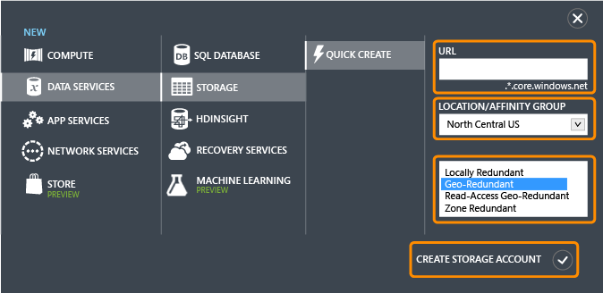
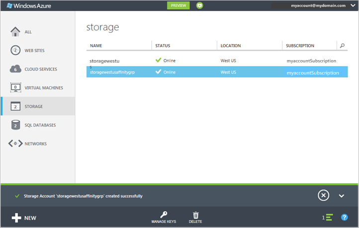

<properties
	pageTitle="How to create, manage, or delete a storage account in the Azure Classic Portal | Microsoft Azure"
	description="Create a new storage account, manage your account access keys, or delete a storage account in the Azure Portal. Learn about standard and premium storage accounts."
	services="storage"
	documentationCenter=""
	authors="robinsh"
	manager="carmonm"
	editor="tysonn"/>

<tags
	ms.service="storage"
	ms.workload="storage"
	ms.tgt_pltfrm="na"
	ms.devlang="na"
	ms.topic="get-started-article"
	ms.date="07/26/2016"
	ms.author="robinsh"/>

# About Azure storage accounts

[AZURE.INCLUDE [storage-selector-portal-create-storage-account](../../includes/storage-selector-portal-create-storage-account.md)]
 
[AZURE.INCLUDE [storage-try-azure-tools](../../includes/storage-try-azure-tools.md)]

## Overview

An Azure storage account gives you access to the Azure Blob, Queue, Table, and File services in Azure Storage. Your storage account provides the unique namespace for your Azure Storage data objects. By default, the data in your account is available only to you, the account owner.

There are two types of storage accounts:

- A standard storage account includes Blob, Table, Queue, and File storage.
- A premium storage account currently supports Azure virtual machine disks only. See [Premium Storage: High-performance Storage for Azure Virtual Machine Workloads](storage-premium-storage.md) for an in-depth overview of Premium Storage.

## Storage account billing

You are billed for Azure Storage usage based on your storage account. Storage costs are based on four factors: storage capacity, replication scheme, storage transactions, and data egress.

- Storage capacity refers to how much of your storage account allotment you are using to store data. The cost of simply storing your data is determined by how much data you are storing, and how it is replicated.
- Replication determines how many copies of your data are maintained at once, and in what locations.
- Transactions refer to all read and write operations to Azure Storage.
- Data egress refers to data transferred out of an Azure region. When the data in your storage account is accessed by an application that is not running in the same region, whether that application is a cloud service or some other type of application, then you are charged for data egress. (For Azure services, you can take steps to group your data and services in the same data centers to reduce or eliminate data egress charges.)  

The [Azure Storage Pricing](https://azure.microsoft.com/pricing/details/storage) page provides detailed pricing information for storage capacity, replication, and transactions. The [Data Transfers Pricing Details](https://azure.microsoft.com/pricing/details/data-transfers/) page provides detailed pricing information for data egress.

For details about storage account capacity and performance targets, see [Azure Storage Scalability and Performance Targets](storage-scalability-targets.md).

> [AZURE.NOTE] When you create an Azure virtual machine, a storage account is created for you automatically in the deployment location if you do not already have a storage account in that location. So it's not necessary to follow the steps below to create a storage account for your virtual machine disks. The storage account name will be based on the virtual machine name. See the [Azure Virtual Machines documentation](https://azure.microsoft.com/documentation/services/virtual-machines/) for more details.

## Create a storage account

1. Sign in to the [Azure Classic Portal](https://manage.windowsazure.com).

2. Click **New** in the taskbar at the bottom of the page. Choose **Data Services** | **Storage**, and then click **Quick Create**.

	

3. In **URL**, enter a name for your storage account.

	> [AZURE.NOTE] Storage account names must be between 3 and 24 characters in length and may contain numbers and lowercase letters only.
	>  
	> Your storage account name must be unique within Azure. The Azure Classic Portal will indicate if the storage account name you select is already taken.

	See [Storage account endpoints](#storage-account-endpoints) below for details about how the storage account name will be used to address your objects in Azure Storage.

4. In **Location/Affinity Group**, select a location for your storage account that is close to you or to your customers. If data in your storage account will be accessed from another Azure service, such as an Azure virtual machine or cloud service, you may want to select an affinity group from the list to group your storage account in the same data center with other Azure services that you are using to improve performance and lower costs.

	Note that you must select an affinity group when your storage account is created. You cannot move an existing account to an affinity group. For more information on affinity groups, see [Service co-location with an affinity group](#service-co-location-with-an-affinity-group) below.

	>[AZURE.IMPORTANT] To determine which locations are available for your subscription, you can call the [List all resource providers](https://msdn.microsoft.com/library/azure/dn790524.aspx) operation. To list providers from PowerShell, call [Get-AzureLocation](https://msdn.microsoft.com/library/azure/dn757693.aspx). From .NET, use the [List](https://msdn.microsoft.com/library/azure/microsoft.azure.management.resources.provideroperationsextensions.list.aspx) method of the ProviderOperationsExtensions class.
	>
	>Additionally, see [Azure Regions](https://azure.microsoft.com/regions/#services) for more information about what services are available in which region.

5. If you have more than one Azure subscription, then the **Subscription** field is displayed. In **Subscription**, enter the Azure subscription that you want to use the storage account with.

6. In **Replication**, select the desired level of replication for your storage account. The recommended replication option is geo-redundant replication, which provides maximum durability for your data. For more details on Azure Storage replication options, see [Azure Storage replication](storage-redundancy.md).

6. Click **Create Storage Account**.

	It may take a few minutes to create your storage account. To check the status, you can monitor the notifications at the bottom of the Azure Classic Portal. After the storage account has been created, your new storage account has **Online** status and is ready for use.

### Storage account endpoints

Every object that you store in Azure Storage has a unique URL address. The storage account name forms the subdomain of that address. The combination of subdomain and domain name, which is specific to each service, forms an *endpoint* for your storage account.

For example, if your storage account is named *mystorageaccount*, then the default endpoints for your storage account are:

- Blob service: http://*mystorageaccount*.blob.core.windows.net

- Table service: http://*mystorageaccount*.table.core.windows.net

- Queue service: http://*mystorageaccount*.queue.core.windows.net

- File service: http://*mystorageaccount*.file.core.windows.net

You can see the endpoints for your storage account on the storage dashboard in the [Azure Classic Portal](https://manage.windowsazure.com) once the account has been created.

The URL for accessing an object in a storage account is built by appending the object's location in the storage account to the endpoint. For example, a blob address might have this format: http://*mystorageaccount*.blob.core.windows.net/*mycontainer*/*myblob*.

You can also configure a custom domain name to use with your storage account. See [Configure a custom domain name for your blob storage endpoint](storage-custom-domain-name.md) for details.

### Service co-location with an affinity group

An *affinity group* is a geographic grouping of your Azure services and VMs with your Azure storage account. An affinity group can improve service performance by locating computer workloads in the same data center or near the target user audience. Also, no billing charges are incurred for egress when data in a storage account is accessed from another service that is part of the same affinity group.

> [AZURE.NOTE]  To create an affinity group, open the <b>Settings</b> area of the [Azure Classic Portal](https://manage.windowsazure.com), click <b>Affinity Groups</b>, and then click either <b>Add an affinity group</b> or the <b>Add</b> button. You can also create and manage affinity groups by using the Azure Service Management API. See <a href="http://msdn.microsoft.com/library/azure/ee460798.aspx">Operations on affinity groups</a> for more information.

## View, copy, and regenerate storage access keys

When you create a storage account, Azure generates two 512-bit storage access keys, which are used for authentication when the storage account is accessed. By providing two storage access keys, Azure enables you to regenerate the keys with no interruption to your storage service or access to that service.

> [AZURE.NOTE] We recommend that you avoid sharing your storage access keys with anyone else. To permit access to storage resources without giving out your access keys, you can use a *shared access signature*. A shared access signature provides access to a resource in your account for an interval that you define and with the permissions that you specify. See [Shared Access Signatures: Understanding the SAS model](storage-dotnet-shared-access-signature-part-1.md) for more information.

In the [Azure Classic Portal](https://manage.windowsazure.com), use **Manage Keys** on the dashboard or the **Storage** page to view, copy, and regenerate the storage access keys that are used to access the Blob, Table, and Queue services.

### Copy a storage access key  

You can use **Manage Keys** to copy a storage access key to use in a connection string. The connection string requires the storage account name and a key to use in authentication. For information about configuring connection strings to access Azure storage services, see [Configure Azure Storage Connection Strings](storage-configure-connection-string.md).

1. In the [Azure Classic Portal](https://manage.windowsazure.com), click **Storage**, and then click the name of the storage account to open the dashboard.

2. Click **Manage Keys**.

 	**Manage Access Keys** opens.

	

3. To copy a storage access key, select the key text. Then right-click, and click **Copy**.

### Regenerate storage access keys
We recommend that you change the access keys to your storage account periodically to help keep your storage connections secure. Two access keys are assigned so that you can maintain connections to the storage account by using one access key while you regenerate the other access key.

> [AZURE.WARNING] Regenerating your access keys can affect services in Azure as well as your own applications that are dependent on the storage account. All clients that use the access key to access the storage account must be updated to use the new key.

**Media services** - If you have media services that are dependent on your storage account, you must re-sync the access keys with your media service after you regenerate the keys.

**Applications** - If you have web applications or cloud services that use the storage account, you will lose the connections if you regenerate keys, unless you roll your keys. 

**Storage Explorers** - If you are using any [storage explorer applications](storage-explorers.md), you will probably need to update the storage key used by those applications.

Here is the process for rotating your storage access keys:

1. Update the connection strings in your application code to reference the secondary access key of the storage account.

2. Regenerate the primary access key for your storage account. In the [Azure Classic Portal](https://manage.windowsazure.com), from the dashboard or the **Configure** page, click **Manage Keys**. Click **Regenerate** under the primary access key, and then click **Yes** to confirm that you want to generate a new key.

3. Update the connection strings in your code to reference the new primary access key.

4. Regenerate the secondary access key.

## Delete a storage account

To remove a storage account that you are no longer using, use **Delete** on the dashboard or the **Configure** page. **Delete** deletes the entire storage account, including all of the blobs, tables, and queues in the account.

> [AZURE.WARNING] It's not possible to restore a deleted storage account or retrieve any of the content that it contained before deletion. Be sure to back up anything you want to save before you delete the account. This also holds true for any resources in the account—once you delete a blob, table, queue, or file, it is permanently deleted.
>
> If your storage account contains VHD files for an Azure virtual machine, then you must delete any images and disks that are using those VHD files before you can delete the storage account. First, stop the virtual machine if it is running, and then delete it. To delete disks, navigate to the **Disks** tab and delete any disks there. To delete images, navigate to the **Images** tab and delete any images that are stored in the account.

1. In the [Azure Classic Portal](https://manage.windowsazure.com), click **Storage**.

2. Click anywhere in the storage account entry except the name, and then click **Delete**.

	 -Or-

	Click the name of the storage account to open the dashboard, and then click **Delete**.

3. Click **Yes** to confirm that you want to delete the storage account.

## Next steps

- To learn more about Azure Storage, see the [Azure Storage documentation](https://azure.microsoft.com/documentation/services/storage/).
- Visit the [Azure Storage Team Blog](http://blogs.msdn.com/b/windowsazurestorage/).
- [Transfer data with the AzCopy Command-Line Utility](storage-use-azcopy.md)
