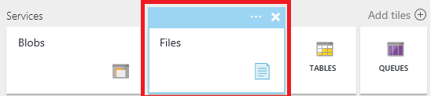
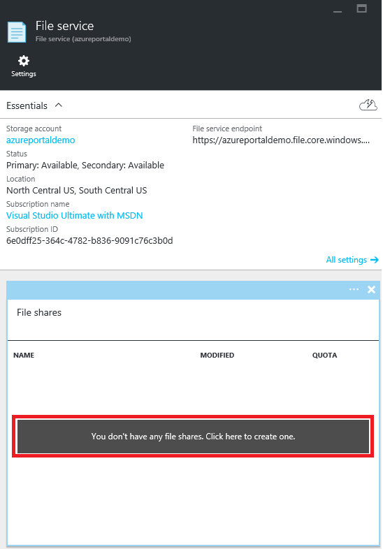
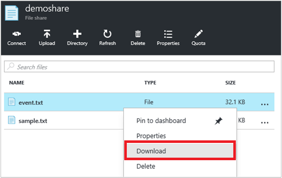
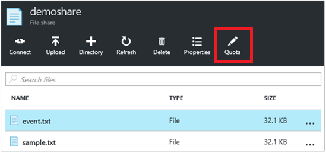
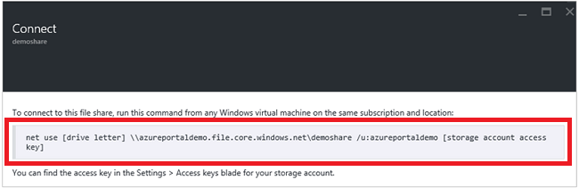
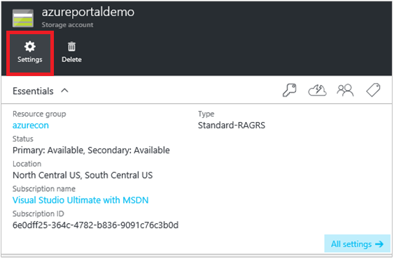
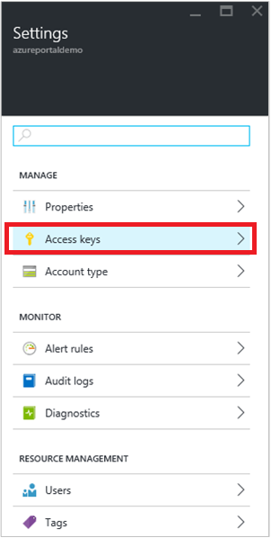

---
title: Get started with Azure File storage on Windows | Microsoft Docs
description: Store file data in the cloud with Azure File storage, and mount your cloud file share from an Azure virtual machine (VM) or from an on-premises application running Windows.
services: storage
documentationcenter: .net
author: RenaShahMSFT
manager: aungoo
editor: tysonn

ms.assetid: 6a889ee1-1e60-46ec-a592-ae854f9fb8b6
ms.service: storage
ms.workload: storage
ms.tgt_pltfrm: na
ms.devlang: dotnet
ms.topic: hero-article
ms.date: 03/27/2017
ms.author: renash

---
# Get started with Azure File storage on Windows
[!INCLUDE [storage-selector-file-include](../../includes/storage-selector-file-include.md)]

[!INCLUDE [storage-check-out-samples-dotnet](../../includes/storage-check-out-samples-dotnet.md)]

[!INCLUDE [storage-file-overview-include](../../includes/storage-file-overview-include.md)]

For information on using File storage with Linux, see [How to use Azure File Storage with Linux](storage-how-to-use-files-linux.md).

For information on scalability and performance targets of File storage, see [Azure Storage Scalability and Performance Targets](storage-scalability-targets.md#scalability-targets-for-blobs-queues-tables-and-files).

[!INCLUDE [storage-dotnet-client-library-version-include](../../includes/storage-dotnet-client-library-version-include.md)]

[!INCLUDE [storage-file-concepts-include](../../includes/storage-file-concepts-include.md)]

## Video: Using Azure File storage with Windows
Here's a video that demonstrates how to create and use Azure File shares on Windows.

> [!VIDEO https://channel9.msdn.com/Blogs/Azure/Azure-File-Storage-with-Windows/player]
> 
> 

## About this tutorial
This getting started tutorial demonstrates the basics of using Microsoft Azure File storage. In this tutorial, we will:

* Use Azure portal or PowerShell to create a new Azure File share, add a directory, upload a local file to the share, and list the files in the directory.
* Mount the file share, just as you would mount any SMB share.
* Use the Azure Storage Client Library for .NET to access the file share from an on-premises application. Create a console application and perform these actions with the file share:
  * Write the contents of a file in the share to the console window.
  * Set the quota (maximum size) for the file share.
  * Create a shared access signature for a file that uses a shared access policy defined on the share.
  * Copy a file to another file in the same storage account.
  * Copy a file to a blob in the same storage account.
* Use Azure Storage Metrics for troubleshooting

File storage is now supported for all storage accounts, so you can either use an existing storage account, or you can create a new storage account. See [How to create a storage account](storage-create-storage-account.md#create-a-storage-account) for information on creating a new storage account.

## Use the Azure portal to manage a file share
The [Azure portal](https://portal.azure.com) provides a user interface for customers to manage file shares. From the portal, you can:

* Create your file share
* Upload and download files to and from your file share
* Monitor the actual usage of each file share
* Adjust the share size quota
* Get the `net use` command to use to mount the file share from a Windows client

### Create file share
1. Sign in to the Azure portal.
2. On the navigation menu, click **Storage accounts** or **Storage accounts (classic)**.
   
    
3. Choose your storage account.
   
    
4. Choose "Files" service.
   
    
5. Click "File shares" and follow the link to create your first file share.
   
    
6. Fill in the file share name and the size of the file share (up to 5120 GB) to create your first file share. Once the file share has been created, you can mount it from any file system that supports SMB 2.1 or SMB 3.0.
   
    

### Upload and download files
1. Choose one file share your already created.
   
    
2. Click **Upload** to open the user interface for files uploading.
   
    
3. Right click on one file and choose **Download** to download it into local.
   
    

### Manage file share
1. Click **Quota** to change the size of the file share (up to 5120 GB).
   
    
2. Click **Connect** to get the command line for mounting the file share from Windows.
   
    
   
    
   
   > [!TIP]
   > To find the storage account access key for mounting, click **Settings** of your storage account, and then click **Access keys**.
   > 
   > 
   
    
   
    

## Use PowerShell to manage a file share
Alternatively, you can use Azure PowerShell to create and manage file shares.

### Install the PowerShell cmdlets for Azure Storage
To prepare to use PowerShell, download and install the Azure PowerShell cmdlets. See [How to install and configure Azure PowerShell](/powershell/azure/overview) for the install point and installation instructions.

> [!NOTE]
> It's recommended that you download and install or upgrade to the latest Azure PowerShell module.
> 
> 

Open an Azure PowerShell window by clicking **Start** and typing **Windows PowerShell**. The PowerShell window loads the Azure Powershell module for you.

### Create a context for your storage account and key
Now, create the storage account context. The context encapsulates the storage account name and account key. For instructions on copying your account key from the [Azure portal](https://portal.azure.com), see [View and copy storage access keys](storage-create-storage-account.md#view-and-copy-storage-access-keys).

Replace `storage-account-name` and `storage-account-key` with your storage account name and key in the following example.

```powershell
# create a context for account and key
$ctx=New-AzureStorageContext storage-account-name storage-account-key
```

### Create a new file share
Next, create the new share, named `logs`.

```powershell
# create a new share
$s = New-AzureStorageShare logs -Context $ctx
```

You now have a file share in File storage. Next we'll add a directory and a file.

> [!IMPORTANT]
> The name of your file share must be all lowercase. For complete details about naming file shares and files, see [Naming and Referencing Shares, Directories, Files, and Metadata](https://msdn.microsoft.com/library/azure/dn167011.aspx).
> 
> 

### Create a directory in the file share
Next, create a directory in the share. In the following example, the directory is named `CustomLogs`.

```powershell
# create a directory in the share
New-AzureStorageDirectory -Share $s -Path CustomLogs
```

### Upload a local file to the directory
Now upload a local file to the directory. The following example uploads a file from `C:\temp\Log1.txt`. Edit the file path so that it points to a valid file on your local machine.

```powershell
# upload a local file to the new directory
Set-AzureStorageFileContent -Share $s -Source C:\temp\Log1.txt -Path CustomLogs
```

### List the files in the directory
To see the file in the directory, you can list all of the directory's files. This command returns the files and subdirectories (if there are any) in the CustomLogs directory.

```powershell
# list files in the new directory
Get-AzureStorageFile -Share $s -Path CustomLogs | Get-AzureStorageFile
```

Get-AzureStorageFile returns a list of files and directories for whatever directory object is passed in. "Get-AzureStorageFile -Share $s" returns a list of files and directories in the root directory. To get a list of files in a subdirectory, you have to pass the subdirectory to Get-AzureStorageFile. That's what this does -- the first part of the command up to the pipe returns a directory instance of the subdirectory CustomLogs. Then that is passed into Get-AzureStorageFile, which returns the files and directories in CustomLogs.

### Copy files
Beginning with version 0.9.7 of Azure PowerShell, you can copy a file to another file, a file to a blob, or a blob to a file. Below we demonstrate how to perform these copy operations using PowerShell cmdlets.

```powershell
# copy a file to the new directory
Start-AzureStorageFileCopy -SrcShareName srcshare -SrcFilePath srcdir/hello.txt -DestShareName destshare -DestFilePath destdir/hellocopy.txt -Context $srcCtx -DestContext $destCtx

# copy a blob to a file directory
Start-AzureStorageFileCopy -SrcContainerName srcctn -SrcBlobName hello2.txt -DestShareName hello -DestFilePath hellodir/hello2copy.txt -DestContext $ctx -Context $ctx
```

## Mount the file share
With support for SMB 3.0, File storage now supports encryption and persistent handles from SMB 3.0 clients. Support for encryption means that SMB 3.0 clients can mount a file share from anywhere, including from:

* An Azure virtual machine in the same region (also supported by SMB 2.1)
* An Azure virtual machine in a different region (SMB 3.0 only)
* An on-premises client application (SMB 3.0 only)

When a client accesses File storage, the SMB version used depends on the SMB version supported by the operating system. The table below provides a summary of support for Windows clients. Please refer to this blog for more details on [SMB versions](http://blogs.technet.com/b/josebda/archive/2013/10/02/windows-server-2012-r2-which-version-of-the-smb-protocol-smb-1-0-smb-2-0-smb-2-1-smb-3-0-or-smb-3-02-you-are-using.aspx).

| Windows Client | SMB Version Supported |
|:--- |:--- |
| Windows 7 |SMB 2.1 |
| Windows Server 2008 R2 |SMB 2.1 |
| Windows 8 |SMB 3.0 |
| Windows Server 2012 |SMB 3.0 |
| Windows Server 2012 R2 |SMB 3.0 |
| Windows 10 |SMB 3.0 |

### Mount the file share from an Azure virtual machine running Windows
To demonstrate how to mount an Azure file share, we'll now create an Azure virtual machine running Windows, and remote into it to mount the share.

1. First, create a new Azure virtual machine by following the instructions in [Create a Windows virtual machine in the Azure portal](../virtual-machines/virtual-machines-windows-hero-tutorial.md?toc=%2fazure%2fvirtual-machines%2fwindows%2ftoc.json).
2. Next, remote into the virtual machine by following the instructions in [Log on to a Windows virtual machine using the Azure portal](../virtual-machines/virtual-machines-windows-connect-logon.md?toc=%2fazure%2fvirtual-machines%2fwindows%2ftoc.json).
3. Open a PowerShell window on the virtual machine.

### Persist your storage account credentials for the virtual machine
Before mounting to the file share, first persist your storage account credentials on the virtual machine. This step allows Windows to automatically reconnect to the file share when the virtual machine reboots. To persist your account credentials, run the `cmdkey` command from the PowerShell window on the virtual machine. Replace `<storage-account-name>` with the name of your storage account, and `<storage-account-key>` with your storage account key. You have to explicitly specify domain "AZURE" as in sample below. 

```
cmdkey /add:<storage-account-name>.file.core.windows.net /user:AZURE\<storage-account-name> /pass:<storage-account-key>
```

Windows will now reconnect to your file share when the virtual machine reboots. You can verify that the share has been reconnected by running the `net use` command from a PowerShell window.

Note that credentials are persisted only in the context in which `cmdkey` runs. If you are developing an application that runs as a service, you will need to persist your credentials in that context as well.

### Mount the file share using the persisted credentials
Once you have a remote connection to the virtual machine, you can run the `net use` command to mount the file share, using the following syntax. Replace `<storage-account-name>` with the name of your storage account, and `<share-name>` with the name of your File storage share.

```
net use <drive-letter>: \\<storage-account-name>.file.core.windows.net\<share-name>

example :
net use z: \\samples.file.core.windows.net\logs
```

Since you persisted your storage account credentials in the previous step, you do not need to provide them with the `net use` command. If you have not already persisted your credentials, then include them as a parameter passed to the `net use` command, as shown in the following example.

```
net use <drive-letter>: \\<storage-account-name>.file.core.windows.net\<share-name> /u:AZURE\<storage-account-name> <storage-account-key>

example :
net use z: \\samples.file.core.windows.net\logs /u:AZURE\samples <storage-account-key>
```

You can now work with the File Storage share from the virtual machine as you
would with any other drive. You can issue standard file commands from the command prompt, or view the mounted share and its contents from File Explorer. You can also run code within the virtual machine that accesses the file share using standard Windows file I/O APIs, such as those provided by the [System.IO namespaces](http://msdn.microsoft.com/library/gg145019.aspx) in the .NET Framework.

You can also mount the file share from a role running in an Azure cloud service by remoting into the role.

### Mount the file share from an on-premises client running Windows
To mount the file share from an on-premises client, you must first take these steps:

* Install a version of Windows which supports SMB 3.0. Windows will leverage SMB 3.0 encryption to securely transfer data between your on-premises client and the Azure file share in the cloud.
* Open Internet access for port 445 (TCP Outbound) in your local network, as is required by the SMB protocol.

> [!NOTE]
> Some Internet service providers may block port 445, so you may need to check with your service provider.
> 
> 

### Unmount the file share
To unmount the file share, you can use `net use` command with `/delete` option.

```
net use <drive-letter> /delete

example :
net use z: /delete
```

## Develop with File storage
To write code that calls File storage, you can use the storage client libraries for .NET and Java, or the Azure Storage REST API. The example in this section demonstrates how to work with a file share by using the [Azure Storage Client Library for .NET](https://msdn.microsoft.com/library/mt347887.aspx) from a simple console application running on the desktop.

### Create the console application and obtain the assembly
In Visual Studio, create a new Windows console application. The following steps show you how to create a console application in Visual Studio 2017, however, the steps are similar in other versions of Visual Studio.

1. Select **File** > **New** > **Project**
2. Select **Installed** > **Templates** > **Visual C#** > **Windows Classic Desktop**
3. Select **Console App (.NET Framework)**
4. Enter a name for your application in the **Name:** field
5. Select **OK**

All code examples in this tutorial can be added to the `Main()` method of your console application's `Program.cs` file.

You can use the Azure Storage Client Library in any type of .NET application, including an Azure cloud service or web app, and desktop and mobile applications. In this guide, we use a console application for simplicity.

### Use NuGet to install the required packages
There are two packages you need to reference in your project to complete this tutorial:

* [Microsoft Azure Storage Client Library for .NET](https://www.nuget.org/packages/WindowsAzure.Storage/): This package provides programmatic access to data resources in your storage account.
* [Microsoft Azure Configuration Manager library for .NET](https://www.nuget.org/packages/Microsoft.WindowsAzure.ConfigurationManager/): This package provides a class for parsing a connection string in a configuration file, regardless of where your application is running.

You can use NuGet to obtain both packages. Follow these steps:

1. Right-click your project in **Solution Explorer** and choose **Manage NuGet Packages**.
2. Search online for "WindowsAzure.Storage" and click **Install** to install the Storage Client Library and its dependencies.
3. Search online for "WindowsAzure.ConfigurationManager" and click **Install** to install the Azure Configuration Manager.

### Save your storage account credentials to the app.config file
Next, save your credentials in your project's app.config file. Edit the app.config file so that it appears similar to the following example, replacing `myaccount` with your storage account name, and `mykey` with your storage account key.

```xml
<?xml version="1.0" encoding="utf-8" ?>
<configuration>
    <startup>
        <supportedRuntime version="v4.0" sku=".NETFramework,Version=v4.5" />
    </startup>
    <appSettings>
        <add key="StorageConnectionString" value="DefaultEndpointsProtocol=https;AccountName=myaccount;AccountKey=StorageAccountKeyEndingIn==" />
    </appSettings>
</configuration>
```

> [!NOTE]
> The latest version of the Azure storage emulator does not support File storage. Your connection string must target an Azure storage account in the cloud to work with File storage.
> 
> 

### Add using directives
Open the `Program.cs` file from Solution Explorer, and add the following using directives to the top of the file.

```csharp
using Microsoft.Azure; // Namespace for Azure Configuration Manager
using Microsoft.WindowsAzure.Storage; // Namespace for Storage Client Library
using Microsoft.WindowsAzure.Storage.Blob; // Namespace for Blob storage
using Microsoft.WindowsAzure.Storage.File; // Namespace for File storage
```

[!INCLUDE [storage-cloud-configuration-manager-include](../../includes/storage-cloud-configuration-manager-include.md)]

### Access the file share programmatically
Next, add the following code to the `Main()` method (after the code shown above) to retrieve the connection string. This code gets a reference to the file we created earlier and outputs its contents to the console window.

```csharp
// Create a CloudFileClient object for credentialed access to File storage.
CloudFileClient fileClient = storageAccount.CreateCloudFileClient();

// Get a reference to the file share we created previously.
CloudFileShare share = fileClient.GetShareReference("logs");

// Ensure that the share exists.
if (share.Exists())
{
    // Get a reference to the root directory for the share.
    CloudFileDirectory rootDir = share.GetRootDirectoryReference();

    // Get a reference to the directory we created previously.
    CloudFileDirectory sampleDir = rootDir.GetDirectoryReference("CustomLogs");

    // Ensure that the directory exists.
    if (sampleDir.Exists())
    {
        // Get a reference to the file we created previously.
        CloudFile file = sampleDir.GetFileReference("Log1.txt");

        // Ensure that the file exists.
        if (file.Exists())
        {
            // Write the contents of the file to the console window.
            Console.WriteLine(file.DownloadTextAsync().Result);
        }
    }
}
```

Run the console application to see the output.

### Set the maximum size for a file share
Beginning with version 5.x of the Azure Storage Client Library, you can set set the quota (or maximum size) for a file share, in gigabytes. You can also check to see how much data is currently stored on the share.

By setting the quota for a share, you can limit the total size of the files stored on the share. If the total size of files on the share exceeds the quota set on the share, then clients will be unable to increase the size of existing files or create new files, unless those files are empty.

The example below shows how to check the current usage for a share and how to set the quota for the share.

```csharp
// Parse the connection string for the storage account.
CloudStorageAccount storageAccount = CloudStorageAccount.Parse(
    Microsoft.Azure.CloudConfigurationManager.GetSetting("StorageConnectionString"));

// Create a CloudFileClient object for credentialed access to File storage.
CloudFileClient fileClient = storageAccount.CreateCloudFileClient();

// Get a reference to the file share we created previously.
CloudFileShare share = fileClient.GetShareReference("logs");

// Ensure that the share exists.
if (share.Exists())
{
    // Check current usage stats for the share.
    // Note that the ShareStats object is part of the protocol layer for the File service.
    Microsoft.WindowsAzure.Storage.File.Protocol.ShareStats stats = share.GetStats();
    Console.WriteLine("Current share usage: {0} GB", stats.Usage.ToString());

    // Specify the maximum size of the share, in GB.
    // This line sets the quota to be 10 GB greater than the current usage of the share.
    share.Properties.Quota = 10 + stats.Usage;
    share.SetProperties();

    // Now check the quota for the share. Call FetchAttributes() to populate the share's properties.
    share.FetchAttributes();
    Console.WriteLine("Current share quota: {0} GB", share.Properties.Quota);
}
```

### Generate a shared access signature for a file or file share
Beginning with version 5.x of the Azure Storage Client Library, you can generate a shared access signature (SAS) for a file share or for an individual file. You can also create a shared access policy on a file share to manage shared access signatures. Creating a shared access policy is recommended, as it provides a means of revoking the SAS if it should be compromised.

The following example creates a shared access policy on a share, and then uses that policy to provide the constraints for a SAS on a file in the share.

```csharp
// Parse the connection string for the storage account.
CloudStorageAccount storageAccount = CloudStorageAccount.Parse(
    Microsoft.Azure.CloudConfigurationManager.GetSetting("StorageConnectionString"));

// Create a CloudFileClient object for credentialed access to File storage.
CloudFileClient fileClient = storageAccount.CreateCloudFileClient();

// Get a reference to the file share we created previously.
CloudFileShare share = fileClient.GetShareReference("logs");

// Ensure that the share exists.
if (share.Exists())
{
    string policyName = "sampleSharePolicy" + DateTime.UtcNow.Ticks;

    // Create a new shared access policy and define its constraints.
    SharedAccessFilePolicy sharedPolicy = new SharedAccessFilePolicy()
        {
            SharedAccessExpiryTime = DateTime.UtcNow.AddHours(24),
            Permissions = SharedAccessFilePermissions.Read | SharedAccessFilePermissions.Write
        };

    // Get existing permissions for the share.
    FileSharePermissions permissions = share.GetPermissions();

    // Add the shared access policy to the share's policies. Note that each policy must have a unique name.
    permissions.SharedAccessPolicies.Add(policyName, sharedPolicy);
    share.SetPermissions(permissions);

    // Generate a SAS for a file in the share and associate this access policy with it.
    CloudFileDirectory rootDir = share.GetRootDirectoryReference();
    CloudFileDirectory sampleDir = rootDir.GetDirectoryReference("CustomLogs");
    CloudFile file = sampleDir.GetFileReference("Log1.txt");
    string sasToken = file.GetSharedAccessSignature(null, policyName);
    Uri fileSasUri = new Uri(file.StorageUri.PrimaryUri.ToString() + sasToken);

    // Create a new CloudFile object from the SAS, and write some text to the file.
    CloudFile fileSas = new CloudFile(fileSasUri);
    fileSas.UploadText("This write operation is authenticated via SAS.");
    Console.WriteLine(fileSas.DownloadText());
}
```

For more information about creating and using shared access signatures, see [Using Shared Access Signatures (SAS)](storage-dotnet-shared-access-signature-part-1.md) and [Create and use a SAS with Blob storage](storage-dotnet-shared-access-signature-part-2.md).

### Copy files
Beginning with version 5.x of the Azure Storage Client Library, you can copy a file to another file, a file to a blob, or a blob to a file. In the next sections, we demonstrate how to perform these copy operations programmatically.

You can also use AzCopy to copy one file to another or to copy a blob to a file or vice versa. See [Transfer data with the AzCopy Command-Line Utility](storage-use-azcopy.md).

> [!NOTE]
> If you are copying a blob to a file, or a file to a blob, you must use a shared access signature (SAS) to authenticate the source object, even if you are copying within the same storage account.
> 
> 

**Copy a file to another file**

The following example copies a file to another file in the same share. Because this copy operation copies between files in the same storage account, you can use Shared Key authentication to perform the copy.

```csharp
// Parse the connection string for the storage account.
CloudStorageAccount storageAccount = CloudStorageAccount.Parse(
    Microsoft.Azure.CloudConfigurationManager.GetSetting("StorageConnectionString"));

// Create a CloudFileClient object for credentialed access to File storage.
CloudFileClient fileClient = storageAccount.CreateCloudFileClient();

// Get a reference to the file share we created previously.
CloudFileShare share = fileClient.GetShareReference("logs");

// Ensure that the share exists.
if (share.Exists())
{
    // Get a reference to the root directory for the share.
    CloudFileDirectory rootDir = share.GetRootDirectoryReference();

    // Get a reference to the directory we created previously.
    CloudFileDirectory sampleDir = rootDir.GetDirectoryReference("CustomLogs");

    // Ensure that the directory exists.
    if (sampleDir.Exists())
    {
        // Get a reference to the file we created previously.
        CloudFile sourceFile = sampleDir.GetFileReference("Log1.txt");

        // Ensure that the source file exists.
        if (sourceFile.Exists())
        {
            // Get a reference to the destination file.
            CloudFile destFile = sampleDir.GetFileReference("Log1Copy.txt");

            // Start the copy operation.
            destFile.StartCopy(sourceFile);

            // Write the contents of the destination file to the console window.
            Console.WriteLine(destFile.DownloadText());
        }
    }
}
```

**Copy a file to a blob**

The following example creates a file and copies it to a blob within the same storage account. The example creates a SAS for the source file, which the service uses to authenticate access to the source file during the copy operation.

```csharp
// Parse the connection string for the storage account.
CloudStorageAccount storageAccount = CloudStorageAccount.Parse(
    Microsoft.Azure.CloudConfigurationManager.GetSetting("StorageConnectionString"));

// Create a CloudFileClient object for credentialed access to File storage.
CloudFileClient fileClient = storageAccount.CreateCloudFileClient();

// Create a new file share, if it does not already exist.
CloudFileShare share = fileClient.GetShareReference("sample-share");
share.CreateIfNotExists();

// Create a new file in the root directory.
CloudFile sourceFile = share.GetRootDirectoryReference().GetFileReference("sample-file.txt");
sourceFile.UploadText("A sample file in the root directory.");

// Get a reference to the blob to which the file will be copied.
CloudBlobClient blobClient = storageAccount.CreateCloudBlobClient();
CloudBlobContainer container = blobClient.GetContainerReference("sample-container");
container.CreateIfNotExists();
CloudBlockBlob destBlob = container.GetBlockBlobReference("sample-blob.txt");

// Create a SAS for the file that's valid for 24 hours.
// Note that when you are copying a file to a blob, or a blob to a file, you must use a SAS
// to authenticate access to the source object, even if you are copying within the same
// storage account.
string fileSas = sourceFile.GetSharedAccessSignature(new SharedAccessFilePolicy()
{
    // Only read permissions are required for the source file.
    Permissions = SharedAccessFilePermissions.Read,
    SharedAccessExpiryTime = DateTime.UtcNow.AddHours(24)
});

// Construct the URI to the source file, including the SAS token.
Uri fileSasUri = new Uri(sourceFile.StorageUri.PrimaryUri.ToString() + fileSas);

// Copy the file to the blob.
destBlob.StartCopy(fileSasUri);

// Write the contents of the file to the console window.
Console.WriteLine("Source file contents: {0}", sourceFile.DownloadText());
Console.WriteLine("Destination blob contents: {0}", destBlob.DownloadText());
```

You can copy a blob to a file in the same way. If the source object is a blob, then create a SAS to authenticate access to that blob during the copy operation.

## Troubleshooting File storage using metrics
Azure Storage Analytics now supports metrics for File storage. With metrics data, you can trace requests and diagnose issues.

You can enable metrics for File storage from the [Azure portal](https://portal.azure.com). You can also enable metrics programmatically by calling the Set File Service Properties operation via the REST API, or one of its analogues in the Storage Client Library.

The following code example shows how to use the Storage Client Library for .NET to enable metrics for File storage.

First, add the following `using` directives to your `Program.cs` file, in addition to those you added above:

```csharp
using Microsoft.WindowsAzure.Storage.File.Protocol;
using Microsoft.WindowsAzure.Storage.Shared.Protocol;
```

Note that while Blob, Table, and Queue storage use the shared `ServiceProperties` type in the `Microsoft.WindowsAzure.Storage.Shared.Protocol` namespace, File storage uses its own type, the `FileServiceProperties` type in the `Microsoft.WindowsAzure.Storage.File.Protocol` namespace. Both namespaces must be referenced from your code, however, for the following code to compile.

```csharp
// Parse your storage connection string from your application's configuration file.
CloudStorageAccount storageAccount = CloudStorageAccount.Parse(
        Microsoft.Azure.CloudConfigurationManager.GetSetting("StorageConnectionString"));
// Create the File service client.
CloudFileClient fileClient = storageAccount.CreateCloudFileClient();

// Set metrics properties for File service.
// Note that the File service currently uses its own service properties type,
// available in the Microsoft.WindowsAzure.Storage.File.Protocol namespace.
fileClient.SetServiceProperties(new FileServiceProperties()
{
    // Set hour metrics
    HourMetrics = new MetricsProperties()
    {
        MetricsLevel = MetricsLevel.ServiceAndApi,
        RetentionDays = 14,
        Version = "1.0"
    },
    // Set minute metrics
    MinuteMetrics = new MetricsProperties()
    {
        MetricsLevel = MetricsLevel.ServiceAndApi,
        RetentionDays = 7,
        Version = "1.0"
    }
});

// Read the metrics properties we just set.
FileServiceProperties serviceProperties = fileClient.GetServiceProperties();
Console.WriteLine("Hour metrics:");
Console.WriteLine(serviceProperties.HourMetrics.MetricsLevel);
Console.WriteLine(serviceProperties.HourMetrics.RetentionDays);
Console.WriteLine(serviceProperties.HourMetrics.Version);
Console.WriteLine();
Console.WriteLine("Minute metrics:");
Console.WriteLine(serviceProperties.MinuteMetrics.MetricsLevel);
Console.WriteLine(serviceProperties.MinuteMetrics.RetentionDays);
Console.WriteLine(serviceProperties.MinuteMetrics.Version);
```

Also, you can refer to [Azure Files Troubleshooting Article](storage-troubleshoot-file-connection-problems.md) for end-to-end troubleshooting guidance. 

## File storage FAQ
1. **Is Active Directory-based authentication supported by File storage?**
   
    We currently do not support AD-based authentication or ACLs, but do have it in our list of feature requests. For now, the Azure Storage account keys are used to provide authentication to the file share. We do offer a workaround using shared access signatures (SAS) via the REST API or the client libraries. Using SAS, you can generate tokens with specific permissions that are valid over a specified time interval. For example, you can generate a token with read-only access to a given file. Anyone who possesses this token while it is valid has read-only access to that file.
   
    SAS is only supported via the REST API or client libraries. When you mount the file share via the SMB protocol,  you can't use a SAS to delegate access to its contents. 

2. **How can I provide access to a specific file over a web browser?**
   Using SAS, you can generate tokens with specific permissions that are valid over a specified time interval. For example, you can generate a token with read-only access to a particular file for a specific period of time. Anyone who possesses this url can perform download directly from any web browser while it is valid. SAS keys can be easily generated from UI like Storage Explorer.

3.   **What are different ways to access files in Azure File storage?**
    You can mount the fileshare on your local machine using SMB 3.0 protocol or use tools like [Storage Explorer](http://storageexplorer.com/) or Cloudberry to access files in your file share. From your application, you can use Client Libraries, REST API or Powershell to access your files in Azure File share.
    
4.   **How can I mount Azure file share on my local machine?** 
    You can mount the file share via the SMB protocol as long as port 445 (TCP Outbound) is open and your client supports the SMB 3.0 protocol (*e.g.*, Windows 8 or Windows Server 2012). Please work with your local ISP provider to unblock the port. In the interim, you can view your files using Storage Explorer or any other third party such as Cloudberry.

5. **Does the network traffic between an Azure virtual machine and a file share count as external bandwidth that is charged to the subscription?**
   
    If the file share and virtual machine are in different regions, the traffic between them will be charged as external bandwidth.
6. **If network traffic is between a virtual machine and a file share in the same region, is it free?**
   
    Yes. It is free if the traffic is in the same region.
7. **Does connecting from on-premises virtual machines to Azure File Storage depend on Azure ExpressRoute?**
   
    No. If you don't have ExpressRoute, you can still access the file share from on-premises as long as you have port 445 (TCP Outbound) open for Internet access. However, you can use ExpressRoute with File storage if you like.
8. **Is a "File Share Witness" for a failover cluster one of the use cases for Azure File Storage?**
   
    This is not supported currently.
9. **File storage is replicated only via LRS or GRS right now, right?**  
   
    We plan to support RA-GRS but there is no timeline to share yet.
10. **When can I use existing storage accounts for Azure File Storage?**
   
    Azure File Storage is now enabled for all storage accounts.
11. **Will a Rename operation also be added to the REST API?**
   
    Rename is not yet supported in our REST API.
12. **Can you have nested shares, in other words, a share under a share?**
    
    No. The file share is the virtual driver that you can mount, so nested shares are not supported.
13. **Is it possible to specify read-only or write-only permissions on folders within the share?**
    
    You don't have this level of control over permissions if you mount the file share via SMB. However, you can achieve this by creating a shared access signature (SAS) via the REST API or client libraries.  
14. **My performance was slow when trying to unzip files into in File storage. What should I do?**
    
    To transfer large numbers of files into File storage, we recommend that you use AzCopy, Azure Powershell (Windows), or the Azure CLI (Linux/Unix), as these tools have been optimized for network transfer.
15. **Patch released to fix slow-performance issue with Azure Files**
    
    The Windows team recently released a patch to fix a slow performance issue when the customer accesses Azure Files Storage from Windows 8.1 or Windows Server 2012 R2. For more information, please check out the associated KB article, [Slow performance when you access Azure Files Storage from Windows 8.1 or Server 2012 R2](https://support.microsoft.com/kb/3114025).
16. **Using Azure File Storage with IBM MQ**
    
    IBM has released a document to guide IBM MQ customers when configuring Azure File Storage with their service. For more information, please check out [How to setup IBM MQ Multi instance queue manager with Microsoft Azure File Service](https://github.com/ibm-messaging/mq-azure/wiki/How-to-setup-IBM-MQ-Multi-instance-queue-manager-with-Microsoft-Azure-File-Service).
17. **How do I troubleshoot Azure File Storage errors?**
    
    You can refer to [Azure Files Troubleshooting Article](storage-troubleshoot-file-connection-problems.md) for end-to-end troubleshooting guidance.               

18. **How can I enable server side encryption for Azure Files?**
> [!NOTE]
> [Server Side Encryption](storage-service-encryption.md) for Azure Files is currently in preview. You can contact [SSEDiscussion](mailto:ssediscussions@microsoft.com) if you have questions during the preview.

    [Server Side Encryption](storage-service-encryption.md) for Azure Files is currently in preview. During preview, you can enable this feature only on new Azure Resource Manager storage accounts created by using the [Azure portal](https://portal.azure.com). There is no additional charge for enabling this feature. When you enable Storage Service Encryption for Azure File Storage, your data is automatically encrypted for you. 
    
    We plan to support enabling encryption for file storage with [Azure PowerShell](/powershell/resourcemanager/azurerm.storage/v2.7.0/azurerm.storage), [Azure CLI](storage-azure-cli.md), and the [Azure Storage Resource Provider REST API](/rest/api/storagerp/storageaccounts) in the future. 
    See [Storage Service Encryption](storage-service-encryption.md) for more information about encryption at rest in Azure Storage, and you can contact ssediscussions@microsoft.com if you have questions during the preview.

## Next steps
See these links for more information about Azure File storage.

### Conceptual articles and videos
* [Azure Files Storage: a frictionless cloud SMB file system for Windows and Linux](https://azure.microsoft.com/documentation/videos/azurecon-2015-azure-files-storage-a-frictionless-cloud-smb-file-system-for-windows-and-linux/)
* [How to use Azure File Storage with Linux](storage-how-to-use-files-linux.md)

### Tooling support for File storage
* [Using Azure PowerShell with Azure Storage](storage-powershell-guide-full.md)
* [How to use AzCopy with Microsoft Azure Storage](storage-use-azcopy.md)
* [Using the Azure CLI with Azure Storage](storage-azure-cli.md#create-and-manage-file-shares)
* [Troubleshooting Azure File storage problems](https://docs.microsoft.com/azure/storage/storage-troubleshoot-file-connection-problems)

### Reference
* [Storage Client Library for .NET reference](https://msdn.microsoft.com/library/azure/dn261237.aspx)
* [File Service REST API reference](http://msdn.microsoft.com/library/azure/dn167006.aspx)

### Blog posts
* [Azure File storage is now generally available](https://azure.microsoft.com/blog/azure-file-storage-now-generally-available/)
* [Inside Azure File Storage](https://azure.microsoft.com/blog/inside-azure-file-storage/)
* [Introducing Microsoft Azure File Service](http://blogs.msdn.com/b/windowsazurestorage/archive/2014/05/12/introducing-microsoft-azure-file-service.aspx)
* [Persisting connections to Microsoft Azure Files](http://blogs.msdn.com/b/windowsazurestorage/archive/2014/05/27/persisting-connections-to-microsoft-azure-files.aspx)
