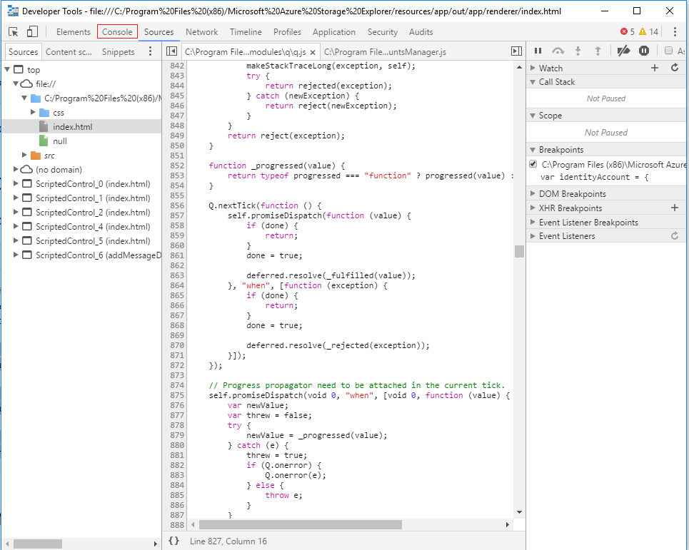
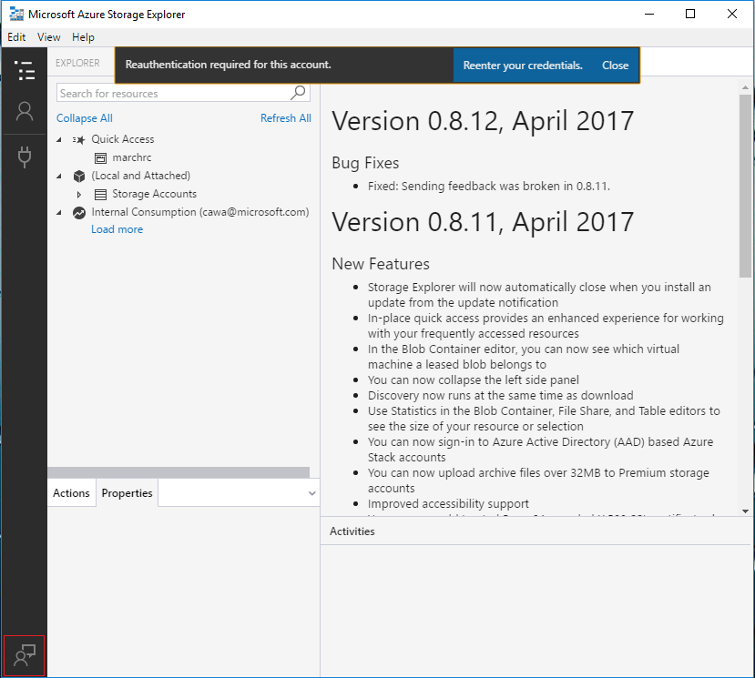

# Azure Storage Explorer troubleshooting guide

## Introduction

Microsoft Azure Storage Explorer (Preview) is a stand-alone app that enables you to easily work with Azure Storage data on Windows, macOS and Linux. The app can connect toStorage accounts hosted on Azure, Sovereign Clouds, and Azure Stack.

This guide summarizes solutions for common issues seen in Storage Explorer.

## Sign in issues

Before you continue, try restarting your application and see whether the problems can be fixed.

### Error: Self-Signed Certificate in Certificate Chain

There are several reasons why you may encounter this error, and the most common two reasons are as follows:

1. The app is connected through a “transparent proxy”, which means a server (such as your company server) is intercepting HTTPS traffic, decrypting it, and then encrypting it using a self-signed certificate.

2. You are running an application, such as antivirus software, which is injecting a self-signed SSL certificate into the HTTPS messages that you receive.

When Storage Explorer encounters one of the issues, it can no longer know whether the received HTTPS message is tampered. If you have a copy of the self-signed certificate, you can let Storage Explorer trust it. If you are unsure of who is injecting the certificate, follow these steps to find it:

1. Install Open SSL

    - [Windows](https://slproweb.com/products/Win32OpenSSL.html) (any of the light versions should be sufficient)

    - Mac and Linux: should be included with your operating system

2. Run Open SSL

    - Windows: open the installation directory, click **/bin/**, and then double-click **openssl.exe**.
    - Mac and Linux: run **openssl** from a terminal.

3. Execute s_client -showcerts -connect microsoft.com:443

4. Look for self-signed certificates. If you are unsure which are self-signed, look for anywhere the subject ("s:") and issuer ("i:") are the same.

5. When you have found any self-signed certificates, for each one, copy and paste everything from and including **-----BEGIN CERTIFICATE-----** to **-----END CERTIFICATE-----** to a new .cer file.

6. Open Storage Explorer, click **Edit** > **SSL Certificates** > **Import Certificates**, and then use the file picker to find, select, and open the .cer files that you created.

If you cannot find any self-signed certificates using the above steps, contact us through the feedback tool for more help.

### Unable to retrieve subscriptions

If you are unable to retrieve your subscriptions after you successfully sign in, follow these steps to troubleshoot this issue:

- Verify that your account has access to the subscriptions by signing into the Azure Portal.

- Make sure that you have signed in using the correct environment (Azure, Azure China, Azure Germany, Azure US Government, or Custom Environment/Azure Stack).

- If you are behind a proxy, make sure that you have configured the Storage Explorer proxy properly.

- Try removing and readding the account.

- Try deleting the following files from your root directory (that is, C:\Users\ContosoUser), and then re-adding the account:

    - .adalcache

    - .devaccounts

    - .extaccounts

- Watch the developer tools console (by pressing F12) when you are signing in for any error messages:

### Unable to see the authentication page

If you are unable to see the authentication page, follow these steps to troubleshoot this issue:

- Depending on the speed of your connection, it may take a while for the sign-in page to load, wait at least one minute before closing the authentication dialog box.

- If you are behind a proxy, make sure that you have configured the Storage Explorer proxy properly.

- View the developer console by pressing the F12 key. Watch the responses from the developer console and see whether you can find any clue for why authentication not working.

### Cannot remove account

If you are unable to remove an account, or if the reauthenticate link does not do anything, follow these steps to troubleshoot this issue:

- Try deleting the following files from your root directory, and then readding the account:

    - .adalcache

    - .devaccounts

    - .extaccounts

- If you want to remove SAS attached Storage resources, delete the following files:

    - %AppData%/StorageExplorer folder for Windows

    - /Users/<your_name>/Library/Applicaiton SUpport/StorageExplorer for Mac

    - ~/.config/StorageExplorer for Linux

> [!NOTE]
>  You will have to reenter all your credentials if you delete these files.

## Proxy issues

First, make sure that the following information you entered are all correct:

- The proxy URL and port number

- Username and password if required by the proxy

### Common solutions

If you are still experiencing issues, follow these steps to troubleshoot them:

- If you can connect to the Internet without using your proxy, verify that Storage Explorer works without proxy settings enabled. If this is the case, there may be an issue with your proxy settings. Work with your proxy administrator to identify the problems.

- Verify that other applications using the proxy server work as expected.

- Verify that you can connect to the Microsoft Azure portal using your web browser

- Verify that you can receive responses from your service endpoints. Enter one of your endpoint URLs into your browser. If you can connect, you should receive an InvalidQueryParameterValue or similar XML response.

- If someone else is also using Storage Explorer with your proxy server, verify that they can connect. If they can connect, you may have to contact your proxy server admin.

### Tools for diagnosing issues

If you have networking tools, such as Fiddler for Windows, you may be able to diagnose the problems as follows:

- If you have to work through your proxy, you may have to configure your networking tool to connect through the proxy.

- Check the port number used by your networking tool.

- Enter the local host URL and the networking tool's port number as proxy settings in Storage Explorer. If this isdone correctly, your networking tool starts logging network requests made by Storage Explorer to management and service endpoints. For example, enter https://cawablobgrs.blob.core.windows.net/ for your blob endpoint in a browser, and you will receive a response resembles the following, which suggests the resource exists, although you cannot access it.

### Contact proxy server admin

If your proxy settings are correct, you may have to contact your proxy server admin, and

- Make sure that your proxy does not block traffic to Azure management or resource endpoints.

- Verify the authentication protocol used by your proxy server. Storage Explorer does not currently support NTLM proxies.

## "Unable to Retrieve Children" error message

If you are connected to Azure through a proxy, verify that your proxy settings are correct. If you were granted access to a resource from the owner of the subscription or account, verify that you have read or list permissions for that resource.

### Issues with SAS URL
If you are connecting to a service using a SAS URL and experiencing this error:

- Verify that the URL provides the necessary permissions to read or list resources.

- Verify that the URL has not expired.

- If the SAS URL is based on an access policy, verify that the access policy has not been revoked.

## Next steps

If none of the solutions work for you, submit your issue through the feedback tool with your email and as many details about the issue included as you can, so that we can contact you for fixing the issue.

To do this, click **Help** menu, and then click **Send Feedback**.

