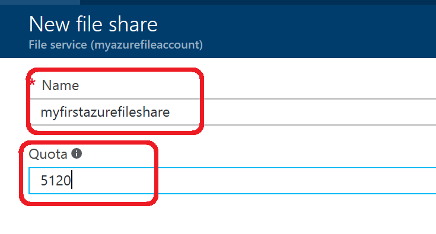

You can create Azure file shares using [Azure
Portal](https://portal.azure.com/), the Azure Storage PowerShell cmdlets, the
Azure Storage client libraries, or the Azure Storage REST API. Additionally,
because these file shares are SMB shares, you can access them via standard and
familiar file system APIs.

Create File Share Through Portal
================================

1.  Go to Storage Account Page on Azure Portal

1.  Click on Add File share

1.  Provide Name and Quota. Quota currently can be maximum 5TB

1.  View you File share

1.  Upload a file

1.  Browse into your file share and manage your directories and files

Create File share through Powershell
====================================

Install the PowerShell cmdlets for Azure Storage

To prepare to use PowerShell, download and install the Azure PowerShell cmdlets.
See [How to install and configure Azure
PowerShell](https://azure.microsoft.com/en-us/documentation/articles/powershell-install-configure/) for
the install point and installation instructions.

**Note:**

It's recommended that you download and install or upgrade to the latest Azure
PowerShell module.

Open an Azure PowerShell window by clicking **Start** and typing **Windows
PowerShell**. The PowerShell window loads the Azure Powershell module for you.

Create a context for your storage account and key

Now, create the storage account context. The context encapsulates the storage
account name and account key. For instructions on copying your account key from
the [Azure Portal](https://portal.azure.com/), see [View and copy storage access
keys](https://azure.microsoft.com/en-us/documentation/articles/storage-create-storage-account/#view-and-copy-storage-access-keys).

Replace storage-account-name and storage-account-key with your storage account
name and key in the following example.

Copy

\# create a context for account and key

\$ctx=New-AzureStorageContext storage-account-name storage-account-key

Create a new file share

Next, create the new share, named logs.

Copy

\# create a new share

\$s = New-AzureStorageShare logs -Context \$ctx

You now have a file share in File storage. Next we'll add a directory and a
file.

**Important:**

The name of your file share must be all lowercase. For complete details about
naming file shares and files, see [Naming and Referencing Shares, Directories,
Files, and Metadata](https://msdn.microsoft.com/library/azure/dn167011.aspx).

Create File share through CLI
=============================

### To prepare to use CLI, download and install the Azure CLI. See  [Install the Azure Command-Line Interface](https://www.google.com/url?sa=t&rct=j&q=&esrc=s&source=web&cd=1&ved=0ahUKEwiz1Y22urjSAhVS7WMKHZSmAH8QFggcMAA&url=https%3A%2F%2Fdocs.microsoft.com%2Fen-us%2Fazure%2Fxplat-cli-install&usg=AFQjCNFi0kW3Wz6WgfZW0iH2OmaBBPN2gA&cad=rja) and [Get started with Azure CLI 2.0 \| Microsoft Docs](https://docs.microsoft.com/en-us/cli/azure/get-started-with-azure-cli).

Get Initialized

Replace storage-account and resource\_group with your storage account name and
resource group in the following example.

read -e -p "New storage account name:" storage\_account

read -e -p "New resource group name:" resource\_group

read -e -p "Location for group:" location

Create Azure resource group

echo "Creating the \\"\$resource\_group\\" resource group..."

az group create -n \$resource\_group -l \$location -o table

echo "Done!"

echo 

Create storage account

echo "Creating the \\"\$storage\_account\\" storage account..."

az storage account create -n \$storage\_account -g \$resource\_group -l
\$location --sku Standard\_LRS -o table

echo "Done!"

echo

Acquire connection string.

current\_env\_conn\_string=\$(az storage account show-connection-string -n
\$storage\_account -g \$resource\_group --query 'connectionString' -o tsv)

if [[ \$current\_env\_conn\_string == "" ]]; then

    echo "Couldn't retrieve the connection string for the new account."

    exit 0

fi

Create file share

echo "Creating the \\"files\\" file share..."

az storage share create --name files --quota 2048 --connection-string
\$current\_env\_conn\_string 1\>/dev/null

echo "Created!"
