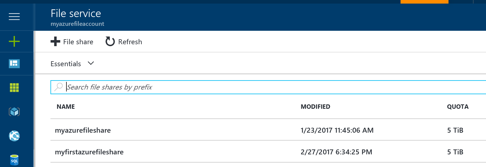
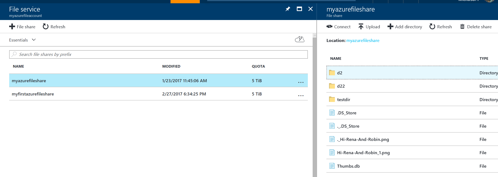

# Create a File Share in Azure File Storage
You can create Azure File shares using [Azure Portal](https://portal.azure.com/), the Azure Storage PowerShell cmdlets, the Azure Storage client libraries, or the Azure Storage REST API.In this tutorial, you will learn:
* [How to create Azure File share using the Portal](#portal)
* [How to create Azure File share using Powershell](#powershell)
* [How to create Azure File share using CLI](#cli)

## Prerequisites
Before you can create an Azure File Share, you will need to [create an Azure Storage Account](storage-create-storage-account.md), unless you already have one. You will need Storage account key if you plan to use Powershell.

## <a id="portal"></a>Create file share through the Portal
1. **Go to Storage Account blade on Azure Portal**:    
    

2. **Click on add File Share button**:    
    

3. **Provide Name and Quota. Quota currently can be maximum 5TB**:    
    

4. **View your new file share**:
    

5. **Upload a file**:
    

6. **Browse into your file share and manage your directories and files**:
    


## <a id="powershell"></a>Create file share through PowerShell
To prepare to use PowerShell, download and install the Azure PowerShell cmdlets. See [How to install and configure Azure PowerShell](https://azure.microsoft.com/en-us/documentation/articles/powershell-install-configure/) for the install point and installation instructions.

> [!Note]  
> It's recommended that you download and install or upgrade to the latest Azure PowerShell module.

1. **Create a context for your storage account and key**
    The context encapsulates the storage account name and account key. For instructions on copying your account key from the [Azure Portal](https://portal.azure.com/), see [View and copy storage access keys](storage-create-storage-account.md#view-and-copy-storage-access-keys).

    Replace storage-account-name and storage-account-key with your storage account name and key in the following example:

    ```PowerShell
    $storageContext = New-AzureStorageContext <storage-account-name> <storage-account-key>
    ```

2. **Create a new file share**:    
    ```PowerShell
    $share = New-AzureStorageShare logs -Context $storageContext
    ```

> [!Note]  
> The name of your file share must be all lowercase. For complete details about naming file shares and files, see [Naming and Referencing Shares, Directories, Files, and Metadata](https://msdn.microsoft.com/library/azure/dn167011.aspx).

## <a id="cli"></a>Create file share through Command Line Interface (CLI)
1. **To prepare to use Command Line Interface (CLI), download and install the Azure CLI.**  
    See [Install the Azure Command-Line Interface](/cli/azure/install-azure-cli.md) and [Get started with Azure CLI 2.0](https://docs.microsoft.com/en-us/cli/azure/get-started-with-azure-cli).

2. **Create a connection string to the Storage Account where you want to create the share.**  
    Replace ```<storage-account>``` and ```<resource_group>``` with your storage account name and resource group in the following example.

    ```
    current_env_conn_string = $(az storage account show-connection-string -n <storage-account> -g <resource-group> --query 'connectionString' -o tsv)

    if [[ $current_env_conn_string == "" ]]; then  
        echo "Couldn't retrieve the connection string."
    fi
    ```

3. **Create file share**
    ```
    az storage share create --name files --quota 2048 --connection-string $current_env_conn_string 1 > /dev/null
    ```

## Next Steps if you are a first-time user of Azure File Storage
* [Connect and Mount File Share](storage-file-how-to-connect-and-mount.md)

See these links for more information about Azure File storage.

* [FAQ](storage-files-faq.md)
* [Troubleshooting](storage-troubleshoot-file-connection-problems.md)

### Conceptual articles and videos
* [Azure File Storage: a frictionless cloud SMB file system for Windows and Linux](https://azure.microsoft.com/documentation/videos/azurecon-2015-azure-files-storage-a-frictionless-cloud-smb-file-system-for-windows-and-linux/)
* [How to use Azure File Storage with Linux](storage-how-to-use-files-linux.md)

### Tooling support for File storage
* [Using Azure PowerShell with Azure Storage](storage-powershell-guide-full.md)
* [How to use AzCopy with Microsoft Azure Storage](storage-use-azcopy.md)
* [Using the Azure CLI with Azure Storage](storage-azure-cli.md#create-and-manage-file-shares)
* [Troubleshooting Azure File storage problems](https://docs.microsoft.com/en-us/azure/storage/storage-troubleshoot-file-connection-problems)

### Blog posts
* [Azure File storage is now generally available](https://azure.microsoft.com/blog/azure-file-storage-now-generally-available/)
* [Inside Azure File Storage](https://azure.microsoft.com/blog/inside-azure-file-storage/)
* [Introducing Microsoft Azure File Service](http://blogs.msdn.com/b/windowsazurestorage/archive/2014/05/12/introducing-microsoft-azure-file-service.aspx)
* [Migrating data to Azure File ](https://azure.microsoft.com/en-us/blog/migrating-data-to-microsoft-azure-files/)

### Reference
* [Storage Client Library for .NET reference](https://msdn.microsoft.com/library/azure/dn261237.aspx)
* [File Service REST API reference](http://msdn.microsoft.com/library/azure/dn167006.aspx)