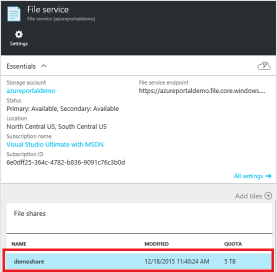
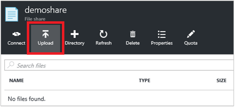
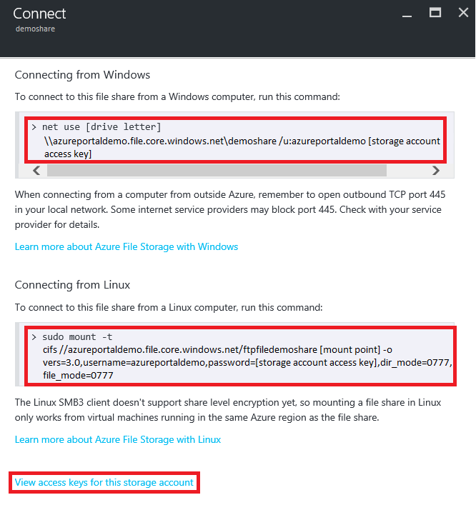

# How to use File Storage from the Azure Portal
The [Azure portal](https://portal.azure.com) provides a user interface for managing Azure File Storage. You can perform the following actions from your web browser:

* Create a File Share
* Upload and download files to and from your file share.
* Monitor the actual usage of each file share.
* Adjust the file share size quota.
* Copy the `net use` command to use to mount your file share from a Windows client.

## Create file share
1. Sign in to the Azure portal.
2. On the navigation menu, click **Storage accounts** or **Storage accounts (classic)**.
    
    

3. Choose your storage account.

    

4. Choose "Files" service.

    

5. Click "File shares" and follow the link to create your first file share.

    

6. Fill in the file share name and the size of the file share (up to 5120 GB) to create your first file share. Once the file share has been created, you can mount it from any file system that supports SMB 2.1 or SMB 3.0. You could click on **Quota** on the file share to change the size of the file up to 5120 GB. Please refer to [Azure Pricing Calculator](https://azure.microsoft.com/pricing/calculator/) to estimate the storage cost of using Azure File Storage.

    

## Upload and download files
1. Choose one file share your have already created.

    

2. Click **Upload** to open the user interface for files uploading.

    

## Connect to file share
-  Click **Connect** to get the command line for mounting the file share from Windows and Linux. For Linux users, you can also refer to [How to use Azure File Storage with Linux](storage-how-to-use-files-linux.md) for more mounting instructions for other Linux distros.

    
-  You can copy the commands for mounting file share on Windows or Linux and run it from you Azure VM or on-premises machine.

    

**Tip:**  
To find the storage account access key for mounting, click on **View access keys for this storage account** at the bottom of the connect page.

## See also
See these links for more information about Azure File storage.

* [FAQ](storage-files-faq.md)
* [Troubleshooting](storage-troubleshoot-file-connection-problems.md)