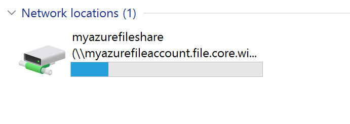

Mount the file share from an Azure virtual machine running Windows
==================================================================

Prerequisites
-------------

| Windows 7              | SMB 2.1 |
|------------------------|---------|
| Windows Server 2008 R2 | SMB 2.1 |
| Windows 8              | SMB 3.0 |
| Windows Server 2012    | SMB 3.0 |
| Windows Server 2012 R2 | SMB 3.0 |
| Windows 10             | SMB 3.0 |

Once the Azure File Storage hare is mounted, you can see it in the explorer

Before mounting to the file share, first persist your storage account
credentials on the virtual machine. This step allows Windows to automatically
reconnect to the file share when the virtual machine reboots. To persist your
account credentials, run the cmdkey command from the PowerShell window on the
virtual machine. Replace \<storage-account-name\> with the name of your storage
account, and \<storage-account-key\> with your storage account key.

Copy

cmdkey /add:\<storage-account-name\>.file.core.windows.net
/user:AZURE\\\<storage-account-name\> /pass:\<storage-account-key\>

Windows will now reconnect to your file share when the virtual machine reboots.
You can verify that the share has been reconnected by running the net
use command from a PowerShell window.

Note that credentials are persisted only in the context in which cmdkey runs. If
you are developing an application that runs as a service, you will need to
persist your credentials in that context as well.

Once you have a remote connection to the virtual machine, you can run the net
usecommand to mount the file share, using the following syntax.
Replace \<storage-account-name\> with the name of your storage account,
and \<share-name\> with the name of your File storage share.

Copy

net use \<drive-letter\>:
\\\\\<storage-account-name\>.file.core.windows.net\\\<share-name\>

REM example :

net use z:
[\\\\samples.file.core.windows.net\\logs](file://samples.file.core.windows.net/logs)

REM You could now use your favorite commands to write and copy data to mounted
Azure file share.

REM ipconfig \> z:\\sample0.txt

REM copy sample1.txt z:\\

Since you persisted your storage account credentials in the previous step, you
do not need to provide them with the net use command. If you have not already
persisted your credentials, then include them as a parameter passed to the net
use command, as shown in the following example.

Copy

net use \<drive-letter\>:
\\\\\<storage-account-name\>.file.core.windows.net\\\<share-name\>
/u:\<storage-account-name\> \<storage-account-key\>

REM example :

net use z: \\\\samples.file.core.windows.net\\logs /u:samples
\<storage-account-key\>

You can now work with the File Storage share from the virtual machine as you
would with any other drive. You can issue standard file commands from the
command prompt, or view the mounted share and its contents from File Explorer.
You can also run code within the virtual machine that accesses the file share
using standard Windows file I/O APIs, such as those provided by the [System.IO
namespaces](http://msdn.microsoft.com/library/gg145019.aspx) in the .NET
Framework.

You can also mount the file share from a role running in an Azure cloud service
by remoting into the role.

Mount the file share from an on-premises client

| Windows 8              | SMB 3.0 |
|------------------------|---------|
| Windows Server 2012    | SMB 3.0 |
| Windows Server 2012 R2 | SMB 3.0 |
| Windows 10             | SMB 3.0 |

To mount the file share from an on-premises client, you must first take these
steps:

-   Install a version of Windows or Mac OS which supports SMB 3.0. The OS will
    leverage SMB 3.0 encryption to securely transfer data between your
    on-premises client and the Azure file share in the cloud.

-   Open Internet access for port 445 (TCP Outbound) in your local network, as
    is required by the SMB protocol.

**Note:**

Some Internet service providers may block port 445, so you may need to check
with your service provider.
