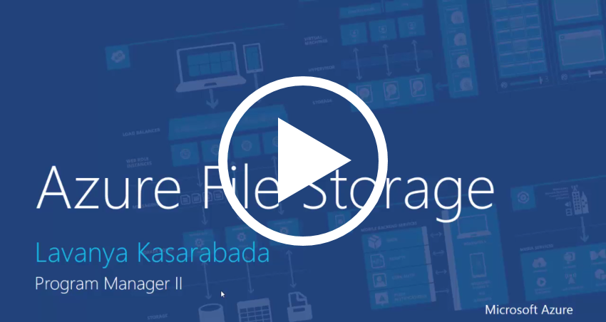

# Introduction to Azure File Storage
Azure File Storage is Microsoft's easy to use cloud file system. Azure File Storage offers network file shares in the cloud using the industry standard [Server Message Block (SMB) Protocol](https://msdn.microsoft.com/library/windows/desktop/aa365233.aspx) and [Samba/Common Internet File System (CIFS)](https://technet.microsoft.com/en-us/library/cc939973.aspx). Azure File shares can be mounted concurrently by clients such as on-premises deployments of Windows, macOS, or Linux, or by Azure Virtual Machines. 

Azure File shares can be used to:

* Provide file share functionality for virtual machines running in Azure.
* Completely replace on-premises file shares without globally available file shares for today's mobile workforce.
* Enable moving and managing data using familiar tools like robocopy in addition to Azure tools like AzCopy.
* Enable "lift and shift" migration of applications that depend on file semantics to the cloud, without expensive rewrites.

## Videos
| Introducing Azure File Storage (27m) | Azure File Storage Tutorial (5 minutes)  |
|-|-|
| [](https://www.youtube.com/watch?v=zlrpomv5RLs) | [](https://channel9.msdn.com/Blogs/Azure/Azure-File-Storage-with-Windows/) |

## Why is Azure File Storage useful?
Azure File Storage allows you to replace Windows Server, Linux, or NAS based file servers hosted on-premises or in the cloud, with an OS-free cloud file share. This has the following benefits:

* **Simplicity**. Azure File shares can be created without the need to manage hardware or an OS. This means you don't have to deal with patching the server OS with critical security upgrades or replacing faulty hard disks.
* **Shared access:**. Azure File shares support the industry standard SMB protocol, meaning you can seamlessly replace your on-premises file shares with Azure File shares without worrying about application compatibility. Being able to share a file system across multiple applications/instances is a significant advantage with Azure File STprage for applications that need shareability. 
* **Programmability**. Applications running in Azure can access data in the share via file [system I/O APIs](https://msdn.microsoft.com/en-us/library/system.io.file(v=vs.110).aspx). Developers can therefore leverage their existing code and skills to migrate existing applications. In addition to System IO APIs, one can use Azure Storage Client Libraries or the Azure Storage REST API.
* **Scripting and Tooling**. PowerShell cmdlets and Azure CLI  can be used to create, mount, and manage File storage shares as part of the administration of Azure applications.You can create and manage Azure file shares using Azure Portal and Azure Storage Explorer. 
* **Resiliency**. Azure File Storage has been built from the ground up to be always available. Replacing on-premises file shares with Azure File Storage means you no longer have to wake up to deal with local power outages or network issues. 

## How does it work?
Managing Azure File shares is a lot simpler than managing file shares on-premises. The following diagram illustrates the Azure File Storage management constructs:


* **Storage Account**: All access to Azure Storage is done through a storage account. See Azure Storage Scalability and Performance Targets for details about storage account capacity.
* **Share**: A File storage share is an SMB file share in Azure. All directories and files must be created in a parent share. An account can contain an unlimited number of shares, and a share can store an unlimited number of files, up to the 5 TB total capacity of the file share.
* **Directory**: An optional hierarchy of directories.
* **File**: A file in the share. A file may be up to 1 TB in size.
* **URL format**: Files are addressable using the following URL format:  

    ```
    https://<storage account>.file.core.windows.net/<share>/<directory/directories>/<file>
    ```
## Next Steps if you are a first-time user of Azure File Storage
* [Create File Share](storage-file-how-to-create-file-share.md)
* [Connect and Mount File Share](storage-file-how-to-connect-and-mount.md)
* [Manage Azure File Share using tools and scripts](storage-file-how-to-tooling-and-scripting.md)

## See Also

* **[Azure Blob](../storage/storage-dotnet-how-to-use-blobs.md)**: Massively-scalable object storage for unstructured data
* **[Azure Table](../storage/storage-dotnet-how-to-use-tables.md)**: Flexible NoSQL database
* **[Azure Queues](../storage/storage-dotnet-how-to-use-queues.md)**: Durable queues for large-volume cloud services
* **[Azure Disks](../storage/storage-premium-storage.md)**: Premium storage for I/O intensive applications