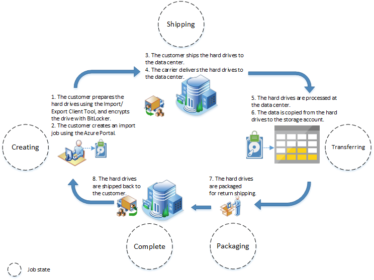
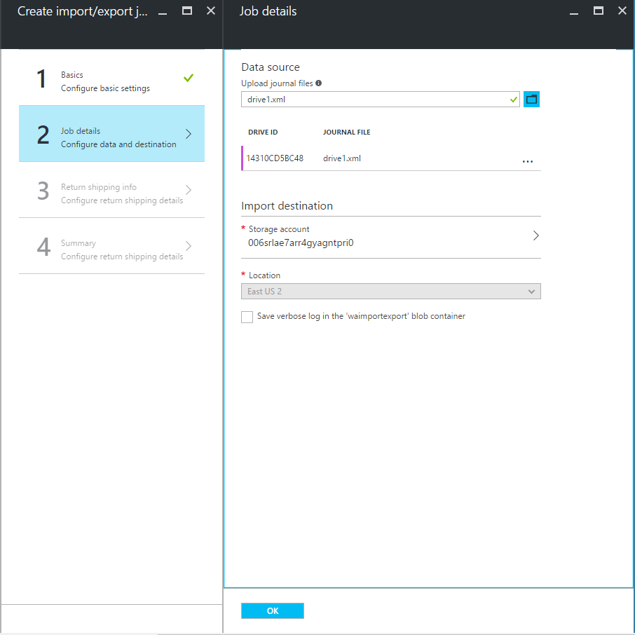
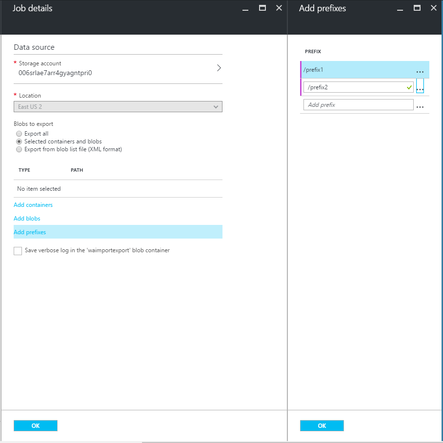

<properties
	pageTitle="Using import/export to transfer data to Blob Storage | Microsoft Azure"
	description="Learn how to create import and export jobs in the Azure Classic portal to transfer data to blob storage."
	authors="renashahmsft"
	manager="aungoo"
	editor="tysonn"
	services="storage"
	documentationCenter=""/>

<tags
	ms.service="storage"
	ms.workload="storage"
	ms.tgt_pltfrm="na"
	ms.devlang="na"
	ms.topic="article"
	ms.date="06/22/2016"
	ms.author="renash"/>

# Use the Microsoft Azure Import/Export Service to transfer data to Blob storage

## Overview

Azure Import/Export Service allows you to securely transfer large amounts of data to Azure blob storage by shipping hard disk drives to an Azure data center. You can also use this service to transfer data from Azure blob storage to hard disk drives and ship to your on-premises site. This service is suitable in situations where you want to transfer several TBs of data to or from Azure, but uploading or downloading over the network is not feasible due to limited bandwidth or high network costs.

The service requires that hard disk drives should be bit locker encrypted for the security of your data. The service supports classic storage accounts present in all the regions of Public Azure. You must ship hard disk drives to one of the supported locations specified later in this article.
 
In this article, you will learn more about the Azure Import/Export service and how to ship drives for copying your data to and from Azure Blob storage.

> [AZURE.IMPORTANT] You can create and manage import and export jobs for classic storage using the Classic portal or the [Import/Export service REST APIs](http://go.microsoft.com/fwlink/?LinkID=329099). Resource Manager storage accounts are not supported at this time.

## When should I use the Azure Import/Export service?

You can consider using Azure Import/Export service when uploading or downloading data over the network is too slow or getting additional network bandwidth is cost prohibitive.

You can use this service in scenarios such as:

- Migrating data to the cloud: Move large amounts of data to Azure quickly and cost effectively.
- Content distribution: Quickly send data to your customer sites.
- Backup: Take backups of your on-premises data to store in Azure blob storage.
- Data recovery: Recover large amount of data stored in blob storage and have it delivered to your on-premises location.

## Pre-requisites

In this section, we have listed the pre-requisites required to use this service. Please review them carefully before shipping your drives.

### Storage account

You must have an existing Azure subscription and one or more **classic** storage accounts to use the Import/Export service. Each job may be used to transfer data to or from only one classic storage account. In other words, a single import/export job cannot span across multiple storage accounts. For information on creating a new storage account, see [How to Create a Storage Account](storage-create-storage-account.md#create-a-storage-account). 

### Blob types

You can use Azure Import/Export service to copy data to **Block** blobs or **Page** blobs. Conversely, you can only export **Block** blobs, **Page** blobs or **Append** blobs from Azure storage using this service. 

### Job

To begin the process of importing to or exporting from Blob storage, you first create a job. A job can be an import job or an export job:

- Create an import job when you want to transfer data you have on-premises to blobs in your Azure storage account.
- Create an export job when you want to transfer data currently stored as blobs in your storage account to hard drives that are shipped to you.

When you create a job, you notify the Import/Export service that you will be shipping one or more hard drives to an Azure data center. 

- For an import job, you will be shipping hard drives containing your data. 
- For an export job, you will be shipping empty hard drives. 
- You can ship up to 10 hard disk drives per job.

You can create an import or export job using the [Classic portal](https://manage.windowsazure.com/) or the [Azure Storage Import/Export REST API](http://go.microsoft.com/fwlink/?LinkID=329099).

### Client tool

The first step in creating an **import** job is to prepare your drive that will be shipped for import. To prepare your drive, you must connect it to a local server and run the Azure Import/Export Client Tool on the local server. This client tool facilitates copying your data to the drive, encrypting the data on the drive with BitLocker, and generating the drive journal files. 

The journal files store basic information about your job and drive such as drive serial number and storage account name. This journal file is not stored on the drive. It is used during import job creation. Step by step details about job creation are provided later in this article. 

The client tool is only compatible with 64-bit Windows operating system. See the [Operating System](#operating-system) section for specific OS versions supported.

Download the latest version of the [Azure Import/Export client tool](http://go.microsoft.com/fwlink/?LinkID=301900&clcid=0x409). For more details about using the Azure Import/Export Tool, see the [Azure Import/Export Tool Reference](http://go.microsoft.com/fwlink/?LinkId=329032).

### Hard disk drives

Only 3.5 inch SATA II/III internal hard drives are supported for use with the Import/Export service. You can use hard drives up to 10TB. 
For import jobs, only the first data volume on the drive will be processed. The data volume must be formatted with NTFS. 
When copying data to your hard drive, you can attach it directly using a SATA connector or you can attach it externally using an external SATA II/III USB adaptor. We recommend using one of the following external SATA II/III USB adaptors:

- Anker 68UPSATAA-02BU
- Anker 68UPSHHDS-BU
- Startech SATADOCK22UE
- Sharkoon QuickPort XT HC

If you have a converter which is not listed above, you can try running the Azure Import/Export Tool using your converter to prepare the drive and see if it works before purchasing a supported converter.

> [AZURE.IMPORTANT] External hard disk drives that come with an built-in USB adaptor are not supported by this service. Also, the disk inside the casing of an external HDD cannot be used; please do not send external HDDs. 

### Encryption

The data on the drive must be encrypted using BitLocker Drive Encryption. This protects your data while it is in transit. 

For import jobs, there are two ways to perform the encryption. The first way is to use the /encrypt parameter when running the client tool during drive preparation. The second way is to enable BitLocker encryption manually on the drive and specify the encryption key in the client tool command line during drive preparation. 

For export jobs, after your data is copied to the drives, the service will encrypt the drive using BitLocker before shipping it back to you. The encryption key will be provided to you via the Classic portal.  

### Operating System

You can use one of the following 64-bit Operating Systems to prepare the hard drive using the Azure Import/Export Tool before shipping the drive to Azure: 

Windows 7 Enterprise, Windows 7 Ultimate, Windows 8 Pro, Windows 8 Enterprise, Windows 8.1 Pro, Windows 8.1 Enterprise, Windows 101, Windows Server 2008 R2, Windows Server 2012, Windows Server 2012 R2. All of these operating systems support BitLocker Drive Encryption.

> [AZURE.IMPORTANT] 1If you are using a Windows 10 machine to prepare your hard drive, please download the latest version of the Azure Import/Export Tool.

### Locations

The Azure Import/Export service supports copying data to and from all Public Azure storage accounts. You can ship hard disk drives to one of the following locations. If your storage account is in a public Azure location which is not specified here, an alternate shipping location will be provided when you are creating the job using the Classic portal or the Import/Export REST API.

Supported shipping locations:

- East US

- West US

- East US 2

- Central US

- North Central US

- South Central US

- North Europe

- West Europe

- East Asia

- Southeast Asia

- Australia East

- Australia Southeast

- Japan West

- Japan East

- Central India

### Shipping

**Shipping drives to the data center:**

When creating an import or export job, you will be provided a shipping address of one of the supported locations to ship your drives. The shipping address provided will depend on the location of your storage account, but it may not be the same as your storage account location.

You can use carriers like FedEx, DHL, UPS, or the US Postal Service to ship your drives to the shipping address. 

**Shipping drives from the data center:**

When creating an import or export job, you must provide a return address for Microsoft to use when shipping the drives back after your job is complete. Please make sure you provide a valid return address to avoid delays in processing.

You must also provide a valid FedEx or DHL carrier account number to be used by Microsoft for shipping the drives back. A FedEx account number is required for shipping drives back from the US and Europe locations. A DHL account number is required for shipping drives back from Asia and Australia locations. You can create a [FedEx](http://www.fedex.com/us/oadr/) (for US and Europe) or [DHL](http://www.dhl.com/) (Asia and Australia) carrier account if you do not have one. If you already have a carrier account number, please verify that it is valid.

In shipping your packages, you must follow the terms at [Microsoft Azure Service Terms](https://azure.microsoft.com/support/legal/services-terms/).

> [AZURE.IMPORTANT] Please note that the physical media that you are shipping may need to cross international borders. You are responsible for ensuring that your physical media and data are imported and/or exported in accordance with the applicable laws. Before shipping the physical media, check with your advisers to verify that your media and data can legally be shipped to the identified data center. This will help to ensure that it reaches Microsoft in a timely manner. For instance, any package that will cross international borders needs a commercial invoice to be accompanied with the package (except if crossing borders within European Union). You could print out a filled copy of the commercial invoice from carrier website. Example of commercial invoice are [DHL Commercial Invoice] (http://invoice-template.com/wp-content/uploads/dhl-commercial-invoice-template.pdf) or [FedEx Commercial Invoice](http://images.fedex.com/downloads/shared/shipdocuments/blankforms/commercialinvoice.pdf). Make sure that Microsoft has not been indicated as the exporter.

## How does the Azure Import/Export service work?

You can transfer data between your on-premises site and Azure blob storage using the Azure Import/Export service by creating jobs and shipping hard disk drives to an Azure data center. Each hard disk drive you ship is associated with a single job. Each job is associated with a single storage account. Review the [pre-requisites section](#pre-requisites) carefully to learn about the specifics of this service such as supported blob types, disk types, locations, and shipping. 

In this section, we will describe at a high level the steps involved in import and export jobs. Later in the [Quick Start section](#quick-start), we will provide step-by-step instructions to create an import and export job.

### Inside an Import job

At a high level, an import job involves the following steps:

- Determine the data to be imported, and the number of drives you will need.
- Identify the destination blobs for your data in Blob storage.
- Use the Azure Import/Export Tool to copy your data to one or more hard disk drives and encrypt them with BitLocker.  
- Create an import job in your target classic storage account using the Classic portal or the Import/Export REST API. If using the Classic portal, upload the drive journal files.
- Provide the return address and carrier account number to be used for shipping the drives back to you.
- Ship the hard disk drives to the shipping address provided during job creation.
- Update the delivery tracking number in the import job details and submit the import job.
- Drives are received and processed at the Azure data center. 
- Drives are shipped using your carrier account to the return address provided in the import job.

	

### Inside an Export job

At a high level, an export job involves the following steps:

- Determine the data to be exported and the number of drives you will need.
- Identify the source blobs or container paths of your data in Blob storage.
- Create an export job in your source storage account using the Classic portal or the Import/Export REST API.
- Specify the source blobs or container paths of your data in the export job.
- Provide the return address and carrier account number for to be used for shipping the drives back to you.
- Ship the hard disk drives to the shipping address provided during job creation.
- Update the delivery tracking number in the export job details and submit the export job.
- The drives are received and processed at the Azure data center. 
- The drives are encrypted with BitLocker; the keys are available via the Classic portal.  
- The drives are shipped using your carrier account to the return address provided in the import job.

	

### Viewing your job status

You can track the status of your import or export jobs from the Classic portal. Navigate to your storage account in the Classic portal and click the **Import/Export** tab. A list of your jobs will appear on the page. You can filter the list on job status, job name, job type, or tracking number.

You will see one of the following job statuses depending on where your drive is in the process.

Job Status|Description
---|---
Creating|Your job has been created, but you have not yet provided your shipping information.
Shipping|Your job has been created and you have provided your shipping information. **Note**: When the drive is delivered to the Azure data center, the status may still show “Shipping” for some time. Once the service starts copying your data, the status will change to “Transferring”. If you want to see more specific status of your drive, you can use the Import/Export REST API. 
Transferring|Your data is being transferred from your hard drive (for an import job) or to your hard drive (for an export job).
Packaging|The transfer of your data is complete, and your hard drive is being prepared for shipping back to you.
Complete|Your hard drive has been shipped back to you.

### Time to process job 

The amount of time it takes to process an import/export job varies depending on different factors such as shipping time, job type, type and size of the data being copied, and the size of the disks provided. The Import/Export Service does not have an SLA. You can use the REST API to track the job progress more closely. There is a percent complete parameter in the List Jobs operation which gives an indication of copy progress. Reach out to us if you need an estimate to complete a time critical import/export job.

### Pricing 

**Drive handling fee**

There is a drive handling fee for each drive processed as part of your import or export job. See the details on the [Azure Import/Export Pricing](https://azure.microsoft.com/pricing/details/storage-import-export/). 

**Shipping costs**

When you ship drives to Azure, you pay the shipping cost to the shipping carrier. When Microsoft returns the drives to you, the shipping cost is charged to the carrier account which you provided at the time of job creation.

**Transaction costs**

There are no transaction costs when importing data into blob storage. The standard egress charges are applicable when data is exported from blob storage. For more details on transaction costs, see [Data transfer pricing.](https://azure.microsoft.com/pricing/details/data-transfers/) 

## Quick Start

In this section, we will provide step-by-step instructions for creating an import and an export job. Please make sure you meet all of the [pre-requisites](#pre-requisites) before moving forward.

## How to create an Import Job?

Create an import job to copy data to your Azure storage account from hard drives by shipping one or more drives containing data to the specified data center. The import job conveys details about hard disk drives, data to be copied, target storage account, and shipping information to the Azure Import/Export service. Creating an import job is a three-step process. First, prepare your drives using the Azure Import/Export client tool. Second, submit an import job using the Classic portal. Third, ship the drives to the shipping address provided during job creation and update the shipping info in your job details.   

> [AZURE.IMPORTANT] You can submit only one job per storage account. Each drive you ship can be imported to one storage account. For example, let’s say you wish to import data into two storage accounts. You must use separate hard disk drives for each storage account and create separate jobs per storage account. 

### Prepare Your Drives	

The first step when importing data using the Azure Import/Export service is to prepare your drives using the Azure Import/Export client tool. Follow the steps below to prepare your drives.

1.	Identify the data to be imported. This could be directories and standalone files on the local server or a network share.  

2.	Determine the number of drives you will need depending on total size of the data. Procure the required number of 3.5 inch SATA II/III hard disk drives.

3.	Identify the target storage account, container, virtual directories, and blobs. 

4.	Determine the directories and/or standalone files that will be copied to each hard disk drive.

5.	Use the [Azure Import/Export Tool](http://go.microsoft.com/fwlink/?LinkID=301900&clcid=0x409) to copy your data to one or more hard drives.
	
	- The Azure Import/Export tool creates copy sessions to copy your data from source to the hard disk drives. In a single copy session, the tool can copy a single directory along with its subdirectories, or a single file. 

	- You may need multiple copy sessions if your source data spans many directories. 

	- Each hard disk drive you prepare will require at least one copy session.

6.	You can specify the /encrypt parameter to enable Bitlocker encryption on the hard disk drive. Alternatively, you could also enable Bitlocker encryption manually on the hard disk drive and supply the key while running the tool.

7.	The Azure Import/Export Tool generates a drive journal file for each drive as it is prepared. The drive journal file is stored on your local computer, not on the drive itself. You will upload the journal file when you create the import job. A drive journal file includes the drive ID and the BitLocker key, as well as other information about the drive. 
**Important**: Each hard disk drive you prepare will result in a journal file. When you are creating the import job using the Classic portal, you must upload all the journal files of the drives which are part of that import job. Drives without journal files will not be processed.

8.	Do not modify the data on the hard disk drives or the journal file after completing disk preparation.

Below are the commands and examples for preparing the hard disk drive using Azure Import/Export client tool. 

Azure Import/Export client tool PrepImport command for the first copy session to copy a directory:

	WAImportExport PrepImport /sk:<StorageAccountKey> /csas:<ContainerSas> /t: <TargetDriveLetter> [/format] [/silentmode] [/encrypt] [/bk:<BitLockerKey>] [/logdir:<LogDirectory>] /j:<JournalFile> /id:<SessionId> /srcdir:<SourceDirectory> /dstdir:<DestinationBlobVirtualDirectory> [/Disposition:<Disposition>] [/BlobType:<BlockBlob|PageBlob>] [/PropertyFile:<PropertyFile>] [/MetadataFile:<MetadataFile>]

**Example:**

In the example below we are copying all the files and sub directories from H:\Video to the hard disk drive mounted on X:. The data will be imported to the destination storage account specified by the storage account key and into the storage container called video. If the storage container is not present, it will be created. This command will also format and encrypt the target hard disk drive.

	WAImportExport.exe PrepImport /j:FirstDrive.jrn /id:Video1 /logdir:c:\logs /sk:storageaccountkey /t:x /format /encrypt /srcdir:H:\Video1 /dstdir:video/ /MetadataFile:c:\WAImportExport\SampleMetadata.txt

Azure Import/Export client tool PrepImport command for subsequent copy sessions to copy a directory:

	WAImportExport PrepImport /j:<JournalFile> /id:<SessionId> /srcdir:<SourceDirectory> /dstdir:<DestinationBlobVirtualDirectory> [/Disposition:<Disposition>] [/BlobType:<BlockBlob|PageBlob>] [/PropertyFile:<PropertyFile>] [/MetadataFile:<MetadataFile>]

For subsequent copy sessions to the same hard disk drive, specify the same journal file name and provide a new session ID; there is no need to provide the storage account key and target drive again, nor to format or encrypt the drive. In this example we are copying the H:\Photo folder and its sub directories to the same target drive, into the storage container called photo. 

	WAImportExport.exe PrepImport /j:FirstDrive.jrn /id:Photo /srcdir:H:\Photo /dstdir:photo/ /MetadataFile:c:\WAImportExport\SampleMetadata.txt

The Azure Import/Export client tool PrepImport command for the first copy session to copy a file:

	WAImportExport PrepImport /sk:<StorageAccountKey> /csas:<ContainerSas> /t: <TargetDriveLetter> [/format] [/silentmode] [/encrypt] [/bk:<BitLockerKey>] [/logdir:<LogDirectory>] /j:<JournalFile> /id:<SessionId> /srcfile:<SourceFile> /dstblob:<DestinationBlobPath> [/Disposition:<Disposition>] [/BlobType:<BlockBlob|PageBlob>] [/PropertyFile:<PropertyFile>] [/MetadataFile:<MetadataFile>]

The Azure Import/Export client tool PrepImport command for subsequent copy sessions to copy a file:

	WAImportExport PrepImport /j:<JournalFile> /id:<SessionId> /srcfile:<SourceFile> /dstblob:<DestinationBlobPath> [/Disposition:<Disposition>] [/BlobType:<BlockBlob|PageBlob>] [/PropertyFile:<PropertyFile>] [/MetadataFile:<MetadataFile>]

**Remember**: By default, the data will be imported as Block Blobs. You can use the /BlobType parameter to import data as a Page Blobs. For example, if you are importing VHD files which will be mounted as disks on an Azure VM, you must import them as Page Blobs. If you are uncertain which blob type to use, you can specify /blobType:auto and we will help determine the right type. In this case, all vhd and vhdx files will be imported as Page Blobs, and the rest will be imported as Block Blobs.

See more details about using the Azure Import/Export client tool in [Preparing Hard Drives for Import](https://msdn.microsoft.com/library/dn529089.aspx).

Also, refer to the [Sample Workflow to Prepare Hard Drives for an Import Job](https://msdn.microsoft.com/library/dn529097.aspx) for more detailed step-by-step instructions.  

### Create the Import Job

1.	Once you have prepared your drive, navigate to your storage account in the [Classic portal](https://manage.windowsazure.com) and view the Dashboard. Under **Quick Glance**, click **Create an Import Job**. Review the steps and select the checkbox to indicate that you have prepared your drive and that you have the drive journal file available.

2.	In Step 1, provide contact information for the person responsible for this import job and a valid return address. If you wish to save verbose log data for the import job, check the option to **Save the verbose log in my 'waimportexport' blob container**.

3.	In Step 2, upload the drive journal files that you obtained during the drive preparation step. You will need to upload one file for each drive that you have prepared.

	

4.	In Step 3, enter a descriptive name for the import job. Note that the name you enter may contain only lowercase letters, numbers, hyphens, and underscores, must start with a letter, and may not contain spaces. You will use the name you choose to track your jobs while they are in progress and once they are completed.

	Next, select your data center region from the list. The data center region will indicate the data center and address to which you must ship your package. See the FAQ below for more information.

5. 	In Step 4, select your return carrier from the list and enter your carrier account number. Microsoft will use this account to ship the drives back to you once your import job is complete.

	If you have your tracking number, select your delivery carrier from the list and enter your tracking number.

	If you do not have a tracking number yet, choose **I will provide my shipping information for this import job once I have shipped my package**, then complete the import process.

6. To enter your tracking number after you have shipped your package, return to the **Import/Export** page for your storage account in the Classic portal, select your job from the list, and choose **Shipping Info**. Navigate through the wizard and enter your tracking number in Step 2.

	If the tracking number is not updated within 2 weeks of creating the job, the job will expire.

	If the job is in the Creating, Shipping or Transferring state, you can also update your carrier account number in Step 2 of the wizard. Once the job is in the Packaging state, you cannot update your carrier account number for that job.

7. You can track your job progress on the portal dashboard. See what each job state in the previous section means by [Viewing your job status](#viewing-your-job-status). 

## How to create an Export Job?

Create an export job to notify the Import/Export service that you'll be shipping one or more empty drives to the data center so that data can be exported from your storage account to the drives and the drives then shipped to you.

### Prepare your drives

Following pre-checks are recommended for preparing your drives for an export job:

1. Check the number of disks required using the Azure Import/Export tool's PreviewExport command. For more information, see [Previewing Drive Usage for an Export Job](https://msdn.microsoft.com/library/azure/dn722414.aspx). It helps you preview drive usage for the blobs you selected, based on the size of the drives you are going to use. 

2. Check that you can read/write to the hard drive that will be shipped for the export job.

### Create the Export job

1. 	To create an export job, navigate to your storage account in the [Classic portal](https://manage.windowsazure.com), and view the Dashboard. Under **Quick Glance**, click **Create an Export Job** and proceed through the wizard.

2. 	In Step 2, provide contact information for the person responsible for this export job. If you wish to save verbose log data for the export job, check the option to **Save the verbose log in my 'waimportexport' blob container**.

3.	In Step 3, specify which blob data you wish to export from your storage account to your blank drive or drives. You can choose to export all blob data in the storage account, or you can specify which blobs or sets of blobs to export.

	To specify a blob to export, use the **Equal To** selector, and specify the relative path to the blob, beginning with the container name. Use *$root* to specify the root container.

	To specify all blobs starting with a prefix, use the **Starts With** selector, and specify the prefix, beginning with a forward slash '/'. The prefix may be the prefix of the container name, the complete container name, or the complete container name followed by the prefix of the blob name.

	The following table shows examples of valid blob paths:

	Selector|Blob Path|Description
	---|---|---
	Starts With|/|Exports all blobs in the storage account
	Starts With|/$root/|Exports all blobs in the root container
	Starts With|/book|Exports all blobs in any container that begins with prefix **book**
	Starts With|/music/|Exports all blobs in container **music**
	Starts With|/music/love|Exports all blobs in container **music** that begin with prefix **love**
	Equal To|$root/logo.bmp|Exports blob **logo.bmp** in the root container
	Equal To|videos/story.mp4|Exports blob **story.mp4** in container **videos**

	You must provide the blob paths in valid formats to avoid errors during processing, as shown in this screenshot.

	

4.	In Step 4, enter a descriptive name for the export job. The name you enter may contain only lowercase letters, numbers, hyphens, and underscores, must start with a letter, and may not contain spaces.

	The data center region will indicate the data center to which you must ship your package. See the FAQ below for more information.

5. 	In Step 5, select your return carrier from the list, and enter your carrier account number. Microsoft will use this account to ship your drives back to you once your export job is complete.

	If you have your tracking number, select your delivery carrier from the list and enter your tracking number.

	If you do not have a tracking number yet, choose **I will provide my shipping information for this export job once I have shipped my package**, then complete the export process.

6. To enter your tracking number after you have shipped your package, return to the **Import/Export** page for your storage account in the Classic portal, select your job from the list, and choose **Shipping Info**. Navigate through the wizard and enter your tracking number in Step 2.

	If the tracking number is not updated within 2 weeks of creating the job, the job will expire.

	If the job is in the Creating, Shipping or Transferring state, you can also update your carrier account number in Step 2 of the wizard. Once the job is in the Packaging state, you cannot update your carrier account number for that job.

	> [AZURE.NOTE] If the blob to be exported is in use at the time of copying to hard drive, Azure Import/Export service will take a snapshot of the blob and copy the snapshot.

7.	You can track your job progress on the dashboard in the Classic portal. See what each job state means in the previous section on “Viewing your job status”.

8.	After you receive the drives with your exported data, you can view and copy the BitLocker keys generated by the service for your drive. Navigate to your storage account in the Classic portal and click the Import/Export tab. Select your export job from the list, and click the View Keys button. The BitLocker keys appear as shown below:

	

Please go through the FAQ section below as it covers the most common questions customers encounter when using this service. 

## Frequently Asked Questions ##

**How long will it take to copy my data after my drive(s) reaches the data center?**

The time to copy varies depending on different factors like job type, type and size of data being copied, size of disks provided, and existing workload. It can vary from a couple of days to a couple of weeks, depending on these factors. Therefore, it is difficult to provide a general estimate. The service tries to optimize your job by copying multiple drives in parallel when possible. If you have a time critical import/export job, reach out to us for an estimate.

**Can I use the Azure Import/Export service with a Resource Manager storage account?**

No, you cannot copy data to or from a Resource Manager storage account directly using the Azure Import/Export service. The service only supports classic storage accounts. Resource Manager storage account support will be coming soon. As an alternative, you can import data into a classic storage account, and migrate it to your Resource Manager storage account using [AzCopy](storage-use-azcopy.md) or CopyBlob.

**Can I copy Azure Files using the Azure Import/Export service?**

No, the Azure Import/Export service only supports Block Blobs and Page Blobs. All other storage types including Azure Files, Tables, and Queues are not supported.

**Is the Azure Import/Export service available for CSP subscriptions?**

No, the Azure Import/Export service does not support CSP subscriptions. The support will be added in the future.

**Can I skip the drive preparation step for an import job or can I prepare a drive without copying?**

Any drive that you want to ship for importing data must be prepared using the Azure Import/Export client tool. You must use the client tool to copy data to the drive. 

**Do I need to perform any disk preparation when creating an export job?**

No, but some pre-checks are recommended. Check the number of disks required using the Azure Import/Export tool's PreviewExport command. For more information, see [Previewing Drive Usage for an Export Job](https://msdn.microsoft.com/library/azure/dn722414.aspx). It helps you preview drive usage for the blobs you selected, based on the size of the drives you are going to use. Also check that you can read from and write to the hard drive that will be shipped for the export job.

**What happens if I accidentally send an HDD which does not conform to the supported requirements?**

The Azure data center will return the drive that does not conform to the supported requirements to you. If only some of the drives in the package meet the support requirements, those drives will be processed, and the drives that do not meet the requirements will be returned to you.

**Can I cancel my job?**

You can cancel a job when its status is Creating or Shipping.

**How long can I view the status of completed jobs in Classic portal?**

You can view the status for completed jobs for up to 90 days. Completed jobs will be deleted after 90 days.

**If I want to import or export more than 10 drives, what should I do?**

One import or export job can reference only 10 drives in a single job for the Import/Export service. If you want to ship more than 10 drives, you can create multiple jobs. Drives that are associated with the same job must be shipped together in the same package.

**Can I use a USB-SATA adaptor that is not in the recommended list?**

If you have a converter which is not listed above, you can try running the Azure Import/Export Tool using your converter to prepare the drive and see if it works before purchasing a supported converter.

**Does the service format the drives before returning them?**

No. All drives are encrypted with BitLocker.

**Can I purchase drives for import/export jobs from Microsoft?**

No. You will need to ship your own drives for both import and export jobs.

**After the import job completes, what will my data look like in the storage account? Will my directory hierarchy be preserved?**

When preparing a hard drive for an import job, the destination is specified by the /dstdir: parameter. This is the destination container in the storage account to which data from the hard drive is copied. Within this destination container, virtual directories are created for folders from the hard drive and blobs are created for files.

**If the drive has files that already exist in my storage account, will the service overwrite existing blobs in my storage account?**

When preparing the drive, you can specify whether the destination files should be overwritten or ignored using the parameter called /Disposition:<rename|no-overwrite|overwrite>. By default, the service will rename the new files rather than overwrite existing blobs.

**Is the Azure Import/Export client tool compatible with 32-bit operating systems?**
No. The client tool is only compatible with 64-bit Windows operating systems. Please refer to the Operating Systems section in the [pre-requisites](#pre-requisites) for a complete list of supported OS versions.

**Should I include anything other than the hard disk drive in my package?**

Please ship only your hard drives. Do not include items like power supply cables or USB cables.

**Do I have to ship my drives using FedEx or DHL?**

You can ship drives to the data center using any known carrier like FedEx, DHL, UPS, or US Postal Service. However, for shipping the drives back to you from the data center, you must provide a FedEx account number in the US and EU, or a DHL account number in the Asia and Australia regions.

**Are there any restrictions with shipping my drive internationally?**

Please note that the physical media that you are shipping may need to cross international borders. You are responsible for ensuring that your physical media and data are imported and/or exported in accordance with the applicable laws. Before shipping the physical media, check with your advisors to verify that your media and data can legally be shipped to the identified data center. This will help to ensure that it reaches Microsoft in a timely manner.

**When creating a job, the shipping address is a location that is different from my storage account location. What should I do?**

Some storage account locations are mapped to alternate shipping locations. Previously available shipping locations can also be temporarily mapped to alternate locations. Always check the shipping address provided during job creation before shipping your drives. 

**Why does my job status in the Classic portal say “Shipping” when the Carrier website shows my package is delivered?**

The status in the Classic portal changes from Shipping to Transferring when the drive processing starts. If your drive has reached the facility, but has not started processing, your job status will show as Shipping.

**When shipping my drive, the carrier asks for the data center contact name and phone number. What should I provide?**

The phone number is provided to you during job creation. If you need a contact name, please contact us at waimportexport@microsoft.com and we will provide you with that information.

**Can I use the Azure Import/Export service to copy PST mailboxes and SharePoint data to O365?**

Please refer to [Import PST files or SharePoint data to Office 365](https://technet.microsoft.com/library/ms.o365.cc.ingestionhelp.aspx).

**Can I use the Azure Import/Export service to copy my backups offline to the Azure Backup Service?**

Please refer to [Offline Backup workflow in Azure Backup](../backup/backup-azure-backup-import-export.md).

## See also:

- [Setting up the Azure Import/Export client tool](https://msdn.microsoft.com/library/dn529112.aspx)

- [Transfer data with the AzCopy command-line utility](storage-use-azcopy.md)
