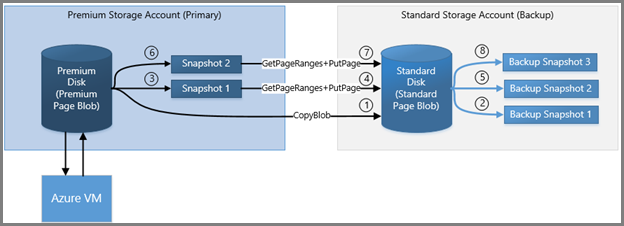
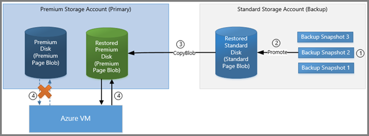

<properties
	pageTitle="Use incremental snapshots for backup and recovery of Azure virtual machines | Microsoft Azure"
	description="Create a custom solution for backup and recovery of your Azure virtual machine disks using incremental snapshots."
	services="storage"
	documentationCenter="na"
	authors="aungoo-msft"
	manager=""
	editor="tysonn"/>

<tags
	ms.service="storage"
	ms.workload="storage"
	ms.tgt_pltfrm="na"
	ms.devlang="na"
	ms.topic="article"
	ms.date="07/25/2016"
	ms.author="tamram;aungoo-msft"/>

# Back up Azure virtual machine disks with incremental snapshots

## Overview 

Azure Storage provides the capability to take snapshots of blobs. Snapshots capture the blob state at that point in time. In this article, we will describe a scenario of how you can maintain backups of virtual machine disks using snapshots. You can use this methodology when you choose not to use Azure Backup and Recovery Service, and wish to create a custom backup strategy for your virtual machine disks.

Azure virtual machine disks are stored as page blobs in Azure Storage. Since we are talking about backup strategy for virtual machine disks in this article, we will be referring to snapshots in the context of page blobs. To learn more about snapshots, refer to [Creating a Snapshot of a Blob](https://msdn.microsoft.com/library/azure/hh488361.aspx).

## What is a snapshot?

A blob snapshot is a read-only version of a blob that is captured at a point in time. Once a snapshot has been created, it can be read, copied, or deleted, but not modified. Snapshots provide a way to back up a blob as it appears at a moment in time. Until REST version 2015-04-05 you had the ability to copy full snapshots. With the REST version 2015-07-08 and above, you can also copy incremental snapshots.

## Full snapshot copy

Snapshots can be copied to another storage account as a blob to keep backups of the base blob. You can also copy a snapshot over its base blob, which is like restoring the blob to an earlier version. When a snapshot is copied from one storage account to another, it will occupy the same space as the base page blob. Therefore, copying whole snapshots from one storage account to another will be slow and will also consume lot of space in the target storage account.

>[AZURE.NOTE] If you copy the base blob to another destination, the snapshots of the blob are not copied along with it. Similarly, if you overwrite a base blob with a copy, snapshots associated with the base blob are not affected and stay intact under base blob name.

### Back up disks using snapshots

As a backup strategy for your virtual machine disks, you can take periodic snapshots of the disk or page blob, and copy them to another storage account using tools like [Copy Blob](https://msdn.microsoft.com/library/azure/dd894037.aspx) operation or [AzCopy](storage-use-azcopy.md). You can copy a snapshot to a destination page blob with a different name. The resulting destination page blob is a writeable page blob and not a snapshot. Later in this article we will describe steps to take backups of virtual machine disks using snapshots.

### Restore disks using snapshots

When it is time to restore your disk to a previous stable version captured in one of the backup snapshots, you can copy a snapshot over the base page blob. After the snapshot is promoted to the base page blob, the snapshot remains, but its source is overwritten with a copy that can be both read and written. Later in this article we will describe steps to restore a previous version of your disk from its snapshot.

### Implementing full snapshot copy

You can implement a full snapshot copy by doing the following,

-   First, take a snapshot of the base blob using the [Snapshot Blob](https://msdn.microsoft.com/library/azure/ee691971.aspx) operation.
-   Then, copy the snapshot to a target storage account using [Copy Blob](https://msdn.microsoft.com/library/azure/dd894037.aspx).
-   Repeat this process to maintain backup copies of your base blob.

## Incremental snapshot copy

The new feature in [GetPageRanges](https://msdn.microsoft.com/library/azure/ee691973.aspx) API provides a much better way to back up the snapshots of your page blobs or disks. The API returns the list of changes between the base blob and the snapshots. This reduces the amount of storage space used on the backup account. The API supports page blobs on Premium Storage as well as Standard Storage. Using this API, you can now build faster and efficient backup solutions for Azure VMs. This will be available with the REST version 2015-07-08 and higher.

Incremental Snapshot Copy allows you to copy from one storage account to another the difference between,

-   Base blob and its Snapshot OR
-   Any two snapshots of the base blob

Provided the following conditions are met, 

- The blob was created on Jan-1-2016 or later.
- The blob was not overwritten with [PutPage](https://msdn.microsoft.com/library/azure/ee691975.aspx) or [Copy Blob](https://msdn.microsoft.com/library/azure/dd894037.aspx) between two snapshots.

**Note**: This feature is available for Premium and Standard Azure Page Blobs.

When you have a custom backup strategy that uses snapshots, copying the snapshots from one storage account to another can be very slow and consumes a lot of storage space. Instead of copying the entire snapshot to a backup storage account, you can write the difference between consecutive snapshots to a backup page blob. This way, the time to copy and space to store backups is substantially reduced.

### Implementing Incremental Snapshot Copy

You can implement incremental snapshot copy by doing the following,

-   Take a snapshot of the base blob using [Snapshot Blob](https://msdn.microsoft.com/library/azure/ee691971.aspx).
-   Copy the snapshot to the target backup storage account using [Copy Blob](https://msdn.microsoft.com/library/azure/dd894037.aspx). This will be the backup page blob. Take a snapshot of this backup page blob and store in backup account.
-   Take another snapshot of the base blob using Snapshot Blob.
-   Get the difference between first and second snapshots of base blob using  [GetPageRanges](https://msdn.microsoft.com/library/azure/ee691973.aspx). Use the new parameter **prevsnapshot** to specify the DateTime value of the snapshot you want to get the difference with. When this parameter is present, the REST response will include only the pages that were changed between target snapshot and previous snapshot including clear pages.
-   Use [PutPage](https://msdn.microsoft.com/library/azure/ee691975.aspx) to apply these changes to the backup page blob.
-   Finally, take a snapshot of the backup page blob and store it in the backup storage account.

In the next section, we will describe in more detail how you can maintain backups of disks using Incremental Snapshot Copy

## Scenario

In this section we will describe a scenario that involves a custom backup strategy for virtual machine disks using snapshots.

Consider a DS-series Azure VM with a premium storage P30 disk attached. The P30 disk called *mypremiumdisk* is stored in a premium storage account called *mypremiumaccount*. A standard storage account called *mybackupstdaccount* will be used for storing the backup of *mypremiumdisk*. We would like to keep a snapshot of *mypremiumdisk* every 12 hours.

To learn about creating storage account and disks, refer to [About Azure storage accounts](storage-create-storage-account.md).

To learn about backing up Azure VMs, refer to [Plan Azure VM backups](../backup/backup-azure-vms-introduction.md).

## Steps to maintain backups of a disk using incremental snapshots

The steps described below will take snapshots of *mypremiumdisk* and maintain the backups in *mybackupstdaccount*. The backup will be a standard page blob called *mybackupstdpageblob*. The backup page blob will always reflect the same state as the last snapshot of *mypremiumdisk*.

1.  First, create the backup page blob for your premium storage disk. To do this, take a snapshot of *mypremiumdisk* called *mypremiumdisk_ss1*.
2.  Copy this snapshot to mybackupstdaccount as a page blob called *mybackupstdpageblob*.
3.  Take a snapshot of *mybackupstdpageblob* called *mybackupstdpageblob_ss1*, using [Snapshot Blob](https://msdn.microsoft.com/library/azure/ee691971.aspx) and store it in *mybackupstdaccount*.
4.  During the backup window, create another snapshot of *mypremiumdisk*, say *mypremiumdisk_ss2*, and store it in *mypremiumaccount*.
5.  Get the incremental changes between the two snapshots, *mypremiumdisk_ss2* and *mypremiumdisk_ss1*, using [GetPageRanges](https://msdn.microsoft.com/library/azure/ee691973.aspx) on *mypremiumdisk_ss2* with **prevsnapshot** parameter set to the timestamp of *mypremiumdisk_ss1*. Write these incremental changes to the backup page blob *mybackupstdpageblob* in *mybackupstdaccount*. If there are deleted ranges in the incremental changes, they must be cleared from the backup page blob. Use [PutPage](https://msdn.microsoft.com/library/azure/ee691975.aspx) to write incremental changes to the backup page blob.
6.  Take a snapshot of the backup page blob *mybackupstdpageblob*, called *mybackupstdpageblob_ss2*. Delete the previous snapshot *mypremiumdisk_ss1* from premium storage account.
7.  Repeat steps 4-6 every backup window. In this way, you can maintain backups of *mypremiumdisk* in a standard storage account.

## Steps to restore a disk from snapshots

The steps described below will restore premium disk, *mypremiumdisk* to an earlier snapshot from the backup storage account *mybackupstdaccount*.

1.  Identify the point in time you wish to restore the premium disk to. Let’s say that is snapshot *mybackupstdpageblob_ss2*, which is stored in the backup storage account *mybackupstdaccount*.
2.  In mybackupstdaccount, promote the snapshot *mybackupstdpageblob_ss2* as the new backup base page blob *mybackupstdpageblobrestored*.
3.  Take a snapshot of this restored backup page blob, called *mybackupstdpageblobrestored_ss1*.
4.  Copy the restored page blob *mybackupstdpageblobrestored* from *mybackupstdaccount* to *mypremiumaccount* as the new premium disk *mypremiumdiskrestored*.
5.  Take a snapshot of *mypremiumdiskrestored*, called *mypremiumdiskrestored_ss1* for making future incremental backups.
6.  Point the DS series VM to the restored disk *mypremiumdiskrestored* and detach the old *mypremiumdisk* from the VM.
7.  Begin the Backup process described in previous section for the restored disk *mypremiumdiskrestored*, using the *mybackupstdpageblobrestored* as the backup page blob.

## Next Steps

Learn more about creating snapshots of a blob and planning your VM backup infrastructure using the links below.

- [Creating a Snapshot of a Blob](https://msdn.microsoft.com/library/azure/hh488361.aspx)
- [Plan your VM Backup Infrastructure](../backup/backup-azure-vms-introduction.md)
