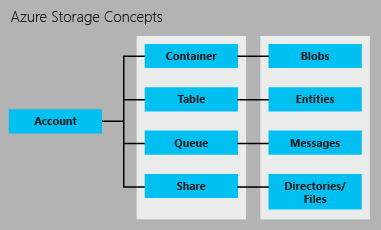

<properties
	pageTitle="Introduction to Storage | Microsoft Azure"
	description="An overview of Azure Storage, Microsoft's online data storage in the cloud. Learn how to use the best available cloud storage solution in your applications."
	services="storage"
	documentationCenter=""
	authors="tamram"
	manager="carmonm"
	editor="tysonn"/>

<tags
	ms.service="storage"
	ms.workload="storage"
	ms.tgt_pltfrm="na"
	ms.devlang="na"
	ms.topic="get-started-article"
	ms.date="07/21/2016"
	ms.author="tamram"/>

# Introduction to Microsoft Azure Storage

## Overview

Azure Storage is the cloud storage solution for modern applications that rely on durability, availability, and scalability to meet the needs of their customers. By reading this article, developers, IT Pros, and business decision makers can learn about:

- What Azure Storage is, and how you can take advantage of it in your cloud, mobile, server, and desktop applications
- What kinds of data you can store with the Azure Storage services: blob (object) data, NoSQL table data, queue messages, and file shares.
- How access to your data in Azure Storage is managed
- How your Azure Storage data is made durable via redundancy and replication
- Where to go next to build your first Azure Storage application

To get up and running with Azure Storage quickly, see [Get started with Azure Storage in five minutes](storage-getting-started-guide.md).

For details on tools, libraries, and other resources for working with Azure Storage, see [Next Steps](#next-steps) below.

## What is Azure Storage?

Cloud computing enables new scenarios for applications requiring scalable, durable, and highly available storage for their data – which is exactly why Microsoft developed Azure Storage. In addition to making it possible for developers to build large-scale applications to support new scenarios, Azure Storage also provides the storage foundation for Azure Virtual Machines, a further testament to its robustness.

Azure Storage is massively scalable, so you can store and process hundreds of terabytes of data to support the big data scenarios required by scientific, financial analysis, and media applications. Or you can store the small amounts of data required for a small business website. Wherever your needs fall, you pay only for the data you’re storing. Azure Storage currently stores tens of trillions of unique customer objects, and handles millions of requests per second on average.

Azure Storage is elastic, so you can design applications for a large global audience, and scale those applications as needed - both in terms of the amount of data stored and the number of requests made against it. You pay only for what you use, and only when you use it.

Azure Storage uses an auto-partitioning system that automatically load-balances your data based on traffic. This means that as the demands on your application grow, Azure Storage automatically allocates the appropriate resources to meet them.

Azure Storage is accessible from anywhere in the world, from any type of application, whether it’s running in the cloud, on the desktop, on an on-premises server, or on a mobile or tablet device. You can use Azure Storage in mobile scenarios where the application stores a subset of data on the device and synchronizes it with a full set of data stored in the cloud.

Azure Storage supports clients using a diverse set of operating systems (including Windows and Linux) and a variety of programming languages (including .NET, Java, Node.js, Python, Ruby, PHP and C++ and mobile programming languages) for convenient development. Azure Storage also exposes data resources via simple REST APIs, which are available to any client capable of sending and receiving data via HTTP/HTTPS.

Azure Premium Storage delivers high-performance, low-latency disk support for I/O intensive workloads running on Azure Virtual Machines. With Azure Premium Storage, you can attach multiple persistent data disks to a virtual machine and configure them to meet your performance requirements. Each data disk is backed by an SSD disk in Azure Premium Storage for maximum I/O performance. See [Premium Storage: High-Performance Storage for Azure Virtual Machine Workloads](storage-premium-storage.md) for more details.

## Introducing the Azure Storage Services

Azure storage provides the following four services: Blob storage, Table storage, Queue storage, and File storage.

- Blob Storage stores unstructured object data. A blob can be any type of text or binary data, such as a document, media file, or application installer. Blob storage is also referred to as Object storage.
- Table Storage stores structured datasets. Table storage is a NoSQL key-attribute data store, which allows for rapid development and fast access to large quantities of data.
- Queue Storage provides reliable messaging for workflow processing and for communication between components of cloud services.
- File Storage offers shared storage for legacy applications using the standard SMB protocol. Azure virtual machines and cloud services can share file data across application components via mounted shares, and on-premises applications can access file data in a share via the File service REST API.

An Azure storage account is a secure account that gives you access to services in Azure Storage. Your storage account provides the unique namespace for your storage resources. The image below shows the relationships between the Azure storage resources in a storage account:

[AZURE.INCLUDE [storage-account-types-include](../../includes/storage-account-types-include.md)]

[AZURE.INCLUDE [storage-versions-include](../../includes/storage-versions-include.md)]

## Blob Storage

For users with large amounts of unstructured object data to store in the cloud, Blob storage offers a cost-effective and scalable solution. You can use Blob storage to store content such as:

- Documents
- Social data such as photos, videos, music, and blogs
- Backups of files, computers, databases, and devices
- Images and text for web applications
- Configuration data for cloud applications
- Big data, such as logs and other large datasets

Every blob is organized into a container. Containers also provide a useful way to assign security policies to groups of objects. A storage account can contain any number of containers, and a container can contain any number of blobs, up to the 500 TB capacity limit of the storage account.  

Blob storage offers three types of blobs, block blobs, append blobs, and page blobs (disks).

- Block blobs are optimized for streaming and storing cloud objects, and are a good choice for storing documents, media files, backups etc.
- Append blobs are similar to block blobs, but are optimized for append operations. An append blob can be updated only by adding a new block to the end. Append blobs are a good choice for scenarios such as logging, where new data needs to be written only to the end of the blob.
- Page blobs are optimized for representing IaaS disks and supporting random writes, and may be up to 1 TB in size. An Azure virtual machine network attached IaaS disk is a VHD stored as a page blob.

For very large datasets where network constraints make uploading or downloading data to Blob storage over the wire unrealistic, you can ship a hard drive to Microsoft to import or export data directly from the data center. See [Use the Microsoft Azure Import/Export Service to Transfer Data to Blob Storage](storage-import-export-service.md).

## Table storage

Modern applications often demand data stores with greater scalability and flexibility than previous generations of software required. Table storage offers highly available, massively scalable storage, so that your application can automatically scale to meet user demand. Table storage is Microsoft’s NoSQL key/attribute store – it has a schemaless design, making it different from traditional relational databases. With a schemaless data store, it's easy to adapt your data as the needs of your application evolve. Table storage is easy to use, so developers can create applications quickly. Access to data is fast and cost-effective for all kinds of applications.  Table storage is typically significantly lower in cost than traditional SQL for similar volumes of data.

Table storage is a key-attribute store, meaning that every value in a table is stored with a typed property name. The property name can be used for filtering and specifying selection criteria. A collection of properties and their values comprise an entity. Since Table storage is schemaless, two entities in the same table can contain different collections of properties, and those properties can be of different types.

You can use Table storage to store flexible datasets, such as user data for web applications, address books, device information, and any other type of metadata that your service requires.  You can store any number of entities in a table, and a storage account may contain any number of tables, up to the capacity limit of the storage account.

Like Blobs and Queues, developers can manage and access Table storage using standard REST protocols, however Table storage also supports a subset of the OData protocol, simplifying advanced querying capabilities and enabling both JSON and AtomPub (XML based) formats.

For today's Internet-based applications, NoSQL databases like Table storage offer a popular alternative to traditional relational databases.

## Queue Storage

In designing applications for scale, application components are often decoupled, so that they can scale independently. Queue storage provides a reliable messaging solution for asynchronous communication between application components, whether they are running in the cloud, on the desktop, on an on-premises server, or on a mobile device. Queue storage also supports managing asynchronous tasks and building process workflows.

A storage account can contain any number of queues. A queue can contain any number of messages, up to the capacity limit of the storage account. Individual messages may be up to 64 KB in size.

## File Storage

Azure File storage offers cloud-based SMB file shares, so that you can migrate legacy applications that rely on file shares to Azure quickly and without costly rewrites. With Azure File storage, applications running in Azure virtual machines or cloud services can mount a file share in the cloud, just as a desktop application mounts a typical SMB share. Any number of application components can then mount and access the File storage share simultaneously.

Since a File storage share is a standard SMB file share, applications running in Azure can access data in the share via file sytem I/O APIs. Developers can therefore leverage their existing code and skills to migrate existing applications. IT Pros can use PowerShell cmdlets to create, mount, and manage File storage shares as part of the administration of Azure applications.

Like the other Azure storage services, File storage exposes a REST API for accessing data in a share. On-premise applications can call the File storage REST API to access data in a file share. This way, an enterprise can choose to migrate some legacy applications to Azure and continue running others from within their own organization. Note that mounting a file share is only possible for applications running in Azure; an on-premises application may only access the file share via the REST API.

Distributed applications can also use File storage to store and share useful application data and development and testing tools. For example, an application may store configuration files and diagnostic data such as logs, metrics, and crash dumps in a File storage share so that they are available to multiple virtual machines or roles. Developers and administrators can store utilities that they need to build or manage an application in a File storage share that is available to all components, rather than installing them on every virtual machine or role instance.

## Access to Blob, Table, Queue, and File Resources

By default, only the storage account owner can access resources in the storage account. For the security of your data, every request made against resources in your account must be authenticated. Authentication relies on a Shared Key model. Blobs can also be configured to support anonymous authentication.

Your storage account is assigned two private access keys on creation that are used for authentication. Having two keys ensures that your application remains available when you regularly regenerate the keys as a common security key management practice.

If you do need to allow users controlled access to your storage resources, then you can create a shared access signature. A shared access signature (SAS) is a token that can be appended to a URL that enables delegated access to a storage resource. Anyone who possesses the token can access the resource it points to with the permissions it specifies, for the period of time that it is valid. Beginning with version 2015-04-05, Azure Storage supports two kinds of shared access signatures: service SAS and account SAS.

The service SAS delegates access to a resource in just one of the storage services: the Blob, Queue, Table, or File service.

An account SAS delegates access to resources in one or more of the storage services. You can delegate access to service-level operations that are not available with a service SAS. You can also delegate access to read, write, and delete operations on blob containers, tables, queues, and file shares that are not permitted with a service SAS.

Finally, you can specify that a container and its blobs, or a specific blob, are available for public access. When you indicate that a container or blob is public, anyone can read it anonymously; no authentication is required.  Public containers and blobs are useful for exposing resources such as media and documents that are hosted on websites.  To decrease network latency for a global audience, you can cache blob data used by websites with the Azure CDN.

See [Shared Access Signatures: Understanding the SAS Model](storage-dotnet-shared-access-signature-part-1.md) for more information on shared access signatures. See [Manage anonymous read access to containers and blobs](storage-manage-access-to-resources.md) and [Authentication for the Azure Storage Services](https://msdn.microsoft.com/library/azure/dd179428.aspx) for more information on secure access to your storage account.

## Replication for Durability and High Availability

The data in your Microsoft Azure storage account is always replicated to ensure durability and high availability, meeting the [SLA for Storage](https://azure.microsoft.com/support/legal/sla/storage/) even in the face of transient hardware failures. 

See [Azure Regions](https://azure.microsoft.com/regions/#services) for more information about what services are available in each region.

When you create a storage account, you must select one of the following replication options:  

- **Locally redundant storage (LRS).** Locally redundant storage maintains three copies of your data. LRS is replicated three times within a single facility in a single region. LRS protects your data from normal hardware failures, but not from the failure of a single facility.  
  
	LRS is offered at a discount. For maximum durability, we recommend that you use geo-redundant storage, described below.

- **Zone-redundant storage (ZRS).** Zone-redundant storage maintains three copies of your data. ZRS is replicated three times across two to three facilities, either within a single region or across two regions, providing higher durability than LRS. ZRS ensures that your data is durable within a single region.  

	ZRS provides a higher level of durability than LRS; however, for maximum durability, we recommend that you use geo-redundant storage, described below.  

	> [AZURE.NOTE] ZRS is currently available only for block blobs, and is only supported for versions 2014-02-14 and later.
	> 
	> Once you have created your storage account and selected ZRS, you cannot convert it to use to any other type of replication, or vice versa. 

- **Geo-redundant storage (GRS)**. Geo-redundant storage is enabled for your storage account by default when you create it. GRS maintains six copies of your data. With GRS, your data is replicated three times within the primary region, and is also replicated three times in a secondary region hundreds of miles away from the primary region, providing the highest level of durability. In the event of a failure at the primary region, Azure Storage will failover to the secondary region. GRS ensures that your data is durable in two separate regions.

	For information about primary and secondary pairings by region, see [Azure Regions](https://azure.microsoft.com/regions/).

- **Read access geo-redundant storage (RA-GRS)**. Read access geo-redundant storage replicates your data to a secondary geographic location, and also provides read access to your data in the secondary location. Read-access geo-redundant storage allows you to access your data from either the primary or the secondary location, in the event that one location becomes unavailable.

	> [AZURE.IMPORTANT] You can change how your data is replicated after your storage account has been created, unless you specified ZRS when you created the account. However, note that you may incur an additional one-time data transfer cost if you switch from LRS to GRS or RA-GRS.
 
See [Azure Storage replication](storage-redundancy.md) for additional details about storage replication options.

For pricing information for storage account replication, see [Azure Storage Pricing](https://azure.microsoft.com/pricing/details/storage/).

For architectural details about durability with Azure Storage, see [SOSP Paper - Azure Storage: A Highly Available Cloud Storage Service with Strong Consistency](http://blogs.msdn.com/b/windowsazurestorage/archive/2011/11/20/windows-azure-storage-a-highly-available-cloud-storage-service-with-strong-consistency.aspx).

## Transferring Data to and from Azure Storage

You can use the AzCopy command-line utility to copy blob, file, and table data within your storage account or across storage accounts. See [Transfer data with the AzCopy Command-Line Utility](storage-use-azcopy.md) for more information.

AzCopy is built on top of the [Azure Data Movement Library](https://www.nuget.org/packages/Microsoft.Azure.Storage.DataMovement/), which is currently available in preview.

The Azure Import/Export service provides a way to import blob data into or export blob data from your storage account via a hard drive disk mailed to the Azure data center. For more information about the Import/Export service, see [Use the Microsoft Azure Import/Export Service to Transfer Data to Blob Storage](storage-import-export-service.md).

## Pricing

[AZURE.INCLUDE [storage-account-billing-include](../../includes/storage-account-billing-include.md)]

## Storage APIs, Libraries, and Tools

Azure Storage resources can be accessed by any language that can make HTTP/HTTPS requests. Additionally, Azure Storage offers programming libraries for several popular languages. These libraries simplify many aspects of working with Azure Storage by handling details such as synchronous and asynchronous invocation, batching of operations, exception management, automatic retries, operational behavior and so forth. Libraries are currently available for the following languages and platforms, with others in the pipeline:

### Azure Storage Data Services

- [Storage Services REST API](http://msdn.microsoft.com/library/azure/dd179355.aspx)
- [Storage Client Library for .NET, Windows Phone, and Windows Runtime](https://www.nuget.org/packages/WindowsAzure.Storage/)
- [Storage Client Library for C++](https://github.com/Azure/azure-storage-cpp)
- [Storage Client Library for Java/Android](/develop/java/)
- [Storage Client Library for Node.js](http://dl.windowsazure.com/nodestoragedocs/index.html)
- [Storage Client Library for PHP](/develop/php/)
- [Storage Client Library for Ruby](/develop/ruby/)
- [Storage Client Library for Python](/develop/python/)
- [Storage Cmdlets for PowerShell 1.0](https://msdn.microsoft.com/library/azure/mt269418.aspx)

### Azure Storage Management Services

- [Storage Resource Provider REST API Reference](https://msdn.microsoft.com/library/azure/mt163683.aspx)
- [Storage Resource Provider Client Library for .NET](https://msdn.microsoft.com/library/azure/mt131037.aspx)
- [Storage Resource Provider Cmdlets for PowerShell 1.0](https://msdn.microsoft.com/library/azure/mt607151.aspx)
- [Storage Service Management REST API (Classic)](https://msdn.microsoft.com/library/azure/ee460790.aspx)

### Azure Storage Data Movement Services

- [Storage Import/Export Service REST API](https://msdn.microsoft.com/library/azure/dn529096.aspx)
- [Storage Data Movement Client Library for .NET](https://www.nuget.org/packages/Microsoft.Azure.Storage.DataMovement/)

### Tools and Utilities

- [Azure Storage Explorer](http://go.microsoft.com/fwlink/?LinkID=822673&clcid=0x409)
- [Azure Storage Client Tools](storage-explorers.md)
- [Azure SDKs and Tools](https://azure.microsoft.com/tools/)
- [Azure Storage Emulator](http://www.microsoft.com/download/details.aspx?id=43709)
- [Azure PowerShell](../powershell-install-configure.md)
- [AzCopy Command-Line Utility](http://aka.ms/downloadazcopy)

## Next Steps

To learn more about Azure Storage, explore these resources:

### Documentation

- [Azure Storage Documentation](https://azure.microsoft.com/documentation/services/storage/)

### For Administrators

- [Using Azure PowerShell with Azure Storage](storage-powershell-guide-full.md)
- [Using Azure CLI with Azure Storage](storage-azure-cli.md)

### For .NET Developers

- [Get started with Azure Blob storage using .NET](storage-dotnet-how-to-use-blobs.md)
- [Get started with Azure Table storage using .NET](storage-dotnet-how-to-use-tables.md)
- [Get started with Azure Queue storage using .NET](storage-dotnet-how-to-use-queues.md)
- [Get started with Azure File storage on Windows](storage-dotnet-how-to-use-files.md)

### For Java/Android Developers

- [How to use Blob storage from Java](storage-java-how-to-use-blob-storage.md)
- [How to use Table storage from Java](storage-java-how-to-use-table-storage.md)
- [How to use Queue storage from Java](storage-java-how-to-use-queue-storage.md)
- [How to use File storage from Java](storage-java-how-to-use-file-storage.md)

### For Node.js Developers

- [How to use Blob storage from Node.js](storage-nodejs-how-to-use-blob-storage.md)
- [How to use Table storage from Node.js](storage-nodejs-how-to-use-table-storage.md)
- [How to use Queue storage from Node.js](storage-nodejs-how-to-use-queues.md)

### For PHP Developers

- [How to use Blob storage from PHP](storage-php-how-to-use-blobs.md)
- [How to use Table storage from PHP](storage-php-how-to-use-table-storage.md)
- [How to use Queue storage from PHP](storage-php-how-to-use-queues.md)

### For Ruby Developers

- [How to use Blob storage from Ruby](storage-ruby-how-to-use-blob-storage.md)
- [How to use Table storage from Ruby](storage-ruby-how-to-use-table-storage.md)
- [How to use Queue storage from Ruby](storage-ruby-how-to-use-queue-storage.md)

### For Python Developers

- [How to use Blob storage from Python](storage-python-how-to-use-blob-storage.md)
- [How to use Table storage from Python](storage-python-how-to-use-table-storage.md)
- [How to use Queue storage from Python](storage-python-how-to-use-queue-storage.md)
- [How to use File storage from Python](storage-python-how-to-use-file-storage.md)
