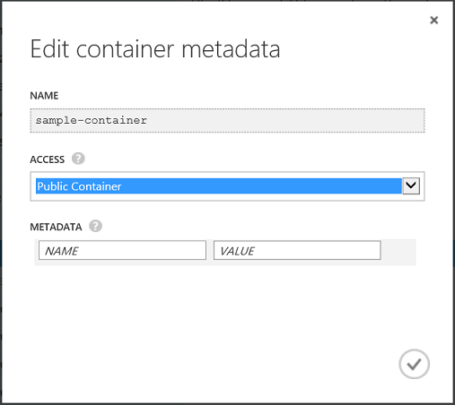

<properties 
	pageTitle="Manage anonymous read access to containers and blobs | Microsoft Azure" 
	description="Learn how to make containers and blobs available for anonymous access, and how to access them programmatically." 
	services="storage" 
	documentationCenter="" 
	authors="tamram" 
	manager="carmonm" 
	editor="tysonn"/>

<tags 
	ms.service="storage" 
	ms.workload="storage" 
	ms.tgt_pltfrm="na" 
	ms.devlang="na" 
	ms.topic="article" 
	ms.date="05/23/2016"
	ms.author="tamram"/>

# Manage anonymous read access to containers and blobs

## Overview

By default, only the owner of the storage account may access storage resources within that account. For Blob storage only, you can set a container's permissions to permit anonymous read access to the container and its blobs, so that you can grant access to those resources without sharing your account key.

Anonymous access is best for scenarios where you want certain blobs to always be available for anonymous read access. For finer-grained control, you can create a shared access signature, which enables you to delegate restricted access using different permissions and over a specified time interval. For more information about creating shared access signatures, see [Shared Access Signatures: Understanding the SAS Model](storage-dotnet-shared-access-signature-part-1.md).

## Grant anonymous users permissions to containers and blobs

By default, a container and any blobs within it may be accessed only by the owner of the storage account. To give anonymous users read permissions to a container and its blobs, you can set the container permissions to allow public access. Anonymous users can read blobs within a publicly accessible container without authenticating the request.

Containers provide the following options for managing container access:

- **Full public read access:** Container and blob data can be read via anonymous request. Clients can enumerate blobs within the container via anonymous request, but cannot enumerate containers within the storage account.

- **Public read access for blobs only:** Blob data within this container can be read via anonymous request, but container data is not available. Clients cannot enumerate blobs within the container via anonymous request.

- **No public read access:** Container and blob data can be read by the account owner only.

You can set container permissions in the following ways:

- From the [Azure Portal](https://portal.azure.com).
- Programmatically, by using the storage client library or the REST API.
- By using PowerShell. To learn about setting container permissions from Azure PowerShell, see [Using Azure PowerShell with Azure Storage](storage-powershell-guide-full.md#how-to-manage-azure-blobs).

### Setting container permissions from the Azure Portal

To set container permissions from the [Azure Portal](https://portal.azure.com), follow these steps:

1. Navigate to the dashboard for your storage account.
2. Select the container name from the list. Note that you must click to the right of the Name column to select the container name. Clicking the name drills down into the container to show its blobs.
3. Select **Edit** from the toolbar.
4. In the **Edit Container Metadata** dialog, select your desired level of permissions from the **Access** field, as shown in the screenshot below.

	

### Setting container permissions programmatically using .NET

To set permissions for a container using the .NET client library, first retrieve the container's existing permissions by calling the **GetPermissions** method. Then set the **PublicAccess** property for the **BlobContainerPermissions** object that is returned by the **GetPermissions** method. Finally, call the **SetPermissions** method with the updated permissions.

The following example sets the container's permissions to full public read access. To set permissions to public read access for blobs only, set the **PublicAccess** property to **BlobContainerPublicAccessType.Blob**. To remove all permissions for anonymous users, set the property to **BlobContainerPublicAccessType.Off**.

    public static void SetPublicContainerPermissions(CloudBlobContainer container)
    {
        BlobContainerPermissions permissions = container.GetPermissions();
        permissions.PublicAccess = BlobContainerPublicAccessType.Container;
        container.SetPermissions(permissions);
    }

## Access containers and blobs anonymously

A client that accesses containers and blobs anonymously can use constructors that do not require credentials. The following examples show a few different ways to reference Blob service resources anonymously. 

### Create an anonymous client object

You can create a new service client object for anonymous access by providing the Blob service endpoint for the account. However, you must also know the name of a container in that account that's available for anonymous access.

    public static void CreateAnonymousBlobClient()
    {
        // Create the client object using the Blob service endpoint.
        CloudBlobClient blobClient = new CloudBlobClient(new Uri(@"https://storagesample.blob.core.windows.net"));

        // Get a reference to a container that's available for anonymous access.
        CloudBlobContainer container = blobClient.GetContainerReference("sample-container");

        // Read the container's properties. Note this is only possible when the container supports full public read access.
        container.FetchAttributes();
        Console.WriteLine(container.Properties.LastModified);
        Console.WriteLine(container.Properties.ETag);
    }

### Reference a container anonymously

If you have the URL to a container that is anonymously available, you can use it to reference the container directly.

    public static void ListBlobsAnonymously()
    {
        // Get a reference to a container that's available for anonymous access.
        CloudBlobContainer container = new CloudBlobContainer(new Uri(@"https://storagesample.blob.core.windows.net/sample-container"));

        // List blobs in the container.
        foreach (IListBlobItem blobItem in container.ListBlobs())
        {
            Console.WriteLine(blobItem.Uri);
        }
    }

### Reference a blob anonymously

If you have the URL to a blob that is available for anonymous access, you can reference the blob directly using that URL:

    public static void DownloadBlobAnonymously()
    {
        CloudBlockBlob blob = new CloudBlockBlob(new Uri(@"https://storagesample.blob.core.windows.net/sample-container/logfile.txt"));
        blob.DownloadToFile(@"C:\Temp\logfile.txt", System.IO.FileMode.Create);
    }

## Features available to anonymous users

The following table shows which operations may be called by anonymous users when a container's ACL is set to allow public access.

| REST Operation                                         | Permission with full public read access | Permission with public read access for blobs only |
|--------------------------------------------------------|-----------------------------------------|---------------------------------------------------|
| List Containers                                        | Owner only                              | Owner only                                        |
| Create Container                                       | Owner only                              | Owner only                                        |
| Get Container Properties                               | All                                     | Owner only                                        |
| Get Container Metadata                                 | All                                     | Owner only                                        |
| Set Container Metadata                                 | Owner only                              | Owner only                                        |
| Get Container ACL                                      | Owner only                              | Owner only                                        |
| Set Container ACL                                      | Owner only                              | Owner only                                        |
| Delete Container                                       | Owner only                              | Owner only                                        |
| List Blobs                                             | All                                     | Owner only                                        |
| Put Blob                                               | Owner only                              | Owner only                                        |
| Get Blob                                               | All                                     | All                                               |
| Get Blob Properties                                    | All                                     | All                                               |
| Set Blob Properties                                    | Owner only                              | Owner only                                        |
| Get Blob Metadata                                      | All                                     | All                                               |
| Set Blob Metadata                                      | Owner only                              | Owner only                                        |
| Put Block                                              | Owner only                              | Owner only                                        |
| Get Block List (committed blocks only)                 | All                                     | All                                               |
| Get Block List (uncommitted blocks only or all blocks) | Owner only                              | Owner only                                        |
| Put Block List                                         | Owner only                              | Owner only                                        |
| Delete Blob                                            | Owner only                              | Owner only                                        |
| Copy Blob                                              | Owner only                              | Owner only                                        |
| Snapshot Blob                                          | Owner only                              | Owner only                                        |
| Lease Blob                                             | Owner only                              | Owner only                                        |
| Put Page                                               | Owner only                              | Owner only                                        |
| Get Page Ranges                                        | All                                     | All                                                  |
| Append Blob                                            | Owner only                              | Owner only                                                  |

## See Also

- [Authentication for the Azure Storage Services](https://msdn.microsoft.com/library/azure/dd179428.aspx)
- [Shared access signatures: Understanding the SAS Model](storage-dotnet-shared-access-signature-part-1.md)
- [Delegating Access with a Shared Access Signature](https://msdn.microsoft.com/library/azure/ee395415.aspx) 
