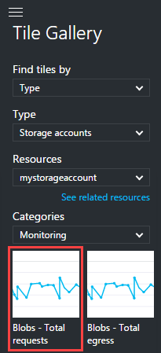

# Monitor a storage account in the Azure portal

## Overview
You can use the [Azure portal](https://portal.azure.com) to monitor your Azure Storage account. Azure Storage uses [Storage Analytics](storage-analytics.md) to track metrics for your account and log request data, and by using the portal, you can configure both.

> [!NOTE]
> Additional costs are associated with examining monitoring data in the Azure portal. For more information, see <a href="http://msdn.microsoft.com/library/azure/hh360997.aspx">Storage Analytics and Billing</a>.  
> 
> For an in-depth guide on using Storage Analytics and other tools to identify, diagnose, and troubleshoot Azure Storage-related issues, see [Monitor, diagnose, and troubleshoot Microsoft Azure Storage](storage-monitoring-diagnosing-troubleshooting.md).
>

## How to: Configure monitoring for a storage account

1. In the [Azure portal](https://portal.azure.com), select **Storage accounts**, then the storage account name to open the account dashboard.
1. To open the **Diagnostic blade**, scroll down to the **MONITORING** section of the **Menu blade** and select **Diagnostics**.
   
    
1. Select the **type** of metrics data for each **service** you wish to monitor, and the **retention policy** for the data. You can also disable monitoring by setting **Status** to **Off**.

   There are two types of metrics you can enable for each service, both of which are enabled by default for new storage accounts:

   * **Aggregate**: Collects metrics such as ingress/egress, availability, latency, and success percentages, which are aggregated for the blob, queue, table, and file services.
   * **Per API**: In addition to the aggregate metrics, collects the same set of metrics for each storage operation in the Azure Storage service API.

   To set the data retention policy, move the **Retention (days)** slider or enter the number of days of data to retain, from 1 to 365. The default for new storage accounts is 7 days. If you do not want to set a retention policy, enter zero. If there is no retention policy, it is up to you to delete the monitoring data.

   > [!TIP]
   > We recommend setting a retention policy based on how long you want to retain storage analytics data for your account so that old and unused analytics data can be deleted by the system at no cost. You are charged when you manually delete metrics data. See [What charges do you incur when you enable storage metrics?](storage-enable-and-view-metrics.md#what-charges-do-you-incur-when-you-enable-storage-metrics) for more information.
   >

1. When you finish the monitoring configuration, select **Save**.

You should start seeing monitoring data in the charts on the storage account blade and the **Metrics** blade of the services you selected to monitor after about an hour. A default set of metrics is displayed in charts for each service. You can select **Edit** on any metrics chart to configure which metrics are displayed in the chart.

> [!NOTE]
> Azure Storage uses [table storage](storage-introduction.md#table-storage) to store the metrics for your storage account, and stores the metrics in tables in your account. For more information, see [How metrics are stored](storage-analytics.md#how-metrics-are-stored).
>

## How to: Customize metrics charts

Use the following procedure to choose which storage metrics to view in metrics charts. These settings do not affect the collection, aggregation, and storage of monitoring data in the storage account.

* If your storage account has **aggregate** monitoring configured, metrics such as ingress/egress, availability, latency, and success percentages are aggregated from the blob, table, and queue services.
* If your storage account has **per API** monitoring configured, the metrics are available at a finer resolution of individual storage operations in addition to the service-level aggregates.

TODO

## How to: Add metrics charts to the storage account blade

A default set of metrics charts are displayed on the storage account blade. Use the following procedure to choose which storage metrics charts to display on your storage account blade.

1. In the [Azure portal](https://portal.azure.com), click **Storage**, and then click the name of the storage account to open the dashboard.
1. Select 

TODO

## How to: Add metrics charts to the portal dashboard

You can add Azure Storage metrics charts for any of your storage accounts to your portal dashboard.

1. Select click **Edit dashboard** while viewing your dashboard in the [Azure portal](https://portal.azure.com).
1. In the **Tile Gallery**, select **Find tiles by** > **Type**.
1. Select **Type** > **Storage accounts**.
1. In **Resources**, select the storage account whose metrics you wish to add to the dashboard.
1. Select **Categories** > **Monitoring**.
1. Drag-and-drop the chart tile onto your dashboard for the metric you'd like displayed. Repeat for all metrics you'd like displayed on the dashboard. In the following image, the "Blobs - Total requests" chart is highlighted as an example, but all of the charts are available for placement on your dashboard.
1. Select **Done customizing** near the top of the dashboard when you're done adding charts.

   

Once you've added charts to your dashboard, you can further customize them as described in [How to: Customize metrics charts](#how-to-customize-metrics-charts).

## How to: Configure logging

For each of the storage services available with your storage account (blob, table, and queue), you can save diagnostics logs for Read Requests, Write Requests, and/or Delete Requests, and can set the data retention policy for each of the services.

1. In the [Azure portal](https://portal.azure.com), select **Storage accounts**, then the name of the storage account to open the storage account blade.
1. Open the **Diagnostic blade**--scroll down to the **MONITORING** section of the **Menu blade** and select **Diagnostics**.
1. Select the **services** for which you'd like to enable logging.

    
1. Click **Save**.

The diagnostics logs are saved in a blob container named $logs in your storage account. For information about accessing the $logs container, see [About Storage Analytics Logging](http://msdn.microsoft.com/library/azure/hh343262.aspx).

> [!NOTE]
> Azure File storage currently supports Storage Analytics metrics, but does not yet support logging.
>

## Next steps

* TODO

