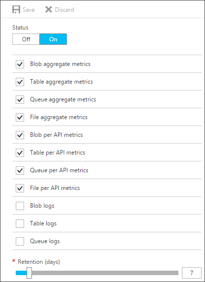
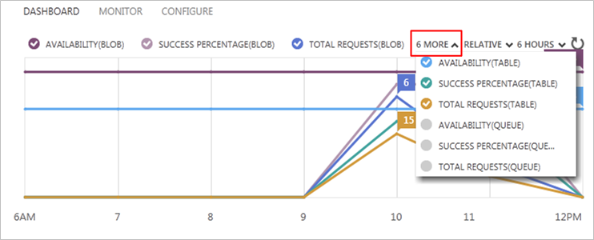
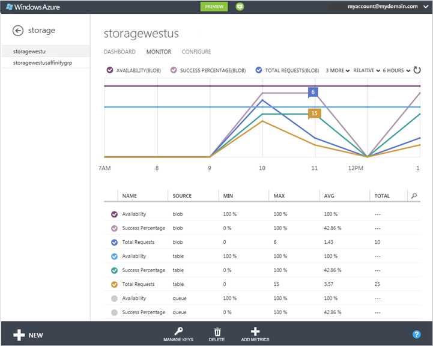
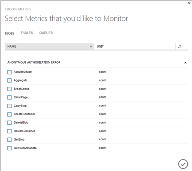
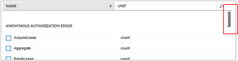
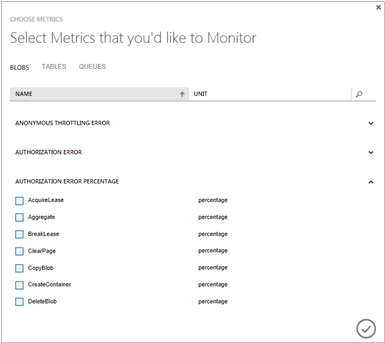
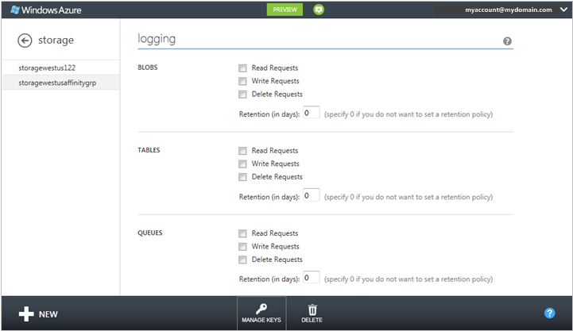

# Monitor a storage account in the Azure portal

## Overview
You can use the [Azure portal](https://portal.azure.com) to monitor your Azure Storage account. Azure Storage uses [Storage Analytics](storage-analytics.md) to track metrics for your account and log request data, and by using the portal, you can configure both.

> [!NOTE]
> Additional costs are associated with examining monitoring data in the Azure portal. For more information, see <a href="http://msdn.microsoft.com/library/azure/hh360997.aspx">Storage Analytics and Billing</a>.  
> 
> For an in-depth guide on using Storage Analytics and other tools to identify, diagnose, and troubleshoot Azure Storage-related issues, see [Monitor, diagnose, and troubleshoot Microsoft Azure Storage](storage-monitoring-diagnosing-troubleshooting.md).
>

## How to: Configure monitoring for a storage account

1. In the [Azure portal](https://portal.azure.com), select **Storage accounts**, then the storage account name to open the account dashboard.
1. To open the **Diagnostic blade**, scroll down to the **MONITORING** section of the **Menu blade** and select **Diagnostics**.
   
    
1. Select the **services** you wish to monitor and the **data retention policy** for the metrics data. You can also disable monitoring by setting **Status** to **Off**.

   There are two types of metrics you can enable for each service:

   * **Aggregate metrics**: 
   * **Per API metrics**:

   To set the data retention policy, move the **Retention (days)** slider or enter the number of days of data to retain, from 1 to 365. If you do not want to set a retention policy, enter zero. If there is no retention policy, it is up to you to delete the monitoring data. We recommend setting a retention policy based on how long you want to retain storage analytics data for your account so that old and unused analytics data can be deleted by the system at no cost.

1. When you finish the monitoring configuration, select **Save**.

You should start seeing monitoring data on the storage account blade and the **Metrics** blade of the services you selected to monitor after about an hour.

After you enable monitoring and set a retention policy, you can choose which of the available metrics to monitor in the [Azure portal](https://portal.azure.com), and which metrics to plot in the metrics charts. A default set of metrics is displayed for each service. You can select **Edit** on a metrics chart to configure which metrics are displayed in the chart.

Azure Storage uses [table storage](storage-introduction.md#table-storage) to store the metrics for your storage account, and stores the metrics in tables in your account. For more information, see [How metrics are stored](storage-analytics.md#how-metrics-are-stored).

## How to: Customize the dashboard for monitoring

You can configure the metrics charts on your storage account dashboard to display metrics for your storage services.

1. In the [Azure portal](https://portal.azure.com), click **Storage**, and then click the name of the storage account to open the dashboard.
2. To change the metrics that are plotted on the chart, take one of the following actions:
   
   * To add a new metric to the chart, click the colored check box next to the metric header in the table below the chart.
   * To hide a metric that is plotted on the chart, clear the colored check box next to the metric header.
     
       
3. By default, the chart shows trends, displaying only the current value of each metric (the **Relative** option at the top of the chart). To display a Y axis so you can see absolute values, select **Absolute**.
4. To change the time range the metrics chart displays, select 6 hours, 24 hours, or 7 days at the top of the chart.

## How to: Customize the Monitor page

On the **Monitor** page, you can view the full set of metrics for your storage account.

* If your storage account has minimal monitoring configured, metrics such as ingress/egress, availability, latency, and success percentages are aggregated from the blob, table, and queue services.
* If your storage account has verbose monitoring configured, the metrics are available at a finer resolution of individual storage operations in addition to the service-level aggregates.

Use the following procedures to choose which storage metrics to view in the metrics charts and table that are displayed on the **Monitor** page. These settings do not affect the collection, aggregation, and storage of monitoring data in the storage account.

## How to: Add metrics to the metrics table

1. In the [Azure portal](https://portal.azure.com), click **Storage**, and then click the name of the storage account to open the dashboard.
2. Click **Monitor**.
   
    The **Monitor** page opens. By default, the metrics table displays a subset of the metrics that are available for monitoring. The illustration shows the default Monitor display for a storage account with verbose monitoring configured for all three services. Use **Add Metrics** to select the metrics you want to monitor from all available metrics.
   
    
   
   > [!NOTE]
   > Consider costs when you select the metrics. There are transaction and egress costs associated with refreshing monitoring displays. For more information, see [Storage Analytics and Billing](http://msdn.microsoft.com/library/azure/hh360997.aspx).
   > 
   > 
3. Click **Add Metrics**.
   
    The aggregate metrics that are available in minimal monitoring are at the top of the list. If the check box is selected, the metric is displayed in the metrics list.
   
    
4. Hover over the right side of the dialog box to display a scrollbar that you can drag to scroll additional metrics into view.
   
    
5. Click the down arrow by a metric to expand a list of operations the metric is scoped to include. Select each operation that you want to view in the metrics table in the [Azure portal](https://portal.azure.com).
   
    In the following illustration, the AUTHORIZATION ERROR PERCENTAGE metric has been expanded.
   
    
6. After you select metrics for all services, click OK (checkmark) to update the monitoring configuration. The selected metrics are added to the metrics table.
7. To delete a metric from the table, click the metric to select it, and then click **Delete Metric**.
   
    

## How to: Customize the metrics chart on the Monitor page

1. On the **Monitor** page for the storage account, in the metrics table, select up to 6 metrics to plot on the metrics chart. To select a metric, click the check box on its left side. To remove a metric from the chart, clear the check box.
2. To switch the chart between relative values (final value only displayed) and absolute values (Y axis displayed), select **Relative** or **Absolute** at the top of the chart.
3. To change the time range the metrics chart displays, select **6 hours**, **24 hours**, or **7 days** at the top of the chart.

## How to: Configure logging

For each of the storage services available with your storage account (blob, table, and queue), you can save diagnostics logs for Read Requests, Write Requests, and/or Delete Requests, and can set the data retention policy for each of the services.

> [!NOTE]
> Azure File storage currently supports Storage Analytics metrics, but does not yet support logging.
>

1. In the [Azure portal](https://portal.azure.com), click **Storage**, and then click the name of the storage account to open the dashboard.
2. Click **Configure**, and use the Down arrow on the keyboard to scroll down to **logging**.
   
    
3. For each service (blob, table, and queue), configure the following:
   
   * The types of request to log: Read Requests, Write Requests, and Delete Requests.
   * The number of days to retain the logged data. Enter zero is if you do not want to set a retention policy. If you do not set a retention policy, it is up to you to delete the logs.
4. Click **Save**.

The diagnostics logs are saved in a blob container named $logs in your storage account. For information about accessing the $logs container, see [About Storage Analytics Logging](http://msdn.microsoft.com/library/azure/hh343262.aspx).

