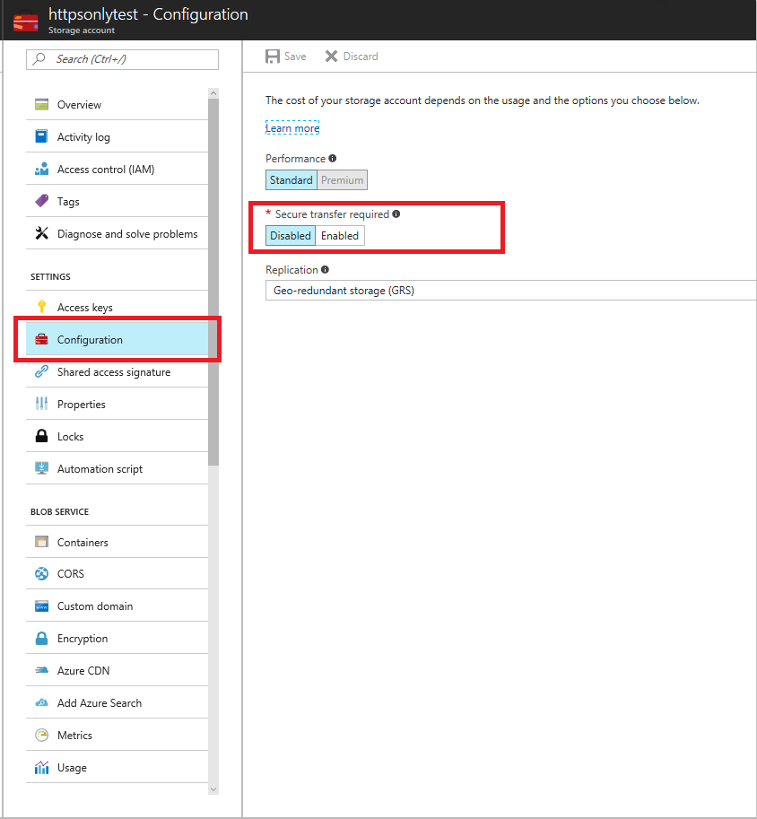

---
title: Require secure transfer in Azure Storage | Microsoft Docs
description: Learn about the "Require secure transfer" feature for Azure Storage, and how to enable it.
services: storage
documentationcenter: na
author: fhryo-msft
manager: Jason.Hogg
editor: fhryo-msft

ms.assetid:
ms.service: storage
ms.devlang: na
ms.topic: article
ms.tgt_pltfrm: na
ms.workload: storage
ms.date: 06/20/2017
ms.author: fryu
---
# Require secure transfer

The "Secure transfer required" option enhances the security of your storage account by only allowing requests to the storage account from secure connections. For example, when calling REST APIs to access your storage account, you must connect using HTTPS. Any requests using HTTP are rejected when "Secure transfer required" is enabled.

When you are using the Azure Files service, any connection without encryption fails when "Secure transfer required" is enabled. This includes scenarios using SMB 2.1, SMB 3.0 without encryption, and some flavors of the Linux SMB client. 

By default, the "Secure transfer required" option is disabled.

> [!NOTE]
> Because Azure Storage doesn't support HTTPS for custom domain names, this option is not applied when using a custom domain name.

## Enable "Secure transfer required" in the Azure portal

You can enable the "Secure transfer required" setting both when you create a storage account in the [Azure portal](https://portal.azure.com), and for existing storage accounts.

### Require secure transfer when you create a storage account

1. Open the **Create storage account** blade in the Azure portal.
1. Under **Secure transfer required**, select **Enabled**.

  

### Require secure transfer for an existing storage account

1. Select an existing storage account in the Azure portal.
1. Select **Configuration** under **SETTINGS** in the storage account menu blade.
1. Under **Secure transfer required**, select **Enabled**.

  

## Next steps
Azure Storage provides a comprehensive set of security capabilities, which together enable developers to build secure applications. For more details, visit the [Storage Security Guide](storage-security-guide.md).
