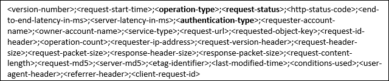

<properties
	pageTitle="Azure Storage security guide | Microsoft Azure"
	description="Details the many methods of securing Azure Storage, including but not limited to RBAC, Storage Service Encryption, Client-side Encryption, SMB 3.0, and Azure Disk Encryption."
	services="storage"
	documentationCenter=".net"
	authors="robinsh"
	manager="carmonm"
	editor="tysonn"/>

<tags
	ms.service="storage"
	ms.workload="storage"
	ms.tgt_pltfrm="na"
	ms.devlang="dotnet"
	ms.topic="article"
	ms.date="08/03/2016"
	ms.author="robinsh"/>

#Azure Storage security guide

##Overview

Azure Storage provides a comprehensive set of security capabilities which together enable developers to build secure applications. The storage account itself can be secured using Role-Based Access Control and Azure Active Directory. Data can be secured in transit between an application and Azure by using [Client-Side Encryption](storage-client-side-encryption.md), HTTPS, or SMB 3.0. Data can be set to be automatically encrypted when written to Azure Storage using [Storage Service Encryption (SSE)](storage-service-encryption.md). OS and Data disks used by virtual machines can be set to be encrypted using [Azure Disk Encryption](../azure-security-disk-encryption.md). Delegated access to the data objects in Azure Storage can be granted using [Shared Access Signatures](storage-dotnet-shared-access-signature-part-1.md).

This article will provide an overview of each of these security features that can be used with Azure Storage. Links are provided to articles that will give details of each feature so you can easily do further investigation on each topic.

Here are the topics to be covered in this article:

-   [Management Plane Security](#management-plane-security) – Securing your Storage Account

    The management plane consists of the resources used to manage your storage account. In this section, we’ll talk about the Azure Resource Manager deployment model and how to use Role-Based Access Control (RBAC) to control access to your storage accounts. We will also talk about managing your storage account keys and how to regenerate them.

-   [Data Plane Security](#data-plane-security) – Securing Access to Your Data

    In this section, we’ll look at allowing access to the actual data objects in your Storage account, such as blobs, files, queues, and tables, using Shared Access Signatures and Stored Access Policies. We will cover both service-level SAS and account-level SAS. We’ll also see how to limit access to a specific IP address (or range of IP addresses), how to limit the protocol used to HTTPS, and how to revoke a Shared Access Signature without waiting for it to expire.

-   [Encryption in Transit](#encryption-in-transit)

    This section discusses how to secure data when you transfer it into or out of Azure Storage. We’ll talk about the recommended use of HTTPS and the encryption used by SMB 3.0 for Azure File Shares. We will also take a look at Client-side Encryption, which enables you to encrypt the data before it is transferred into Storage in a client application, and to decrypt the data after it is transferred out of Storage.

-   [Encryption at Rest](#encryption-at-rest)

    We will talk about Storage Service Encryption (SSE), and how you can enable it for a storage account, resulting in your block blobs, page blobs, and append blobs being automatically encrypted when written to Azure Storage. We will also look at how you can use Azure Disk Encryption and explore the basic differences and cases of Disk Encryption versus SSE versus Client-Side Encryption. We will briefly look at FIPS compliance for U.S. Government computers.

-   Using [Storage Analytics](#storage-analytics) to audit access of Azure Storage

    This section discusses how to find information in the storage analytics logs for a request. We’ll take a look at real storage analytics log data and see how to discern whether a request is made with the Storage account key, with a Shared Access signature, or anonymously, and whether it succeeded or failed.

-   [Enabling Browser-Based Clients using CORS](#Cross-Origin-Resource-Sharing-CORS)

    This section talks about how to allow cross-origin resource sharing (CORS). We’ll talk about cross-domain access, and how to handle it with the CORS capabilities built into Azure Storage.

##Management Plane Security

The management plane consists of operations that affect the storage account itself. For example, you can create or delete a storage account, get a list of storage accounts in a subscription, retrieve the storage account keys, or regenerate the storage account keys.

When you create a new storage account, you select a deployment model of Classic or Resource Manager. The Classic model of creating resources in Azure only allows all-or-nothing access to the subscription, and in turn, the storage account.

This guide focuses on the Resource Manager model which is the recommended means for creating storage accounts. With the Resource Manager storage accounts, rather than giving access to the entire subscription, you can control access on a more finite level to the management plane using Role-Based Access Control (RBAC).

###How to secure your storage account with Role-Based Access Control (RBAC)

Let’s talk about what RBAC is, and how you can use it. Each Azure subscription has an Azure Active Directory. Users, groups, and applications from that directory can be granted access to manage resources in the Azure subscription that use the Resource Manager deployment model. This is referred to as Role-Based Access Control (RBAC). To manage this access, you can use the [Azure Portal](https://portal.azure.com/), the [Azure CLI tools](../xplat-cli-install.md), [PowerShell](../powershell-install-configure.md), or the [Azure Storage Resource Provider REST APIs](https://msdn.microsoft.com/library/azure/mt163683.aspx).

With the Resource Manager model, you put the storage account in a resource group and control access to the management plane of that specific storage account using Azure Active Directory. For example, you can give specific users the ability to access the storage account keys, while other users can view information about the storage account, but cannot access the storage account keys.

####Granting Access

Access is granted by assigning the appropriate RBAC role to users, groups, and applications, at the right scope. To grant access to the entire subscription, you assign a role at the subscription level. You can grant access to all of the resources in a resource group by granting permissions to the resource group itself. You can also assign specific roles to specific resources, such as storage accounts.

Here are the main points that you need to know about using RBAC to access the management operations of an Azure Storage account:

-   When you assign access, you basically assign a role to the account that you want to have access. You can control access to the operations used to manage that storage account, but not to the data objects in the account. For example, you can grant permission to retrieve the properties of the storage account (such as redundancy), but not to a container or data within a container inside Blob Storage.

-   For someone to have permission to access the data objects in the storage account, you can give them permission to read the storage account keys, and that user can then use those keys to access the blobs, queues, tables, and files.

-   Roles can be assigned to a specific user account, a group of users, or to a specific application.

-   Each role has a list of Actions and Not Actions. For example, the Virtual Machine Contributor role has an Action of “listKeys” that allows the storage account keys to be read. The Contributor has “Not Actions” such as updating the access for users in the Active Directory.

-   Roles for storage include (but are not limited to) the following:

	-	Owner – They can manage everything, including access.

    -	Contributor – They can do anything the owner can do except assign access. Someone with this role can view and regenerate the storage account keys. With the storage account keys, they can access the data objects.

    -	Reader – They can view information about the storage account, except secrets. For example, if you assign a role with reader permissions on the storage account to someone, they can view the properties of the storage account, but they can’t make any changes to the properties or view the storage account keys.

    -	Storage Account Contributor – They can manage the storage account – they can read the subscription’s resource groups and resources, and create and manage subscription resource group deployments. They can also access the storage account keys, which in turn means they can access the data plane.

    -	User Access Administrator – They can manage user access to the storage account. For example, they can grant Reader access to a specific user.

    -	Virtual Machine Contributor – They can manage virtual machines but not the storage account to which they are connected. This role can list the storage account keys, which means that the user to whom you assign this role can update the data plane.

		In order for a user to create a virtual machine, they have to be able to create the corresponding VHD file in a storage account. To do that, they need to be able to retrieve the storage account key and pass it to the API creating the VM. Therefore, they must have this permission so they can list the storage account keys.

- The ability to define custom roles is a feature that allows you to compose a set of actions from a list of available actions that can be performed on Azure resources.

- The user has to be set up in your Azure Active Directory before you can assign a role to them.

- You can create a report of who granted/revoked what kind of access to/from whom and on what scope using PowerShell or the Azure CLI.

####Resources

-   [Azure Active Directory Role-based Access Control](../active-directory/role-based-access-control-configure.md)

    This article explains the Azure Active Directory Role-based Access Control and how it works.

-   [RBAC: Built in Roles](../active-directory/role-based-access-built-in-roles.md)

    This article details all of the built-in roles available in RBAC.

-   [Understanding Resource Manager deployment and classic deployment](../resource-manager-deployment-model.md)

    This article explains the Resource Manager deployment and classic deployment models, and explains the benefits of using the Resource Manager and resource groups

-   [Azure Compute, Network, and Storage Providers under the Azure Resource Manager](../virtual-machines/virtual-machines-windows-compare-deployment-models.md)

    This article explains how the Azure Compute, Network, and Storage Providers work under the Resource Manager model.

-   [Managing Role-Based Access Control with the REST API](../active-directory/role-based-access-control-manage-access-rest.md)

	This article shows how to use the REST API to manage RBAC.

-   [Azure Storage Resource Provider REST API Reference](https://msdn.microsoft.com/library/azure/mt163683.aspx)

	This is the reference for the APIs you can use to manage your storage account programmatically.

-   [Developer’s guide to auth with Azure Resource Manager API](http://www.dushyantgill.com/blog/2015/05/23/developers-guide-to-auth-with-azure-resource-manager-api/)

	This article shows how to authenticate using the Resource Manager APIs.

-   [Role-Based Access Control for Microsoft Azure from Ignite](https://channel9.msdn.com/events/Ignite/2015/BRK2707)

    This is a link to a video on Channel 9 from the 2015 MS Ignite conference. In this session, they talk about access management and reporting capabilities in Azure, and explore best practices around securing access to Azure subscriptions using Azure Active Directory.

###Managing Your Storage Account Keys

Storage account keys are 512-bit strings created by Azure that, along with the storage account name, can be used to access the data objects stored in the storage account, e.g. blobs, entities within a table, queue messages, and files on an Azure Files share. Controlling access to the storage account keys controls access to the data plane for that storage account.

Each storage account has two keys referred to as “Key 1” and “Key 2” in the [Azure Portal](http://portal.azure.com/) and in the PowerShell cmdlets. These can be regenerated manually using one of several methods, including, but not limited to using the [Azure Portal](https://portal.azure.com/), PowerShell, the Azure CLI, or programmatically using the .NET Storage Client Library or the Azure Storage Services REST API.

There are any number of reasons to regenerate your storage account keys.

-   You might regenerate them on a regular basis for security reasons.

-   You would regenerate your storage account keys if someone managed to hack into an application and retrieve the key that was hardcoded or saved in a configuration file, giving them full access to your storage account.

-   Another case for key regeneration is if your team is using a Storage Explorer application that retains the storage account key, and one of the team members leaves. The application would continue to work, giving them access to your storage account after they’re gone. This is actually the primary reason they created account-level Shared Access Signatures – you can use an account-level SAS instead of storing the access keys in a configuration file.

####Key regeneration plan

You don’t want to just regenerate the key you are using without some planning. If you do that, you could cut off all access to that storage account, which can cause major disruption. This is why there are two keys. You should regenerate one key at a time.

Before you regenerate your keys, be sure you have a list of all of your applications that are dependent on the storage account, as well as any other services you are using in Azure. For example, if you are using Azure Media Services that are dependent on your storage account, you must re-sync the access keys with your media service after you regenerate the key. If you are using any applications such as a storage explorer, you will need to provide the new keys to those applications as well. Note that if you have VMs whose VHD files are stored in the storage account, they will not be affected by regenerating the storage account keys.

You can regenerate your keys in the Azure Portal. Once keys are regenerated they can take up to 10 minutes to be synchronized across Storage Services.

When you’re ready, here’s the general process detailing how you should change your key. In this case, the assumption is that you are currently using Key 1 and you are going to change everything to use Key 2 instead.

1.  Regenerate Key 2 to ensure that it is secure. You can do this in the Azure Portal.

2.  In all of the applications where the storage key is stored, change the storage key to use Key 2’s new value. Test and publish the application.

3.  After all of the applications and services are up and running successfully, regenerate Key 1. This ensures that anybody to whom you have not expressly given the new key will no longer have access to the storage account.

If you are currently using Key 2, you can use the same process, but reverse the key names.

You can migrate over a couple of days, changing each application to use the new key and publishing it. After all of them are done, you should then go back and regenerate the old key so it no longer works.

Another option is to put the storage account key in an [Azure Key Vault](https://azure.microsoft.com/services/key-vault/) as a secret and have your applications retrieve the key from there. Then when you regenerate the key and update the Azure Key Vault, the applications will not need to be redeployed because they will pick up the new key from the Azure Key Vault automatically. Note that you can have the application read the key each time you need it, or you can cache it in memory and if it fails when using it, retrieve the key again from the Azure Key Vault.

Using Azure Key Vault also adds another level of security for your storage keys. If you use this method, you will never have the storage key hardcoded in a configuration file, which removes that avenue of somebody getting access to the keys without specific permission.

Another advantage of using Azure Key Vault is you can also control access to your keys using Azure Active Directory. This means you can grant access to the handful of applications that need to retrieve the keys from Azure Key Vault, and know that other applications will not be able to access the keys without granting them permission specifically.

Note: it is recommended to use only one of the keys in all of your applications at the same time. If you use Key 1 in some places and Key 2 in others, you will not be able to rotate your keys without some application losing access.

####Resources

-   [About Azure Storage Accounts](storage-create-storage-account.md#regenerate-storage-access-keys)

	This article gives an overview of storage accounts and discusses viewing, copying, and regenerating storage access keys.

-   [Azure Storage Resource Provider REST API Reference](https://msdn.microsoft.com/library/mt163683.aspx)

	This article contains links to specific articles about retrieving the storage account keys and regenerating the storage account keys for an Azure Account using the REST API. Note: This is for  Resource Manager storage accounts.

-   [Operations on storage accounts](https://msdn.microsoft.com/library/ee460790.aspx)

    This article in the Storage Service Manager REST API Reference contains links to specific articles on retrieving and regenerating the storage account keys using the REST API. Note: This is for the Classic storage accounts.

-   [Say goodbye to key management – manage access to Azure Storage data using Azure AD](http://www.dushyantgill.com/blog/2015/04/26/say-goodbye-to-key-management-manage-access-to-azure-storage-data-using-azure-ad/)

	This article shows how to use Active Directory to control access to your Azure Storage keys in Azure Key Vault. It also shows how to use an Azure Automation job to regenerate the keys on an hourly basis.

##Data Plane Security

Data Plane Security refers to the methods used to secure the data objects stored in Azure Storage – the blobs, queues, tables, and files. We’ve seen methods to encrypt the data and security during transit of the data, but how do you go about allowing access to the objects?

There are basically two methods for controlling access to the data objects themselves. The first is by controlling access to the storage account keys, and the second is using Shared Access Signatures to grant access to specific data objects for a specific amount of time.

One exception to note is that you can allow public access to your blobs by setting the access level for the container that holds the blobs accordingly. If you set access for a container to Blob or Container, it will allow public read access for the blobs in that container. This means anyone with a URL pointing to a blob in that container can open it in a browser without using a Shared Access Signature or having the storage account keys.

###Storage Account Keys

Storage account keys are 512-bit strings created by Azure that, along with the storage account name, can be used to access the data objects stored in the storage account.

For example, you can read blobs, write to queues, create tables, and modify files. Many of these actions can be performed through the Azure Portal, or using one of many Storage Explorer applications. You can also write code to use the REST API or one of the Storage Client Libraries to perform these operations.

As discussed in the section on the [Management Plane Security](#management-plane-security), access to the storage keys for a Classic storage account can be granted by giving full access to the Azure subscription. Access to the storage keys for a storage account using the Azure Resource Manager model can be controlled through Role-Based Access Control (RBAC).

###How to delegate access to objects in your account using Shared Access Signatures and Stored Access Policies

A Shared Access Signature is a string containing a security token that can be attached to a URI that allows you to delegate access to storage objects and specify constraints such as the permissions and the date/time range of access.

You can grant access to blobs, containers, queue messages, files, and tables. With tables, you can actually grant permission to access a range of entities in the table by specifying the partition and row key ranges to which you want the user to have access. For example, if you have data stored with a partition key of geographical state, you could give someone access to just the data for California.

In another example, you might give a web application a SAS token that enables it to write entries to a queue, and give a worker role application a SAS token to get messages from the queue and process them. Or you could give one customer a SAS token they can use to upload pictures to a container in Blob Storage, and give a web application permission to read those pictures. In both cases, there is a separation of concerns – each application can be given just the access that they require in order to perform their task. This is possible through the use of Shared Access Signatures.

####Why you want to use Shared Access Signatures

Why would you want to use an SAS instead of just giving out your storage account key, which is so much easier? Giving out your storage account key is like sharing the keys of your storage kingdom. It grants complete access. Someone could use your keys and upload their entire music library to your storage account. They could also replace your files with virus-infected versions, or steal your data. Giving away unlimited access to your storage account is something that should not be taken lightly.

With Shared Access Signatures, you can give a client just the permissions required for a limited amount of time. For example, if someone is uploading a blob to your account, you can grant them write access for just enough time to upload the blob (depending on the size of the blob, of course). And if you change your mind, you can revoke that access.

Additionally, you can specify that requests made using a SAS are restricted to a certain IP address or IP address range external to Azure. You can also require that requests are made using a specific protocol (HTTPS or HTTP/HTTPS). This means if you only want to allow HTTPS traffic, you can set the required protocol to HTTPS only, and HTTP traffic will be blocked.

####Definition of a Shared Access Signature

A Shared Access Signature is a set of query parameters appended to the URL pointing at the resource

that provides information about the access allowed and the length of time for which the access is permitted. Here is an example; this URI provides read access to a blob for five minutes. Note that SAS query parameters must be URL Encoded, such as %3A for colon (:) or %20 for a space.

	http://mystorage.blob.core.windows.net/mycontainer/myblob.txt (URL to the blob)
	?sv=2015-04-05 (storage service version)
	&st=2015-12-10T22%3A18%3A26Z (start time, in UTC time and URL encoded)
	&se=2015-12-10T22%3A23%3A26Z (end time, in UTC time and URL encoded)
	&sr=b (resource is a blob)
	&sp=r (read access)
	&sip=168.1.5.60-168.1.5.70 (requests can only come from this range of IP addresses)
	&spr=https (only allow HTTPS requests)
	&sig=Z%2FRHIX5Xcg0Mq2rqI3OlWTjEg2tYkboXr1P9ZUXDtkk%3D (signature used for the authentication of the SAS)

####How the Shared Access Signature is authenticated by the Azure Storage Service

When the storage service receives the request, it takes the input query parameters and creates a signature using the same method as the calling program. It then compares the two signatures. If they agree, then the storage service can check the storage service version to make sure it’s valid, verify that the current date and time are within the specified window, make sure the access requested corresponds to the request made, etc.

For example, with our URL above, if the URL was pointing to a file instead of a blob, this request would fail because it specifies that the Shared Access Signature is for a blob. If the REST command being called was to update a blob, it would fail because the Shared Access Signature specifies that only read access is permitted.

####Types of Shared Access Signatures

-	A service-level SAS can be used to access specific resources in a storage account. Some examples of this are retrieving a list of blobs in a container, downloading a blob, updating an entity in a table, adding messages to a queue or uploading a file to a file share.

-	An account-level SAS can be used to access anything that a service-level SAS can be used for. Additionally, it can give options to resources that are not permitted with a service-level SAS, such as the ability to create containers, tables, queues, and file shares. You can also specify access to multiple services at once. For example, you might give someone access to both blobs and files in your storage account.

####Creating an SAS URI

1.  You can create an ad hoc URI on demand, defining all of the query parameters each time.

    This is really flexible, but if you have a logical set of parameters that are similar each time, using a Stored Access Policy is a better idea.

2.  You can create a Stored Access Policy for an entire container, file share, table, or queue. Then you can use this as the basis for the SAS URIs you create. Permissions based on Stored Access Policies can be easily revoked. You can have up to 5 policies defined on each container, queue, table, or file share.

    For example, if you were going to have many people read the blobs in a specific container, you could create a Stored Access Policy that says “give read access” and any other settings that will be the same each time. Then you can create an SAS URI using the settings of the Stored Access Policy and specifying the expiration date/time. The advantage of this is that you don’t have to specify all of the query parameters every time.

####Revocation

Suppose your SAS has been compromised, or you want to change it because of corporate security or regulatory compliance requirements. How do you revoke access to a resource using that SAS? It depends on how you created the SAS URI.

If you are using ad hoc URI’s, you have three options. You can issue SAS tokens with short expiration policies and simply wait for the SAS to expire. You can rename or delete the resource (assuming the token was scoped to a single object). You can change the storage account keys. This last option can have a big impact, depending on how many services are using that storage account, and probably isn’t something you want to do without some planning.

If you are using a SAS derived from a Stored Access Policy, you can remove access by revoking the Stored Access Policy – you can just change it so it has already expired, or you can remove it altogether. This takes effect immediately, and invalidates every SAS created using that Stored Access Policy. Updating or removing the Stored Access Policy may impact people accessing that specific container, file share, table, or queue via SAS, but if the clients are written so they request a new SAS when the old one becomes invalid, this will work fine.

Because using a SAS derived from a Stored Access Policy gives you the ability to revoke that SAS immediately, it is the recommended best practice to always use Stored Access Policies when possible.

####Resources

For more detailed information on using Shared Access Signatures and Stored Access Policies, complete with examples, please refer to the following articles:

-   These are the reference articles.

	-	[Service SAS](https://msdn.microsoft.com/library/dn140256.aspx)

		This article provides examples of using a service-level SAS with blobs, queue messages, table ranges, and files.

	-	[Constructing a service SAS](https://msdn.microsoft.com/library/dn140255.aspx)

	-	[Constructing an account SAS](https://msdn.microsoft.com/library/mt584140.aspx)

-   These are tutorials for using the .NET client library to create Shared Access Signatures and Stored Access Policies.

    -	[Shared Access Signatures, Part 1: Understanding the SAS Model](storage-dotnet-shared-access-signature-part-1.md)

        This article includes an explanation of the SAS model, examples of Shared Access Signatures, and recommendations for the best practice use of SAS. Also discussed is the revocation of the permission granted.

    -	[Shared Access Signatures, Part 2: Create and Use a SAS with the Blob Service](storage-dotnet-shared-access-signature-part-2.md)

        This article shows how to generate SAS URIs using the .NET storage client library.

-   Limiting access by IP Address (IP ACLs)

    -	[What is an endpoint Access Control List (ACLs)?](../virtual-network/virtual-networks-acl.md)

    -	[Constructing a Service SAS](https://msdn.microsoft.com/library/azure/dn140255.aspx)

		This is the reference article for service-level SAS; it includes an example of IP ACLing.

	-	[Constructing an Account SAS](https://msdn.microsoft.com/library/azure/mt584140.aspx)

    	This is the reference article for account-level SAS; it includes an example of IP ACLing.

-   Authentication

	-    [Authentication for the Azure Storage Services](https://msdn.microsoft.com/library/azure/dd179428.aspx)

-   Shared Access Signatures Getting Started Tutorial

	-	[SAS Getting Started Tutorial](https://github.com/Azure-Samples/storage-dotnet-sas-getting-started)

##Encryption in Transit

###Transport-Level Encryption – Using HTTPS

Another step you should take to ensure the security of your Azure Storage data is to encrypt the data between the client and Azure Storage. The first recommendation is to always use the [HTTPS](https://en.wikipedia.org/wiki/HTTPS) protocol, which ensures secure communication over the public Internet.

You should always use HTTPS when calling the REST APIs or accessing objects in storage. Also, **Shared Access Signatures**, which can be used to delegate access to Azure Storage objects, include an option to specify that only the HTTPS protocol can be used when using Shared Access Signatures, ensuring that anybody sending out links with SAS tokens will use the proper protocol.

####Resources

-   [Enable HTTPS for an app in Azure App Service](../app-service-web/web-sites-configure-ssl-certificate.md)

	This article shows you how to enable HTTPS for an Azure Web App.

###Using encryption during transit with Azure File Shares

Azure File Storage supports HTTPS when using the REST API, but is more commonly used as an SMB file share attached to a VM. SMB 2.1 does not support encryption, so connections are only allowed within the same region in Azure. However, SMB 3.0 supports encryption, and can be used with Windows Server 2012 R2, Windows 8, Windows 8.1, and Windows 10, allowing cross-region access and even access on the desktop.

Note that while Azure File Shares can be used with Unix, the Linux SMB client does not yet support encryption, so access is only allowed within an Azure region. Encryption support for Linux is on the roadmap of Linux developers responsible for SMB functionality. When they add encryption, you will have the same ability for accessing an Azure File Share on Linux as you do for Windows.

####Resources

-   [How to use Azure File Storage with Linux](storage-how-to-use-files-linux.md)

    This article shows how to mount an Azure File Share on a Linux system and upload/download files.

-   [Get started with Azure File storage on Windows](storage-dotnet-how-to-use-files.md)

	This article gives an overview of Azure File shares and how to mount and use them using PowerShell and .NET.

-   [Inside Azure File Storage](https://azure.microsoft.com/blog/inside-azure-file-storage/)

    This article announces the general availability of Azure File Storage and provides technical details about the SMB 3.0 encryption.

###Using Client-side encryption to secure data that you send to storage

Another option that helps you ensure that your data is secure while being transferred between a client application and Storage is Client-side Encryption. The data is encrypted before being transferred into Azure Storage. When retrieving the data from Azure Storage, the data is decrypted after it is received on the client side. Even though the data is encrypted going across the wire, we recommend that you also use HTTPS, as it has data integrity checks built in which help mitigate network errors affecting the integrity of the data.

Client-side encryption is also a method for encrypting your data at rest, as the data is stored in its encrypted form. We’ll talk about this in more detail in the section on [Encryption at Rest](#encryption-at-rest).

##Encryption at Rest

There are three Azure features that provide encryption at rest. Azure Disk Encryption is used to encrypt the OS and data disks in IaaS Virtual Machines. The other two – Client-side Encryption and SSE – are both used to encrypt data in Azure Storage. Let’s look at each of these, and then do a comparison and see when each one can be used.

While you can use Client-side Encryption to encrypt the data in transit (which is also stored in its encrypted form in Storage), you may prefer to simply use HTTPS during the transfer, and have some way for the data to be automatically encrypted when it is stored. There are two ways to do this -- Azure Disk Encryption and SSE. One is used to directly encrypt the data on OS and data disks used by VMs, and the other is used to encrypt data written to Azure Blob Storage.

###Storage Service Encryption (SSE)

SSE is a new Azure Storage feature in public preview. This feature allows you to request that the storage service automatically encrypt the data when writing it to Azure Storage. When you read the data from Azure Storage, it will be decrypted by the storage service before being returned. This enables you to secure your data without having to modify code or add code to any applications.

This is a setting that applies to the whole storage account. You can enable and disable this feature by changing the value of the setting. To do this, you can use the Azure Portal, PowerShell, the Azure CLI, the Storage Resource Provider REST API, or the .NET Storage Client Library. By default, SSE is turned off.

At this time, the keys used for the encryption are managed by Microsoft. We generate the keys originally, and manage the secure storage of the keys as well as the regular rotation as defined by internal Microsoft policy. In the future, you will get the ability to manage your own encryption keys, and provide a migration path from Microsoft-managed keys to customer-managed keys.

This feature is available for Standard and Premium Storage accounts created using the Resource Manager deployment model and created after 3/30/2016 12:00 am PST. SSE applies only to block blobs, page blobs, and append blobs. The other types of data, including tables, queues, and files, will not be encrypted.

Data is only encrypted when SSE is enabled and the data is written to Blob Storage. Enabling or disabling the SSE does not impact existing data. In other words, when you enable this encryption, it will not go back and encrypt data that already exists; nor will it decrypt the data that already exists when you disable SSE.

If you want to try this feature with a storage account created prior to the aforementioned date, or a Classic storage account, you can create a new storage account and use AzCopy to copy the data to the new account. This should not be required after the preview.

As with most previews, this should not be used in production until the feature becomes Generally Available.

###Client-side Encryption

We mentioned client-side encryption when discussing the encryption of the data in transit. This feature allows you to programmatically encrypt your data in a client application before sending it across the wire to be written to Azure Storage, and to programmatically decrypt your data after retrieving it from Azure Storage.

This does provide encryption in transit, but it also provides the feature of Encryption at Rest. Note that although the data is encrypted in transit, we still recommend using HTTPS to take advantage of the built-in data integrity checks which help mitigate network errors affecting the integrity of the data.

An example of where you might use this is if you have a web application that stores blobs and retrieves blobs, and you want the application and data to be as secure as possible. In that case, you would use client-side encryption. The traffic between the client and the Azure Blob Service contains the encrypted resource, and nobody can interpret the data in transit and reconstitute it into your private blobs.

Client-side encryption is built into the Java and the .NET storage client libraries, which in turn use the Azure Key Vault APIs, making it pretty easy for you to implement. The process of encrypting and decrypting the data uses the envelope technique, and stores metadata used by the encryption in each storage object. For example, for blobs, it stores it in the blob metadata, while for queues, it adds it to each queue message.

For the encryption itself, you can generate and manage your own encryption keys. You can also use keys generated by the Azure Storage Client Library, or you can have the Azure Key Vault generate the keys. You can store your encryption keys in your on-premises key storage, or you can store them in an Azure Key Vault. Azure Key Vault allows you to grant access to the secrets in Azure Key Vault to specific users using Azure Active Directory. This means that not just anybody can read the Azure Key Vault and retrieve the keys you’re using for client-side encryption.

####Resources

-   [Encrypt and decrypt blobs in Microsoft Azure Storage using Azure Key Vault](storage-encrypt-decrypt-blobs-key-vault.md)

    This article shows how to use client-side encryption with Azure Key Vault, including how to create the KEK and store it in the vault using PowerShell.

-   [Client-Side Encryption and Azure Key Vault for Microsoft Azure Storage](storage-client-side-encryption.md)

    This article gives an explanation of client-side encryption, and provides examples of using the storage client library to encrypt and decrypt resources from the four storage services. It also talks about Azure Key Vault.

###Using Azure Disk Encryption to encrypt disks used by your virtual machines

Azure Disk Encryption is a new feature that is currently in preview. This feature allows you to encrypt the OS disks and Data disks used by an IaaS Virtual Machine. For Windows, the drives are encrypted using industry-standard BitLocker encryption technology. For Linux, the disks are encrypted using the DM-Crypt technology. This is integrated with Azure Key Vault to allow you to control and manage the disk encryption keys.

The Azure Disk Encryption solution supports the following three customer encryption scenarios:

-   Enable encryption on new IaaS VMs created from customer-encrypted VHD files and customer-provided encryption keys, which are stored in Azure Key Vault.

-   Enable encryption on new IaaS VMs created from the Azure Marketplace.

-   Enable encryption on existing IaaS VMs already running in Azure.

>[AZURE.NOTE] For Linux VMs already running in Azure, or new Linux VMs created from images in the Azure Marketplace, encryption of the OS disk is not currently supported. Encryption of the OS Volume for Linux VMs is supported only for VMs that were encrypted on-premises and uploaded to Azure. This restriction only applies to the OS disk; encryption of data volumes for a Linux VM is supported.

The solution supports the following for IaaS VMs for public preview release when enabled in Microsoft
Azure:

-   Integration with Azure Key Vault

-   Standard [A, D and G series IaaS VMs](https://azure.microsoft.com/pricing/details/virtual-machines/)

-   Enable encryption on IaaS VMs created using [Azure Resource Manager](../resource-group-overview.md) model

-   All Azure public [regions](https://azure.microsoft.com/regions/)

This feature ensures that all data on your virtual machine disks is encrypted at rest in Azure Storage.

####Resources

-   [Azure Disk Encryption for Windows and Linux IaaS Virtual Machines](https://gallery.technet.microsoft.com/Azure-Disk-Encryption-for-a0018eb0)

    This article discusses the preview release of Azure Disk Encryption and provides a link to download the white paper.

###Comparison of Azure Disk Encryption, SSE, and Client-Side Encryption

####IaaS VMs and their VHD files

For disks used by IaaS VMs, we recommend using Azure Disk Encryption. You can turn on SSE to encrypt the VHD files that are used to back those disks in Azure Storage, but it only encrypts newly written data. This means if you create a VM and then enable SSE on the storage account that holds the VHD file, only the changes will be encrypted, not the original VHD file.

If you create a VM using an image from the Azure Marketplace, Azure performs a [shallow copy](https://en.wikipedia.org/wiki/Object_copying) of the image to your storage account in Azure Storage, and it is not encrypted even if you have SSE enabled. After it creates the VM and starts updating the image, SSE will start encrypting the data. For this reason, it’s best to use Azure Disk Encryption on VMs created from images in the Azure Marketplace if you want them fully encrypted.

If you bring a pre-encrypted VM into Azure from on-premises, you will be able to upload the encryption keys to Azure Key Vault, and continue using the encryption for that VM that you were using on-premises. Azure Disk Encryption is enabled to handle this scenario.

If you have non-encrypted VHD from on-premises, you can upload it into the gallery as a custom image and provision a VM from it. If you do this using the Resource Manager templates, you can ask it to turn on Azure Disk Encryption when it boots up the VM.

When you add a data disk and mount it on the VM, you can turn on Azure Disk Encryption on that data disk. It will encrypt that data disk locally first, and then the service management layer will do a lazy write against storage so the storage content is encrypted.

####Client-side encryption####

Client-side encryption is the most secure method of encrypting your data, because it encrypts it before transit, and encrypts the data at rest. However, it does require that you add code to your applications using storage, which you may not want to do. In those cases, you can use HTTPs for your data in transit, and SSE to encrypt the data at rest.

With client-side encryption, you can encrypt table entities, queue messages, and blobs. With SSE, you can only encrypt blobs. If you need table and queue data to be encrypted, you should use client-side encryption.

Client-side encryption is managed entirely by the application. This is the most secure approach, but does require you to make programmatic changes to your application and put key management processes in place. You would use this when you want the extra security during transit, and you want your stored data to be encrypted.

Client-side encryption is more load on the client, and you have to account for this in your scalability plans, especially if you are encrypting and transferring a lot of data.

####Storage Service Encryption (SSE)

SSE is managed by Azure Storage, and is easily managed. Using SSE does not provide for the security of the data in transit, but it does encrypt the data as it is written to Azure Storage. There is no impact on the performance when using this feature.

You can only encrypt block blobs, append blobs, and page blobs using SSE. If you need to encrypt table data or queue data, you should consider using client-side encryption.

If you have an archive or library of VHD files that you use as a basis for creating new virtual machines, you can create a new storage account, enable SSE, and then upload the VHD files to that account. Those VHD files will be encrypted by Azure Storage.

If you have Azure Disk Encryption enabled for the disks in a VM and SSE enabled on the storage account holding the VHD files, it will work fine; it will result in any newly-written data being encrypted twice.

##Storage Analytics

###Using Storage Analytics to monitor authorization type

For each storage account, you can enable Azure Storage Analytics to perform logging and store metrics data. This is a great tool to use when you want to check the performance metrics of a storage account, or need to troubleshoot a storage account because you are having performance problems.

Another piece of data you can see in the storage analytics logs is the authentication method used by someone when they access storage. For example, with Blob Storage, you can see if they used a Shared Access Signature or the storage account keys, or if the blob accessed was public.

This can be really helpful if you are tightly guarding access to storage. For example, in Blob Storage you can set all of the containers to private and implement the use of an SAS service throughout your applications. Then you can check the logs regularly to see if your blobs are accessed using the storage account keys, which may indicate a breach of security, or if the blobs are public but they shouldn’t be.

####What do the logs look like?

After you enable the storage account metrics and logging through the Azure Portal, analytics data will start to accumulate quickly. The logging and metrics for each service is separate; the logging is only written when there is activity in that storage account, while the metrics will be logged every minute, every hour, or every day, depending on how you configure it.

The logs are stored in block blobs in a container named $logs in the storage account. This container is automatically created when Storage Analytics is enabled. Once this container is created, you can’t delete it, although you can delete its contents.

Under the $logs container, there is a folder for each service, and then there are subfolders for the year/month/day/hour. Under hour, the logs are simply numbered. This is what the directory structure will look like:

Every request to Azure Storage is logged. Here’s a snapshot of a log file, showing the first few fields.

You can see that you can use the logs to track any kind of calls to a storage account.

####What are all of those fields for?

There is an article listed in the resources below that provides the list of the many fields in the logs and what they are used for. Here is the list of fields in order:

We’re interested in the entries for GetBlob, and how they are authenticated, so we need to look for entries with operation-type “Get-Blob”, and check the request-status (4th column) and the authorization-type (8th column).

For example, in the first few rows in the listing above, the request-status is “Success” and the authorization-type is “authenticated”. This means the request was validated using the storage account key.

####How are my blobs being authenticated?

We have three cases that we are interested in.

1.  The blob is public and it is accessed using a URL without a Shared Access Signature. In this case, the request-status is “AnonymousSuccess” and the authorization-type is “anonymous”.

    1.0;2015-11-17T02:01:29.0488963Z;GetBlob;**AnonymousSuccess**;200;124;37;**anonymous**;;mystorage…

2.  The blob is private and was used with a Shared Access Signature. In this case, the request-status is “SASSuccess” and the authorization-type is “sas”.

    1.0;2015-11-16T18:30:05.6556115Z;GetBlob;**SASSuccess**;200;416;64;**sas**;;mystorage…

3.  The blob is private and the storage key was used to access it. In this case, the request-status is “**Success**” and the authorization-type is “**authenticated**”.

    1.0;2015-11-16T18:32:24.3174537Z;GetBlob;**Success**;206;59;22;**authenticated**;mystorage…

You can use the Microsoft Message Analyzer to view and analyze these logs. It includes search and filter capabilities. For example, you might want to search for instances of GetBlob to see if the usage is what you expect, i.e. to make sure someone is not accessing your storage account inappropriately.

####Resources

-   [Storage Analytics](storage-analytics.md)

	This article is an overview of storage analytics and how to enable them.

-   [Storage Analytics Log Format](https://msdn.microsoft.com/library/azure/hh343259.aspx)

	This article illustrates the Storage Analytics Log Format, and details the fields available therein, including authentication-type, which indicates the type of authentication used for the request.

-   [Monitor a Storage Account in the Azure portal](storage-monitor-storage-account.md)

	This article shows how to configure monitoring of metrics and logging for a storage account.

-   [End-to-End Troubleshooting using Azure Storage Metrics and Logging, AzCopy, and Message Analyzer](storage-e2e-troubleshooting.md)

	This article talks about troubleshooting using the Storage Analytics and shows how to use the Microsoft Message Analyzer.

-   [Microsoft Message Analyzer Operating Guide](https://technet.microsoft.com/library/jj649776.aspx)

	This article is the reference for the Microsoft Message Analyzer and includes links to a tutorial, quick start, and feature summary.

##Cross-Origin Resource Sharing (CORS)

###Cross-domain access of resources

When a web browser running in one domain makes an HTTP request for a resource from a different domain, this is called a cross-origin HTTP request. For example, an HTML page served from contoso.com makes a request for a jpeg hosted on fabrikam.blob.core.windows.net. For security reasons, browsers restrict cross-origin HTTP requests initiated from within scripts, such as JavaScript. This means that when some JavaScript code on a web page on contoso.com requests that jpeg on fabrikam.blob.core.windows.net, the browser will not allow the request.

What does this have to do with Azure Storage? Well, if you are storing static assets such as JSON or XML data files in Blob Storage using a storage account called Fabrikam, the domain for the assets will be fabrikam.blob.core.windows.net, and the contoso.com web application will not be able to access them using JavaScript because the domains are different. This is also true if you’re trying to call one of the Azure Storage Services – such as Table Storage – that return JSON data to be processed by the JavaScript client.

####Possible solutions

One way to resolve this is to assign a custom domain like “storage.contoso.com” to fabrikam.blob.core.windows.net. The problem is that you can only assign that custom domain to one storage account. What if the assets are stored in multiple storage accounts?

Another way to resolve this is to have the web application act as a proxy for the storage calls. This means if you are uploading a file to Blob Storage, the web application would either write it locally and then copy it to Blob Storage, or it would read all of it into memory and then write it to Blob Storage. Alternately, you could write a dedicated web application (such as a Web API) that uploads the files locally and writes them to Blob Storage. Either way, you have to account for that function when determining the scalability needs.

####How can CORS help?

Azure Storage allows you to enable CORS – Cross Origin Resource Sharing. For each storage account, you can specify domains that can access the resources in that storage account. For example, in our case outlined above, we can enable CORS on the fabrikam.blob.core.windows.net storage account and configure it to allow access to contoso.com. Then the web application contoso.com can directly access the resources in fabrikam.blob.core.windows.net.

One thing to note is that CORS allows access, but it does not provide authentication, which is required for all non-public access of storage resources. This means you can only access blobs if they are public or you include a Shared Access Signature giving you the appropriate permission. Tables, queues, and files have no public access, and require a SAS.

By default, CORS is disabled on all services. You can enable CORS by using the REST API or the storage client library to call one of the methods to set the service policies. When you do that, you include a CORS rule, which is in XML. Here’s an example of a CORS rule that has been set using the Set Service Properties operation for the Blob Service for a storage account. You can perform that operation using the storage client library or the REST APIs for Azure Storage.

	<Cors>    
	    <CorsRule>
	        <AllowedOrigins>http://www.contoso.com, http://www.fabrikam.com</AllowedOrigins>
	        <AllowedMethods>PUT,GET</AllowedMethods>
	        <AllowedHeaders>x-ms-meta-data*,x-ms-meta-target*,x-ms-meta-abc</AllowedHeaders>
	        <ExposedHeaders>x-ms-meta-*</ExposedHeaders>
	        <MaxAgeInSeconds>200</MaxAgeInSeconds>
	    </CorsRule>
	<Cors>

Here’s what each row means:

-   **AllowedOrigins** This tells which non-matching domains can request and receive data from the storage service. This says that both contoso.com and fabrikam.com can request data from Blob Storage for a specific storage account. You can also set this to a wildcard (\*) to allow all domains to access requests.

-   **AllowedMethods** This is the list of methods (HTTP request verbs) that can be used when making the request. In this example, only PUT and GET are allowed. You can set this to a wildcard (\*) to allow all methods to be used.

-   **AllowedHeaders** This is the request headers that the origin domain can specify when making the request. In this example, all metadata headers starting with x-ms-meta-data, x-ms-meta-target, and x-ms-meta-abc are permitted. The wildcard character (\*) indicates that any header beginning with the specified prefix is allowed.

-   **ExposedHeaders** This tells which response headers should be exposed by the browser to the request issuer. In this example, any header starting with “x-ms-meta-“ will be exposed.

-   **MaxAgeInSeconds** This is the maximum amount of time that a browser will cache the preflight OPTIONS request. (For more information about the preflight request, check the first article below.)

####Resources

For more information about CORS and how to enable it, please check out these resources.

-   [Cross-Origin Resource Sharing (CORS) Support for the Azure Storage Services on Azure.com](storage-cors-support.md)

	This article provides an overview of CORS and how to set the rules for the different storage services.

-   [Cross-Origin Resource Sharing (CORS) Support for the Azure Storage Services on MSDN](https://msdn.microsoft.com/library/azure/dn535601.aspx)

	This is the reference documentation for CORS support for the Azure Storage Services. This has links to articles applying to each storage service, and shows an example and explains each element in the CORS file.

-   [Microsoft Azure Storage: Introducing CORS](http://blogs.msdn.com/b/windowsazurestorage/archive/2014/02/03/windows-azure-storage-introducing-cors.aspx)

	This is a link to the initial blog article announcing CORS and showing how to use it.

##Frequently asked questions about Azure Storage security

1.  **How can I verify the integrity of the blobs I’m transferring into or out of Azure Storage if I can’t use the HTTPS protocol?**

	If for any reason you need to use HTTP instead of HTTPS and you are working with block blobs, you can use MD5 checking to help verify the integrity of the blobs being transferred. This will help with protection from network/transport layer errors, but not necessarily with intermediary attacks.

	If you can use HTTPS, which provides transport level security, then using MD5 checking is redundant and unnecessary.
	
	For more information, please check out the [Azure Blob MD5 Overview](http://blogs.msdn.com/b/windowsazurestorage/archive/2011/02/18/windows-azure-blob-md5-overview.aspx).

2.  **What about FIPS-Compliance for the U.S. Government?**

	The United States Federal Information Processing Standard (FIPS) defines cryptographic algorithms approved for use by U.S. Federal government computer systems for the protection of sensitive data. Enabling FIPS mode on a Windows server or desktop tells the OS that only FIPS-validated cryptographic algorithms should be used. If an application uses non-compliant algorithms, the applications will break. With.NET Framework versions 4.5.2 or higher, the application automatically switches the cryptography algorithms to use FIPS-compliant algorithms when the computer is in FIPS mode.

	Microsoft leaves it up to each customer to decide whether to enable FIPS mode. We believe there is no compelling reason for customers who are not subject to government regulations to enable FIPS mode by default.

	**Resources**

-	[Why We’re Not Recommending “FIPS Mode” Anymore](http://blogs.technet.com/b/secguide/archive/2014/04/07/why-we-re-not-recommending-fips-mode-anymore.aspx)

	This blog article gives an overview of FIPS and explains why they don’t enable FIPS mode by default.

-   [FIPS 140 Validation](https://technet.microsoft.com/library/cc750357.aspx)

	This article provides information on how Microsoft products and cryptographic modules comply with the FIPS standard for the U.S. Federal government.

-   [“System cryptography: Use FIPS compliant algorithms for encryption, hashing, and signing” security settings effects in Windows XP and in later versions of Windows](https://support.microsoft.com/kb/811833)

	This article talks about the use of FIPS mode in older Windows computers.
