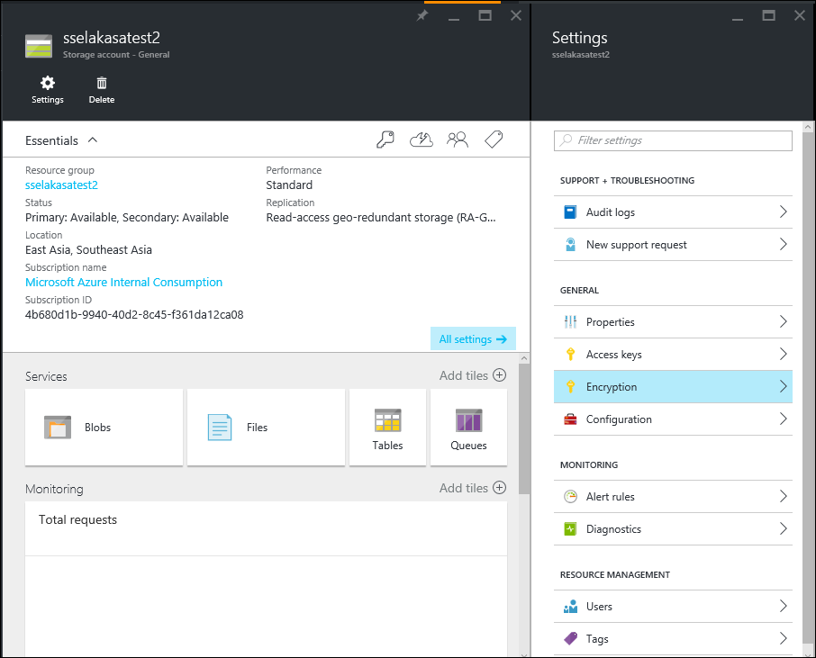
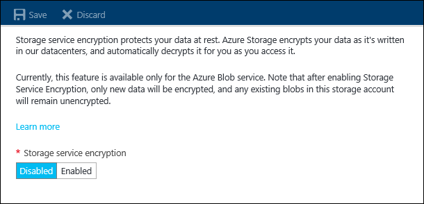

<properties
	pageTitle="Azure Storage Service Encryption for Data at Rest (Preview)| Microsoft Azure"
	description="Use the Azure Storage Service Encryption feature to encrypt your Azure Blob Storage on the service side when storing the data, and decrypt it when retrieving the data."
	services="storage"
	documentationCenter=".net"
	authors="robinsh"
	manager="carmonm"
	editor="tysonn"/>

<tags
	ms.service="storage"
	ms.workload="storage"
	ms.tgt_pltfrm="na"
	ms.devlang="na"
	ms.topic="article"
	ms.date="07/26/2016"
	ms.author="robinsh"/>

# Azure Storage Service Encryption for Data at Rest (Preview)

Azure Storage Service Encryption (SSE) for Data at Rest helps you protect and safeguard your data to meet your organizational security and compliance commitments. With this feature, Azure Storage automatically encrypts your data prior to persisting to storage and decrypts prior to retrieval. The encryption, decryption and key management is totally transparent to users.

The following sections provide detailed guidance on how to use the Storage Service Encryption features as well as the supported scenarios and user experiences.

## Overview

Azure Storage provides a comprehensive set of security capabilities which together enable developers to build secure applications. Data can be secured in transit between an application and Azure by using [Client-Side Encryption](storage-client-side-encryption.md), HTTPs, or SMB 3.0. Storage Service Encryption is a new feature of Azure Storage that will encrypt data when it is written to your Azure Storage supporting block blobs, page blobs and append blobs. This feature can be enabled for new storage accounts using the Azure Resource Manager deployment model and is available for all redundancy levels (LRS, ZRS, GRS, RA-GRS). Storage Service Encryption is available for both Standard and Premium Storage, handling encryption, decryption, and key management in a totally transparent fashion. All data is encrypted using 256-bit [AES encryption](https://en.wikipedia.org/wiki/Advanced_Encryption_Standard), one of the strongest block ciphers available. The Preview section below has details on how one can on board the preview program for Storage Service Encryption.

This screenshot shows where to find the Storage Service Encryption setting using the [Azure Portal](https://azure.portal.com). On this screen, you would click on Encryption to continue.

After you click the Encryption setting, you can enable or disable Storage Service Encryption.

##Availability

For Standard Storage, this feature is currently available in Australia Southeast, Canada Central, Canada East, Central US, East Asia, East US 2, North Central US, Southeast Asia, West Europe, and West US.

For Premium Storage, this feature is currently available in Australia Southeast, Canada Central, Canada East, Central US, East Asia, East US 2, North Central US, Southeast Asia, Japan East, and West US. 

We will update this document as we roll this feature out in additional regions.

##Encryption Scenarios

Storage Service Encryption can be enabled at a storage account level. It supports the following customer scenarios:

-   Encryption of block blobs, append blobs, and page blobs.

-   Encryption of archived VHDs and templates brought to Azure from on-premises.

-   Encryption of underlying OS and data disks for IaaS VMs created using your VHDs.

The public preview has the following limitations:

-   Encryption of classic storage accounts is not supported.

-   Encryption of classic storage accounts migrated to Resource Manager storage accounts is not supported.

-   Existing Data - SSE only encrypts newly created data after the encryption is enabled. If for example you create a new Resource Manager storage account but don’t turn on encryption, and then you upload blobs or archived VHDs to that storage account and then turn on SSE, those blobs will not be encrypted unless they are rewritten or copied.

-   Marketplace Support - Enable encryption of VMs created from the Marketplace using the (Azure Portal)[https://portal.azure.com), PowerShell and Azure CLI. The VHD base image will remain unencrypted; however, any writes done after the VM has spun up will be encrypted.

-   Table, Queues, and Files data will not be encrypted.

##Preview

This feature is supported only for newly created Resource Manager storage accounts; classic storage accounts are not supported. To use this new feature, you must register your subscription using PowerShell cmdlets. Once your subscription is approved, you will be able to enable SSE for your storage account under the approved subscription. As with most previews, this should not be used for production workloads until the feature becomes Generally Available. You can join our Storage Service Encryption Preview group on Yammer to provide any feedback you have regarding your experience.

### Registering for Preview

-   [Install the Azure PowerShell cmdlets](../powershell-install-configure.md). 

-   In Windows 10, open PowerShell as Administrator.  

-   Register with the Storage Resource Provider namespace. This is only needed for a subscription that is not already registered with the SRP.

    `PS E:\> Register-AzureRmResourceProvider -ProviderNamespace "Microsoft.Storage" `

-   To register for the feature, you can use the Register-AzureRmProviderFeature PowerShell cmdlet.

    `Register-AzureRmProviderFeature -FeatureName "EncryptionAtRest" -ProviderNamespace "Microsoft.Storage"`

-   To query the state of your registration to see if the subscription has been approved, you can use the Get-AzureRmProviderFeature PowerShell cmdlet.

    `Get-AzureRmProviderFeature -FeatureName "EncryptionAtRest" -ProviderNamespace "Microsoft.Storage"`

When the registration status is returned as “Registered”, your subscription has been approved. Please also visit our Azure Storage Service Encryption Preview group on Yammer.

##Getting Started

###Step 1: [Sign up for the Preview](#registering-for-preview).

###Step 2: [Create a new storage account](storage-create-storage-account.md).

###Step 3: Enable encryption.

You can enable encryption using the [Azure Portal](https://portal.azure.com).

> [AZURE.NOTE] If you want to programmatically enable or disable the Storage Service Encryption on a storage account, you can use the [Azure Storage Resource Provider REST API](https://msdn.microsoft.com/library/azure/mt163683.aspx). We will be adding this ability to the [Storage Resource Provider Client Library for .NET](https://msdn.microsoft.com/library/azure/mt131037.aspx), Azure PowerShell and Azure CLI soon.

###Step 4: Copy data to storage account

#### Using AzCopy

AzCopy is a Windows command-line utility designed for copying data to and from Microsoft Azure Blob, File, and Table storage using simple commands with optimal performance. You can use this utility to copy data from an existing blob storage account to your new storage account with encryption capability enabled.

To learn more, please visit [Transfer data with the AzCopy Command Line Utility](storage-use-azcopy.md).

#### Using the Storage Client Libraries

You can upload and download data to and from blob storage using our rich set of Storage Client Libraries including .NET, C++, Java, Android, Node.js, PHP, Python, and Ruby.

To learn more, please visit our [Get started with Azure Blob storage using .NET](storage-dotnet-how-to-use-blobs.md).

#### Using a Storage Explorer

A Storage explorer can be used to create storage accounts, upload and download data, view contents of blobs, and navigate through directories. Many support both classic and Resource Manager storage accounts.

You can use one of these to upload blobs to your storage account with encryption enabled. With some storage explorers, you can also copy data from your existing storage account to your new storage account that has SSE enabled.

To learn more, please visit [Azure Storage Explorers](storage-explorers.md).

###Step 5: Query the status of the encrypted data

Once SSE is widely available, an updated version of the Storage Client libraries will be deployed that allow you to query the state of an object to determine if it is encrypted or not.

In the meantime, you can call [Get Account Properties](https://msdn.microsoft.com/library/azure/mt163553.aspx) to verify that the storage account has encryption enabled or view the storage account properties in the Azure Portal.

##Encryption and Decryption Workflow

Here is a brief description of the encryption/decryption workflow:

-   The customer enables encryption on the storage account.

-   When the customer writes new data (PUT Blob, PUT Block, PUT Page, etc.) to Blob storage; every write is encrypted using 256-bit [AES encryption](https://en.wikipedia.org/wiki/Advanced_Encryption_Standard), one of the strongest block ciphers available.

-   When the customer needs to access data (GET Blob, etc.), data is automatically decrypted before returning to the user.

-   If encryption is disabled, new writes are no longer encrypted and existing encrypted data remains encrypted until rewritten by the user. While encryption is enabled, writes to Blob storage will be encrypted. The state of data does not change with the user toggling between enabling/disabling encryption for the storage account.

-   All encryption keys are stored, encrypted, and managed by Microsoft.

##Frequently asked questions about Storage Service Encryption for Data at Rest

**Q: I have an existing classic storage account. Can I enable SSE on it?**

A: No, SSE is only supported on newly created Resource Manager storage accounts in preview.

**Q: How can I encrypt data in my classic storage account?**

A: You can create a new Resource Manager storage account and copy your data using [AzCopy](storage-use-azcopy.md) from your existing classic storage account to your newly created Resource Manager storage account.

**Q: I have an existing Resource Manager storage account. Can I enable SSE on it?**

A: During the SSE preview, you have to create a new account in order to access the new SSE feature.

**Q: I would like to encrypt the current data in an existing Resource Manager storage account?**

A: If your existing Resource Manager storage account was created prior to this Preview announcement, you can create a new Resource Manager Storage account and enable encryption. You can then copy your data from the previous storage account, and it will be automatically encrypted. However, if your Resource Manager storage account was created after the Preview announcement and you decided to enable encryption at a later point in time, you can enable encryption for this storage account using Azure Portal and rewrite your unencrypted data back into the storage account.

**Q: I’m using Premium storage; can I use SSE?**

A: Yes, SSE is supported on both Standard Storage and Premium Storage.

**Q: If I create a new storage account and enable SSE, then create a new VM using that storage account, does that mean my VM is encrypted?**

A: Yes. Any disks created that use the new storage account will be encrypted, as long as they are created after SSE is enabled. If the VM was created using Azure Market Place, the VHD base image will remain unencrypted; however, any writes done after the VM has spun up will be encrypted.

**Q: Can I create new storage accounts with SSE enabled using Azure PowerShell and Azure CLI?**

A: We will be releasing this capability in the upcoming release of Azure PowerShell and Azure CLI, currently targeted for the end of April.

**Q: How much more does Azure Storage cost if SSE is enabled?**

A: There is no additional cost.

**Q: How do I sign up for the preview?**

A: You can register for access to the preview using PowerShell. Once your subscription is approved for the feature, you will be able to use PowerShell to enable Encryption at Rest.

**Q: When I sign up for the preview using PowerShell, what is the feature name that I need to register?**

A: EncryptionAtRest.

**Q: Who manages the encryption keys?**

A: The keys are managed by Microsoft.

**Q: Can I use my own encryption keys?**

A: We are working on providing capabilities for customers to bring their own encryption keys.

**Q: Can I revoke access to the encryption keys?**

A: Not at this time; the keys are fully managed by Microsoft.

**Q: Is SSE enabled by default when I create a new storage account?**

A: SSE is not enabled by default; you can use the Azure Portal to enable it. You can also programmatically enable this feature using the Storage Resource Provider REST API.

**Q: How is this different from Azure Drive Encryption?**

A: This feature is used to encrypt data in Azure Blob storage. The Azure Disk Encryption is used to encrypt OS and Data disks in IaaS VMs. For more details, please visit our [Storage Security Guide](storage-security-guide.md).

**Q: What if I enable SSE, and then go in and enable Azure Disk Encryption on the disks?**

A: This will work seamlessly. Your data will be encrypted by both methods.

**Q: My storage account is set up to be replicated geo-redundantly. If I enable SSE, will my redundant copy also be encrypted?**

A: Yes, all copies of the storage account are encrypted, and all redundancy options – Locally Redundant Storage (LRS), Zone-Redundant Storage (ZRS), Geo-Redundant Storage (GRS), and Read Access Geo-Redundant Storage (RA-GRS) are all supported.

**Q: I can’t enable encryption on my storage account.**

A: When did you create the storage account? During the preview, you will need to register your subscription and also create a new storage account to be able to use SSE; you cannot enable SSE on storage accounts created prior to the preview.

**Q: Is the SSE Preview only permitted in specific regions?**

A: The SSE Preview is available in East Asia and West Europe for Standard storage and Japan East for Premium Storage. As we roll this out to additional regions in the following months, we will update this document.

**Q: How do I contact someone if I have any issues or want to provide feedback?**

A: Please contact [ssediscussions@microsoft.com](mailto:ssediscussions@microsoft.com) for any issues related to Storage Service Encryption.

##Next Steps

Azure Storage provides a comprehensive set of security capabilities which together enable developers to build secure applications. For more details, visit the [Storage Security Guide](storage-security-guide.md).
