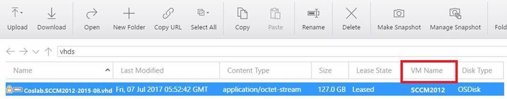

# How to use Storage Explorer to delete object

You might cannot delete a storage account because of a VHD which prevents deletion of the storage account. This article shows how to delete the VHD by using Microsoft Azure Storage Explorer (Preview).

To delete the object, please follow these steps:

## Step 1 Identity the VHD and VM that prevent deletion of the storage account

1. When you delete the storage  account, you will receive a message dialog such as the following: 

     

2. Check the Disk URL to identify the storage account that contains the VHD. In the following example, the string before “.blob.core.windows.net “ is the storage account name, and "Coslab-SCCM2012-2015-08-28.vhd" is the disk name.  

        https://portalvhds73fmhrw5xkp43.blob.core.windows.net/vhds/Coslab-SCCM2012-2015-08-28.vhd

3. Copy the disk name from the disk URL. 

## Step 2 Delete the VDH by using Azure Storage Explorer

1. Download and Install the latest version of [Azure Storage Explorer](http://storageexplorer.com/). This tool is a standalone app from Microsoft that allows you to easily work with Azure Storage data on Windows, macOS and Linux.
2. Open Azure Storage Explorer, select  on the left bar, select your Azure environment, and then sign in.

3. Select all subscriptions or the subscription that contains the storage account you want to delete.

    

4. Go to the storage account that we obtained from the disk URL earlier, select the Blob Containers > vhds and search for the VHD that prevents you delete the storage account.
5. If the VHD is found,  check the **VM Name** column to find the VM that is using this VHD.

    

6. Detach the VDH from Azure portal. For more information, see [How to detach a disk from a Windows virtual machine](../virtual-machines/windows/classic/detach-disk.md). If the VHD is OS disk, you must delete the VM. Then you can delete the VHD.

    > [!Note]
    > If you delete the attached disks with the VM, then you can proceed with deleting Storage account after the VM deletion are finished. If you delete the VHD separately, wait for > a few minutes to delete the VHD. Disks are detached from a deleted VM asynchronously. It might take a few minutes after the VM is deleted for this field to clear up.

7. Go to the Azure Storage Explorer, right-click the VHD and then select delete. 
