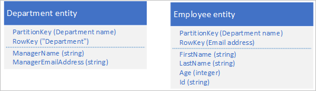
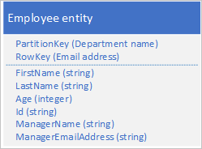
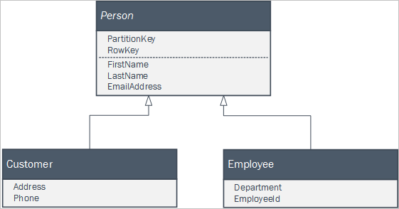
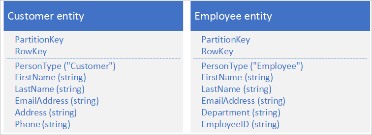

# Modeling relationships
This article discusses the modeling process to help you design your Azure Table storage solutions.

Building domain models is a key step in the design of complex systems. Typically, you use the modeling process to identify entities and the relationships between them as a way to understand the business domain and inform the design of your system. This section focuses on how you can translate some of the common relationship types found in domain models to designs for the Table service. The process of mapping from a logical data-model to a physical NoSQL based data-model is different from that used when designing a relational database. Relational databases design typically assumes a data normalization process optimized for minimizing redundancy – and a declarative querying capability that abstracts how the implementation of how the database works.  

## One-to-many relationships
One-to-many relationships between business domain objects occur frequently: for example, one department has many employees. There are several ways to implement one-to-many relationships in the Table service each with pros and cons that may be relevant to the particular scenario.  

Consider the example of a large multi-national corporation with tens of thousands of departments and employee entities where every department has many employees and each employee as associated with one specific department. One approach is to store separate department and employee entities such as these:  

This example shows an implicit one-to-many relationship between the types based on the **PartitionKey** value. Each department can have many employees.  

This example also shows a department entity and its related employee entities in the same partition. You could choose to use different partitions, tables, or even storage accounts for the different entity types.  

An alternative approach is to denormalize your data and store only employee entities with denormalized department data as shown in the following example. In this particular scenario, this denormalized approach may not be the best if you have a requirement to be able to change the details of a department manager because to do this you need to update every employee in the department.  

For more information, see the [Denormalization pattern](table-storage-design-patterns.md#denormalization-pattern) later in this guide.  

The following table summarizes the pros and cons of each of the approaches outlined above for storing employee and department entities that have a one-to-many relationship. You should also consider how often you expect to perform various operations: it may be acceptable to have a design that includes an expensive operation if that operation only happens infrequently.  

<table>
<tr>
<th>Approach</th>
<th>Pros</th>
<th>Cons</th>
</tr>
<tr>
<td>Separate entity types, same partition, same table</td>
<td>
<ul>
<li>You can update a department entity with a single operation.</li>
<li>You can use an EGT to maintain consistency if you have a requirement to modify a department entity whenever you update/insert/delete an employee entity. For example, if you maintain a departmental employee count for each department.</li>
</ul>
</td>
<td>
<ul>
<li>You may need to retrieve both an employee and a department entity for some client activities.</li>
<li>Storage operations happen in the same partition. At high transaction volumes, this may result in a hotspot.</li>
<li>You cannot move an employee to a new department using an EGT.</li>
</ul>
</td>
</tr>
<tr>
<td>Separate entity types, different partitions or tables or storage accounts</td>
<td>
<ul>
<li>You can update a department entity or employee entity with a single operation.</li>
<li>At high transaction volumes, this may help spread the load across more partitions.</li>
</ul>
</td>
<td>
<ul>
<li>You may need to retrieve both an employee and a department entity for some client activities.</li>
<li>You cannot use EGTs to maintain consistency when you update/insert/delete an employee and update a department. For example, updating an employee count in a department entity.</li>
<li>You cannot move an employee to a new department using an EGT.</li>
</ul>
</td>
</tr>
<tr>
<td>Denormalize into single entity type</td>
<td>
<ul>
<li>You can retrieve all the information you need with a single request.</li>
</ul>
</td>
<td>
<ul>
<li>It may be expensive to maintain consistency if you need to update department information (this would require you to update all the employees in a department).</li>
</ul>
</td>
</tr>
</table>

How you choose between these options, and which of the pros and cons are most significant, depends on your specific application scenarios. For example, how often do you modify department entities; do all your employee queries need the additional departmental information; how close are you to the scalability limits on your partitions or your storage account?  

## One-to-one relationships
Domain models may include one-to-one relationships between entities. If you need to implement a one-to-one relationship in the Table service, you must also choose how to link the two related entities when you need to retrieve them both. This link can be either implicit, based on a convention in the key values, or explicit by storing a link in the form of **PartitionKey** and **RowKey** values in each entity to its related entity. For a discussion of whether you should store the related entities in the same partition, see the section [One-to-many relationships](#one-to-many-relationships).  

There are also implementation considerations that might lead you to implement one-to-one relationships in the Table service:  

* Handling large entities (for more information, see [Large Entities Pattern](table-storage-design-patterns.md#large-entities-pattern)).  
* Implementing access controls (for more information, see Controlling access with Shared Access Signatures).  

## Join in the client
Although there are ways to model relationships in the Table service, you should not forget that the two prime reasons for using the Table service are scalability and performance. If you find you are modeling many relationships that compromise the performance and scalability of your solution, you should ask yourself if it is necessary to build all the data relationships into your table design. You may be able to simplify the design and improve the scalability and performance of your solution if you let your client application perform any necessary joins.  

For example, if you have small tables that contain data that does not change often, then you can retrieve this data once and cache it on the client. This can avoid repeated roundtrips to retrieve the same data. In the examples we have looked at in this guide, the set of departments in a small organization is likely to be small and change infrequently making it a good candidate for data that client application can download once and cache as look up data.  

## Inheritance relationships
If your client application uses a set of classes that form part of an inheritance relationship to represent business entities, you can easily persist those entities in the Table service. For example, you might have the following set of classes defined in your client application where **Person** is an abstract class.

You can persist instances of the two concrete classes in the Table service using a single Person table using entities in that look like this:  

For more information about working with multiple entity types in the same table in client code, see the section Working with heterogeneous entity types later in this guide. This provides examples of how to recognize the entity type in client code.  

## Next steps

- [Table design patterns](table-storage-design-patterns.md)
- [Design for querying](table-storage-design-for-query.md)
- [Encrypt table data](table-storage-design-encrypt-data.md)
- [Design for data modification](table-storage-design-for-modification.md)
