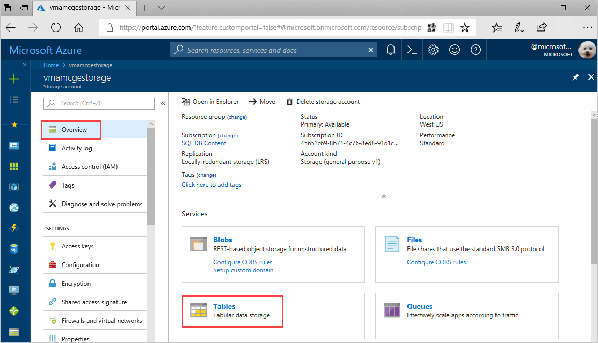
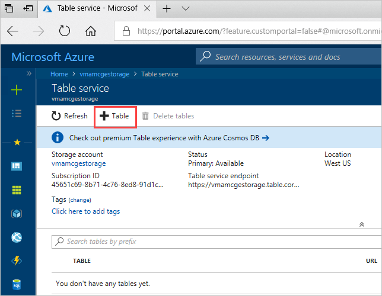

# Quickstart: Create an Azure Storage table in the Azure portal 

This quickstart shows how to create tables and entities in the web-based Azure portal. This quickstart also shows you how to create an Azure storage account.

[!INCLUDE [quickstarts-free-trial-note](../../../includes/quickstarts-free-trial-note.md)]

## Prerequisites

To complete this quickstart, first create an Azure storage account in the [Azure portal](https://portal.azure.com/#create/Microsoft.StorageAccount-ARM). For help creating the account, see [Create a storage account](../common/storage-account-create.md).

## Add a table

You can now use Table service in the Azure portal to create a table.

1. Click Overview > Tables.

   

2. Click **+ Table**.

   

3. Type a name for your table in the **Table name** box, then click **OK**. 

   

## Next steps

- [Guidelines for table design](table-storage-design-guidelines.md)
