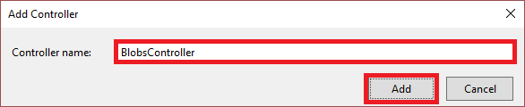
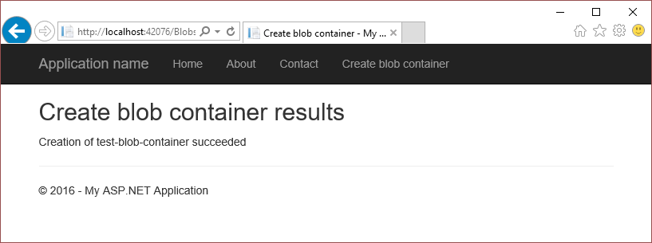
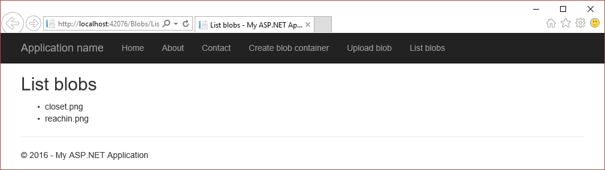

# Get started with Azure blob storage and Visual Studio Connected Services (ASP.NET)
[!INCLUDE [storage-try-azure-tools-blobs](../../includes/storage-try-azure-tools-blobs.md)]

## Overview

Azure blob storage is a service that stores unstructured data in the cloud as objects/blobs. Blob storage can store any type of text or binary data, such as a document, media file, or application installer. Blob storage is also referred to as object storage.

This tutorial shows how to write ASP.NET code for some common scenarios using Azure blob storage. Scenarios 
include creating a blob container, and uploading, listing, downloading, and deleting blobs.

##Prerequisites

* [Microsoft Visual Studio](https://www.visualstudio.com/visual-studio-homepage-vs.aspx)
* [Azure storage account](storage-create-storage-account.md#create-a-storage-account)

[!INCLUDE [storage-blob-concepts-include](../../includes/storage-blob-concepts-include.md)]

[!INCLUDE [storage-create-account-include](../../includes/vs-storage-aspnet-getting-started-create-azure-account.md)]

[!INCLUDE [storage-development-environment-include](../../includes/vs-storage-aspnet-getting-started-setup-dev-env.md)]

### Create an MVC controller 

1. In the **Solution Explorer**, right-click **Controllers**, and, from the context menu, select **Add->Controller**.

	

1. On the **Add Scaffold** dialog, select **MVC 5 Controller - Empty**, and select **Add**.

	

1. On the **Add Controller** dialog, name the controller *BlobsController*, and select **Add**.

	

1. Add the following *using* directives to the `BlobsController.cs` file:

    ```csharp
	using Microsoft.Azure;
    using Microsoft.WindowsAzure.Storage;
    using Microsoft.WindowsAzure.Storage.Auth;
    using Microsoft.WindowsAzure.Storage.Blob;
	```

## Create a blob container

A blob container is a nested hierarchy of blobs and folders. The following steps illustrate how to create a blob container:

> [!NOTE]
> 
> The code in this section assumes that you have completed the steps in the section, [Set up the development environment](#set-up-the-development-environment). 

1. Open the `BlobsController.cs` file.

1. Add a method called **CreateBlobContainer** that returns an **ActionResult**.

    ```csharp
    public ActionResult CreateBlobContainer()
    {
		// The code in this section goes here.

        return View();
    }
    ```
 
1. Within the **CreateBlobContainer** method, get a **CloudStorageAccount** object that represents your storage account information. Use the following code to get the storage connection string and storage account information from the Azure service configuration. (Change *&lt;storage-account-name>* to the name of the Azure storage account you're accessing.)
   
    ```csharp
    CloudStorageAccount storageAccount = CloudStorageAccount.Parse(
       CloudConfigurationManager.GetSetting("<storage-account-name>_AzureStorageConnectionString"));
    ```
   
1. Get a **CloudBlobClient** object represents a blob service client.
   
    ```csharp
    CloudBlobClient blobClient = storageAccount.CreateCloudBlobClient();
    ```

1. Get a **CloudBlobContainer** object that represents a reference to the desired blob container name. The **CloudBlobClient.GetContainerReference** method does not make a request against blob storage. The reference is returned whether or not the blob container exists. 
   
    ```csharp
    CloudBlobContainer container = blobClient.GetContainerReference("test-blob-container");
    ```

1. Call the **CloudBlobContainer.CreateIfNotExists** method to create the container if it does not yet exist. The **CloudBlobContainer.CreateIfNotExists** method returns **true** if the container does not exist, and is successfully created. Otherwise, **false** is returned.    

    ```csharp
	ViewBag.Success = container.CreateIfNotExists();
    ```

1. Update the **ViewBag** with the name of the blob container.

    ```csharp
	ViewBag.BlobContainerName = container.Name;
    ```

1. In the **Solution Explorer**, expand the **Views** folder, right-click **Blobs**, and from the context menu, select **Add->View**.

1. On the **Add View** dialog, enter **CreateBlobContainer** for the view name, and select **Add**.

1. Open `CreateBlobContainer.cshtml`, and modify it so that it looks like the following code snippet:

    ```csharp
	@{
	    ViewBag.Title = "Create Blob Container";
	}
	
	<h2>Create Blob Container results</h2>

	Creation of @ViewBag.BlobContainerName @(ViewBag.Success == true ? "succeeded" : "failed")
    ```

1. In the **Solution Explorer**, expand the **Views->Shared** folder, and open `_Layout.cshtml`.

1. After the last **Html.ActionLink**, add the following **Html.ActionLink**:

    ```html
	<li>@Html.ActionLink("Create blob container", "CreateBlobContainer", "Blobs")</li>
    ```

1. Run the application, and select **Create Blob Container** to see results similar to the following screen shot:
  
	

	As mentioned previously, the **CloudBlobContainer.CreateIfNotExists** method returns **true** only when the container doesn't exist and is created. Therefore, if you run the app when the container exists, the method returns **false**. To run the app multiple times, you must delete the container before running the app again. Deleting the container can be done via the **CloudBlobContainer.Delete** method. You can also delete the container using the [Azure portal](http://go.microsoft.com/fwlink/p/?LinkID=525040) or the [Microsoft Azure Storage Explorer](../vs-azure-tools-storage-manage-with-storage-explorer.md).  

## Upload a blob into a blob container

Once you've [created a blob container](#create-a-blob-container), you can upload files into that container. This section walks you through uploading a local file to a blob container. The steps assume you've created a blob container named *test-blob-container*. 

> [!NOTE]
> 
> The code in this section assumes that you have completed the steps in the section, [Set up the development environment](#set-up-the-development-environment). 

1. Open the `BlobsController.cs` file.

1. Add a method called **UploadBlob** that returns an **EmptyResult**.

    ```csharp
    public EmptyResult UploadBlob()
    {
		// The code in this section goes here.

        return new EmptyResult();
    }
    ```
 
1. Within the **UploadBlob** method, get a **CloudStorageAccount** object that represents your storage account information. Use the following code to get the storage connection string and storage account information from the Azure service configuration: (Change *&lt;storage-account-name>* to the name of the Azure storage account you're accessing.)
   
    ```csharp
    CloudStorageAccount storageAccount = CloudStorageAccount.Parse(
       CloudConfigurationManager.GetSetting("<storage-account-name>_AzureStorageConnectionString"));
    ```
   
1. Get a **CloudBlobClient** object represents a blob service client.
   
    ```csharp
    CloudBlobClient blobClient = storageAccount.CreateCloudBlobClient();
    ```

1. Get a **CloudBlobContainer** object that represents a reference to the blob container name. 
   
    ```csharp
    CloudBlobContainer container = blobClient.GetContainerReference("test-blob-container");
    ```

1. As explained earlier, Azure storage supports different blob types. To retrieve a reference to a page blob, call the **CloudBlobContainer.GetPageBlobReference** method. To retrieve a reference to a block blob, call the **CloudBlobContainer.GetBlockBlobReference** method. Usually, block blob is the recommended type to use. (Change <blob-name>* to the name you want to give the blob once uploaded.)

    ```csharp
    CloudBlockBlob blob = container.GetBlockBlobReference(<blob-name>);
    ```

1. Once you have a blob reference, you can upload any data stream to it by calling the blob reference object's **UploadFromStream** method. The **UploadFromStream** method creates the blob if it doesn't exist,
or overwrites it if it does exist. (Change *&lt;file-to-upload>* to a fully qualified path to the file you want to upload.)

    ```csharp
    using (var fileStream = System.IO.File.OpenRead(<file-to-upload>))
    {
        blob.UploadFromStream(fileStream);
    }
    ```

1. In the **Solution Explorer**, expand the **Views** folder, right-click **Blobs**, and from the context menu, select **Add->View**.

1. In the **Solution Explorer**, expand the **Views->Shared** folder, and open `_Layout.cshtml`.

1. After the last **Html.ActionLink**, add the following **Html.ActionLink**:

    ```html
	<li>@Html.ActionLink("Upload blob", "UploadBlob", "Blobs")</li>
    ```

1. Run the application, and select **Upload blob**.  
  
The section - [List the blobs in a blob container](#list-the-blobs-in-a-blob-container) - illustrates how to list the blobs in a blob container. 	

## List the blobs in a blob container

This section illustrates how to list the blobs in a blob container. The sample code references the *test-blob-container* created in the section, [Create a blob container](#create-a-blob-container).

> [!NOTE]
> 
> The code in this section assumes that you have completed the steps in the section, [Set up the development environment](#set-up-the-development-environment). 

1. Open the `BlobsController.cs` file.

1. Add a method called **ListBlobs** that returns an **ActionResult**.

    ```csharp
    public ActionResult ListBlobs()
    {
		// The code in this section goes here.

        return View();
    }
    ```
 
1. Within the **ListBlobs** method, get a **CloudStorageAccount** object that represents your storage account information. Use the following code to get the storage connection string and storage account information from the Azure service configuration: (Change *&lt;storage-account-name>* to the name of the Azure storage account you're accessing.)
   
    ```csharp
    CloudStorageAccount storageAccount = CloudStorageAccount.Parse(
       CloudConfigurationManager.GetSetting("<storage-account-name>_AzureStorageConnectionString"));
    ```
   
1. Get a **CloudBlobClient** object represents a blob service client.
   
    ```csharp
    CloudBlobClient blobClient = storageAccount.CreateCloudBlobClient();
    ```

1. Get a **CloudBlobContainer** object that represents a reference to the blob container name. 
   
    ```csharp
    CloudBlobContainer container = blobClient.GetContainerReference("test-blob-container");
    ```

1. To list the blobs in a blob container, use the **CloudBlobContainer.ListBlobs** method. The **CloudBlobContainer.ListBlobs** method returns an **IListBlobItem** object that you cast to a **CloudBlockBlob**,
**CloudPageBlob**, or **CloudBlobDirectory** object. The following code snippet enumerates
all the blobs in a blob container. Each blob is cast to the appropriate object based on its type,
and its name (or URI in the case of a **CloudBlobDirectory**) is added to a list.

    ```csharp
    List<string> blobs = new List<string>();

    foreach (IListBlobItem item in container.ListBlobs(null, false))
    {
        if (item.GetType() == typeof(CloudBlockBlob))
        {
            CloudBlockBlob blob = (CloudBlockBlob)item;
            blobs.Add(blob.Name);
        }
        else if (item.GetType() == typeof(CloudPageBlob))
        {
            CloudPageBlob blob = (CloudPageBlob)item;
            blobs.Add(blob.Name);
        }
        else if (item.GetType() == typeof(CloudBlobDirectory))
        {
            CloudBlobDirectory dir = (CloudBlobDirectory)item;
            blobs.Add(dir.Uri.ToString());
        }
    }

	return View(blobs);
    ```

	In addition to blobs, blob containers can contain directories. Let's suppose you have a blob container called *test-blob-container* with the following hierarchy:

		foo.png
		dir1/bar.png
		dir2/baz.png

	Using the preceding code example, the **blobs** string list contains values similar to the following:

		foo.png
		<storage-account-url>/test-blob-container/dir1
		<storage-account-url>/test-blob-container/dir2

	As you can see, the list includes only the top-level entities; not the nested ones (*bar.png* and *baz.png*). To list all the entities within a blob container, you must call the **CloudBlobContainer.ListBlobs** method and pass **true** for the **useFlatBlobListing** parameter.    

    ```csharp
    ...
	foreach (IListBlobItem item in container.ListBlobs(useFlatBlobListing:true))
	...
    ```

	Setting the **useFlatBlobListing** parameter to **true** returns a flat listing of all entities in the blob container, and yields the following results:

		foo.png
		dir1/bar.png
		dir2/baz.png

1. In the **Solution Explorer**, expand the **Views** folder, right-click **Blobs**, and from the context menu, select **Add->View**.

1. On the **Add View** dialog, enter **ListBlobs** for the view name, and select **Add**.

1. Open `ListBlobs.cshtml`, and modify it so that it looks like the following code snippet:

    ```html
	@model List<string>
	@{
	    ViewBag.Title = "List blobs";
	}
	
	<h2>List blobs</h2>
	
	<ul>
	    @foreach (var item in Model)
	    {
	    <li>@item</li>
	    }
	</ul>
    ```

1. In the **Solution Explorer**, expand the **Views->Shared** folder, and open `_Layout.cshtml`.

1. After the last **Html.ActionLink**, add the following **Html.ActionLink**:

    ```html
	<li>@Html.ActionLink("List blobs", "ListBlobs", "Blobs")</li>
    ```

1. Run the application, and select **List blobs** to see results similar to the following screen shot:
  
	

## Download blobs

This section illustrates how to download a blob and either persist it to local storage or read the contents into a string. The sample code references the *test-blob-container* created in the section, [Create a blob container](#create-a-blob-container).

1. Open the `BlobsController.cs` file.

1. Add a method called **DownloadBlob** that returns an **ActionResult**.

    ```csharp
    public EmptyResult DownloadBlob()
    {
		// The code in this section goes here.

        return new EmptyResult();
    }
    ```
 
1. Within the **DownloadBlob** method, get a **CloudStorageAccount** object that represents your storage account information. Use the following code to get the storage connection string and storage account information from the Azure service configuration: (Change *&lt;storage-account-name>* to the name of the Azure storage account you're accessing.)
   
    ```csharp
    CloudStorageAccount storageAccount = CloudStorageAccount.Parse(
       CloudConfigurationManager.GetSetting("<storage-account-name>_AzureStorageConnectionString"));
    ```
   
1. Get a **CloudBlobClient** object represents a blob service client.
   
    ```csharp
    CloudBlobClient blobClient = storageAccount.CreateCloudBlobClient();
    ```

1. Get a **CloudBlobContainer** object that represents a reference to the blob container name. 
   
    ```csharp
    CloudBlobContainer container = blobClient.GetContainerReference("test-blob-container");
    ```

1. Get a blob reference object by calling **CloudBlobContainer.GetBlockBlobReference** or **CloudBlobContainer.GetPageBlobReference** method. (Change *&lt;blob-name>* to the name of the blob you are downloading.)

    ```csharp
    CloudBlockBlob blob = container.GetBlockBlobReference(<blob-name>);
    ```

1. To download a blob, use the **CloudBlockBlob.DownloadToStream** or **CloudPageBlob.DownloadToStream** method, depending on the blob type. The following code snippet uses the **CloudBlockBlob.DownloadToStream** method to transfer a blob's contents to a stream object that is then persisted to a local file: (Change *&lt;local-file-name>* to the fully qualified file name representing where you want the blob downloaded.) 

    ```csharp
    using (var fileStream = System.IO.File.OpenWrite(<local-file-name>))
    {
        blob.DownloadToStream(fileStream);
    }
    ```

1. In the **Solution Explorer**, expand the **Views->Shared** folder, and open `_Layout.cshtml`.

1. After the last **Html.ActionLink**, add the following **Html.ActionLink**:

    ```html
	<li>@Html.ActionLink("Download blob", "DownloadBlob", "Blobs")</li>
    ```

1. Run the application, and select **Download blob** to download the blob. The blob specified in the **CloudBlobContainer.GetBlockBlobReference** method call downloads to the location you specify in the **File.OpenWrite** method call. 

## Delete blobs

The following steps illustrate how to delete a blob:

> [!NOTE]
> 
> The code in this section assumes that you have completed the steps in the section, [Set up the development environment](#set-up-the-development-environment). 

1. Open the `BlobsController.cs` file.

1. Add a method called **DeleteBlob** that returns an **ActionResult**.

    ```csharp
    public EmptyResult DeleteBlob()
    {
		// The code in this section goes here.

        return new EmptyResult();
    }
    ```

1. Get a **CloudStorageAccount** object that represents your storage account information. Use the following code to get the storage connection string and storage account information from the Azure service configuration: (Change *&lt;storage-account-name>* to the name of the Azure storage account you're accessing.)
   
    ```csharp
    CloudStorageAccount storageAccount = CloudStorageAccount.Parse(
       CloudConfigurationManager.GetSetting("<storage-account-name>_AzureStorageConnectionString"));
    ```
   
1. Get a **CloudBlobClient** object represents a blob service client.
   
    ```csharp
    CloudBlobClient blobClient = storageAccount.CreateCloudBlobClient();
    ```

1. Get a **CloudBlobContainer** object that represents a reference to the blob container name. 
   
    ```csharp
    CloudBlobContainer container = blobClient.GetContainerReference("test-blob-container");
    ```

1. Get a blob reference object by calling **CloudBlobContainer.GetBlockBlobReference** or **CloudBlobContainer.GetPageBlobReference** method. (Change *&lt;blob-name>* to the name of the blob you are deleting.)

    ```csharp
    CloudBlockBlob blob = container.GetBlockBlobReference(<blob-name>);
        ```

1. To delete a blob, use the **Delete** method.

    ```csharp
    blob.Delete();
    ```

1. In the **Solution Explorer**, expand the **Views->Shared** folder, and open `_Layout.cshtml`.

1. After the last **Html.ActionLink**, add the following **Html.ActionLink**:

    ```html
	<li>@Html.ActionLink("Delete blob", "DeleteBlob", "Blobs")</li>
    ```

1. Run the application, and select **Delete blob** to delete the blob specified in the **CloudBlobContainer.GetBlockBlobReference** method call. 

## Next steps
View more feature guides to learn about additional options for storing data in Azure.

  * [Get started with Azure table storage and Visual Studio Connected Services (ASP.NET)](./vs-storage-aspnet-getting-started-tables.md)
  * [Get started with Azure queue storage and Visual Studio Connected Services (ASP.NET)](./vs-storage-aspnet-getting-started-queues.md)