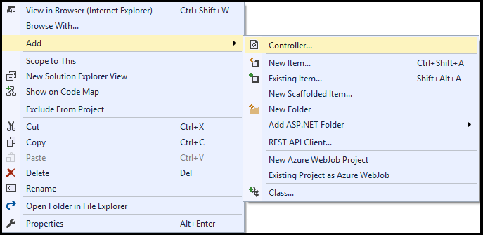
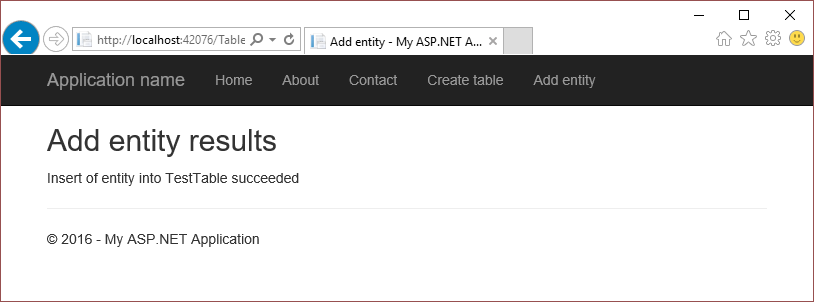

# Get started with Azure table storage and Visual Studio Connected Services (ASP.NET)
[!INCLUDE [storage-try-azure-tools-tables](../../includes/storage-try-azure-tools-tables.md)]

## Overview

Azure Table storage enables you to store large amounts of structured data. The service is a NoSQL datastore that accepts authenticated calls from inside and outside the Azure cloud. Azure tables are ideal for storing structured, non-relational data.

This tutorial shows how to write ASP.NET code for some common scenarios using Azure table storage entities, performing common tasks such as creating and deleting a table, as well as working with table entities. 

##Prerequisites

* [Microsoft Visual Studio](https://www.visualstudio.com/visual-studio-homepage-vs.aspx)
* [Azure storage account](storage-create-storage-account.md#create-a-storage-account)

[!INCLUDE [storage-create-account-include](../../includes/vs-storage-aspnet-getting-started-create-azure-account.md)]

[!INCLUDE [storage-development-environment-include](../../includes/vs-storage-aspnet-getting-started-setup-dev-env.md)]

### Create an MVC controller 

1. In the **Solution Explorer**, right-click **Controllers**, and, from the context menu, select **Add->Controller**.

	

1. On the **Add Scaffold** dialog, select **MVC 5 Controller - Empty**, and select **Add**.

	

1. On the **Add Controller** dialog, name the controller *TablesController*, and select **Add**.

	

1. Add the following *using* directives to the `TablesController.cs` file.

    ```csharp
	using Microsoft.Azure;
    using Microsoft.WindowsAzure.Storage;
    using Microsoft.WindowsAzure.Storage.Auth;
    using Microsoft.WindowsAzure.Storage.Table;
	```
## Create a table

The following steps illustrate how to create a table.

1. Open the `TablesController.cs` file.

1. Add a method called **CreateTable** that returns an **ActionResult**.

    ```csharp
    public ActionResult CreateTable()
    {
		// The code in this section goes here.

        return View();
    }
    ```
1. Within the **CreateTable** method, get a **CloudStorageAccount** object that represents your storage account information. Use the following code to get the storage connection string and storage account information from the Azure service configuration. (Change  *&lt;storage-account-name>* to the name of the Azure storage account you're accessing.)
   
    ```csharp
    CloudStorageAccount storageAccount = CloudStorageAccount.Parse(
       CloudConfigurationManager.GetSetting("<storage-account-name>_AzureStorageConnectionString"));
    ```

1. Get a **CloudTableClient** object represents a table service client.
   
    ```csharp
    CloudTableClient tableClient = storageAccount.CreateCloudTableClient();
    ```

1. Get a **CloudTable** object that represents a reference to the desired table name. The **CloudTableClient.GetTableReference** method does not make a request against table storage. The reference is returned whether or not the table exists. 
   
    ```csharp
    CloudTable table = tableClient.GetTableReference("TestTable");
    ```
1. Call the **CloudTable.CreateIfNotExists** method to create the table if it does not yet exist. The **CloudTable.CreateIfNotExists** method returns **true** if the table does not exist, and is successfully created; otherwise, **false** is returned.    

    ```csharp
	ViewBag.Success = table.CreateIfNotExists();
    ```
1. Update the **ViewBag** with the name of the table.

    ```csharp
	ViewBag.TableName = table.Name;
    ```

1. In the **Solution Explorer**, expand the **Views** folder, right-click **Tables**, and from the context menu, select **Add->View**.

1. On the **Add View** dialog, enter **CreateTable** for the view name, and select **Add**.

1. Open `CreateTable.cshtml`, and modify it so that it looks like the following.

    ```csharp
	@{
	    ViewBag.Title = "Create table";
	}
	
	<h2>Create table results</h2>

	Creation of @ViewBag.TableName @(ViewBag.Success == true ? "succeeded" : "failed")
    ```

1. In the **Solution Explorer**, expand the **Views->Shared** folder, and open `_Layout.cshtml`.

1. After the last **Html.ActionLink**, add the following **Html.ActionLink**.

    ```html
	<li>@Html.ActionLink("Create table", "CreateTable", "Tables")</li>
    ```

1. Run the application, and select **Create table**. You will see results similar to those shown in the following screen shot. 
  
	

	As mentioned previously, the **CloudTable.CreateIfNotExists** method returns **true** only when the table doesn't exist and is created. Therefore, if you run the app when the table exists, the method will return **false**. To run the app multiple times, you must delete the table before running the app again. Deleting the container can be done via the **CloudTable.Delete** method. You can also delete the table using the [Azure portal](http://go.microsoft.com/fwlink/p/?LinkID=525040) or the [Microsoft Azure Storage Explorer](../vs-azure-tools-storage-manage-with-storage-explorer.md).  

## Add an entity to a table

*Entities* map to C\# objects by using a custom class derived from
**TableEntity**. To add an entity to a table, create a
class that defines the properties of your entity. In this section, you'll 
see how to define an entity class that uses the customer's first name as the row
key and last name as the partition key. Together, an entity's partition
and row key uniquely identify the entity in the table. Entities with the
same partition key can be queried faster than those with different
partition keys, but using diverse partition keys allows for greater scalability of parallel operations. For any property that should be stored in the table service,
the property must be a public property of a supported type that exposes both setting and retrieving values.
The entity class *must* declare a public parameter-less constructor.

1. In the **Solution Explorer**, right-click **Models**, and, from the context menu, select **Add->Class**.

1. On the **Add New Item** dialog, name the class, **CustomerEntity**.

1. Open the `CustomerEntity.cs` file, and add the following **using** directive. 

    ```csharp
	using Microsoft.WindowsAzure.Storage.Table;
    ```

1. Modify the class so that, when finished, the class is declared as in the following code. The class declares an entity class called **CustomerEntity** that uses the customer's first name as the row key and last name as the partition key.

    ```csharp
    public class CustomerEntity : TableEntity
    {
        public CustomerEntity(string lastName, string firstName)
        {
            this.PartitionKey = lastName;
            this.RowKey = firstName;
        }

        public CustomerEntity() { }

        public string Email { get; set; }
    }
    ```

1. Open the `TablesController.cs` file.

1. Add the following directive so that the code in the `TablesController.cs` file can access the **CustomerEntity** class.

    ```csharp
	using StorageAspnet.Models;
    ```

1. Add a method called **AddEntity** that returns an **ActionResult**.

    ```csharp
    public ActionResult AddEntity()
    {
		// The code in this section goes here.

        return View();
    }
    ```

1. Within the **AddEntity** method, get a **CloudStorageAccount** object that represents your storage account information. Use the following code to get the storage connection string and storage account information from the Azure service configuration. (Change  *&lt;storage-account-name>* to the name of the Azure storage account you're accessing.)
   
    ```csharp
    CloudStorageAccount storageAccount = CloudStorageAccount.Parse(
       CloudConfigurationManager.GetSetting("<storage-account-name>_AzureStorageConnectionString"));
    ```

1. Get a **CloudTableClient** object represents a table service client.
   
    ```csharp
    CloudTableClient tableClient = storageAccount.CreateCloudTableClient();
    ```

1. Get a **CloudTable** object that represents a reference to the table to which you are going to add the new entity. 
   
    ```csharp
    CloudTable table = tableClient.GetTableReference("TestTable");
    ```

1. Instantiate and initialize the **CustomerEntity** class.

    ```csharp
    CustomerEntity customer1 = new CustomerEntity("Harp", "Walter");
    customer1.Email = "Walter@contoso.com";
    ```

1. Create a **TableOperation** object that inserts the customer entity.

    ```csharp
    TableOperation insertOperation = TableOperation.Insert(customer1);
    ```

1. Execute the insert operation by calling the **CloudTable.Execute** method. You can verify the result of the operation by inspecting the **TableResult.HttpStatusCode** property. A status code of 2xx indicates the action requested by the client was processed successfully. For example, successful insertions of new entities results in an HTTP status code of 204, meaning that the operation was successfully processed and the server did not return any content.

    ```csharp
	TableResult result = table.Execute(insertOperation);
    ```

1. Update the **ViewBag** with the table name, and the results of the insert operation.

    ```csharp
	ViewBag.TableName = table.Name;
	ViewBag.Result = result.HttpStatusCode;
    ```

1. In the **Solution Explorer**, expand the **Views** folder, right-click **Tables**, and from the context menu, select **Add->View**.

1. On the **Add View** dialog, enter **AddEntity** for the view name, and select **Add**.

1. Open `AddEntity.cshtml`, and modify it so that it looks like the following.

    ```csharp
	@{
	    ViewBag.Title = "Add entity";
	}
	
	<h2>Add entity results</h2>

	Insert of entity into @ViewBag.TableName @(ViewBag.Result == 204 ? "succeeded" : "failed")
    ```
1. In the **Solution Explorer**, expand the **Views->Shared** folder, and open `_Layout.cshtml`.

1. After the last **Html.ActionLink**, add the following **Html.ActionLink**.

    ```html
	<li>@Html.ActionLink("Add entity", "AddEntity", "Tables")</li>
    ```

1. Run the application, and select **Add entity**. You will see results similar to those shown in the following screen shot. 
  
	

	You can verify that the entity was added by following the steps in the section, [Get a single entity](#get-a-single-entity). You can also use the [Microsoft Azure Storage Explorer](../vs-azure-tools-storage-manage-with-storage-explorer.md) to view all of the entities for your tables.


## Add a batch of entities to a table

In addition to being able to add an entity to a table one at a time, you can also add entities in batch. This reduces the number of round-trips between your code and the Azure table service. The following steps illustrate how to programmatically add multiple entities to a table using a single operation. In an ASP.NET MVC app, the code would go in a controller.

1. Add the following *using* directives:

         using Microsoft.Azure;
         using Microsoft.WindowsAzure.Storage;
         using Microsoft.WindowsAzure.Storage.Auth;
         using Microsoft.WindowsAzure.Storage.Table;

2. Get a **CloudStorageAccount** object that represents your storage account information. Use the following code to get the storage connection string and storage account information from the Azure service configuration. (Change  *<storage-account-name>* to the name of the Azure storage account you're accessing.)

         CloudStorageAccount storageAccount = CloudStorageAccount.Parse(
           CloudConfigurationManager.GetSetting("<storage-account-name>_AzureStorageConnectionString"));

3. Get a **CloudTableClient** object represents a table service client.

        CloudTableClient tableClient = storageAccount.CreateCloudTableClient();


4. Get a **CloudTable** object that represents a reference to the desired table name. (Change *<table-name>* to the name of the table to which you want to add the entities.)

		CloudTable table = tableClient.GetTableReference(<table-name>);

5. To add an entity to a table you define a class derived from **TableEntity**. The following code defines an entity class called **CustomerEntity** that uses the customer's first name as the row key and last name as the partition key.

	    public class CustomerEntity : TableEntity
	    {
	        public CustomerEntity(string lastName, string firstName)
	        {
	            this.PartitionKey = lastName;
	            this.RowKey = firstName;
	        }
	
	        public CustomerEntity() { }
	
	        public string Email { get; set; }
	    }

6. Instantiate the entities.

	    CustomerEntity customer1 = new CustomerEntity("Smith", "Jeff");
	    customer1.Email = "Jeff@contoso.com";
	
	    CustomerEntity customer2 = new CustomerEntity("Smith", "Ben");
	    customer2.Email = "Ben@contoso.com";

7. Get a **TableBatchOperation** object.

	    TableBatchOperation batchOperation = new TableBatchOperation();

8. Add entities to the batch insert operation.

	    batchOperation.Insert(customer1);
	    batchOperation.Insert(customer2);

9. Execute the batch insert operation by calling the **CloudTable.ExecuteBatch** method. The **CloudTable.ExecuteBatch** method returns a list of **TableResult** objects. You can verify the result of the batch insert operation by inspecting the **TableResult.HttpStatusCode** property of each **TableResult** object in the list. A status code of 2xx indicates the action requested by the client was processed successfully. For example, successful insertions of new entities results in an HTTP status code of 204, meaning that the operation was successfully processed and the server did not return any content.
    
		IList<TableResult> results = table.ExecuteBatch(batchOperation);

		// Inspect the HttpStatusCode property of each TableResult object
		// in the results list for success/failure.

## Get a single entity

The following steps illustrate how to programmatically get an entity from a table. In an ASP.NET MVC app, the code would go in a controller. 

> [!NOTE]
> 
> The code in this section references the **CustomerEntity** class and data presented in the section, [Add a batch of entities to a table](#add-a-batch-of-entities-to-a-table). 

1. Add the following *using* directives:

         using Microsoft.Azure;
         using Microsoft.WindowsAzure.Storage;
         using Microsoft.WindowsAzure.Storage.Auth;
         using Microsoft.WindowsAzure.Storage.Table;

2. Get a **CloudStorageAccount** object that represents your storage account information. Use the following code to get the storage connection string and storage account information from the Azure service configuration. (Change  *<storage-account-name>* to the name of the Azure storage account you're accessing.)

         CloudStorageAccount storageAccount = CloudStorageAccount.Parse(
           CloudConfigurationManager.GetSetting("<storage-account-name>_AzureStorageConnectionString"));

3. Get a **CloudTableClient** object represents a table service client.

        CloudTableClient tableClient = storageAccount.CreateCloudTableClient();


4. Get a **CloudTable** object that represents a reference to the desired table name. (Change *<table-name>* to the name of the table to which you want to add the entities.)

		CloudTable table = tableClient.GetTableReference(<table-name>);

5. Create a retrieve operation object that takes an entity object derived from **TableEntity**. The first parameter is the *partitionKey*, and the second parameter is the *rowKey*. Using the **CustomerEntity** class and data presented in the section [Add a batch of entities to a table](#add-a-batch-of-entities-to-a-table), the following code snippet queries the table for a **CustomerEntity** entity with a *partitionKey* value of "Smith" and a *rowKey* value of "Ben".  

        TableOperation retrieveOperation = TableOperation.Retrieve<CustomerEntity>("Smith", "Ben");

6. Execute the retrieve operation.   

	    TableResult retrievedResult = table.Execute(retrieveOperation);

7. Verify the result of the operation by inspecting the **TableOperation.HttpStatusCode** property where a status code of 200 indicates the action requested by the client was processed successfully. You can also inspect the **TableResult.Result** property that (if the operation is successful) will contain the returned entity.

        CustomerEntity customer = null;

        if (retrievedResult.HttpStatusCode == 200 && retrievedResult.Result != null)
        {
            // Process the customer entity.
			customer = retrievedResult.Result as CustomerEntity;
        }

## Get all entities in a partition

The following steps illustrate how to programmatically get all the entities from a partition. In an ASP.NET MVC app, the code would go in a controller. 

> [!NOTE]
> 
> The code in this section references the **CustomerEntity** class and data presented in the section, [Add a batch of entities to a table](#add-a-batch-of-entities-to-a-table). 

1. Add the following *using* directives:

         using Microsoft.Azure;
         using Microsoft.WindowsAzure.Storage;
         using Microsoft.WindowsAzure.Storage.Auth;
         using Microsoft.WindowsAzure.Storage.Table;

2. Get a **CloudStorageAccount** object that represents your storage account information. Use the following code to get the storage connection string and storage account information from the Azure service configuration. (Change  *<storage-account-name>* to the name of the Azure storage account you're accessing.)

         CloudStorageAccount storageAccount = CloudStorageAccount.Parse(
           CloudConfigurationManager.GetSetting("<storage-account-name>_AzureStorageConnectionString"));

3. Get a **CloudTableClient** object represents a table service client.

        CloudTableClient tableClient = storageAccount.CreateCloudTableClient();


4. Get a **CloudTable** object that represents a reference to the desired table name. (Change *<table-name>* to the name of the table to which you want to add the entities.)

		CloudTable table = tableClient.GetTableReference(<table-name>);

5. Instantiate a **TableQuery** object specifying the query in the **Where** clause. Using the **CustomerEntity** class and data presented in the section [Add a batch of entities to a table](#add-a-batch-of-entities-to-a-table), the following code snippet queries the table for a all entities where the **PartitionKey** has a value of "Smith".

	    TableQuery<CustomerEntity> query = 
			new TableQuery<CustomerEntity>()
			.Where(TableQuery.GenerateFilterCondition("PartitionKey", QueryComparisons.Equal, "Smith"));

6. Within a loop, call the **CloudTable.ExecuteQuerySegmented** method passing the query object you instantiated in the previous step.  The **CloudTable.ExecuteQuerySegmented** method returns a **TableContinuationToken** object that - when **null** - indicates that there are no more entities to retrieve. Within the loop, use another loop to iterate over the returned entities.

        TableContinuationToken token = null;
        do
        {
            TableQuerySegment<CustomerEntity>resultSegment = table.ExecuteQuerySegmented(query, token);
            token = resultSegment.ContinuationToken;

            foreach (CustomerEntity customer in resultSegment.Results)
            {
                // Process customer entity.
            }
        } while (token != null);

## Delete an entity

The following steps illustrate how to search for, and then delete an entity.

1. Add the following *using* directives:

         using Microsoft.Azure;
         using Microsoft.WindowsAzure.Storage;
         using Microsoft.WindowsAzure.Storage.Auth;
         using Microsoft.WindowsAzure.Storage.Table;

2. Get a **CloudStorageAccount** object that represents your storage account information. Use the following code to get the storage connection string and storage account information from the Azure service configuration. (Change  *<storage-account-name>* to the name of the Azure storage account you're accessing.)

         CloudStorageAccount storageAccount = CloudStorageAccount.Parse(
           CloudConfigurationManager.GetSetting("<storage-account-name>_AzureStorageConnectionString"));

3. Get a **CloudTableClient** object represents a table service client.

        CloudTableClient tableClient = storageAccount.CreateCloudTableClient();


4. Get a **CloudTable** object that represents a reference to the desired table name. (Change *<table-name>* to the name of the table to which you want to add the entities.)

		CloudTable table = tableClient.GetTableReference(<table-name>);

5. Create a retrieve operation object that takes an entity object derived from **TableEntity**. The first parameter is the *partitionKey*, and the second parameter is the *rowKey*. Using the **CustomerEntity** class and data presented in the section [Add a batch of entities to a table](#add-a-batch-of-entities-to-a-table), the following code snippet queries the table for a **CustomerEntity** entity with a *partitionKey* value of "Smith" and a *rowKey* value of "Ben".  

        TableOperation retrieveOperation = TableOperation.Retrieve<CustomerEntity>("Smith", "Ben");

6. Execute the retrieve operation.   

	    TableResult retrievedResult = table.Execute(retrieveOperation);

7. Verify the result of the operation by inspecting the **TableOperation.HttpStatusCode** property where a status code of 200 indicates the action requested by the client was processed successfully. You can also inspect the **TableResult.Result** property that (if the operation is successful) will contain the returned entity. Within the conditional statement to verify that the operation succeeded, create a delete operation (passing the returned entity from the query), and execute the delete operation.

        if (retrievedResult.HttpStatusCode == 200 && retrievedResult.Result != null)
        {
            CustomerEntity customer = retrievedResult.Result as CustomerEntity;

            // Create the delete operation.
            TableOperation deleteOperation = TableOperation.Delete(customer);

            // Execute the delete operation.
            table.Execute(deleteOperation);
        }

## Next steps
View more feature guides to learn about additional options for storing data in Azure.

  * [Get started with Azure blob storage and Visual Studio Connected Services (ASP.NET)](./vs-storage-aspnet-getting-started-blobs.md)
  * [Get started with Azure queue storage and Visual Studio Connected Services (ASP.NET)](./vs-storage-aspnet-getting-started-queues.md)