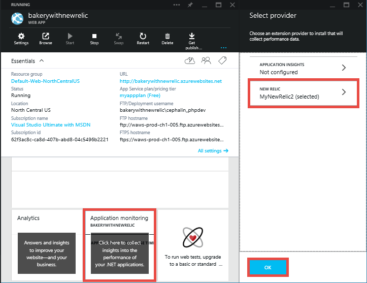

<properties 
	pageTitle=".NET web app in Azure App Service with New Relic application performance management" 
	description="Learn how to use New Relic's performance monitoring for ASP.NET applications running on Azure App Service." 
	services="app-service\web" 
	documentationCenter=".net" 
	authors="cephalin" 
	manager="wpickett" 
	editor=""/>

<tags 
	ms.service="app-service-web" 
	ms.workload="web" 
	ms.tgt_pltfrm="na" 
	ms.devlang="dotnet" 
	ms.topic="article" 
	ms.date="04/17/2015" 
	ms.author="stepsic"/>

# .NET web app in Azure App Service with New Relic application performance management

This guide describes how to add New Relic's world-class performance
monitoring to your web app in [Azure App Service](http://go.microsoft.com/fwlink/?LinkId=529714). We'll cover the fast and simple
process to add New Relic to your application and introduce you to some of
New Relic's features. For more information about using New Relic, see [Using New Relic](#using-new-relic).

## What is New Relic?

New Relic is a developer focused tool that monitors your production applications
and provides deep insight into their performance and reliability. It is
designed to save you time when identifying and diagnosing performance issues, and
it puts the information you need to solve these issues at your fingertips.

New Relic tracks the load time and throughput for your web transaction, both from
the server and your users' browsers. It shows how much time you spend in the
database, analyzes slow queries and web requests, provides uptime monitoring and
alerting, tracks application exceptions, and a whole lot more.

## New Relic special pricing through the Azure Store

New Relic Standard is free to Azure users.
New Relic Pro is offered in multiple packages based on which website mode you are using, and the instance size if you are using reserved mode.

For pricing information see the [New Relic page in the Azure Marketplace](/marketplace/partners/newrelic/newrelic).

> [AZURE.NOTE] Pricing is only listed for up to 10 compute instances. For counts greater than 10 please contact New Relic (sales@newrelic.com) for volume pricing.

Azure customers receive a 2 week trial subscription of New Relic Pro when they deploy the New Relic agent.

Sign up for New Relic using the Azure Marketplace
--

New Relic integrates seamlessly with Azure Web Roles, Worker roles and Azure App Service.

To sign up for New Relic directly from the Azure Marketplace, follow these four easy steps.

## Step 1. Create a New Relic account

1. Log in to the [Azure preview portal](https://portal.azure.com) and click **New** in the lower-left corner.
3. Click **Developer services** > **New Relic APM**.
4. Configure your New Relic account by specifying the following, then click **Create**.
	- **Name**
	- **Pricing Tier**
	- **Resource Group**
	- **Subscription**
	- **Location**
	- **Legal Terms**

11. After you click **Create**, your New Relic account will begin the creation process. You can monitor the status by clicking the **Notifications** button. Once it is created, the New Relic account's blade will be displayed.

12. To retrieve your New Relic license key, look at the **Essentials** panel at the top of the blade. Your Web Apps instance will automatically register this license key in its app settings when you integrate your web app with the New Relic account.

## Step 2: Configure New Relic integration for your web app

2. Open your web app's blade in the [Azure preview portal](https://portal.azure.com).
3. Click **Application monitoring** > **New Relic**. Select the account that you created in the previous step, then click **OK**. 

	

	Once the save operation has completed, click **All Settings** in the web app's blade, then click **Application settings**. You should see the **NEWRELIC\_LICENSEKEY** setting added to the **App settings** section of the blade to support New Relic:

	>[AZURE.NOTE] It may take up to 30 seconds for the new app setting to take effect. To force the settings to take effect immediately, restart the web app.

## Step 3: Publish the ASP.NET web app

Using Visual Studio or WebMatrix, publish your web app. If you have previously published your web app, publish it again so that the Web Apps instance would add the required New Relic NuGet package to enable New Relic monitoring.

## Step 4. Check out your application's performance in New Relic.

To view your New Relic dashboard:

2. Open your web app's blade in the [Azure preview portal](https://portal.azure.com).
3. Click **Application monitoring** > **application name** > **View at New Relic**.

	

3. If this is the first time you use your account, configure your account information.
3. From the New Relic menu bar, select **Applications > (application's name)**.

	The **Monitoring > Overview** dashboard automatically appears.

	

	After you select an app from the list on your **Applications** menu, the **Overview** dashboard shows current app server and browser information.

### Using New Relic

After you select your app from the list on the Applications menu, the Overview dashboard shows current app server and browser information. To toggle between the two views, click the **App server** or **Browser** button.

In addition to the <a href="https://newrelic.com/docs/site/the-new-relic-ui#functions">standard New Relic UI</a> and <a href="https://newrelic.com/docs/site/the-new-relic-ui#drilldown">dashboard drill-down</a> functions, the Applications Overview dashboard has additional functions.

<table border="1">
  <thead>
    <tr>
      <th><b>If you want to...</b></th>
      <th><b>Do this...</b></th>
    </tr>
  </thead>
  <tbody>
    <tr>
       <td>Show dashboard information for the selected app&#39;s server or browser</td>
       <td>Click the <b>App Server</b> or <b>Browser</b> button.</td>
    </tr>
     <tr>
       <td>View threshold levels for your app&#39;s <a href="https://newrelic.com/docs/site/apdex" target="_blank">Apdex</a> score</td>
       <td>Point to the Apdex score <b>?<b> icon.</b></b></td>
    </tr>
    <tr>
       <td>View worldwide Apdex details</td>
       <td>From the Overview&#39;s <b>Browser</b> view, point anywhere on the Global Apdex map. <b>Tip:</b> To go directly to the selected app&#39;s <a href="https://newrelic.com/docs/site/geography" target="_blank">Geography</a>dashboard, click the <b>Global Apdex</b> title, or click anywhere on the Global Apdex map.</td>
    </tr>
    <tr>
       <td>View the <a href="https://docs.newrelic.com/docs/applications-menu/transactions-dashboard" target="_blank">Web Transactions</a> dashboard</td>
       <td>Click the Web Transactions table on the Applications Overview dashboard. Or, to view details about a specific web transaction (including <a href="https://newrelic.com/docs/site/key-transactions" target="_blank">Key Transactions</a>), click its name.</td>
    </tr>
    <tr>
       <td>View the <a href="https://newrelic.com/docs/site/errors" target="_blank">Errors</a> dashboard</td>
       <td>Click the Error rate chart&#39;s title on the Applications Overview dashboard. <b>Tip:</b> You can also view the Errors dashboard from <b>Applications</b> &gt; (your app) &gt; Events &gt; Errors.</td>
    </tr>
    <tr>
       <td>View the app&#39;s server details</td>
       <td>
Do any of the following:

        <ul>
          <li>Toggle between a table view of the hosts or breakout metric details of each host.</li>
          <li>Click an individual server&#39;s name.</li>
          <li>Point to an individual server&#39;s Apdex score.</li>
          <li>Click an individual server&#39;s CPU usage or Memory.</li>
        </ul>
       

</td>
    </tr>
  </tbody>
</table>

Below is an example of the Applications Overview dashboard when you select the Browser view.

## Next steps

Check out these additional resources for more information:

 * [Installing the .NET Agent for Azure Websites](https://docs.newrelic.com/docs/agents/net-agent/azure-installation/azure-websites#manual): New Relic .NET Agent installation procedures 
 * [The New Relic User Interface](https://newrelic.com/docs/site/the-new-relic-ui): 
Overview of the New Relic UI, setting user rights and profiles, using standard functions and dashboard drill-down details
 * [Applications Overview](https://newrelic.com/docs/site/applications-overview): Features and functions when using New Relic's Applications Overview dashboard
 * [Apdex](https://newrelic.com/docs/site/apdex): Overview of how Apdex measures end users' satisfaction with your application
 * [Real User Monitoring](https://newrelic.com/docs/features/real-user-monitoring): Overview of how RUM details the time it takes for your users' 
browsers to load your webpages, where they come from, and what browsers they use
 * [Finding Help](https://newrelic.com/docs/site/finding-help): Resources available through New Relic's online Help Center

>[AZURE.NOTE] If you want to get started with Azure App Service before signing up for an Azure account, go to [Try App Service](http://go.microsoft.com/fwlink/?LinkId=523751), where you can immediately create a short-lived starter web app in App Service. No credit cards required; no commitments.

## What's changed
* For a guide to the change from Websites to App Service see: [Azure App Service and Its Impact on Existing Azure Services](http://go.microsoft.com/fwlink/?LinkId=529714)
* For a guide to the change of the Azure portal to the Azure preview portal see: [Reference for navigating the preview portal](http://go.microsoft.com/fwlink/?LinkId=529715)

[webmatrixwebsite]: web-sites-dotnet-using-webmatrix.md
[vswebsite]: web-sites-dotnet-get-started.md

[wmnugetbutton]: ./media/store-new-relic-web-sites-dotnet-application-performce-management/nrwmnugetbutton.png
[wmnugetgallery]: ./media/store-new-relic-web-sites-dotnet-application-performce-management/nrwmnugetgallery.png

[newrelicconf]: ./media/store-new-relic-web-sites-dotnet-application-performce-management/nrwmlicensekey.png
[vslicensekey]: ./media/store-new-relic-web-sites-dotnet-application-performce-management/nrvslicensekey.png
[add-on]: ./media/store-new-relic-web-sites-dotnet-application-performce-management/nraddon.png
[custom]: ./media/store-new-relic-web-sites-dotnet-application-performce-management/nrcustom.png
