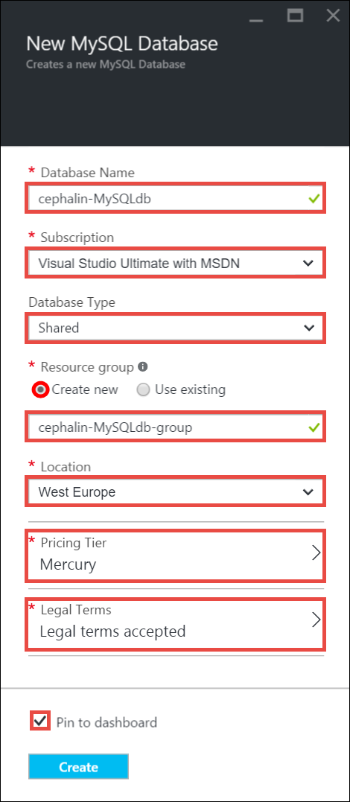
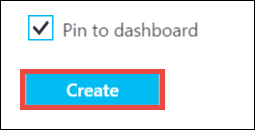
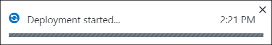
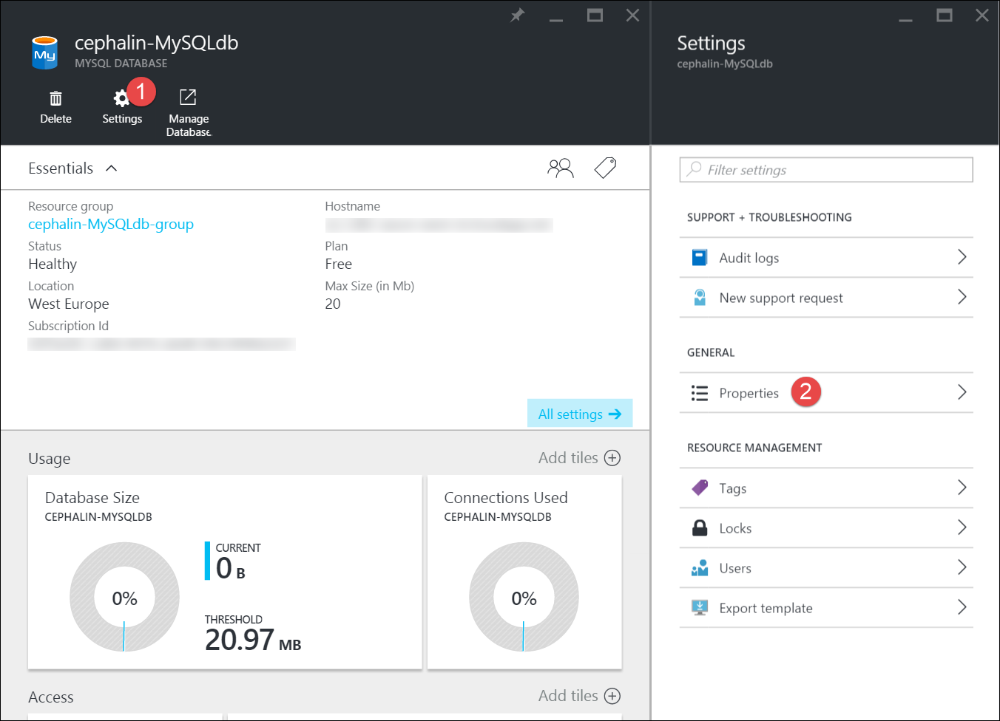
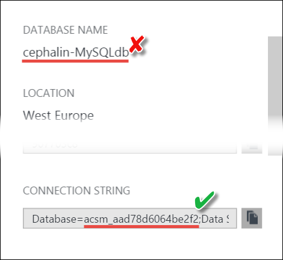
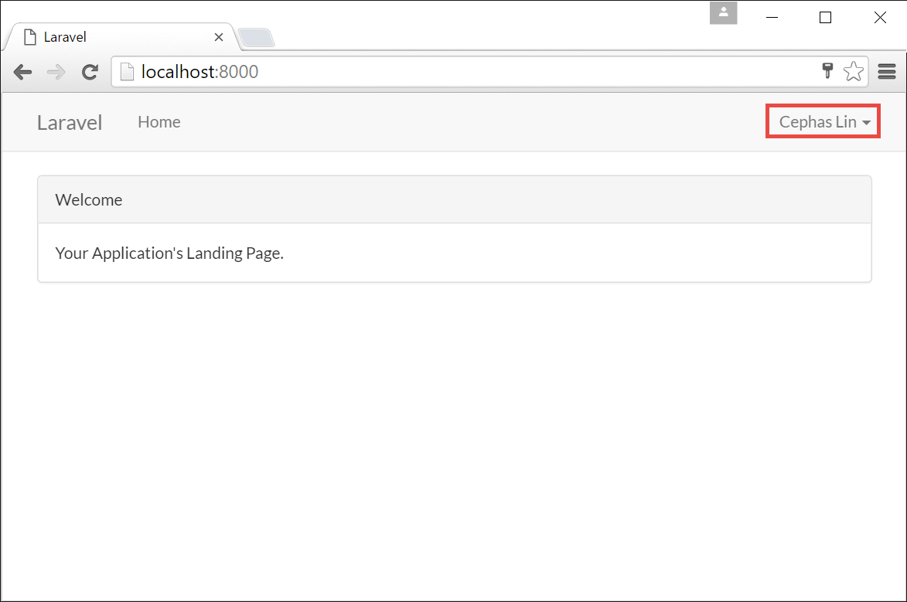
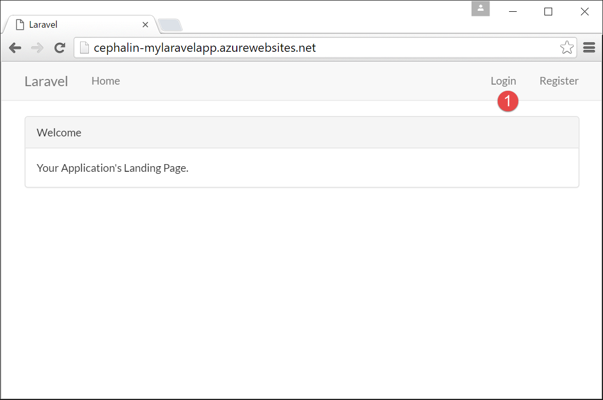
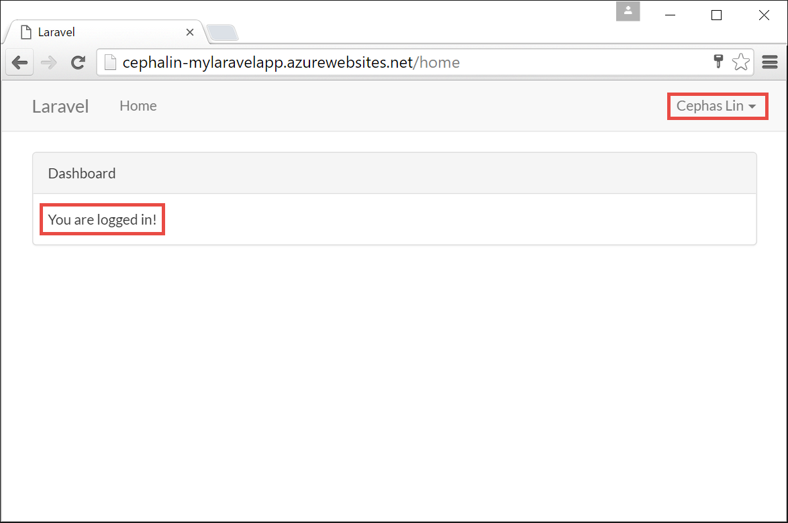

<properties
	pageTitle="Create and connect to a MySQL database in Azure"
	description="Learn how to use the Azure portal to create a MySQL database and then connect to it from a PHP web app in Azure."
	documentationCenter="php"
	services="app-service\web"
	authors="cephalin"
	manager="wpickett"
	editor=""
	tags="mysql"/>

<tags
	ms.service="multiple"
	ms.workload="data-management"
	ms.tgt_pltfrm="na"
	ms.devlang="PHP"
	ms.topic="article"
	ms.date="08/11/2016"
	ms.author="robmcm;cephalin"/>

# Create and connect to a MySQL database in Azure

This guide will show you how to create a MySQL database in the [Azure portal](https://portal.azure.com) (provider is [ClearDB](http://www.cleardb.com/)) and how to connect to it from a PHP web app running in 
[Azure App Service](./app-service/app-service-value-prop-what-is.md). 

> [AZURE.NOTE] You can also create a MySQL database as part of a [Marketplace app template](./app-service-web/app-service-web-create-web-app-from-marketplace.md).

## Create a MySQL database in Azure portal

To create a MySQL database in the Azure portal, do the following:

1. Log in to the [Azure portal](https://portal.azure.com).

2. From the left menu, click **New** > **Data + Storage** > **MySQL Database**.

	

2. In the New MySQL Database [blade](azure-portal-overview.md), configure your new MySQL database as follows (*blade*: a portal page that opens horizontally):

	- **Database Name**: Type a uniquely identifiable name
	- **Subscription**: Choose the subscription to use
	- **Database Type**: Select **Shared** for low-cost or free tiers, or **Dedicated** to get dedicated resources. 
	- **Resource group**: Add the MySQL database to an existing [resource group](../resource-group-overview.md) or put it in a new one. Resources in the same group
	can be easily managed together.
	- **Location**: Select a location close to you. When adding to an exisitng resource group, you're locked to the resource group's location.
	- **Pricing Tier**: Click **Pricing Tier**, then select a pricing option (**Mercury** tier is free), and then click **Select**. 
	- **Legal Terms**: Click **Legal Terms**, review the purchase details, and click **Purchase**.
	- **Pin to dashboard**: Select if you want to access it directly from the dashboard. This is especially helpful if you aren't familiar with
	portal navigation yet.
	
    The following screenshot is just an example of how you can configure your MySQL database.  
	

3. When you're done configuring, click **Create**.

	

	You will see a pop-up notification letting you know that deployment has started.

	

	You will get another pop-up once deployment has succeeded. The portal will also open your MySQL database blade automatically.

## Connect to your MySQL database from a PHP web app in Azure

To see the connection information for your new MySQL database, just click **Properties**. If you don't see the **Settings** blade,
click **Settings** > **Properties**.
	

You can now use that connection information in any web app. A sample that shows how to use the connection information from a simple
PHP app is available [here](https://github.com/WindowsAzure/azure-sdk-for-php-samples/tree/master/tasklist-mysql).

### Connect a Laravel web app (from the PHP get started tutorial)

Suppose you just finished the tutorial [Create, configure, and deploy a PHP web app to Azure](./app-service-web/app-service-web-php-get-started.md)
and have a [Laravel](https://www.laravel.com/) web app running in Azure, you can easily add database capabilities to your Laravel
app. Just follow the steps below:

>[AZURE.NOTE] The following steps assumes that you have finished the tutuorial 
[Create, configure, and deploy a PHP web app to Azure](./app-service-web/app-service-web-php-get-started.md).

1. Configure the Laravel app in your local development environment to point to the MySQL database. To do this, open `.env`
from your Laravel app's root directory and configure the MySQL database options.

		DB_CONNECTION=mysql
		DB_HOST=<HOSTNAME_from_properties_blade>
		DB_PORT=<PORT_from_properties_blade>
		DB_DATABASE=<see_note_below>
		DB_USERNAME=<USERNAME_from_properties_blade>
		DB_PASSWORD=<PASSWORD_from_properties_blade>

	>[AZURE.NOTE] In the **Properties** blade, the name of your MySQL database may or may not be the one shown in the **DATABASE NAME** field. It's better
	to check the Database parameter in the **CONNECTION STRING** field.	
	>
	>

2. The quickest way to verify that you have MySQL access now is to use 
[Laravel's default authentication scaffolding](https://laravel.com/docs/5.2/authentication#authentication-quickstart). 
In the command-line terminal, run the following commands from your Laravel app's root directory:

		 php artisan migrate
		 php artisan make:auth

	The first command creates the tables in Azure based on predefined migrations in the `database/migrations` directory, and the second 
	command scaffolds the basic views and routes for user registration and authentication.

3. Run the development server now:

		php artisan serve

4. In the browser, navigate to http://localhost:8000 and register a new user as shown:

	

	Follow the UI prompt complete the registration. Once registration completes, you will be logged in.
	
	

	You are now developing your app against the MySQL database in Azure.

5. Now, you just need to replicate your `.env` settings to your Azure web app. Run the following Azure CLI commands:

		azure site appsetting add DB_CONNECTION=mysql
		azure site appsetting add DB_HOST=<HOSTNAME_from_properties_blade>
		azure site appsetting add DB_PORT=<PORT_from_properties_blade>
		azure site appsetting add DB_DATABASE=<Database_param_from_CONNECTION_INFO_from_properties_blade>
		azure site appsetting add DB_USERNAME=<USERNAME_from_properties_blade>
		azure site appsetting add DB_PASSWORD=<PASSWORD_from_properties_blade>

	Find out how this works in [Configure the Azure web app](./app-service-web/app-service-web-php-get-started.md#configure).

6. Next, commit and push to Azure the local changes made earlier while running `php artisan make:auth`.

		git add .
		git commit -m "scaffold auth views and routes"
		git push azure master

7. Browse to the Azure web app.

		azure site browse

8. Log in using the user credentials you created earlier.

	

	After you log in, you should see the friendly post-login screen.
	
	

	Congratulations, your PHP web app in Azure is now accessing data from your MySQL database. 

## Next steps

For more information, see the [PHP Developer Center](/develop/php/).
