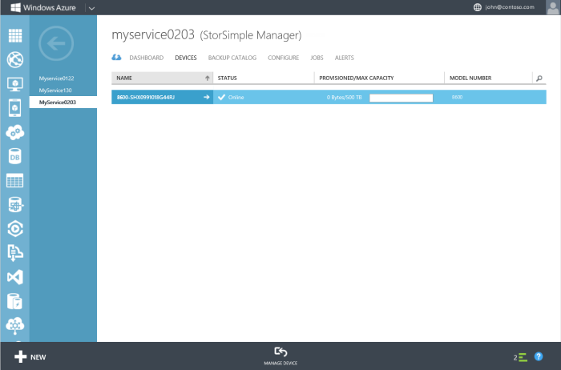

<properties 
   pageTitle="How to failover your StorSimple device"
   description="Learn how to failover your StorSimple device to itself, another physical device or a virtual device."
   services="storsimple"
   documentationCenter=""
   authors="alkohli"
   manager="adinah"
   editor="tysonn" />
<tags 
   ms.service="storsimple"
   ms.devlang="na"
   ms.topic="hero-article"
   ms.tgt_pltfrm="na"
   ms.workload="na"
   ms.date="04/17/2015"
   ms.author="alkohli" />

# Failover and disaster recovery for your StorSimple device

## Overview

This tutorial describes the steps required to failover a StorSimple device in the event of a disaster. A failover will allow you to migrate your data from a source device in the datacenter to another physical or even a virtual device located in the same or a different geographical location. 
Device failover is orchestrated via the disaster recovery (DR) feature and is initiated from the Devices page. This page tabulates all the StorSimple devices connected to your StorSimple Manager service. For each device, the friendly name, status, provisioned and maximum capacity, type and model are displayed.

## Disaster recovery (DR) and device failover
In a disaster recovery (DR) scenario, the primary device stops functioning. In this situation, you can move the cloud data associated with the failed device to another device by using the primary device as the *source* and specifying another device as the *target*. You can select one or more volume containers to migrate to the target device. This process is referred to as the *failover*. During the failover, the volume containers from the source device change ownership and are transferred to the target device.

## Considerations for device failover
In the event of a disaster, you may choose to failover your StorSimple device:

- To a physical device 
- To itself
- To a virtual device

For any device failover, keep in mind the following:

- The prerequisites for DR are that all the volumes within the volume containers are offline and the volume containers have an associated cloud snapshot. 
- The available target devices for DR are devices that have sufficient space to accommodate the selected volume containers. 
- The devices that are connected to your service but do not meet the criteria of sufficient space will not be available as target devices.

## Fail over to another physical device

Perform the following steps to restore your device to a target physical device.

1. Verify that the volume container you want to fail over has associated cloud snapshots.

1. On the **Devices** page, click the **Volume Containers** tab.

1. Select a volume container that you would like to fail over to another device. Click the volume container to display the list of volumes within this container. Select a volume and click **Take Offline** to take the volume offline. Repeat this process for all the volumes in the volume container.

1. Repeat the previous step for all the volume containers you would like to fail over to another device.

1. On the Devices page, click **Failover**.

1. In the wizard that opens up, under **Choose volume container to failover**:

	1. In the list of volume containers, select the volume containers you would like to fail over.

		>[AZURE.NOTE] **Only the volume containers with associated cloud snapshots and offline volumes are displayed.**

	1. Under **Choose a target device** for the volumes in the selected containers, select a target device from the drop-down list of available devices. Only the devices that have the available capacity are displayed in the drop-down list.

	1. Finally, review all the failover settings under **Confirm failover**. Click the check icon .

1. After the failover is completed, go to the **Devices** page.											

	1. Select the device that was used as the target device for the failover process.

	1. Go to the **Volume Containers** page. All the volume containers, along with the volumes from the old device, should be listed.

## Failover using a single device

Perform the following steps if you only have a single device and need to perform a failover.

1. Take cloud snapshots of all the volumes in your device.

1. Reset your device to factory defaults. Follow the detailed instructions in [how to reset a StorSimple device to factory default settings](https://msdn.microsoft.com/library/dn772373.aspx).

1. Configure your device and register it again with your StorSimple Manager service.

1. On the **Devices** page, the old device should show as **Offline**. The newly registered device should show as **Online**.

1. For the new device, complete the minimum configuration of the device first. 
												
	>[AZURE.IMPORTANT] **If the minimum configuration is not completed first, your DR will fail as a result of a bug in the current implementation. This behavior will be fixed in a later release.**

1. Select the old device (status offline) and click **Failover**. In the wizard that is presented, fail over this device and specify the target device as the newly registered device. For detailed instructions, refer to [Fail over to another physical device](#fail-over-to-another-physical-device).

1. A device restore job will be created that you can monitor from the **Jobs** page.

1. After the job has successfully completed, access the new device and navigate to the **Volume Containers** page. All the volume containers from the old device should now be migrated to the new device.

## Fail over to a StorSimple virtual device

You must have a StorSimple virtual device created and configured prior to running this procedure.
 
>[AZURE.NOTE] **In this release, the amount of storage supported on the StorSimple virtual device is 30 TB.**

Perform the following steps to restore the device to a target StorSimple virtual device.

1. Verify that the volume container you want to fail over has associated cloud snapshots.

1. On the **Devices** page, click the **Volume Containers** tab.

1. Select a volume container that you would like to fail over to another device. Click the volume container to display the list of volumes within this container. Select a volume and click **Take Offline** to take the volume offline. Repeat this process for all the volumes in the volume container.

1. Repeat the previous step for all the volume containers you would like to fail over to another device.

1. On the **Devices** page, click **Failover**.

1. In the wizard that opens up, under **Choose volume container to failover**, complete the following:
													
	1. In the list of volume containers, select the volume containers you would like to fail over.

		>[AZURE.NOTE] **Only the volume containers with associated cloud snapshots and offline volumes are displayed.**

1. Under **Choose a target device for the volumes in the selected containers**, select the StorSimple virtual device from the drop-down list of available devices. Only the devices that have sufficient capacity are displayed in the drop-down list.

1. Finally, review all the failover settings under Confirm failover. Click the check icon .

1. After the failover is completed, go to the **Devices** page.
													
	a. Select the StorSimple virtual device that was used as the target device for the failover process.
	
	b. 	Go to **Volume Containers** page. All the volume containers, along with the volumes from the old device should now be listed here.

## See also
After you have performed the failover, you may need to:

- [Deactivate your StorSimple device](https://msdn.microsoft.com/library/azure/dn772379.aspx#deactivate)
- [Delete your StorSimple device](https://msdn.microsoft.com/library/azure/dn772379.aspx#delete)

For information on how to manage your device using the StorSimple Manager service, see:

- [Administrator's Guide](https://msdn.microsoft.com/library/dn772401.aspx)

