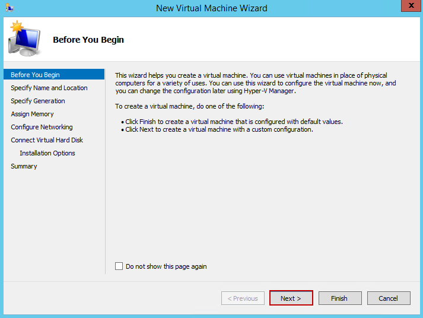
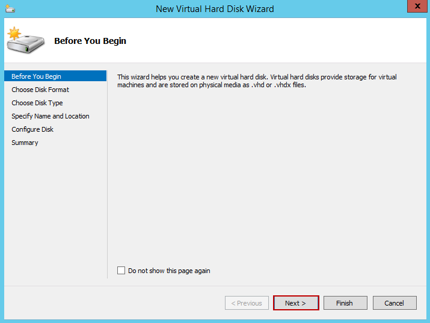
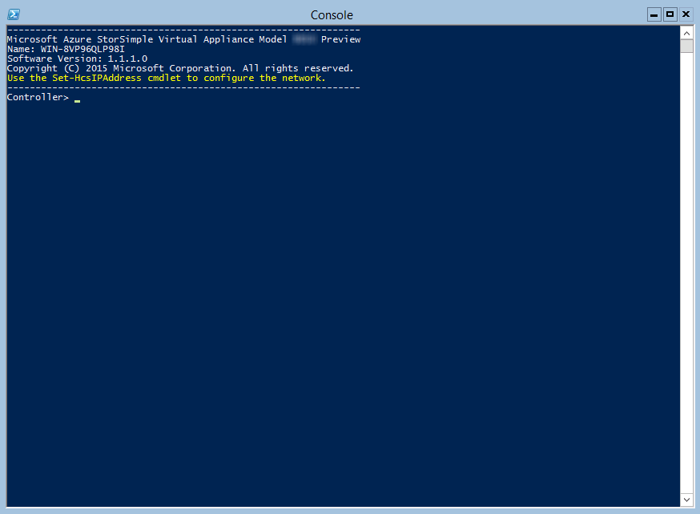
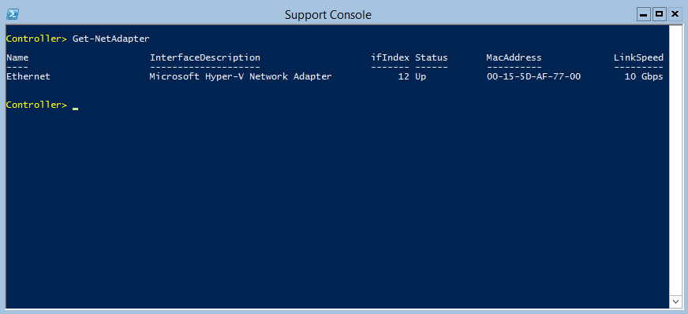

<properties
   pageTitle="Deploy StorSimple Virtual Array 2 - Provision a virtual device in Hyper-V"
   description="This second tutorial in StorSimple Virtual Array deployment involves provisioning a virtual device in Hyper-V."
   services="storsimple"
   documentationCenter="NA"
   authors="alkohli"
   manager="carmon"
   editor=""/>

<tags
   ms.service="storsimple"
   ms.devlang="NA"
   ms.topic="article"
   ms.tgt_pltfrm="NA"
   ms.workload="NA"
   ms.date="12/28/2015"
   ms.author="alkohli"/>

# Deploy StorSimple Virtual Array 2 - Provision a virtual device in Hyper-V

## Overview 

These provisioning tutorials apply to Microsoft Azure StorSimple Virtual Arrays (also known as StorSimple on-premises virtual devices or StorSimple virtual devices) running v 1.1.1.0 (Public Preview) only. These tutorials describe how to provision a StorSimple virtual device on a host system running Hyper-V 2008 R2, Hyper-V 2012 or Hyper-V 2012 R2.

You will need administrator privileges to provision and configure a virtual device. The provisioning and initial setup can take 30-45 minutes to complete.

> [AZURE.IMPORTANT]
> 
> This public preview is intended for evaluation only. Installing this preview in a production environment is not supported.

## Provisioning prerequisites

Here you will find the prerequisites to provision a virtual device on a host system running Hyper-V 2008 R2, Hyper-V 2012, and 2012 R2.

### For StorSimple Manager service

Before you begin, make sure that:

-   You have completed all the steps in [Prepare the portal for StorSimple Virtual Array](storsimple-ova-deploy1-portal-prep.md).

-   You have downloaded the virtual device image for Hyper-V from the Azure portal. For more information, see **Step 3: Download the virtual device image** in [Prepare the portal for the deployment of StorSimple Virtual Array](storsimple-ova-deploy1-portal-prep.md).

### For the StorSimple virtual device 

Before you deploy a virtual device, make sure that:

-   You have access to a host system running Hyper-V (2008 R2 or later) that can be used to a provision a device.

-   The host system is able to dedicate the following resources to provision your virtual device:

	-   A minimum of 4 cores.
	
	-   At least 8 GB of RAM.
	
	-   One network interface.
	
	-   A 500 GB virtual disk for system data.

### For the network in the datacenter 

Before you begin, make sure that:

-   You have reviewed the networking requirements to deploy a StorSimple virtual device and configured the datacenter network as per the requirements. For more information, see [StorSimple Virtual Array System Requirements Guide](storsimple-ova-system-requirements.md).

## Step-by-step provisioning 

To provision and connect to a virtual device, you will need to perform the following steps:

1.  Ensure that the host system has sufficient resources to meet the minimum virtual device requirements.

2.  Provision a virtual device in your hypervisor.

3.  Start the virtual device and get the IP address.

Each of these steps is explained in the following sections.

## Step 1: Ensure that the host system meets minimum virtual device requirements

To create a virtual device, you will need:

-   Hyper-V 2008 R2 SP1, Hyper-V 2012, or Hyper-V 2012 R2 running on your Windows Server 2008 R2 SP1, Windows Server 2012, or Windows Server 2012 R2 host system.

-   Microsoft Hyper-V Manager on a Microsoft Windows client connected to the host.

You must make sure that the underlying hardware (host system) on which you are creating the virtual device is able to dedicate the following resources to your virtual device:

- A minimum of 4 cores.
- At least 8 GB of RAM.
- One network interface.
- A 500 GB virtual disk for system data.

## Step 2: Provision a virtual device in hypervisor

Perform the following steps to provision a device in your hypervisor.

#### To provision a virtual device

1.  On your Windows Server host, copy the virtual device image on the local drive. This is the image that you have downloaded through the Azure portal. Make a note of the location where you copied the image as you will be using this later in the procedure.

2.  Open **Server Manager**. In the top right corner, click **Tools** and select **Hyper-V Manager**.

	

	If you are running Hyper-V 2008 R2, open the Hyper-V Manager. In Server Manager, click **Roles > Hyper-V > Hyper-V Manager**.

1.  In the **Hyper-V Manager**, in the scope pane, right-click your system node to open the context menu. Select **New** and then select **Virtual Machine**.

	

1.  On **Before you begin** page, click **Next**.

	

1.  On the **Specify name and location** page, provide a **Name** for your on-premises StorSimple virtual device. Click **Next**.

	

1.  On the **Specify generation** page, choose **Generation 1**. Click **Next**.

	

	This screen will not be presented if running Hyper-V 2008 R2.

1.  On the **Assign memory** page:

    a.  Specify a **Startup memory** of 8192 MB or higher. The minimum memory requirement for an 	on-premises StorSimple virtual device is 8 GB or higher. Do not check the option to **Use 	Dynamic Memory for this virtual machine**.

    b.  Click **Next**.

	

1.  On the **Configure networking** page:

    a.  From the dropdown list for **Connection**, select a virtual switch. You will need to select a virtual switch that is connected to the Internet.

    b.  Click **Next**.

	

1.  On the **Connect virtual hard disk** page:

    a.  Select the option to **use an existing virtual hard disk**. Point to the VHD that is downloaded on your host system.

    b.  Click **Next**.

	

1.  Review the **Summary** presented to you. Click **Finish** to create the virtual machine.

	

1.  To meet the minimum requirements, you will need 4 cores. To add 4 virtual processors, with your host system selected in the **Hyper-V Manager** window, in the right-pane under the list of **Virtual Machines**, locate the virtual machine you just created. Select and right-click the machine name and select **Settings**.

	

1.  On the **Settings** page, in the left-pane, click **Processor**. In the right-pane, set **number of virtual processors** to 4 (or more). Click **Apply**.

	

1.  To meet the minimum requirements, you also need to add a 500 GB virtual data disk. In the **Settings** page:

    1.  In the left pane, select **SCSI Controller**. 
    2.  In the right pane, select **Hard Drive,** and click **Add**.

	

1.  On the **Hard drive** page, select the **Virtual hard disk** option and click **New**. This will start the **New Virtual Hard Disk Wizard**.

	

1.  On the **Before you begin page**, click **Next**.

	

1.  On the **Choose Disk Format page**, accept the default option of **VHDX** format. Click **Next**. This screen will not be presented if running Hyper-V 2008 R2.

	

1.  On the **Choose Disk Type page**, set virtual hard disk type as **Dynamically expanding**. Click **Next**. Note that this is default in Hyper-V 2012 and Hyper-V 2012 R2. In Hyper-V 2008 R2, default is **Fixed size**.

	

1.  On the **Specify Name and Location** page, provide a **name** as well as **location** (you can browse to one) for the data disk. Click **Next**.

	

1.  On the **Configure Disk** page, select the option **Create a new blank virtual hard disk** and specify the size as **500 GB** (or more). Click **Next**.

	

1.  On the **Summary** page, review the details of your virtual data disk and if satisfied, click **Finish** to create the disk. The wizard will close and a virtual hard disk will be added to your machine.

	

1.  You will return to the **Settings** page. Click **OK** to close the **Settings** page and return to Hyper-V Manager window.

	

## Step 3: Start the virtual device and get the IP

Perform the following steps to start your virtual device and connect to it.

#### To start the virtual device

1.  Start the virtual device.

	

1.  After the device is running, select the device, right click, and select **Connect**.

	

1.  You may have to wait 5-10 minutes for the device to be ready. A status message is displayed on the console to indicate the progress. After the device is ready, go to **Action**. Press Ctrl + Alt + Delete to log into the virtual device. The default user is *StorSimpleAdmin* and the default password is *Password1*.

	

1.  For security reasons, the device administrator password expires at the first log on. You will be prompted to change the password. 

	

	Enter a password that contains at least 8 characters. The password must satisfy at least 3 out of the following 4 requirements: uppercase, lowercase, numeric, and special characters. Reenter the password to confirm it. You will be notified that the password has changed.

	

1.  After the password is successfully changed, the virtual device may restart. Wait for the device to start.

	

 	The Windows PowerShell console of the device will be displayed along with a progress bar.

	

1.  Steps 6-8 only apply when booting up in a non DHCP environment. If you are in a DHCP environment, then skip these steps and go to step 9. If you booted up your device in non DHCP environment, you will see the following screen. 

	

 	You will now need to configure the network.

1.  Use the `Get-NetAdapter` command to list all the network interfaces enabled on your virtual device. If your device has a single network interface enabled, the default name assigned to this interface is `Ethernet`.

	

1.  Use the Set-HcsIpAddress cmdlet to configure the network. An example is shown below:

 	`Set-HcsIpAddress –Name Ethernet –IpAddress 10.161.22.90 –Netmask 255.255.255.0 –Gateway 10.161.22.1`

 	

1.  After the initial setup is complete and the device has booted up, you will see the device banner text. Make a note of the IP address and the URL displayed in the banner text to manage the device. You will use this IP address to connect to the web UI of your virtual device and complete the local setup and registration.

	

	If your device does not meet the minimum configuration requirements, you will see an error in the banner text (shown below). You will need to modify the device configuration so that it has adequate resources to meet the minimum requirements. You can then restart and connect to the device. Refer to the minimum configuration requirements in [Step1: Ensure that the host system meets minimum virtual device requirements](#_Step_1:_Ensure).

	

If you face any other error during the initial configuration using the local web UI, refer to the following workflows in [Manage your StorSimple Virtual Array using the local web UI](storsimple-ova-web-ui-admin.md).

-   Run diagnostic tests to troubleshoot web UI setup.

-   Generate log package and view log files.

## Next steps

-   [Set up your StorSimple Virtual Array as a file server](storsimple-ova-deploy3-fs-setup.md)

-   [Set up your StorSimple Virtual Array as an iSCSI server](storsimple-ova-deploy3-iscsi-setup.md)
