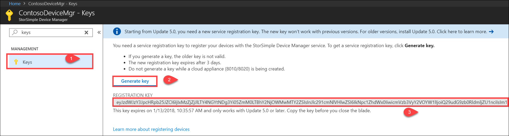

# Use the new authentication for your StorSimple

## Overview

The StorSimple Device Manager service runs in Microsoft Azure and connects to multiple StorSimple devices. To date, StorSimple Device Manager service has used an Access Control service (ACS) to authenticate the service to your StorSimple device. The ACS mechanism will be deprecated soon and replaced by an Azure Active Directory (AAD) authentication. For more information, go to the following announcements for ACS deprecation and use of AAD authentication.

- [The future of Azure ACS is Azure Active Directory](https://cloudblogs.microsoft.com/enterprisemobility/2015/02/12/the-future-of-azure-acs-is-azure-active-directory/)
- [Upcoming changes to the Microsoft Access Control Service](https://azure.microsoft.com/blog/acs-access-control-service-namespace-creation-restriction/)

This article describes the details of the AAD authentication and the associated new service registration key and modifications to the firewall rules as applicable to the StorSimple devices. The information contained in this article is applicable to StorSimple 8000 series devices only.

The AAD authentication occurs in StorSimple 8000 series device running Update 5 or later. Due to the introduction of the AAD authentication, changes occur in:

- URL patterns for firewall rules.
- Service registration key.

These changes are discussed in detail in the following sections.

## URL changes for AAD authentication

To ensure that the service uses AAD-based authentication, all the users must include the new authentication URLs in their firewall rules.

If using StorSimple 8000 series, ensure that the following URL is included in the firewall rules:

| URL pattern                         | Cloud | Component/Functionality         |
|------------------------------------|-------|----------------------------------|
| `https://login.windows.net`        | Azure Public |AAD authentication service      |
| `https://login.microsoftonline.us` | US Government |AAD authentication service      |

For a complete list of URL patterns for StorSimple 8000 series devices, go to [URL patterns for firewall rules](storsimple-8000-system-requirements.md#url-patterns-for-firewall-rules).

If the authentication URL is not included in the firewall rules beyond the deprecation date, and the device is running Update 5, the users see a URL alert. The users need to include the new authentication URL. If the device is running a version prior to Update 5, the users see a heartbeat alert. In each case, the StorSimple device cannot authenticate with the service and the service is not able to communicate with the device.

## Device version and authentication changes

If using a StorSimple 8000 series device, use the following table to determine what action you need to take based on the device software version you are running.

| If your device is running| Take the following action                                    |
|--------------------------|------------------------|
| Update 5 or later and the device is offline.   You see an alert that URL is not whitelisted.|1. Modify the firewall rules to include the authentication URL. See [authentication URLs](#url-changes-for-aad-authentication). 2. [Get the AAD registration key from the service](#aad-based-registration-keys). 3. [Connect to the Windows PowerShell interface of the StorSimple 8000 series device](storsimple-8000-deployment-walkthrough-u2.md#use-putty-to-connect-to-the-device-serial-console). 4. Use `Redo-DeviceRegistration` cmdlet to register the device through the Windows PowerShell. Supply the key you got in the previous step.|
| Update 5 or later and the device online.| No action is required.                                       |
| Update 4 or earlier and the device is offline. |1. Modify the firewall rules to include the authentication URL. 2. [Download Update 5 through catalog server](storsimple-8000-install-update-5.md#download-updates-for-your-device). 3. [Apply Update 5 through the hotfix method](storsimple-8000-install-update-5.md#install-update-5-as-a-hotfix). 4. [Get the AAD registration key from the service](#aad-based-registration-keys). 5. [Connect to the Windows PowerShell interface of the StorSimple 8000 series device](storsimple-8000-deployment-walkthrough-u2.md#use-putty-to-connect-to-the-device-serial-console).  6. Use `Redo-DeviceRegistration` cmdlet to register the device through the Windows PowerShell. Supply the key you got in the previous step.|
| Update 4 or earlier and the device is online. |Modify the firewall rules to include the authentication URL.  Install Update 5 through the Azure portal.              |
| Factory reset to a version before Update 5.      |The portal shows an AAD based registration key while the device is running older software. Follow the steps in the preceding scenario for when the device is running Update 4 or earlier.              |

## AAD-based registration keys

Beginning Update 5 for StorSimple 8000 series devices, new AAD-based registration keys are used. You use the registration keys to register your StorSimple Device Manager service with the device.

You cannot use the new AAD service registration keys if you are using a StorSimple 8000 series device running Update 4 or earlier (includes an older device being activated now).
In this scenario, you need to regenerate the service registration key. Once you regenerate the key, the new key is used for registering all the subsequent devices. The old key is no longer valid.

- The new AAD registration key expires after 3 days.
- The AAD registration keys work only with StorSimple 8000 series devices running Update 5 or later.
- The AAD registration keys are longer than the corresponding ACS registration keys.

Perform the following steps to generate an AAD service registration key.

#### To generate the AAD service registration key

1. In **StorSimple Device Manager**, go to **Management &gt;** **Keys**. You can also use the search bar to search for _Keys_.
    
2. Click **Generate key**.

    

3. Copy the new key. The older key will no longer work.

    

    > [!NOTE] 
    > If you are creating a StorSimple Cloud Appliance on the service registered to your StorSimple 8000 series device, do not generate a registration key while the creation is in progress. Wait for the creation to complete and then generate the registration key.

## Next steps

* Learn more about how to deploy [StorSimple 8000 series device](storsimple-8000-deployment-walkthrough-u2.md).

