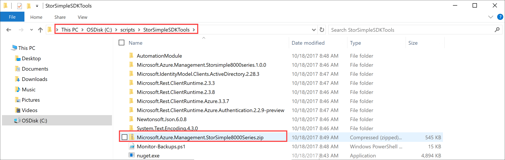
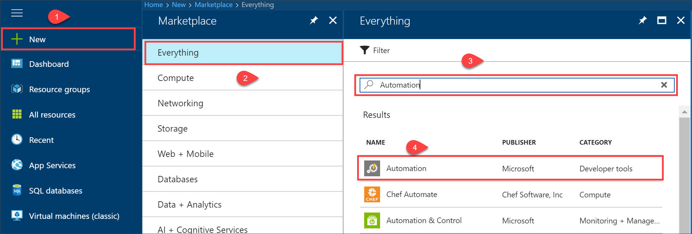
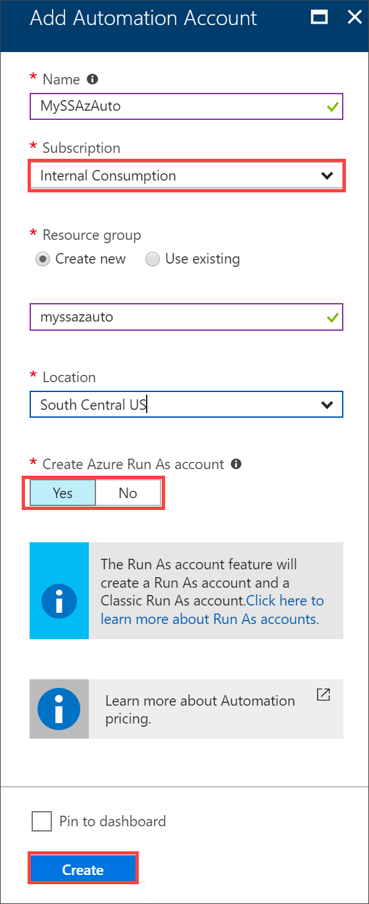
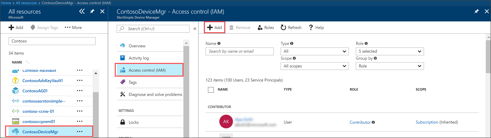
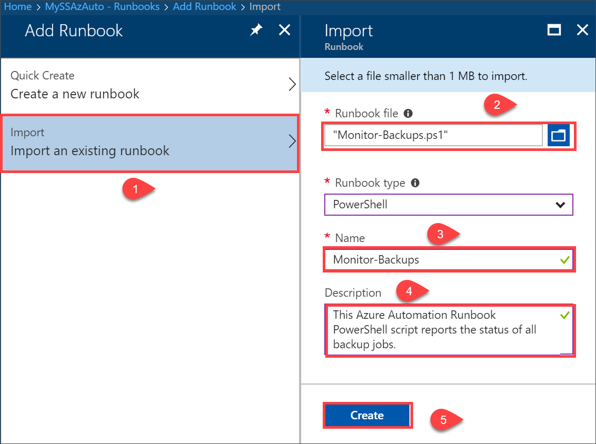
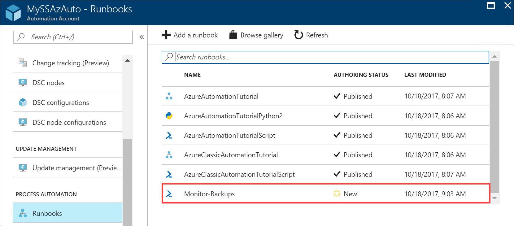
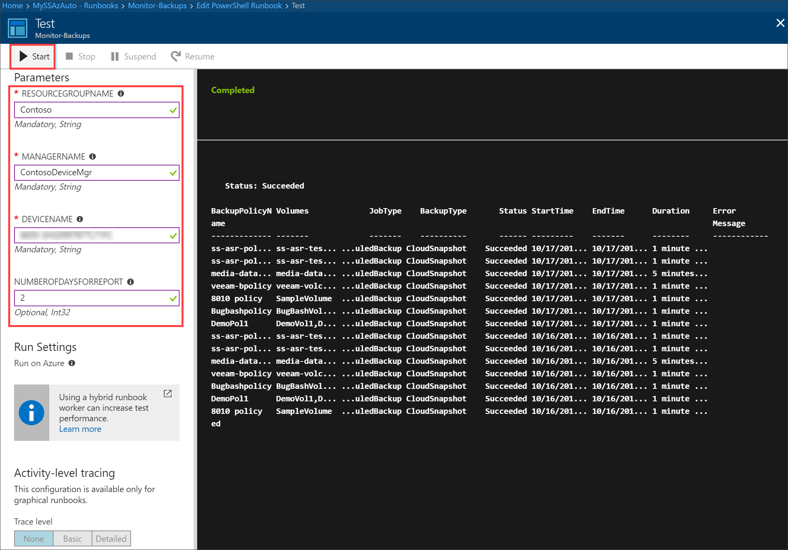
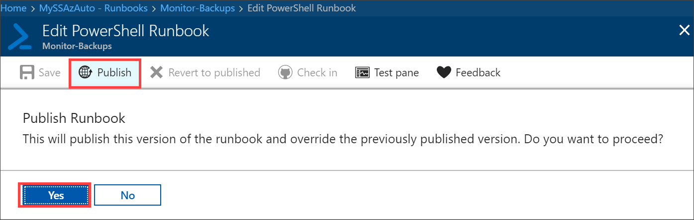

# Use Azure Automation runbooks to manage StorSimple devices

This article describes how Azure Automation runbooks are used to manage your StorSimple 8000 series device in Azure portal. A sample runbook is included to walk you through the steps of configuring your environment to execute this runbook.


## Configure, add, and run Azure runbook

This section takes an example Windows PowerShell script for StorSimple and details the various steps required to import the script into a runbook and then publish and execute the runbook.

### Prerequisites

Before you begin, ensure that you have:

* an active Azure subscription associated with your StorSimple Device Manager service registered with a StorSimple 8000 series device.

* Windows PowerShell 5.0 installed on your computer (Or, your Windows Server host for your StorSimple if using one).

### Create automation runbook module in Windows PowerShell

To create an automation module for the StorSimple 8000 series device management, perform the following steps:

1. Launch Windows PowerShell. Create a new folder and change directory to the new folder.

    ```powershell
        mkdir C:\scripts\StorSimpleSDKTools
        cd C:\scripts\StorSimpleSDKTools
    ```

2. [Download NuGet CLI](https://www.nuget.org/downloads) under the folder created in the previous step. There are various versions of _nuget.exe_. Choose the version corresponding to your SDK. Each download link points directly to an _.exe_ file. Be sure to right-click and save the file to your computer rather than running it from the browser.

    You can also run the following command to download and store the script in the same folder that you created earlier.

    ```
        wget https://dist.nuget.org/win-x86-commandline/latest/nuget.exe -Out C:\scripts\StorSimpleSDKTools\nuget.exe
    ```

3. Download the dependent SDK.

    ```
        C:\scripts\StorSimpleSDKTools\nuget.exe install Microsoft.Azure.Management.Storsimple8000series
        C:\scripts\StorSimpleSDKTools\nuget.exe install Microsoft.IdentityModel.Clients.ActiveDirectory -Version 2.28.3
        C:\scripts\StorSimpleSDKTools\nuget.exe install Microsoft.Rest.ClientRuntime.Azure.Authentication -Version 2.2.9-preview
    ```

4. Download the script from the sample GitHub project.

    ```
        wget https://raw.githubusercontent.com/anoobbacker/storsimpledevicemgmttools/master/Monitor-Backups.ps1 -Out Monitor-Backups.ps1
    ```

5. Create an Azure Automation Runbook Module for StorSimple 8000 Series device management. On the Windows Powershell window, type the following commands:

    ```powershell
        # set path variables
        $downloadDir = "C:\scripts\StorSimpleSDKTools"
        $moduleDir = "$downloadDir\AutomationModule\Microsoft.Azure.Management.StorSimple8000Series"

        #don't change the folder name "Microsoft.Azure.Management.StorSimple8000Series"
        mkdir "$moduleDir"
        Copy-Item "$downloadDir\Microsoft.IdentityModel.Clients.ActiveDirectory.2.28.3\lib\net45\Microsoft.IdentityModel.Clients.ActiveDirectory*.dll" $moduleDir
        Copy-Item "$downloadDir\Microsoft.Rest.ClientRuntime.Azure.3.3.7\lib\net452\Microsoft.Rest.ClientRuntime.Azure*.dll" $moduleDir
        Copy-Item "$downloadDir\Microsoft.Rest.ClientRuntime.2.3.8\lib\net452\Microsoft.Rest.ClientRuntime*.dll" $moduleDir
        Copy-Item "$downloadDir\Newtonsoft.Json.6.0.8\lib\net45\Newtonsoft.Json*.dll" $moduleDir
        Copy-Item "$downloadDir\Microsoft.Rest.ClientRuntime.Azure.Authentication.2.2.9-preview\lib\net45\Microsoft.Rest.ClientRuntime.Azure.Authentication*.dll" $moduleDir
        Copy-Item "$downloadDir\Microsoft.Azure.Management.Storsimple8000series.1.0.0\lib\net452\Microsoft.Azure.Management.Storsimple8000series*.dll" $moduleDir

        #Don't change the name of the Archive
        compress-Archive -Path "$moduleDir" -DestinationPath Microsoft.Azure.Management.StorSimple8000Series.zip
    ```

6. Verify that an automation module zip file is created in `C:\scripts\StorSimpleSDKTools`.

    

7. The following output is presented when the automation module is created via the Windows PowerShell.

    ```powershell
    mkdir C:\scripts\StorSimpleSDKTools
    ```

    ```Output
        Directory: C:\scripts

    Mode                LastWriteTime         Length Name
    ----                -------------         ------ ----
    d-----       10/18/2017   8:43 AM                StorSimpleSDKTools
    ```

    ```powershell
    wget https://dist.nuget.org/win-x86-commandline/latest/nuget.exe -Out C:\scripts\StorSimpleSDKTools\nuget.exe
    ```

    ```powershell
    C:\scripts\StorSimpleSDKTools\nuget.exe install Microsoft.Azure.Management.Storsimple8000series
    ```

    ```Output
    -------------------------------------------
    CUT              CUT
    -------------------------------------------
    Successfully installed 'Microsoft.Azure.Management.Storsimple8000series 1.0.0' to C:\scripts\StorSimpleSDKTools
    Executing nuget actions took 1.77 sec
    ```

    ```powershell
    C:\scripts\StorSimpleSDKTools\nuget.exe install Microsoft.IdentityModel.Clients.ActiveDirectory -Version 2.28.3
    ```

    ```Output
    -------------------------------------------
    CUT              CUT
    -------------------------------------------
    Successfully installed 'Microsoft.IdentityModel.Clients.ActiveDirectory 2.28.3' to C:\scripts\StorSimpleSDKTools
    Executing nuget actions took 927.64 ms
    ```

    ```powershell
    C:\scripts\StorSimpleSDKTools\nuget.exe install Microsoft.Rest.ClientRuntime.Azure.Authentication -Version 2.2.9-preview
    ```

    ```Output
    -------------------------------------------
    CUT              CUT
    -------------------------------------------
    Successfully installed 'Microsoft.Rest.ClientRuntime.Azure.Authentication 2.2.9-preview' to C:\scripts\StorSimpleSDKTools
    Executing nuget actions took 717.48 ms
    ```

    ```powershell
    wget https://raw.githubusercontent.com/anoobbacker/storsimpledevicemgmttools/master/Monitor-Backups.ps1 -Out Monitor-Backups.ps1
    # set path variables
    $downloadDir = "C:\scripts\StorSimpleSDKTools"
    $moduleDir = "$downloadDir\AutomationModule\Microsoft.Azure.Management.StorSimple8000Series"
    #don't change the folder name "Microsoft.Azure.Management.StorSimple8000Series"
    mkdir "$moduleDir"
    ```

    ```Output
        Directory: C:\scripts\StorSimpleSDKTools\AutomationModule

    Mode                LastWriteTime         Length Name
    ----                -------------         ------ ----
    d-----       10/18/2017   8:48 AM                Microsoft.Azure.Management.StorSimple8000Series
    ```

    ```powershell
    Copy-Item "$downloadDir\Microsoft.IdentityModel.Clients.ActiveDirectory.2.28.3\lib\net45\Microsoft.IdentityModel.Clients.ActiveDirectory*.dll" $moduleDir
    Copy-Item "$downloadDir\Microsoft.Rest.ClientRuntime.Azure.3.3.7\lib\net452\Microsoft.Rest.ClientRuntime.Azure*.dll" $moduleDir
    Copy-Item "$downloadDir\Microsoft.Rest.ClientRuntime.2.3.8\lib\net452\Microsoft.Rest.ClientRuntime*.dll" $moduleDir
    Copy-Item "$downloadDir\Newtonsoft.Json.6.0.8\lib\net45\Newtonsoft.Json*.dll" $moduleDir
    Copy-Item "$downloadDir\Microsoft.Rest.ClientRuntime.Azure.Authentication.2.2.9-preview\lib\net45\Microsoft.Rest.ClientRuntime.Azure.Authentication*.dll" $moduleDir
    Copy-Item "$downloadDir\Microsoft.Azure.Management.Storsimple8000series.1.0.0\lib\net452\Microsoft.Azure.Management.Storsimple8000series*.dll" $moduleDir
    #Don't change the name of the Archive
    compress-Archive -Path "$moduleDir" -DestinationPath Microsoft.Azure.Management.StorSimple8000Series.zip
    ```

### Import, publish, and run Automation runbook

1. Create an Azure Run As automation account in the Azure portal. To do so, go
   to **Azure marketplace > Everything** and then search for **Automation**. Select **Automation accounts**.

    

2. In the **Add Automation Account** blade:

   1. Supply the **Name** of your Automation account.
   2. Select the **Subscription** linked to your StorSimple Device Manager service.
   3. Create a new resource group or select from an existing resource group.
   4. Select a **Location** (if possible the same as where your service is running).
   5. Leave the default **Create Run As account** option selected.
   6. Optionally check **Pin to dashboard**. Click **Create**.

       

      After the automation account is successfully created, you are notified. For more information on how to create an Automation account, go to [Create a Run As account](https://docs.microsoft.com/azure/automation/automation-create-runas-account).

3. To ensure that the automation account created can access the StorSimple Device Manager service, you need to assign appropriate permissions to the automation account. Go to **Access control** in your StorSimple Device Manager service. Click **+ Add** and provide the name of your Azure Automation Account. **Save** the settings.

    

4. In the newly created account, go to **Shared Resources > Modules** and click **+ Add module**.

5. In the **Add module** blade, browse to the location of the zipped module, and select and open the module. Click **OK**.

    

6. Go to **Process Automation > Runbooks and click + Add a runbook**. In the **Add runbook** blade, click **Import an existing runbook**. Point to the Windows PowerShell script file for the **Runbook file**. The runbook type is automatically selected. Provide a name and an optional description for the runbook. Click **Create**.

    

7. The runbook is added to the list of runbooks. Select and click this runbook.

    

8. Edit the runbook and click **Test pane**. Provide the parameters such as name of your StorSimple Device Manager service, name of the StorSimple device and the subscription. **Start** the test. The report is generated when the run is complete. For more information, go to [how to test a runbook](../automation/automation-first-runbook-textual-powershell.md#step-3---test-the-runbook).

    

9. Inspect the output from the runbook in the test pane. If satisfied, close the pane. Click **Publish** and when prompted for confirmation, confirm, and publish the runbook.

    

## Next steps

[Use StorSimple Device Manager service to manage your StorSimple device](storsimple-8000-manager-service-administration.md).
